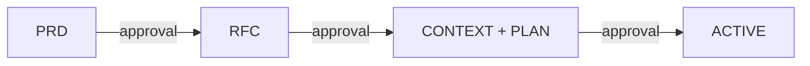

# /task-init — Unified Task Initialization

> **When to invoke:** when starting any new work item (epic, feature, bug, task, chore)
> **Result:** docs folder + beads tracking + approval flow

---

## Step 0: Create docs folder (ALL types)

**This step is MANDATORY for every type. No exceptions.**

```bash
mkdir -p .claude/development/docs/features/{ISSUE-KEY}
```

---

## Step 0.5: Explore — derive the axes (ALL types)

**This step is MANDATORY for every type, and it runs BEFORE the type is chosen. No exceptions.**

Launch the Explore role as a subagent — `Agent(subagent_type="explore")` — with the target the request is about (a path or a symbol). It returns one artifact and nothing else: the `## Axes` section `beadloom impact <target> --section` renders, with every site as a path and a line and the `In scope` column left undecided.

```bash
beadloom impact <path|symbol> --section     # what the role runs; do not hand-write the table
```

Then decide the scope with the user: rule each row `yes` or `no` with a reason in the `Why` cell. That decision is the person's half of the section and the role does not take it.

**Why before the type.** The axis count is what says whether a work item is a bug. The one time this project chose the type first, the item was routed `bug` and became 28 beads — and re-deriving the axes afterwards showed the change ranging over four graph nodes. `beadloom docs quality` reports a simplified-flow work item that carries no `## Axes` section, and one whose kept axes name more nodes than the route it took can hold, so this step is checked rather than trusted.

---

## Type detection

**The route is decided from the axes derived in Step 0.5, not from how the request was phrased.**

| Type | Flow | Docs created |
|------|------|-------------|
| `epic` | Full: PRD → RFC → CONTEXT+PLAN → ACTIVE | PRD, RFC, CONTEXT, PLAN, ACTIVE |
| `feature` | Full: PRD → RFC → CONTEXT+PLAN → ACTIVE | PRD, RFC, CONTEXT, PLAN, ACTIVE |
| `bug` | Simplified: BRIEF → ACTIVE | BRIEF, ACTIVE |
| `task` | Simplified: BRIEF → ACTIVE | BRIEF, ACTIVE |
| `chore` | Simplified: BRIEF → ACTIVE | BRIEF, ACTIVE |

The simplified flow writes one BRIEF and passes no approval gate, so it is the route with nothing in it that records a crossing:

- Kept axes naming **one** node — the simplified flow carries the change.
- Kept axes naming **more than one** node — take the full flow, or narrow the work item's scope until the axes name one. The count is a fact about the change and not a preference, so a route taken against it is reported.
- **No axes at all** — the type has not been decided from anything. Go back to Step 0.5.

Paste the section into the work item's BRIEF (simplified) or RFC (full). Both templates carry the `## Axes` heading, so a missing section is a `doc-quality` finding rather than an omission somebody has to notice.

---

## Full flow (epic | feature)

### Sequence



**EACH step requires explicit user approval before proceeding!**

### Document status lifecycle

Every document follows this strict lifecycle:

```
Draft  →  Approved  →  Done
```

- Create document with `Status: Draft`
- Show to user, wait for explicit approval ("утверждаю" / "approve" / "ok")
- Set `Status: Approved`, proceed to next document
- Set `Status: Done` when epic/feature is completed

**Status format is EXACT — always capitalized, no dates in parentheses:**
```
> **Status:** Draft
> **Status:** Approved
> **Status:** Done
```

### Step 1: PRD

1. Create `PRD.md` from template (see `/templates`) with `Status: Draft`
2. Fill in content based on user's request
3. Show to user in chat
4. **WAIT for explicit approval**
5. Update `Status: Approved`

```
┌──────────────────────────────────────────────┐
│ PRD: {ISSUE-KEY} — [Name]                    │
│ Status: Draft → waiting for approval         │
│                                              │
│ [summary of what PRD contains]               │
│                                              │
│ Approve to proceed to RFC?                   │
└──────────────────────────────────────────────┘
```

### Step 2: RFC

1. Create `RFC.md` from template with `Status: Draft`
2. Fill in technical solution
3. Show to user
4. **WAIT for explicit approval**
5. Update `Status: Approved`

### Step 3: CONTEXT + PLAN

1. Create `CONTEXT.md` from template with `Status: Draft`
   - Code standards: copy from CLAUDE.md §0.1 (do NOT survey the user)
2. Create `PLAN.md` from template with `Status: Draft`
   - Describe beads, dependencies, waves — but do NOT create beads yet
3. Show both to user
4. **WAIT for explicit approval**
5. Update both to `Status: Approved`
6. **Create beads in tracker** (ONLY after PLAN is Approved):
   - One-time per clone: ensure `git config beads.role maintainer` is set (see CLAUDE.md §0 Setup).
   - Create the parent bead and take its id from bd's answer, never from a number you
     wrote first: `bd create --type feature --title "[ISSUE-KEY] Name" --json` (use
     `--type epic` if you want `bd swarm` orchestration — swarm requires an epic-type
     parent; feature parents still work via bead dependencies)
   - **Create the sub-beads as ONE plan, not one bead per process**, and wire every edge
     by plan-local KEY:

     ```bash
     bd create --graph plan.json --json    # -> {"ids": {"dev": "proj-fac", ...}}
     ```

     where `plan.json` is `{"nodes": [{"key": "dev", "title": "...", "type": "task",
     "parent_id": "<parent-id>"}], "edges": [{"from_key": "test", "to_key": "dev",
     "type": "blocks"}]}`. Measured on bd 1.0.4: a 60-bead DAG with 59 edges cost 69.45 s
     over 119 processes created one at a time, against 1.15 s over one process from a
     plan. A node key spelled `parent` instead of `parent_id` is silently ignored — exit
     0, no parent set.
   - **Never write a bead's number into its own title.** The number is ALLOCATED at
     creation and a title written before it is a second copy that can disagree: four
     `--parent` creates launched simultaneously took `.1` through `.4` out of launch
     order.
     The plan form removes the question — its edges name keys and it allocates a flat id
     that takes no number from that sequence — and `--json` answers it for a single
     create.
   - Wiring an edge afterwards, when the DAG changes: `bd dep add <blocked> <blocker>`,
     and **READ THE ECHO**. bd names both beads' FULL TITLES — `✓ Added dependency:
     proj-027 (bead 59) depends on proj-9to (bead 60)` — and reading that echo is the
     only reason a mis-wired edge was ever caught in seconds rather than surviving the
     wave. Confirm the result with `bd dep tree <parent-id>`. The bulk `--file` form of
     the same command prints `✓ Added 2 dependencies` and no titles at all, so it buys
     speed by discarding the check; wire by key inside the plan instead.
7. **Immediately proceed to Step 4** (no additional approval needed)

**Process gate:** Do NOT create beads before PLAN is Approved. If PLAN is rejected or modified, no stale beads to clean up.

**Mandatory bead structure (full flow):**
```
<parent-id> [feature/epic] — parent bead
├── <parent-id>.N [task/dev]        — development sub-tasks (one per BEAD)
├── <parent-id>.N [task/test]       — test agent sub-task
├── <parent-id>.N [task/review]     — review agent sub-task
└── <parent-id>.N [task/tech-writer]— doc update sub-task
```

Every feature/epic MUST include sub-tasks for all four agent roles:
- `dev` — implementation beads (one per logical unit of work)
- `test` — test verification bead (depends on all dev beads)
- `review` — code review bead (depends on test bead)
- `tech-writer` — documentation update bead (depends on review bead)

### Step 4: ACTIVE

1. Create `ACTIVE.md` (no approval needed — working document)
2. Show start confirmation:

```
┌──────────────────────────────────────────────┐
│ READY: {ISSUE-KEY} — [Name]                  │
│                                              │
│ Type: epic | feature                         │
│ Beads: [count]                               │
│ Critical path: BEAD-01 → BEAD-02 → ...      │
│                                              │
│ All docs approved. Ready to start?           │
└──────────────────────────────────────────────┘
```

---

## Simplified flow (bug | task | chore)

### Sequence


**One approval, then straight to work.**

### Step 1: BRIEF

1. Create `BRIEF.md` from template (see `/templates`) with `Status: Draft`
2. Paste the `## Axes` section from Step 0.5, with every row ruled `yes` or `no` and a reason
3. Fill in: Problem, Solution, Beads, Acceptance Criteria
4. Create beads in tracker, with each bead's `refs:` generated from the section
   rather than typed — `beadloom axes .claude/development/docs/features/{ISSUE-KEY}/BRIEF.md --refs`:
   ```bash
   bd create --type {type} --title "{ISSUE-KEY}: [Name]" --description "..." --json
   # If multiple subtasks: one plan, one process, every edge named by key
   bd create --graph plan.json --json
   ```

   The title carries the work-item key and never a bead number — the number is
   allocated at creation, so a title written before it is a second copy of one fact.
5. Show to user
6. **WAIT for explicit approval**
7. Update `Status: Approved`

### Step 2: ACTIVE

1. Create `ACTIVE.md` (no approval needed)
2. Start work immediately

---

## Template rules

All documents MUST use templates from `/templates`. No improvisation.

**Strict formatting rules:**
- **Language:** ALL documents (PRD, RFC, CONTEXT, PLAN, ACTIVE, BRIEF) MUST be in English
- No numbered sections (use `##` / `###` headings only)
- Status: always `Draft` / `Approved` / `Done` (capitalized, no dates in status)
- Date in separate `Created:` field
- Metadata block uses `>` blockquote syntax

---

## Initialization checklist

### Full flow (epic | feature)
- [ ] Created folder `.claude/development/docs/features/{ISSUE-KEY}/`
- [ ] Explore run (Step 0.5) and its `## Axes` section produced
- [ ] Every axis row ruled in or out of scope, with a reason
- [ ] Route checked against the axes: more than one node kept -> full flow
- [ ] PRD.md created with `Status: Draft` (in English)
- [ ] PRD.md → **user approved** → `Status: Approved`
- [ ] RFC.md created with `Status: Draft` (in English)
- [ ] RFC.md → **user approved** → `Status: Approved`
- [ ] CONTEXT.md created with `Status: Draft`
- [ ] PLAN.md created with `Status: Draft` (beads described, NOT created yet)
- [ ] CONTEXT.md + PLAN.md → **user approved** → `Status: Approved`
- [ ] Parent bead created, its id read from bd's answer: `bd create --type feature --json`
- [ ] Sub-bead DAG created as ONE plan, edges named by key: `bd create --graph plan.json --json`
- [ ] Dev sub-beads in the plan (one per BEAD)
- [ ] Test sub-bead in the plan (depends on all dev beads)
- [ ] Review sub-bead in the plan (depends on the test bead)
- [ ] Tech-writer sub-bead in the plan (depends on the review bead)
- [ ] No bead title carries a bead number
- [ ] DAG confirmed against the titles the tracker echoes: `bd dep tree <parent-id>`
- [ ] ACTIVE.md created
- [ ] User confirmed start of development

### Simplified flow (bug | task | chore)
- [ ] Created folder `.claude/development/docs/features/{ISSUE-KEY}/`
- [ ] Explore run (Step 0.5) and its `## Axes` section produced
- [ ] Every axis row ruled in or out of scope, with a reason
- [ ] Kept axes name ONE node — otherwise this is not a simplified-flow item
- [ ] BRIEF.md created with `Status: Draft`, carrying the `## Axes` section
- [ ] Beads created in tracker, `refs:` generated by `beadloom axes <BRIEF> --refs`
- [ ] BRIEF.md → **user approved** → `Status: Approved`
- [ ] ACTIVE.md created
- [ ] Work started
