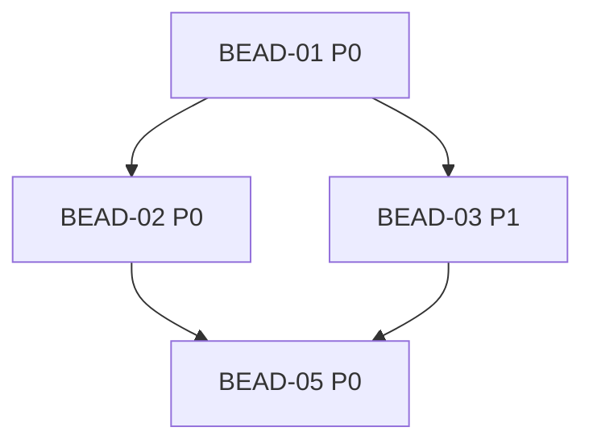

# /templates — Documentation Templates

> **When to invoke:** when creating epic documentation files
> **Contains:** PRD, RFC, CONTEXT, PLAN, ACTIVE

---

## PRD.md — Product Requirements Document

```markdown
# {ISSUE-KEY}: [Name] — Product Requirements Document

## Metadata
- **Author:** [name]
- **Created:** YYYY-MM-DD
- **Status:** [Draft | Review | Approved]

## 1. Problem

### 1.1 Current situation
[Description of the current state, user pain points]

### 1.2 Why this matters
[Business justification]

### 1.3 Who is affected
[Target audience]

## 2. Goals

### 2.1 Business goals
- [ ] Goal 1 (measurable)
- [ ] Goal 2 (measurable)

### 2.2 User goals
- [ ] As a user, I want [action], so that [result]

### 2.3 Non-goals (Out of Scope)
- What is NOT in scope

## 3. Solution

### 3.1 User Stories

#### US-1: [Name]
**As** [role]
**I want** [action]
**So that** [result]

**Acceptance criteria:**
- [ ] Criterion 1
- [ ] Criterion 2

### 3.2 Functional requirements

| ID | Requirement | Priority |
|----|-------------|----------|
| FR-1 | Description | Must |
| FR-2 | Description | Should |

### 3.3 Non-functional requirements

| ID | Category | Requirement |
|----|----------|-------------|
| NFR-1 | Performance | Response time < 200ms |
| NFR-2 | Reliability | Graceful degradation |

## 4. Risks

| Risk | Probability | Impact | Mitigation |
|------|-------------|--------|------------|
| Risk 1 | High | High | Action plan |

## 5. Success metrics

| Metric | Current | Target |
|--------|---------|--------|
| Metric 1 | X | Y |
```

---

## RFC.md — Technical Specification

```markdown
# RFC-XXX: [Name]

**Status:** [Draft | Review | Approved | Implemented]
**Author:** [name]
**Created:** YYYY-MM-DD
**Last updated:** YYYY-MM-DD

### Accepted decisions (filled in as approvals are given)
- [ ] Decision 1: **[choice]** — reason
- [ ] Decision 2: **[choice]** — reason

---

## 1. Overview

### 1.1 Brief description
[1-2 paragraphs: what we are doing and why]

### 1.2 Key capabilities

| Capability | Description |
|------------|-------------|
| Feature 1 | Description |
| Feature 2 | Description |

### 1.3 Related documents
- [PRD](./XXX.PRD.md)

---

## 2. Motivation

### 2.1 Problem
[Description of the current situation and pain points]

### 2.2 Solution
[How the proposed solution addresses the problem]

---

## 3. Technical context

### 3.1 Constraints and requirements
- Python 3.10+
- SQLite (WAL mode)
- No external network dependencies

---

## 4. Proposed solution

### 4.1 General approach
[Description of the chosen approach]

### 4.2 Project structure

```
src/beadloom/
├── infrastructure/   # DB, reindex, cache, doctor, watcher
├── context_oracle/   # BFS traversal, context bundles, search, why
├── doc_sync/         # Sync engine, sync state, staleness detection
├── onboarding/       # Bootstrap, presets, docs gen/polish, prime
├── graph/            # YAML loader, linter, rule engine, import resolver
├── services/         # cli.py (Click), mcp_server.py (MCP stdio)
└── tui/              # Interactive terminal dashboard (Textual)
tests/
├── conftest.py
├── test_*.py         # Flat layout: test_cli_*, test_integration*, test_<module>
└── ...
```

---

## 5. Architecture

### 5.1 Layers

```
Services (CLI, MCP, TUI) → Domains (5 packages) → Infrastructure (DB, reindex)
                                    ↓
                              tree-sitter parsers
```

Dependencies point inward. Services depend on domains. Reverse is forbidden.

### 5.2 Components

| Component | Package | Technology |
|-----------|---------|------------|
| CLI | `services/cli.py` | Click + Rich |
| MCP Server | `services/mcp_server.py` | mcp-python (stdio) |
| TUI | `tui/` | Textual |
| Context Oracle | `context_oracle/` | BFS, FTS5, caching |
| Doc Sync | `doc_sync/` | Hash-based staleness |
| Onboarding | `onboarding/` | Bootstrap, presets, docs gen |
| Graph | `graph/` | YAML loader, linter, rules |
| Infrastructure | `infrastructure/` | SQLite (WAL), reindex |

---

## 6. API and interfaces

### 6.1 CLI Commands

| Command | Description |
|---------|-------------|
| `beadloom init` | Project initialization |
| `beadloom reindex` | SQLite rebuild |

### 6.2 Python Interfaces

```python
# Nodes and edges are stored in SQLite, accessed via sql queries
# Key functions:
from beadloom.context_oracle.builder import build_context, bfs_subgraph
from beadloom.infrastructure.db import open_db, create_schema
from beadloom.infrastructure.reindex import incremental_reindex
from beadloom.graph.loader import load_graph_yamls
from beadloom.doc_sync.engine import check_sync
from beadloom.graph.linter import lint_graph
```

---

## 7. Data models

### 7.1 SQLite Schema

```sql
CREATE TABLE nodes (
    ref_id  TEXT PRIMARY KEY,
    kind    TEXT NOT NULL,
    summary TEXT NOT NULL DEFAULT '',
    source  TEXT,
    extra   TEXT DEFAULT '{}'
);

CREATE TABLE edges (
    src_ref_id TEXT NOT NULL REFERENCES nodes(ref_id),
    dst_ref_id TEXT NOT NULL REFERENCES nodes(ref_id),
    kind       TEXT NOT NULL,
    PRIMARY KEY (src_ref_id, dst_ref_id, kind)
);
```

---

## 8. Security

### 8.1 Checklist

- [ ] SQL: parameterized queries (`?`), no f-strings
- [ ] YAML: `safe_load()` only
- [ ] Paths: `pathlib` + prefix validation
- [ ] No hardcoded secrets
- [ ] No `subprocess.shell=True` with user input

---

## 9. Implementation plan

### Phase 1: Foundation

| Task | Priority |
|------|----------|
| Task 1 | P0 |
| Task 2 | P0 |

**Completion criteria:**
- Criterion 1
- Criterion 2

---

## 10. Risks and mitigation

| Risk | Probability | Impact | Mitigation |
|------|-------------|--------|------------|
| Risk 1 | Medium | High | Action plan |

---

## 11. Alternatives

### 11.1 Considered options

#### Option A: [Name]

**Pros:**
- Pro 1

**Cons:**
- Con 1

**Decision:** Rejected — reason

---

## 12. Open questions

| # | Question | Options | Decision |
|---|----------|---------|----------|
| Q1 | Question? | a) Option A b) Option B | ? |

---

## Appendices

### A. Environment Variables

Beadloom has no external API dependencies. All operations are local and deterministic.
```

---

## CONTEXT.md — Core Memory

```markdown
# {ISSUE-KEY}: [Name] — Context

## Status
- **Phase:** [Planning | Development | Review | Done]
- **Current bead:** BEAD-XX
- **Blockers:** [none | description]

## Goal (immutable)
[1-2 sentences: what should be achieved]

## Key constraints
- [Technical constraints]
- [Business constraints]

## Code standards

### Language and environment
- **Language:** Python 3.10+
- **Package manager:** uv
- **Virtual environment:** uv venv

### Methodologies
| Methodology | Application |
|-------------|-------------|
| TDD | Red → Green → Refactor |
| Clean Code | Naming (snake_case), SRP, DRY, KISS |
| Modular architecture | CLI → Core → Storage |

### Testing
- **Framework:** pytest + pytest-cov
- **Coverage:** minimum 80%

### Code quality
- **Linter:** ruff
- **Typing:** mypy --strict

### Restrictions
- [x] No `Any` without justification
- [x] No `print()` — use logging
- [x] No bare `except:`
- [x] No `os.path` — pathlib only
- [x] No f-strings in SQL
- [x] No `yaml.load()` — safe_load only

## Accepted architectural decisions
| Date | Decision | Reason | Alternatives |
|------|----------|--------|--------------|
| YYYY-MM-DD | Decision X | Because Y | Rejected: A, B |

## Current stack/dependencies
- Python 3.10+, SQLite, Click, Rich, PyYAML, tree-sitter

## Related files
(discover via `beadloom ctx <ref-id>` — never hardcode)
- `src/beadloom/context_oracle/` — Context Oracle
- `src/beadloom/infrastructure/` — SQLite, reindex
- `src/beadloom/graph/` — YAML loader, rules, linter

## Last updated
- **Date:** YYYY-MM-DD HH:MM
- **Agent:** [agent name]
- **Changes:** [brief description]
```

---

## PLAN.md — DAG and Beads

```markdown
# {ISSUE-KEY}: [Epic name]

## Epic description
[What should be achieved]

## Dependency DAG



**Critical path:** BEAD-01 → BEAD-02 → BEAD-05

## Beads Overview

| ID | Name | P | Depends on | Status |
|----|------|---|------------|--------|
| BEAD-01 | Setup | P0 | - | Done |
| BEAD-02 | Core | P0 | 01 | In Progress |
| BEAD-03 | Tests | P1 | 01 | Pending |

## Bead Details

### BEAD-01: [Name]

**Priority:** P0
**Status:** Done

#### Description
[What needs to be done]

#### Dependencies
- **Depends on:** -
- **Blocks:** BEAD-02, BEAD-03

#### Readiness criteria
- [x] Criterion 1
- [x] Criterion 2

#### Checkpoint (beads comments)
> See `bd comments <bead-id>`
```

---

## ACTIVE.md — Current Focus

```markdown
# {ISSUE-KEY}: Active Work

## Current task
**Bead:** BEAD-XX
**Goal:** [what we are doing]
**Readiness criterion:** [how to know it is done]

## Session plan
- [ ] Step 1: description
- [ ] Step 2: description
- [x] Step 3: description (completed HH:MM)

## Notes
### [HH:MM] Title
What was done, decisions made.

## Open questions
- [ ] Question 1

## Next step
[What to do after the current task]
```
