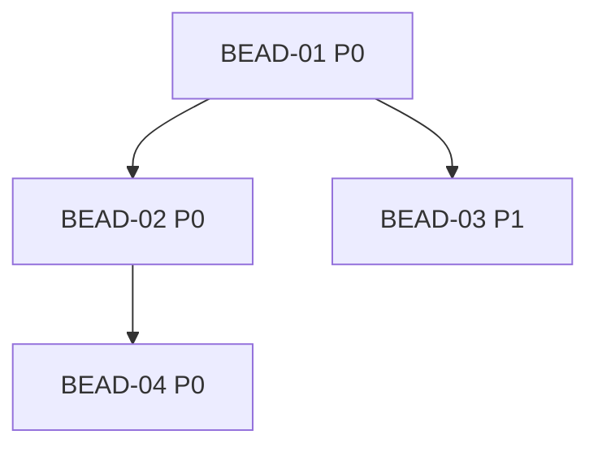

# /templates — Document Templates

> **When to invoke:** when creating task documentation files
> **Contains:** PRD, RFC, CONTEXT, PLAN, ACTIVE, BRIEF

**Rules:**
- Use templates EXACTLY as written — no improvisation
- No numbered sections (use `##` / `###` headings)
- Status: always `Draft` / `Approved` / `Done`
- Date in separate field, never inside status

---

## PRD.md — Product Requirements Document

Used for: `epic`, `feature`

```markdown
# PRD: {ISSUE-KEY} — [Name]

> **Status:** Draft
> **Created:** YYYY-MM-DD

---

## Problem

[What is broken / missing / suboptimal. Include evidence and data.]

## Impact

[Who is affected. Why it matters. What happens if we don't fix it.]

## Goals

- [ ] Goal 1 (measurable)
- [ ] Goal 2 (measurable)

## Non-goals

- What is explicitly out of scope

## User Stories

### US-1: [Name]
**As** [role], **I want** [action], **so that** [result].

**Acceptance criteria:**
- [ ] Criterion 1
- [ ] Criterion 2

### US-2: [Name]
**As** [role], **I want** [action], **so that** [result].

**Acceptance criteria:**
- [ ] Criterion 1
- [ ] Criterion 2

## Acceptance Criteria (overall)

- [ ] Criterion 1
- [ ] Criterion 2
- [ ] Criterion 3
```

---

## RFC.md — Technical Specification

Used for: `epic`, `feature`

```markdown
# RFC: {ISSUE-KEY} — [Name]

> **Status:** Draft
> **Created:** YYYY-MM-DD

---

## Overview

[1-2 paragraphs: what we are doing and why]

## Motivation

### Problem
[Current situation and pain points]

### Solution
[How the proposed solution addresses the problem]

## Technical Context

### Constraints
- Python 3.10+
- SQLite (WAL mode)
- [Additional constraints specific to this task]

### Affected Areas
[Which domains/services/modules will be touched — discover via `beadloom ctx`]

## Proposed Solution

### Approach
[Description of the chosen approach]

### Changes

| File / Module | Change |
|---------------|--------|
| `path/to/file.py` | Description of change |

### API Changes
[New/changed public interfaces, if any]

## Alternatives Considered

### Option A: [Name]
[Description, pros, cons, why rejected]

## Risks

| Risk | Probability | Impact | Mitigation |
|------|-------------|--------|------------|
| Risk 1 | Low/Med/High | Low/Med/High | Action |

## Open Questions

| # | Question | Decision |
|---|----------|----------|
| Q1 | Question? | Pending / Decided: [answer] |
```

---

## CONTEXT.md — Core Memory

Used for: `epic`, `feature`

```markdown
# CONTEXT: {ISSUE-KEY} — [Name]

> **Status:** Draft
> **Created:** YYYY-MM-DD
> **Last updated:** YYYY-MM-DD

---

## Goal

[1-2 sentences: what should be achieved. Immutable after approval.]

## Key Constraints

- [Technical constraint]
- [Business constraint]

## Code Standards

### Language and Environment
- **Language:** Python 3.10+ (type hints, `str | None` syntax)
- **Package manager:** uv
- **Virtual environment:** uv venv

### Methodologies

| Methodology | Application |
|-------------|-------------|
| TDD | Red -> Green -> Refactor |
| Clean Code | snake_case, SRP, DRY, KISS |
| Modular architecture | CLI -> Core -> Storage |

### Testing
- **Framework:** pytest + pytest-cov
- **Coverage:** minimum 80%

### Code Quality
- **Linter:** ruff (lint + format)
- **Typing:** mypy --strict

### Restrictions
- No `Any` without justification
- No `print()` / `breakpoint()` — use logging
- No bare `except:` — only `except SpecificError:`
- No `os.path` — pathlib only
- No f-strings in SQL — parameterized queries `?`
- No `yaml.load()` — safe_load only

## Architectural Decisions

| Date | Decision | Reason |
|------|----------|--------|
| YYYY-MM-DD | Decision | Because... |

## Related Files

(discover via `beadloom ctx <ref-id>` — never hardcode)

## Current Phase

- **Phase:** Planning | Development | Review | Done
- **Current bead:** BEAD-XX
- **Blockers:** none
```

---

## PLAN.md — DAG and Beads

Used for: `epic`, `feature`

```markdown
# PLAN: {ISSUE-KEY} — [Name]

> **Status:** Draft
> **Created:** YYYY-MM-DD

---

## Epic Description

[What should be achieved]

## Dependency DAG



**Critical path:** BEAD-01 -> BEAD-02 -> BEAD-04

## Beads

| ID | Name | Priority | Depends On | Status |
|----|------|----------|------------|--------|
| BEAD-01 | [Name] | P0 | - | Pending |
| BEAD-02 | [Name] | P0 | 01 | Pending |
| BEAD-03 | [Name] | P1 | 01 | Pending |

## Bead Details

### BEAD-01: [Name]

**Priority:** P0
**Depends on:** -
**Blocks:** BEAD-02, BEAD-03

**What to do:**
[Clear description of the work]

**Done when:**
- [ ] Criterion 1
- [ ] Criterion 2
```

---

## ACTIVE.md — Current Focus

Used for: ALL types

```markdown
# ACTIVE: {ISSUE-KEY} — [Name]

> **Last updated:** YYYY-MM-DD
> **Phase:** Development | Completed

---

## Current Bead

**Bead:** BEAD-XX — [Name]
**Goal:** [what we are doing]
**Done when:** [criterion]

## Progress

- [ ] Step 1: description
- [x] Step 2: description (completed HH:MM)

## Results

| Bead | Status | Details |
|------|--------|---------|
| BEAD-01 | Done | [brief result] |
| BEAD-02 | In Progress | [current state] |

## Notes

[Decisions, blockers, discoveries]
```

---

## BRIEF.md — Simplified Task Document

Used for: `bug`, `task`, `chore`

```markdown
# BRIEF: {ISSUE-KEY} — [Name]

> **Type:** bug | task | chore
> **Status:** Draft
> **Created:** YYYY-MM-DD

---

## Problem

[What is broken / what needs to be done / what needs cleanup]

## Solution

[How we will solve it]

## Beads

| ID | Name | Priority | Status |
|----|------|----------|--------|
| BEAD-01 | [Name] | P0 | Pending |

## Acceptance Criteria

- [ ] Criterion 1
- [ ] Criterion 2
```
