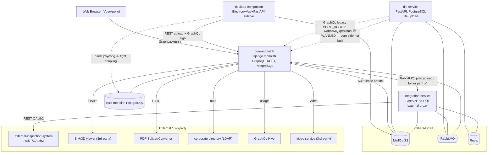

# F1 — IT-Landscape & Contract Analysis (discovery)

> **Status:** Discovery draft (pre-/task-init) — input for STRATEGY-3 F1 federation.
> **Date:** 2026-05-31
> **Method:** 4 parallel agent analyses of the real repos (`core-monolith`, `file-service`, `integration-service`, `desktop-companion`), synthesized here. Cited findings; honest about gaps.

---

## 1. Systems Overview

| System | Role | Stack | API style | Data store | Broker |
|--------|------|-------|-----------|-----------|--------|
| **core-monolith** | Main monolith; decomposition source | Django + Graphene GraphQL + Channels WS + Celery | GraphQL (`/graphql`) primary + REST | **PostgreSQL** + MinIO | RabbitMQ (integration-service only) |
| **file-service** | File upload/storage microservice | FastAPI + Strawberry GraphQL | GraphQL + REST auth | **PostgreSQL** + MinIO | RabbitMQ + Redis/Taskiq |
| **integration-service** | Integration proxy to a 3rd-party **external-inspection-system** | FastAPI + Strawberry GraphQL | GraphQL + REST health | **No SQL** (external system = system of record) + Redis | RabbitMQ + Redis/Taskiq |
| **desktop-companion** | Desktop companion (upload + sign) | Electron + Vue 3 + Python FastAPI sidecar | calls core-monolith REST+GraphQL | in-memory + reads core-monolith DB directly | none |

**Naming:** the four repos all live under one internal org's registry. The monolith is referenced from the satellites as the "core" system.

> ⚠️ **Accuracy lesson (owner-confirmed 2026-05-31):** the core-monolith analysis first concluded **MySQL** — wrong. It is **PostgreSQL**; the `MYSQL_*` env names + a stray `psycopg2`/`mysqlclient` mix are **stale naming** from a past migration. A blind code/config read was misled by dead naming. This is the central accuracy risk for Beadloom on this landscape (see §4bis) — declarations must be human-verified, not inferred-and-trusted.

**Domains inside core-monolith (microservice-extraction candidates):**
- `core` — projects, folders, files/versions, statuses, MinIO storage, PDF split, QR (partial MS-candidate; file-service IS its extraction)
- `tasks` — review/approval/signing workflow, QR generation (MS-candidate: yes)
- `accounts` — auth, users, JWT, directory backend (MS-candidate: yes — identity service)
- `viewer` — 3rd-party BIM/3D viewer adapter (MS-candidate: yes)
- `notifications` — favorites + realtime WS (MS-candidate: maybe)
- `bot` — chat-bot integration (MS-candidate: yes, standalone)
- `tools`, `help` — small (no)

---

## 2. IT-Landscape (System Context)

---

## 3. Contract / Integration Map

| # | Edge | Protocol | Contract location | Status |
|---|------|----------|-------------------|--------|
| 1 | **core-monolith → integration-service** | RabbitMQ AMQP | core `message_queue/payload.py`; integration-service `openspec/specs/rabbitmq-queue`, `plan-version-upload` | ✅ **Confirmed both sides** — `start_plan_version_upload`, `ensure_plans_folder_path` |
| 2 | **integration-service → core-monolith** | RabbitMQ AMQP | integration-service `outbox_payloads.py`; core `integration_inbound.py` | ✅ **Confirmed both sides** — `*_completed` (core consumes) |
| 3 | **integration-service → external-inspection-system** | REST/HTTPS OAuth2 | integration-service `doc/spec_*_integration.md`, `core/<ext>/` | ✅ Confirmed — plans/polygons/houses/oauth |
| 4 | **desktop-companion → core-monolith** | REST upload + GraphQL sign | desktop `api/upload_service.py`, `api/sign_service.py` (hardcoded) | ✅ Confirmed (desktop side; hand-written, no generated client) |
| 5 | **desktop-companion → core-monolith PostgreSQL** | psycopg3 direct TCP | desktop `api/sign_service.py` | ⚠️ **Red flag (active)** — reads the monolith's PostgreSQL directly, bypassing the app layer. Owner-confirmed target. Tight coupling → tag `deprecated`-intent. |
| 6 | **file-service → core-monolith** | GraphQL HTTP (`CORE_HOST`) | file-service `clients/apis/<core>/client.py` | ⚠️ **Legacy, not on hot path** per its own docs |
| 7 | **file-service ↔ core events** | RabbitMQ (`qr_code_info` in, `file_status_changed` out) | file-service `openspec/specs/qr-code-info*`, `files/domain/events.py` | 🟡 **PLANNED (owner-confirmed)** — declared in file-service, the core-side bridge is **not built yet**. A legitimate `planned` edge, not a drift. |
| 8 | **browser → core-monolith** | GraphQL/REST (Apollo) | core `schema/schema.graphql` | ✅ |

**Contract formats in play:** GraphQL SDL (core `schema.graphql`, ~2072 lines; Hive registry), Strawberry code-first GraphQL (file-service, integration-service — no SDL exported), RabbitMQ message types (Pydantic schemas + `openspec/` markdown specs; **no AsyncAPI/proto**), REST (FastAPI runtime `/openapi.json`, **no static OpenAPI files**), hand-written REST/GraphQL calls (desktop).

---

## 4. 🔴 Intent-vs-Reality Drifts (gold for F2 — found during discovery)

These are exactly the cross-service contract mismatches F2 (contract graph) exists to catch. Already surfaced just by analysis:

- **D1 — file-service ↔ core event bridge = PLANNED, not built (owner-confirmed 2026-05-31).** file-service emits RabbitMQ `qr_code_info` (in) / `file_status_changed` (out) and its docs describe a core-system peer. The core side has **no RabbitMQ handler** for these (only a GraphQL `UpdateQRCodeInfo` mutation + an internal WS notification; its consumer ACKs unknown types as `unknown_message_type`). **Resolution:** the bridge is **intentionally not finished yet** on the core side → model as a `planned` edge, NOT a drift. (file-service's `<core>_service/` dir is its *client* module to the monolith, not a separate service.)
- **D2 — `CORE_HOST` declared-but-unused in integration-service.** It requires `CORE_HOST`/`CORE_JWT_TOKEN` env (fails startup without) but makes **zero** calls to it → `dead`/`planned` config placeholder.
- **D3 — desktop-companion direct DB access = active, RESOLVED (owner-confirmed).** desktop `sign_service.py` connects directly to the **core PostgreSQL** (the earlier "MySQL vs PostgreSQL mismatch" was stale env naming — the monolith is PostgreSQL). Real and active; an `active` but architecturally-undesirable edge (tight coupling) → tag `deprecated`-intent / cleanup candidate.
- **D4 — file-service → core GraphQL legacy path** (`getFilesForViewerById`, `CORE_HOST`) still in code but its docs say it's off the hot path → `deprecated` edge.
- **D5 — auth stubs.** integration-service `get_user()` always returns `None` (JWT validation TODO); GraphQL runs unauthenticated. file-service has real JWT. Inconsistent auth maturity — `active` but incomplete.

---

## 4bis. 🎯 Accuracy strategy for legacy / dead / planned code (cross-cutting F1/F2 design requirement)

This landscape is full of code that lies to a naive analyzer (owner-flagged): stale DB naming (MySQL→PostgreSQL), present-but-unused integrations (the BIM viewer adapter), declared-but-unbuilt bridges (the core event bridge), and real-but-easily-missed integrations (SMTP, feature-flags). A blind code-inferred graph would be wrong. Beadloom's answer (= its moat — intent + reality + diff), extended:

**A. Lifecycle status on every node AND edge:** `active | planned | deprecated | dead`.
- Examples here: core event bridge = `planned`; BIM viewer adapter = `deprecated`; `CORE_HOST` in integration-service = `dead`; desktop→core-DB = `active` (cleanup-flagged); core↔integration-service AMQP = `active`.

**B. Three-valued intent-vs-reality (the killer feature for "messy code"):**
| Declared (intent) | Measured (reality, from imports/code) | Verdict |
|---|---|---|
| `active` | present | ✅ OK |
| `active` | **absent** | 🔴 DRIFT (dead declaration) |
| `planned` | absent | 🟡 OK / expected (core event bridge) |
| `deprecated` | present | 🗑 cleanup candidate (BIM adapter, legacy GraphQL) |
| **undeclared** | present | 🟠 UNDECLARED (code uses X, graph doesn't) |

**C. UNDECLARED-but-real findings (must be captured — the "didn't notice it" class):**
- **SMTP** (core Django email) — real integration, not yet in the landscape map. → add as `active`.
- **feature-flags service** — used in core + desktop-companion — real, not mapped. → add as `active`.
- **BIM/3D viewer adapter** — present in core code but **not used** per owner. → add as `deprecated`.
- (Confirm completeness with a dedicated "UNDECLARED sweep" — see open item.)

**D. Bootstrap = draft + human/agent review, never blind auto-trust.** Code-inferred nodes/edges start `unverified`; an agent/human confirms status. Conflicts (e.g. PostgreSQL-vs-MySQL naming) → **flagged for review, not silently decided.** This prevents the MySQL-mistake class.

> This A–D model is proposed as a **standing design requirement** for F1 (graph schema carries lifecycle) and F2 (contract drift uses the three-valued table). Recorded into STRATEGY-3.

---

## 5. Shared Infrastructure (federation-relevant)

- **MinIO/S3** — used by all 4 (core, file-service, integration-service reads, desktop reads release artifacts). Shared object-storage substrate.
- **RabbitMQ** — **one broker, per-service queues** (each service/monolith owns its own queues/routing keys). Broker = single infra node; queues = the contract channels.
- **Redis** — file-service, integration-service (Taskiq, cache, locks, outbox). core uses Redis for Channels/Celery.
- **Deploy** — all containerized; satellites on k8s (Helm+ArgoCD, per-service namespaces, secrets via a secrets-manager). core on docker-compose (DB/RMQ/MinIO external/managed).

---

## 6. Recommended Schemas for F1 (with real data)

| Schema | Verdict for F1 | Why |
|--------|---------------|-----|
| **IT-landscape (System Context)** | ✅ **F1 core** | §2 — 4 systems + externals + shared infra. The federation map. |
| **Contract/Integration map** | ✅ **F1 core** | §3 — the cross-service contract graph (F1→F2). Already exposed 5 drifts. |
| **Per-system architecture (C4 Container)** | 🟡 F1-light → F2 | core domains (decomposition candidates) are the most valuable slice. |
| **Data ownership / ER** | 🟡 F2 | core PostgreSQL + file-service PostgreSQL (separate instances) + integration-service no-SQL (external system is its system-of-record); desktop reads core's PostgreSQL directly. Focused ownership pass later. |
| **User-flow (cross-system)** | 🔵 F4 | e.g. "upload plan → split → push to external-inspection-system → sign" spans all 4. Layered on contracts. |

---

## 7. Federation modeling note (how this maps to Beadloom)

- **Hub-and-spoke:** central Beadloom hub aggregates per-repo graphs. Each repo gets its own `.beadloom/` (satellite); hub composes the landscape (§2) + contract edges (§3).
- **Cross-repo node identity:** `@core-monolith:core`, `@file-service:files`, `@integration-service:plans`, `@desktop-companion:sign` (STRATEGY-3 F1 `@org/repo:NODE`).
- **Contract edges = F2 core:** the §3 edges with protocol + contract-file + lifecycle status + "confirmed both sides?" flag. Drift detection (§4) is the killer feature.
- **Thinnest live slice (for F1 dogfood):** **core-monolith ↔ integration-service RabbitMQ** — the ONE contract confirmed both sides, 2 real repos, clear bidirectional message contract. Ideal first `active` edge. (file-service↔core is the ideal *second* test — it exercises the `planned` state: a declared edge whose reality is intentionally absent, so the hub must show "planned, not built" rather than a false drift.)

---

## 8. Decisions (owner-confirmed 2026-05-31)

1. **D1 bridge:** the core↔file-service RabbitMQ bridge is **not built yet** → `planned` edge.
2. **desktop DB (D3):** connects to the **core PostgreSQL** directly. The monolith is **PostgreSQL** (MySQL naming is stale). `active`, cleanup-flagged.
3. **RabbitMQ:** **one broker**, **per-service queues**. Broker = single infra node; queues = contract channels.
4. **Central hub:** a **new dedicated repo**; aggregated **via CI/CD, pull-based** (satellites publish commit-SHA-tagged `beadloom export` artifacts to a package registry / MinIO; hub CI pulls + composes + validates + publishes). On-push + nightly cron.
5. **F1 first slice:** **core-monolith ↔ integration-service** (RabbitMQ, both-sides-confirmed).
6. **F2 contract priority:** **AMQP message types first**, then GraphQL SDL, then REST.

### Still open (carry into /task-init or a follow-up)
- **UNDECLARED sweep:** a dedicated pass to catch real-but-unmapped integrations across all repos (SMTP, feature-flags found; verify error-tracking / video / secrets-manager / directory / Redis pub/sub) so the landscape is complete, each tagged with a lifecycle status. The "don't miss anything" guarantee.
- **Hub artifact format & cadence:** exact `beadloom export` schema for federation + CI trigger design.
