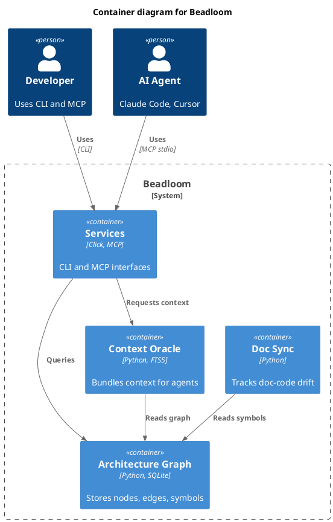

# Beadloom: Strategy 2 — Architecture Infrastructure for the AI Agent Era

> **Status:** Active (Phases 8-12.6 complete, v1.8 planned: 12.8+12.9+12.10+12.11, Phase 13+ planned)
> **Date:** 2026-02-19 (revision 10)
> **Current version:** 1.7.0
> **Predecessor:** STRATEGY.md (Phases 1-6, all completed)
> **Sources:** STRATEGY.md, BACKLOG.md §2-§6, BDL-UX-Issues.md, competitive analysis February 2026

---

## 1. Strategic Context

### What We Solved (Strategy 1)

Beadloom v1.0-1.4 is a full-featured **Architecture as Code** platform: architecture graph, Context Oracle, Doc Sync, architecture lint, MCP server, Agent Prime. The pipeline works: `init` → `reindex` → `ctx` → agent receives context.

### Market Context (February 2026)

AI model context windows are growing rapidly:

| Model | Context |
|-------|---------|
| Claude Opus 4.6 | 1M tokens |
| Gemini 1.5 Pro | up to 2M tokens |
| GPT-5 | 400K tokens |

A typical 50-100 module project is ~500K-2M tokens. Models **can already** read an entire project in one go.

### Why Beadloom Remains Valuable

2026 research (Martin Fowler "Context Engineering for Coding Agents", Anthropic "2026 Agentic Coding Trends Report", ITBrief "AI coding tools face 2026 reset towards architecture") shows:

1. **"Lost in the middle"** — at >100K tokens, models lose 15-30% accuracy on information in the middle of the context
2. **Structure breaks down** — 500K tokens of raw code = text without architectural relationships
3. **Cost** — filling a 1M-token window on every agent step = minutes + dollars
4. **80% of tech debt in 2026 is architectural** — agents write more code, boundary violations happen more often

> **Beadloom is not "more context". It's "the right 2K tokens instead of the wrong 500K".**

### What Context Windows Do NOT Replace

| Capability | Why irreplaceable |
|------------|-------------------|
| **Doc-Code Sync** | Temporal tracking: requires file hashes over time, not a one-time snapshot |
| **Architecture Lint** | Deterministic validation: an agent can violate boundaries, lint catches it |
| **Context Oracle (<20ms)** | In multi-step workflows (plan→code→review→test) 2K in 20ms >> 500K in 30s |
| **YAML graph in Git** | Diffable, reviewable, mergeable — no cloud SaaS offers this |

### What Was Broken (Fixed in v1.5.0)

**Three critical problems — ALL SOLVED:**

1. ~~**Bootstrap is shallow**~~ **FIXED (Phase 8)** — Bootstrap now ingests README, detects 18+ frameworks, discovers entry points, runs import analysis, and generates contextual summaries like "FastAPI service: auth — JWT auth, 3 classes, 5 fns".

2. ~~**Doc Sync is broken**~~ **FIXED (Phase 8.5 + BDL-016)** — Symbol-level drift detection via `symbols_hash` catches semantic drift. BDL-016 fixed the incremental reindex path to preserve baselines. `sync-check` now honestly reports stale docs.

3. ~~**4 languages aren't enough**~~ **FIXED (Phase 9)** — Added Kotlin, Java, Swift, C/C++, Objective-C. 9 languages total.

### Strategy 2 Key Message

> **Strategy 1: Beadloom manages knowledge.**
> **Strategy 2: Beadloom is architecture infrastructure: understands a project from second one, honestly tracks drift, works on any stack, scales to IT landscapes.**

---

## 2. Design Principles

### Principle 1: Agent-native (unchanged)

Beadloom remains an **infrastructure layer**, not an agent. No built-in LLM API calls. The agent the developer already uses does the thinking — Beadloom provides richer data.

### Principle 2: Structure Over Volume

More context ≠ better context. Beadloom delivers **structured data** (graph, symbols, edges, rules, sync status) — what an LLM cannot extract from raw code in a single pass.

### Principle 3: Sync Honesty

Doc Sync must **actually** catch discrepancies, not create a false sense of security. "5 stale" truth is better than "0 stale" lies.

### Principle 4: Core is Deterministic, Semantics are Optional

The core remains deterministic (tree-sitter, BFS, FTS5, symbol-level hashing). Semantic capabilities (embeddings, similarity) are optional via `beadloom[semantic]` and tied to multi-repo scale.

### Principle 5: Engineering Tool

Beadloom is for engineers who build and maintain serious IT systems. YAML graph in Git, deterministic lint, CI gate, multi-repo federation — this is enterprise architecture tooling.

### Why Not a Built-in LLM?

| Factor | Built-in LLM | Rich structured data |
|--------|--------------|----------------------|
| Download size | 3-8 GB model weights | 0 (uses existing tree-sitter) |
| Time to start | Minutes to download model | Instant |
| Hardware requirements | 8+ GB RAM, GPU preferred | Any machine |
| Result quality | 7B << Claude/GPT-4 | Agent's LLM generates ideal summaries |
| Maintenance | Model versions, backends, CUDA/Metal | Standard Python |
| Design compliance | Violates "agent-native" | Fully compliant |

---

## 3. Competitive Landscape

### Direct Competitors

| Tool | What it does | Threat | Our advantage |
|------|-------------|--------|---------------|
| **Greptile** | Semantic code graph, cloud SaaS, $0.45/file | Medium | Local-first, YAML in Git, doc-sync |
| **Augment Code** | Proprietary Context Engine, 400K+ files | High (if opened) | Open format, deterministic |
| **DeepDocs** | GitHub-native doc sync, auto-PR with updates | High for doc-sync | Any Git, not just GitHub; architecture graph |
| **Sourcegraph Cody** | Cross-repo code search + AI | Medium | Not search-first, but architecture-first |

### Complementary Tools

| Tool | How it complements Beadloom |
|------|-----------------------------|
| **Cursor / Windsurf** | IDE with index → Beadloom as MCP backend for architectural context |
| **AGENTS.md (Vercel)** | Static instructions → Beadloom generates AGENTS.md from a live graph |
| **Repomix** | Flat file aggregation → Beadloom delivers structured bundles |
| **Claude Code** | CLAUDE.md + MCP → Beadloom as context MCP server |

### Beadloom's Unique Position

**Local-first, graph-based, Git-versioned architecture infrastructure with doc-sync and multi-language support.** No competitor covers all of this simultaneously.

---

## 4. Roadmap

### Phase 8: Smart Bootstrap (v1.5) — DONE

**Goal:** `beadloom init` creates a graph with real architectural meaning, not just file counts.

**Metric:** Bootstrapping a 50-module project yields nodes with framework, entry points, key symbols, and dependency edges.

**Delivered in:** BDL-015 (17 beads, 306 new tests). Released as v1.5.0.

| # | Task | Type | P | Status |
|---|------|------|---|--------|
| 8.1 | **README/documentation ingestion** — `_ingest_readme()` extracts project description, tech stack, architecture notes | feature | P0 | DONE |
| 8.2 | **Extended framework detection** — 18+ frameworks detected by files and imports | feature | P0 | DONE |
| 8.3 | **Entry point discovery** — `_discover_entry_points()` across 6 languages | feature | P0 | DONE |
| 8.4 | **Import analysis at bootstrap** — `_quick_import_scan()` builds `depends_on` edges | feature | P0 | DONE |
| 8.5 | **Contextual node summaries** — `_build_contextual_summary()` with rich descriptions | feature | P1 | DONE |
| 8.6 | **AGENTS.md in bootstrap** — auto-called from `bootstrap_project()` (fix UX #19) | fix | P1 | DONE |
| 8.7 | **`service-needs-parent` rule** — auto-generated in `generate_rules()` | fix | P1 | DONE |

### Phase 8.5: Doc Sync v2 — Semantic Drift Detection (v1.5) — DONE

**Goal:** Doc Sync honestly catches discrepancies between code and documentation, rather than creating a false sense of security.

**Metric:** After changing 3 functions in a module, `sync-check` shows "stale" for the corresponding documentation, even if the doc file hasn't changed between reindexes.

**Fix:** UX Issues #15, #18 — critical product problems. **Additionally fixed E2E in BDL-016.**

| # | Task | Type | P | Status |
|---|------|------|---|--------|
| 8.5.1 | **Symbol-level drift detection** — `_compute_symbols_hash()` + `symbols_hash` in `sync_state` | feature | P0 | DONE |
| 8.5.2 | **`doctor` warns about drift** — `_check_symbol_drift()` + `_check_stale_sync()` | feature | P0 | DONE |
| 8.5.3 | **Symbol diff in `docs polish`** — `_detect_symbol_changes()` in polish output | feature | P0 | DONE |
| 8.5.4 | **Incremental reindex: graph YAML** — `_graph_yaml_changed()` (fix UX #21) | fix | P0 | DONE |
| 8.5.5 | **`setup-rules` auto-detect fix** — content check instead of presence (fix UX #17) | fix | P2 | DONE |

### Phase 9: Mobile and Server Languages (v1.5) — DONE

**Goal:** Beadloom supports mobile, cross-platform, and server-side development languages. Critical for dogfood project (React Native + Expo + C++ native modules).

**Metric:** `beadloom reindex` on a project with `.kt`, `.swift`, `.cpp`, `.m` files extracts symbols, imports, and dependencies.

| # | Task | Type | P | Status |
|---|------|------|---|--------|
| 9.1 | **Kotlin** — `_load_kotlin()`, `_extract_kotlin_imports()` with stdlib filtering | feature | P0 | DONE |
| 9.2 | **Java** — `_load_java()`, `_extract_java_imports()` with static/wildcard imports | feature | P0 | DONE |
| 9.3 | **Swift** — `_load_swift()`, `_extract_swift_imports()` with 35 Apple framework filters | feature | P0 | DONE |
| 9.4 | **C/C++** — `_load_c()`, `_load_cpp()`, `_extract_c_cpp_imports()` with 80+ system headers | feature | P1 | DONE |
| 9.5 | **Objective-C** — `_load_objc()`, `_extract_objc_imports()` with 48 system frameworks | feature | P1 | DONE |

### Phase 10: Deep Code Analysis (v1.6) — DONE

**Goal:** Graph nodes become rich contextual objects: routes, activity, tests.

**Metric:** `beadloom ctx AUTH` returns API routes, activity level, test coverage — enough for an agent to start working without reading a single file.

**Delivered in:** BDL-017 (15 beads, 3 waves). Plus BDL-018 (honest detection, 4 beads, 43 tests) and BDL-020 (hierarchy fix, 3 beads, 4 tests).

| # | Task | Type | P | Status |
|---|------|------|---|--------|
| 10.1 | **API surface extraction** — 12 frameworks: FastAPI, Flask, Django, Express, NestJS, Spring Boot, Gin, Echo, Fiber, Actix, GraphQL, gRPC | feature | P0 | DONE |
| 10.2 | **Git history analysis** — hot/warm/cold/dormant classification, 6-month window | feature | P0 | DONE |
| 10.3 | **Test mapping** — pytest, jest, go test, JUnit, XCTest; maps tests to modules | feature | P1 | DONE |
| 10.4 | **Rule severity levels** — `error`/`warn`, backward-compatible v1→v2, `--strict` fails on errors only | feature | P1 | DONE |
| 10.5 | **Smart `docs polish`** — enriched with routes, activity, tests, config, symbol diff | feature | P1 | DONE |

### Phase 10.5: Doc-Sync Honest Detection (v1.6) — DONE

**Goal:** Doc-Sync honestly catches ALL types of staleness, not just file-hash changes.

**Metric:** After changing code in a domain, `sync-check` reports stale with specific reasons.

**Delivered in:** BDL-018 (4 beads, 43 new tests) + BDL-019 (doc refresh) + BDL-020 (hierarchy fix).

| # | Task | Type | P | Status |
|---|------|------|---|--------|
| 10.5.1 | **3-layer staleness** — `symbols_changed` + `untracked_files` + `missing_modules` | feature | P0 | DONE |
| 10.5.2 | **Source coverage check** — detect untracked files in node source dirs | feature | P0 | DONE |
| 10.5.3 | **Doc coverage check** — verify docs mention all source modules | feature | P0 | DONE |
| 10.5.4 | **Hierarchy-aware coverage** — `part_of` edges count child node files as tracked | fix | P0 | DONE |
| 10.5.5 | **Baseline fix** — `_compute_symbols_hash()` handles both JSON formats, snapshot preserves hashes | fix | P0 | DONE |

### Phase 11: Agent Infrastructure (v1.6) — DONE

**Goal:** Agents have full access to all validation and context tools via MCP and CLI.

**Metric:** An agent can run lint via MCP, get impact analysis (`why`), see graph diff — not just `get_context`.

**Delivered in:** BDL-017 (15 beads, 3 waves).

| # | Task | Type | P | Status |
|---|------|------|---|--------|
| 11.1 | **MCP tool `lint`** — architecture validation via MCP with severity in JSON | feature | P0 | DONE |
| 11.2 | **MCP tool `why`** — impact analysis via MCP; upstream deps + downstream dependents | feature | P1 | DONE |
| 11.3 | **MCP tool `diff`** — graph changes since git ref via MCP | feature | P1 | DONE |
| 11.4 | **Context cost metrics** — `beadloom status` shows avg/max bundle sizes in tokens | feature | P2 | DONE |
| 11.5 | **Deep config reading** — pyproject.toml, package.json, tsconfig.json, Cargo.toml, build.gradle | feature | P2 | DONE |

### Phase 12: AaC Rules v2 — Architecture Enforcement (v1.7) — DONE

**Goal:** Transform rule engine from simple "node needs edge" checks to a full architecture enforcement system. Beadloom becomes the ArchUnit/Dependency-Cruiser equivalent — language-agnostic and graph-native.

**Metric:** `beadloom lint --strict` catches forbidden cross-layer imports, dependency cycles, and oversized domains. A React Native project with `layers:` config in rules.yml gets boundary violations detected automatically.

**Motivation:** Dogfooding (UX #32-37) revealed that the current rule engine is primitive (`require` + `has_edge_to` only). With 533 imports already indexed for a typical project, import-based boundary enforcement is within reach. AaC rules are Beadloom's key differentiator — "architecture enforcement, not just documentation."

**Delivered in:** BDL-021 (Wave 1-4). Released as v1.7.0.

| # | Task | Type | P | Status |
|---|------|------|---|--------|
| 12.1 | **Node tags/labels** — `tags: [ui-layer, presentation]` field in services.yml. Arbitrary strings for rule matching. Required prerequisite for layer/group rules | feature | P0 | DONE |
| 12.2 | **Forbidden dependency rules** — `forbid` rule type: "nodes tagged X must NOT have `uses` edge to nodes tagged Y". Inverse of current `require` | feature | P0 | DONE |
| 12.3 | **Layer enforcement rules** — `layers:` definition with ordered names + domain assignments. `enforce: top-down` prevents lower layers from depending on upper. `allow_skip: true` for non-strict layering | feature | P0 | DONE |
| 12.4 | **Circular dependency detection** — `forbid_cycles` rule type on `uses`/`depends_on` edges. BFS cycle detection with path reporting | feature | P0 | DONE |
| 12.5 | **Import-based boundary rules** — `forbid_import` rule type: "files in path A must not import from path B". Uses existing import index from `code_symbols` table | feature | P1 | DONE |
| 12.6 | **Cardinality/complexity rules** — `check` rule type: `max_symbols`, `max_files`, `min_doc_coverage` per node. Architectural smell detection | feature | P2 | DONE |

### Phase 12.5: Init Quality (v1.7) — DONE

**Goal:** First-time `beadloom init` captures 80%+ of real project architecture, not 35%. Fix all dogfooding UX issues.

**Metric:** `beadloom init` on a React Native project with native modules produces 15+ nodes (was 6), includes all code directories, generates doc skeletons, and `lint` passes without manual fixes.

**Delivered in:** BDL-021 (Wave 2-4).

| # | Task | Type | P | Status |
|---|------|------|---|--------|
| 12.5.1 | **Scan all code directories** — `detect_source_dirs()` scans all top-level dirs containing code files, not just manifest-adjacent ones (fix UX #32) | fix | P0 | DONE |
| 12.5.2 | **Non-interactive init mode** — `--mode bootstrap`, `--yes`/`--non-interactive`, `--force` flags for CI and agent use (fix UX #33) | feature | P1 | DONE |
| 12.5.3 | **Root service rule fix** — `_generate_default_rules()` excludes root service from `service-needs-parent` (fix UX #34) | fix | P1 | DONE |
| 12.5.4 | **Docs generate in init** — offer doc skeleton generation as final init step, or auto-generate (fix UX #35) | feature | P1 | DONE |
| 12.5.5 | **Doc auto-linking** — fuzzy matching of existing docs to graph nodes by path/content during init (fix UX #36) | feature | P2 | DONE |

### Phase 12.6: Architecture Intelligence (v1.7) — DONE

**Goal:** Proactive architecture insights — detect what changed, what's affected, and where risk concentrates. Makes architecture visible in CI/CD and refactoring workflows.

**Metric:** `beadloom diff HEAD~5` shows added/removed/changed nodes and edges since 5 commits ago. `beadloom why <ref-id> --reverse` shows not just "what depends on X" but "what X depends on" with transitive closure. CI pipeline can fail on unexpected architecture drift.

**Delivered in:** BDL-021 (Wave 2-3).

| # | Task | Type | P | Status |
|---|------|------|---|--------|
| 12.6.1 | **`beadloom diff`** — compare architecture snapshots between commits/branches/tags. Shows added/removed/changed nodes, edges, symbols. Human-readable + `--json` for CI | feature | P2 | DONE |
| 12.6.2 | **Enhanced impact analysis** — `beadloom why <ref-id> --reverse` (what X depends on) + `--depth N` (transitive closure depth) + `--format tree` (visual dependency tree) | feature | P2 | DONE |
| 12.6.3 | **Architecture snapshot storage** — store graph snapshots in SQLite for historical comparison without git checkout. `beadloom snapshot save/list/compare` | feature | P2 | DONE |

### Phase 12.8: C4 Architecture Diagrams (v1.8)

**Goal:** Auto-generate C4 model diagrams (Context, Container, Component) from the existing architecture graph. Beadloom already has all the data — tags, layers, `part_of` hierarchy, edges — C4 is a natural projection of this data into an industry-standard visualization format.

**Metric:** `beadloom graph --format=c4` on a project with tags and layers produces a valid C4 Container diagram in Mermaid syntax that renders in GitHub markdown. `--format=c4-plantuml` produces equivalent PlantUML output. `--level=context|container|component` controls the abstraction level.

**Motivation:** C4 (Simon Brown) is the de-facto standard for architecture visualization in enterprise and open-source. No existing tool auto-generates C4 from a code-derived architecture graph. This makes Beadloom the first **Architecture-as-Code tool that produces C4 diagrams from real code structure**, not hand-written descriptions.

**Prerequisites (all in v1.7):** Node tags (12.1), layer definitions (12.3), `part_of` hierarchy, `uses`/`depends_on` edges, API surface data (10.1).

| # | Task | Type | P | Effort |
|---|------|------|---|--------|
| 12.8.1 | **C4 level mapping** — map graph nodes to C4 levels (System, Container, Component) via configurable strategy: `c4_level` field in services.yml, fallback to `part_of` depth + tags heuristic. Root service = System, top-level domains = Containers, nested modules = Components | feature | P0 | M |
| 12.8.2 | **C4-Mermaid output** — `beadloom graph --format=c4` generates Mermaid C4 syntax (`C4Context`, `C4Container`, `C4Component` diagram types). Reuses existing `graph` command infrastructure, adds C4 renderer | feature | P0 | S |
| 12.8.3 | **C4-PlantUML output** — `beadloom graph --format=c4-plantuml` generates C4-PlantUML with standard macros (`System()`, `Container()`, `Component()`, `Rel()`). Full C4-PlantUML library compatibility | feature | P1 | S |
| 12.8.4 | **C4 level selection** — `--level=context\|container\|component` for drill-down. Context shows system boundaries + external actors. Container shows top-level domains. Component shows internals of a specific container (`--scope=<ref-id>`) | feature | P1 | S |
| 12.8.5 | **C4 external systems** — nodes with `external: true` tag render as `System_Ext`, `Container_Ext`, `ContainerDb_Ext` in C4. Database nodes (tagged `database` or `storage`) render as `ContainerDb` | feature | P2 | S |

### Phase 12.9: Architecture Debt Report (v1.8)

**Goal:** Single command that aggregates all architecture health signals into a quantified debt report. Transforms scattered diagnostics (`lint`, `sync-check`, `doctor`, `status`) into one actionable dashboard with a numeric debt score, category breakdown, and trend tracking.

**Metric:** `beadloom status --debt-report` produces a structured report with debt score 0-100, broken down by categories (rule violations, doc gaps, complexity smells). `--json` output enables CI gate (`--fail-if=score>30`). Score delta vs last snapshot shows trend.

**Motivation:** Architecture debt is invisible until it's too late. Teams say "we have tech debt" but can't quantify it. Beadloom already collects all the signals — lint violations, stale docs, missing coverage, complexity metrics, dormant domains — but they're scattered across 4 commands. One aggregated score makes debt visible, trackable, and actionable. This is what turns Beadloom from "a tool you run sometimes" into "a metric your team tracks every sprint".

**Prerequisites (all in v1.7):** Architecture lint with severity (10.4, 12.1-12.6), doc sync with 3-layer staleness (10.5), git activity analysis (10.2), test mapping (10.3), cardinality checks (12.6), snapshots (12.6.3).

| # | Task | Type | P | Effort |
|---|------|------|---|--------|
| 12.9.1 | **Debt score formula** — weighted aggregation: rule violations (errors×3 + warnings×1), doc gaps (undocumented×2 + stale×1), complexity smells (oversized×2 + high-fan-out×1 + dormant×0.5). Configurable weights in `config.yml`. Score 0 = clean, 100 = critical | feature | P0 | M |
| 12.9.2 | **`status --debt-report`** — human-readable report with categories, counts, top offenders. Rich output via Rich tables/panels. Shows debt score with severity label (clean/low/medium/high/critical) | feature | P0 | S |
| 12.9.3 | **JSON + CI output** — `--debt-report --json` for machine consumption. `--fail-if=score>N` exits non-zero for CI gates. `--fail-if=errors>0` for strict mode | feature | P1 | S |
| 12.9.4 | **Trend tracking** — compare current debt score vs last snapshot. Shows delta per category: "Rule violations: 7 (+2)", "Doc gaps: 8 (-3)". Requires snapshots from Phase 12.6.3 | feature | P1 | S |
| 12.9.5 | **MCP tool `get_debt_report`** — expose debt report via MCP so AI agents can prioritize architectural fixes autonomously. Returns structured JSON with score, categories, top offenders | feature | P2 | S |
| 12.9.6 | **Top offenders list** — rank nodes by individual debt contribution. "SERVICES: 8 points (3 violations, 2 stale docs, oversized)". Helps teams know where to invest refactoring effort | feature | P2 | S |

### Phase 12.10: Interactive Architecture TUI (v1.8)

**Goal:** Transform the existing TUI from a static viewer into an interactive architecture workstation. One command — `beadloom tui` — gives a developer a live, navigable dashboard with graph exploration, debt monitoring, doc status, dependency tracing, and keyboard-driven actions. Works over SSH, in tmux, on any terminal.

**Metric:** `beadloom tui` opens an interactive dashboard that updates live on file changes. Developer can explore the full graph, trace dependencies, inspect context bundles, and trigger actions (reindex, lint, generate docs) without leaving the TUI. Startup < 1s. No competitor has an equivalent.

**Motivation:** CLI commands give snapshots — you run, read, forget. TUI gives a persistent workspace. For architecture work, the ability to explore and navigate interactively is a category-defining feature. No AaC competitor (Greptile, Augment, DeepDocs) has a terminal-native interactive interface. This works everywhere: SSH, tmux, CI debug sessions, containers, remote servers.

**Technology:** Textual (by Textualize) — Python TUI framework built on Rich (already in Beadloom's stack). CSS-like styling, reactive widgets, async support, hot reload during development.

**Prerequisites:** Phase 12.9 (debt report data for dashboard), all existing infrastructure (lint, sync-check, graph, ctx, why).

| # | Task | Type | P | Effort |
|---|------|------|---|--------|
| 12.10.1 | **Architecture Dashboard** — main screen with debt score gauge, graph tree, lint violations panel, git activity sparklines. Layout via Textual CSS. Updates reactively when underlying data changes | feature | P0 | L |
| 12.10.2 | **Interactive Graph Explorer** — tree widget with expand/collapse. Enter → node detail (symbols, edges, routes, tests). Keyboard nav: `d` downstream, `u` upstream, `c` context preview, `o` open in $EDITOR | feature | P0 | M |
| 12.10.3 | **Live File Watcher** — `watchfiles` (or `watchdog`) monitors source dirs. On change: badge "reindex needed", press `r` to reindex, dashboard auto-refreshes. Debounced (500ms) to avoid spam | feature | P1 | M |
| 12.10.4 | **Dependency Path Tracer** — interactive `why` panel. Select source → target, shows all paths. Highlights cycles in red. Reverse mode (who depends on me). Keyboard: arrow keys to navigate paths | feature | P1 | M |
| 12.10.5 | **Doc Sync Status Panel** — all nodes with doc status (fresh/stale/missing) + staleness reason. Press `g` to generate skeleton, `p` to view polish data. Color-coded: green/yellow/red | feature | P1 | S |
| 12.10.6 | **Context Bundle Inspector** — preview exactly what `beadloom ctx <ref-id>` returns. Shows token count, sections, dependencies. Helps developers understand what agents see | feature | P2 | S |
| 12.10.7 | **Keyboard-driven Actions** — trigger reindex (`r`), lint (`l`), sync-check (`s`), generate docs (`g`), snapshot (`S`) directly from TUI. Action results shown in status bar / notification panel | feature | P2 | S |

### Phase 12.11: Documentation Audit — Meta-Doc Staleness Detection (v1.8) ⚗️ EXPERIMENTAL

**Goal:** Automatically detect stale facts in project-level documentation (README, CONTRIBUTING, guides) that are not tied to specific graph nodes and therefore fall outside doc-sync scope. Zero-config: Beadloom computes ground truth from project state and scans markdown files for outdated mentions.

**Metric:** `beadloom docs audit` on a project after a release detects stale version numbers, outdated counts (MCP tools, languages, commands), and changed feature lists — without any manual mapping configuration. False positive rate < 20% across diverse projects.

**Motivation:** After every release, meta-documentation (README, guides, CONTRIBUTING, SECURITY) goes stale. Version numbers, feature counts, command lists, API endpoint counts — all silently become wrong. BDL-022 (v1.7.0 doc refresh) required 6 parallel agents and 10 file updates. This problem exists in every project with documentation. `sync-check` covers node-level docs; `docs audit` covers everything else.

**Experimental status:** ⚗️ This feature ships as experimental in v1.8. The keyword-proximity matching algorithm needs real-world validation across diverse projects (different doc styles, languages, structures). User feedback will shape the matching heuristics, fact registry, and tolerance system. API may change in v1.9.

**Prerequisites:** Manifest parsing (existing), code_symbols (existing), graph storage (existing). No dependency on other v1.8 phases.

| # | Task | Type | P | Effort |
|---|------|------|---|--------|
| 12.11.1 | **Fact registry** — auto-compute project facts from existing data: version (from manifest), language_count, node_count, edge_count (from graph), test_count (from test mapping), framework_count (from detection). Extensible via `config.yml` for project-specific facts | feature | P0 | M |
| 12.11.2 | **Doc scanner** — scan markdown files, extract numeric mentions + version strings. Keyword-proximity matching: associate numbers with nearby keywords (e.g., "9" near "languages" → `language_count`). Built-in keyword sets for standard facts, configurable for custom | feature | P0 | M |
| 12.11.3 | **`beadloom docs audit`** — compare ground truth vs mentions. Human-readable report: stale/fresh/unmatched. Color-coded output via Rich. `--json` for scripting | feature | P0 | S |
| 12.11.4 | **CI gate** — `beadloom docs audit --fail-if=stale>0` exits non-zero. Integrates into release workflows to block releases with outdated docs | feature | P1 | S |
| 12.11.5 | **Tolerance system** — configurable per-fact tolerance: exact match for versions, ±5% for test counts, ±10% for growing metrics. Avoids false positives for naturally fluctuating numbers | feature | P1 | S |
| 12.11.6 | **Debt report integration** — `docs audit` stale count feeds into debt score (Phase 12.9) as a "meta-doc staleness" category. Unified view of all documentation health | feature | P2 | S |

### Phase 13: Cross-System Foundation (v1.9)

**Goal:** Beadloom works across repository boundaries. Beginning of the path to serving IT landscapes.

**Metric:** `beadloom ctx AUTH` in repo-A can show a dependency on `@repo-B:BILLING`; `beadloom export` generates a graph for external consumption.

| # | Task | Type | P | Effort |
|---|------|------|---|--------|
| 13.1 | **Multi-repo graph refs** — references to nodes from external repositories (`@org/other-repo:AUTH-001`); configuration in `config.yml` | feature | P0 | L |
| 13.2 | **Polyglot API contract edges** — frontend↔backend links via OpenAPI, GraphQL, protobuf; cross-language `depends_on` | feature | P1 | L |
| 13.3 | **`beadloom export`** — export graph to DOT, D2, Mermaid file, JSON for external consumption | feature | P1 | S |
| 13.4 | **Monorepo workspace** — multiple `_graph/` roots in a single repository; isolated contexts per package | feature | P2 | M |

### Phase 14: Full Cross-System + Semantic Layer (v2.0)

**Goal:** Beadloom serves IT landscapes of dozens of repositories. Semantic search works across a federated graph of 1000+ nodes.

**Rationale for tying semantics to multi-repo:** At single-project scale (50-200 nodes) FTS5 covers 95% of search queries. At 1000+ nodes from 15 repositories, different teams name identical concepts differently — this is where embedding-based search provides real value.

**Metric:** `beadloom search "authentication flow"` returns relevant nodes from 5 repositories, even when the word "authentication" doesn't appear in the graph.

| # | Task | Type | P | Effort |
|---|------|------|---|--------|
| 14.1 | **Graph federation** — index synchronization protocol between repositories; shared node registry | feature | P0 | L |
| 14.2 | **`beadloom[semantic]` extra** — `sqlite-vec>=0.1` + `fastembed>=0.4`; `uv tool install beadloom[semantic]` | feature | P0 | S |
| 14.3 | **Embedding index** — on `reindex`, generate embeddings via BAAI/bge-small-en-v1.5 (77MB, CPU-only); `vec_nodes` table via sqlite-vec | feature | P0 | M |
| 14.4 | **Semantic search** — `beadloom search --semantic "auth flow"`; fallback: semantic → FTS5 → LIKE | feature | P0 | M |
| 14.5 | **Plugin system** — entry points for custom nodes, edges, indexers, rules | feature | P1 | L |
| 14.6 | **Code similarity** — `beadloom similar REF_ID` finds similar nodes by embedding distance | feature | P2 | S |
| 14.7 | **Embedding cache invalidation** — re-embed only changed nodes | feature | P2 | S |

### Phase 15: Quality and Robustness (cross-cutting)

**Goal:** Improve reliability and maintainability for production use.

| # | Task | Type | P | Effort |
|---|------|------|---|--------|
| 15.1 | **Atomic YAML writes** — temp-file + rename for crash protection | fix | P1 | S |
| 15.2 | **SQLite schema migrations** — versioned schema with forward migration | feature | P1 | M |
| 15.3 | **Re-export/alias resolution** — `from X import Y` chains through re-exports | feature | P2 | M |
| 15.4 | **Performance benchmarks** — automated benchmark suite | feature | P2 | M |
| 15.5 | **Property-based testing** — Hypothesis for graph edge cases | feature | P2 | M |

### Phase 7: Guides and Demos (parallel)

| # | Task | Type | P | Effort |
|---|------|------|---|--------|
| 7.1 | **Guide: "Onboarding a new developer in 1 day"** | docs | P1 | S |
| 7.2 | **Guide: "Multi-agent workflow with Beadloom + Claude Code"** | docs | P1 | S |
| 7.3 | **Guide: "Keeping documentation alive in a fast-moving codebase"** | docs | P1 | S |
| 7.4 | **Demo GIF/asciicast** for README | docs | P1 | S |
| 7.5 | **Update README.ru.md** — bring up to date for v1.4+ | docs | P1 | S |

### Deferred to STRATEGY-3 (visualization and ecosystem)

The following tasks have value but are not priorities for architecture infrastructure:

| Task | Why deferred |
|------|-------------|
| Web dashboard (D3/Cytoscape) | High effort; Interactive TUI (Phase 12.10) covers this natively |
| VS Code extension | High effort; MCP tools are sufficient |
| ASCII graph in terminal | Low ROI; Mermaid + C4 covers this |
| GitHub Actions marketplace | Useful, but `beadloom lint --strict` in CI already works |
| pre-commit hook | `beadloom install-hooks` already exists |
| Architecture pattern detection (MVC/hex) | LLMs identify patterns from context better |
| Dependency weight analysis | Low ROI for single repo; useful at multi-repo |
| ~~Rule tags / categories~~ | **Elevated to Phase 12.1 (v1.7)** — prerequisite for AaC rules |
| "Did you mean?" | Levenshtein already exists in MCP; CLI can be added |
| Symbol search (by signature) | tree-sitter already provides names; signatures are edge case |
| C# (tree-sitter-c-sharp) | No dogfood project; on user request |

---

## 5. Key Feature Details

### 5.1 Symbol-level Drift Detection (Phase 8.5)

**Problem:** Sync-check shows "31/31 OK" with 12 real discrepancies (UX Issues #15, #18). Hash-based detection compares files between reindexes but doesn't catch the "code changed, doc didn't" situation.

**Solution:** Two-level sync verification:

```
Level 1 (existing): file-hash based
  sync_state.doc_hash != current hash → stale

Level 2 (NEW): symbol-level drift
  sync_state.symbols_hash != current node symbols_hash → stale
  where symbols_hash = SHA256(sorted(code_symbols for ref_id))
```

**Implementation:**

```python
def compute_symbols_hash(conn: sqlite3.Connection, ref_id: str) -> str:
    """Compute symbol hash for a node."""
    rows = conn.execute(
        "SELECT symbol_name, kind, line_start, line_end "
        "FROM code_symbols WHERE annotations LIKE ? "
        "ORDER BY file_path, symbol_name",
        (f'%"{ref_id}"%',),
    ).fetchall()
    return hashlib.sha256(str(rows).encode()).hexdigest()

# In sync-check:
# 1. Check file-level hashes (existing)
# 2. Check symbols_hash vs symbols_hash_at_sync (NEW)
# 3. If symbols_hash changed but doc_hash didn't → STALE (semantic drift)
```

**Symbol diff for `docs polish`:**

```python
def compute_symbol_diff(old_symbols: list, new_symbols: list) -> dict:
    """Compute symbol difference for docs polish."""
    old_set = {(s.name, s.kind) for s in old_symbols}
    new_set = {(s.name, s.kind) for s in new_symbols}
    return {
        "added": new_set - old_set,      # new functions/classes
        "removed": old_set - new_set,    # removed
        "changed": [...],                 # changed signatures
    }
```

### 5.2 README Ingestion (Phase 8)

**Problem:** README.md contains architecture descriptions, tech stack, instructions. Bootstrap ignores it.

**Solution:**

```python
def ingest_readme(project_root: Path) -> dict[str, Any]:
    """Extract project metadata from README and root documents."""
    # Parses: README.md, CONTRIBUTING.md, ARCHITECTURE.md, docs/README.md
    # Extracts: project description, technology mentions, architecture diagrams
    # Returns: {"description": "...", "tech_stack": [...], "architecture_notes": "..."}
```

### 5.3 Import Analysis at Bootstrap (Phase 8)

**Problem:** `bootstrap_project()` generates only `part_of` edges. `depends_on` edges only appear after `reindex`.

**Solution:** Lightweight import extraction during bootstrap:

```python
def bootstrap_project(project_root, *, preset_name=None):
    # ... existing scanning + clustering ...

    # NEW: lightweight import scanning
    import_edges = _quick_import_scan(project_root, clusters, scan["source_dirs"])
    edges.extend(import_edges)
```

Reuses `extract_imports()` from `import_resolver.py`, maps to cluster names. Fast and accurate enough for the initial graph.

### 5.4 Mobile Languages (Phase 9)

**Dogfood project:** React Native + Expo mobile app with native modules:
- C++ routing engine (iOS: Obj-C++ wrapper, Android: JNI)
- C++/BLE embedded device integration
- Potential iOS/Android native modules (Swift, Kotlin)

**Approach:** Adding tree-sitter loaders to `_EXTENSION_LOADERS` following the existing pattern (Python, TS, Go, Rust):

| Language | tree-sitter package | Extensions | What we extract |
|----------|-------------------|------------|-----------------|
| Kotlin | tree-sitter-kotlin | `.kt`, `.kts` | classes, data classes, `@Composable`, `@HiltViewModel`, imports |
| Java | tree-sitter-java | `.java` | classes, interfaces, `@RestController`, `@Service`, imports |
| Swift | tree-sitter-swift | `.swift` | classes, structs, protocols, `@main`, `import` |
| C/C++ | tree-sitter-c/cpp | `.h`, `.c`, `.cpp` | functions, classes, `#include` |
| Obj-C | tree-sitter-objc | `.m`, `.mm` | classes, methods, `#import`, `@interface` |

### 5.5 API Surface Extraction (Phase 10)

**Solution:** Tree-sitter queries for framework-specific routes:

```python
# Python (FastAPI/Flask)
@app.post("/api/login")           → Route("POST", "/api/login")

# Go (Gin/Echo/Fiber)
r.POST("/api/login", handler)     → Route("POST", "/api/login")

# TypeScript (NestJS/Express)
@Get("/me")                       → Route("GET", "/me")

# Java/Kotlin (Spring Boot)
@GetMapping("/api/users")         → Route("GET", "/api/users")
```

Routes are stored as JSON in `nodes.extra` and included in context bundles.

### 5.6 Git History Analysis (Phase 10)

```python
def analyze_git_activity(project_root: Path, source_dirs: list[str]) -> dict[str, GitActivity]:
    """Analyze git history by source directory cluster."""
    # git log --format="%H %aI" --name-only --since="6 months ago"
    # Tags: hot (>20 commits/month), warm (5-20), cold (<5), dormant (0 for 3 months)
```

### 5.7 AaC Rules v2 — Architecture Enforcement (Phase 12)

**Problem:** Current rule engine has one type: `require` (check that a node has a specific edge). This covers ~5% of architecture enforcement needs. Real projects need forbidden dependencies, layer direction, cycle detection, and import-level boundaries.

**Solution:** Extended rule YAML with 5 new rule types:

```yaml
# rules.yml v2
version: 2

# Node tags (prerequisite)
tags:
  ui-layer: [app-tabs, app-auth, app-meshtastic]
  feature-layer: [map, calendar, profile, meshtastic-ui]
  shared-layer: [hooks, theme, ui, navigation]
  service-layer: [mapbox-service, valhalla-service]
  native-layer: [valhalla-native, meshtastic-native]

rules:
  # 1. Existing: require (v1)
  - name: domain-needs-parent
    require:
      for: { kind: domain }
      edge_kind: part_of
      has_edge_to: {}

  # 2. NEW: forbid (inverse of require)
  - name: ui-no-native
    forbid:
      from: { tag: ui-layer }
      to: { tag: native-layer }
      edge_kind: uses
    message: "UI layer must not depend on native modules directly"

  # 3. NEW: layers (ordered enforcement)
  - name: layer-direction
    layers:
      - { name: presentation, tag: ui-layer }
      - { name: features, tag: feature-layer }
      - { name: shared, tag: shared-layer }
      - { name: services, tag: service-layer }
      - { name: native, tag: native-layer }
    enforce: top-down
    allow_skip: true

  # 4. NEW: forbid_cycles
  - name: no-circular-deps
    forbid_cycles:
      edge_kind: uses
      max_depth: 10

  # 5. NEW: forbid_import (file-level)
  - name: no-cross-feature-imports
    forbid_import:
      from: "components/features/map/**"
      to: "components/features/calendar/**"

  # 6. NEW: check (cardinality)
  - name: domain-size
    check:
      for: { kind: domain }
      max_symbols: 200
      max_files: 30
```

**Implementation approach:** Each rule type is a separate evaluator function. The engine dispatches by rule type. Import-based rules query `code_symbols` table directly. Cycle detection uses iterative DFS with path tracking.

### 5.8 `beadloom[semantic]` — Technical Specification (Phase 14)

**Model:** BAAI/bge-small-en-v1.5 — 77MB, 384-dimensional embeddings, CPU-only, 5-14K docs/sec.

**Schema:**

```sql
CREATE VIRTUAL TABLE IF NOT EXISTS vec_nodes USING vec0(
    ref_id TEXT PRIMARY KEY,
    embedding FLOAT[384]
);
CREATE VIRTUAL TABLE IF NOT EXISTS vec_chunks USING vec0(
    chunk_id INTEGER PRIMARY KEY,
    embedding FLOAT[384]
);
```

**Fallback chain:**

```
1. [semantic] installed? → cosine similarity via vec_nodes
2. FTS5 match? → full-text search
3. Fallback → LIKE query
```

**Value at scale:**

| Scale | FTS5 sufficient? | Semantic needed? |
|-------|-------------------|-----------------|
| 1 project, 50 nodes | Yes | No |
| 1 project, 200 nodes | Yes | Optional |
| 5 repos, 500 nodes | No | Yes |
| 15 repos, 2000 nodes | No | Required |

### 5.9 C4 Architecture Diagrams — Technical Specification (Phase 12.8)

**C4 Model Mapping:**

The C4 model defines 4 abstraction levels. Beadloom maps its graph hierarchy to C4 as follows:

| C4 Level | Beadloom Source | Example |
|----------|----------------|---------|
| **System (C1)** | Root service node | "Beadloom" |
| **Container (C2)** | Top-level domains (`part_of` depth=1) | `graph/`, `services/`, `doc_sync/` |
| **Component (C3)** | Nested modules (`part_of` depth=2+) | `graph/builder`, `services/mcp` |
| **Person/External** | Nodes tagged `external: true` | "CI Pipeline", "IDE via MCP" |

**Level determination strategy (configurable):**

```yaml
# services.yml — explicit C4 level (highest priority)
nodes:
  - ref_id: GRAPH
    name: Architecture Graph
    c4_level: container          # explicit override
    c4_technology: "Python, SQLite"
    c4_description: "Stores and queries architecture graph"

# Fallback: automatic mapping
# 1. c4_level field in services.yml → use as-is
# 2. part_of depth 0 (root) → System
# 3. part_of depth 1 → Container
# 4. part_of depth 2+ → Component
# 5. tag "external" → System_Ext / Container_Ext
# 6. tag "database" / "storage" → ContainerDb
```

**C4-Mermaid output example:**

```
C4Container
    title Container diagram for Beadloom

    Person(user, "Developer", "Uses CLI and MCP")
    Person(agent, "AI Agent", "Claude Code, Cursor")

    System_Boundary(beadloom, "Beadloom") {
        Container(graph, "Architecture Graph", "Python, SQLite", "Stores nodes, edges, symbols")
        Container(ctx_oracle, "Context Oracle", "Python, FTS5", "Bundles context for agents")
        Container(doc_sync, "Doc Sync", "Python", "Tracks doc-code drift")
        Container(services, "Services", "Click, MCP", "CLI and MCP interfaces")
    }

    Rel(user, services, "Uses", "CLI")
    Rel(agent, services, "Uses", "MCP stdio")
    Rel(services, graph, "Queries")
    Rel(services, ctx_oracle, "Requests context")
    Rel(ctx_oracle, graph, "Reads graph")
    Rel(doc_sync, graph, "Reads symbols")
```

**C4-PlantUML output example:**



**CLI interface:**

```bash
# Default: C4 Container diagram in Mermaid (most useful level)
beadloom graph --format=c4

# PlantUML output
beadloom graph --format=c4-plantuml

# Specific C4 level
beadloom graph --format=c4 --level=context      # C1: system + external actors
beadloom graph --format=c4 --level=container     # C2: top-level domains (default)
beadloom graph --format=c4 --level=component     # C3: internals of one container

# Drill into a specific container
beadloom graph --format=c4 --level=component --scope=GRAPH

# Save to file
beadloom graph --format=c4-plantuml --output=architecture.puml
```

**Data sources per C4 element:**

| C4 Element | Data source |
|-----------|-------------|
| Name | `nodes.name` |
| Technology | `nodes.extra.frameworks` + language from `code_symbols` |
| Description | `nodes.summary` or `docs.content` excerpt |
| Relationships | `edges` (uses, depends_on) → `Rel()` |
| External flag | `tags` containing `external` |
| Database flag | `tags` containing `database`, `storage` |
| Boundary grouping | `part_of` edges → `System_Boundary` / `Container_Boundary` |

### 5.10 Architecture Debt Report — Technical Specification (Phase 12.9)

**Debt Score Formula:**

```
debt_score = min(100, Σ category_scores)

category_scores:
  rule_violations  = (error_count × 3) + (warning_count × 1)
  doc_gaps         = (undocumented_nodes × 2) + (stale_docs × 1) + (untracked_files × 0.5)
  complexity       = (oversized_domains × 2) + (high_fan_out × 1) + (dormant_domains × 0.5)
  test_gaps        = (untested_domains × 1)

severity:
  0       = clean    ✓
  1-10    = low      ●
  11-25   = medium   ▲
  26-50   = high     ◆
  51-100  = critical ✖
```

Weights are configurable in `config.yml`:

```yaml
# config.yml
debt_report:
  weights:
    rule_error: 3
    rule_warning: 1
    undocumented_node: 2
    stale_doc: 1
    untracked_file: 0.5
    oversized_domain: 2
    high_fan_out: 1
    dormant_domain: 0.5
    untested_domain: 1
  thresholds:
    oversized_symbols: 200    # max symbols per node
    high_fan_out: 10          # max outgoing dependencies
    dormant_months: 3         # months with 0 commits
  fail_if:                    # CI defaults (overridable via CLI)
    score: null               # --fail-if=score>30
    errors: null              # --fail-if=errors>0
```

**Data aggregation (sources per category):**

| Category | Data source | How collected |
|----------|-------------|---------------|
| Rule violations | `lint_engine.evaluate()` | Existing lint infrastructure (Phase 12) |
| Doc gaps — undocumented | `nodes` without matching `docs` entry | Existing doc_sync (Phase 8.5) |
| Doc gaps — stale | `sync_state` with symbol drift | Existing sync-check (Phase 10.5) |
| Doc gaps — untracked | Files in source dirs not covered by nodes | Existing coverage check (Phase 10.5) |
| Complexity — oversized | `code_symbols` count per node > threshold | Existing cardinality rules (Phase 12.6) |
| Complexity — fan-out | `edges` (uses/depends_on) count per node | Existing graph edges |
| Complexity — dormant | `git_activity` with 0 commits in N months | Existing git analysis (Phase 10.2) |
| Test gaps | Nodes without test mapping | Existing test mapping (Phase 10.3) |

**CLI interface:**

```bash
# Human-readable report (default)
beadloom status --debt-report

# JSON for scripting / CI
beadloom status --debt-report --json

# CI gate — fail if debt score exceeds threshold
beadloom status --debt-report --fail-if=score>30

# Strict CI — fail on any lint errors
beadloom status --debt-report --fail-if=errors>0

# Show trend vs last snapshot
beadloom status --debt-report --trend

# Filter by category
beadloom status --debt-report --category=docs
beadloom status --debt-report --category=rules,complexity
```

**Human-readable output example:**

```
Architecture Debt Report
════════════════════════════════════════════════════

  Debt Score: 23 / 100  ▲ medium

Category Breakdown
──────────────────────────────────────────────────
  Rule Violations .................... 9 pts
  ├── errors:   2  (ui→native forbid, cycle in services)
  └── warnings: 3  (missing part_of, cardinality)

  Documentation Gaps ................. 8 pts
  ├── undocumented nodes:  3  (AUTH, BILLING, NOTIFICATIONS)
  ├── stale docs:          4  (GRAPH, SERVICES, DOC_SYNC, CTX_ORACLE)
  └── untracked files:     1  (services/new_handler.py)

  Complexity Smells .................. 5 pts
  ├── oversized (>200 sym): 2  (GRAPH: 247, SERVICES: 213)
  ├── high fan-out (>10):   1  (SERVICES: 14 deps)
  └── dormant (>3 months):  0

  Test Gaps .......................... 1 pt
  └── untested domains:     1  (NOTIFICATIONS)

Top Offenders
──────────────────────────────────────────────────
  1. SERVICES .............. 8 pts  (2 violations, 2 stale, oversized, fan-out)
  2. GRAPH ................. 4 pts  (1 stale, oversized)
  3. AUTH .................. 3 pts  (undocumented, 1 violation)

Trend (vs snapshot 2026-02-12)
──────────────────────────────────────────────────
  Score: 23 ← 26  ↓ 3 improved
  Rules: 9  ← 11  ↓ 2
  Docs:  8  ← 8   = 0
  Complexity: 5  ← 5   = 0
  Tests: 1  ← 2   ↓ 1
```

**JSON output schema:**

```json
{
  "debt_score": 23,
  "severity": "medium",
  "categories": {
    "rule_violations": {
      "score": 9,
      "errors": 2,
      "warnings": 3,
      "details": [
        {"rule": "ui-no-native", "severity": "error", "node": "APP-TABS"},
        {"rule": "no-circular-deps", "severity": "error", "path": ["SERVICES", "GRAPH", "SERVICES"]}
      ]
    },
    "doc_gaps": {
      "score": 8,
      "undocumented": ["AUTH", "BILLING", "NOTIFICATIONS"],
      "stale": ["GRAPH", "SERVICES", "DOC_SYNC", "CTX_ORACLE"],
      "untracked_files": ["services/new_handler.py"]
    },
    "complexity": {
      "score": 5,
      "oversized": [{"node": "GRAPH", "symbols": 247}, {"node": "SERVICES", "symbols": 213}],
      "high_fan_out": [{"node": "SERVICES", "deps": 14}],
      "dormant": []
    },
    "test_gaps": {
      "score": 1,
      "untested": ["NOTIFICATIONS"]
    }
  },
  "top_offenders": [
    {"node": "SERVICES", "score": 8, "reasons": ["2 violations", "2 stale", "oversized", "fan-out"]},
    {"node": "GRAPH", "score": 4, "reasons": ["1 stale", "oversized"]}
  ],
  "trend": {
    "previous_snapshot": "2026-02-12",
    "previous_score": 26,
    "delta": -3
  }
}
```

### 5.11 Interactive Architecture TUI — Technical Specification (Phase 12.10)

**Technology stack:**

| Component | Choice | Rationale |
|-----------|--------|-----------|
| Framework | Textual >=0.80 | Built on Rich (already in stack), CSS-like layout, reactive, async-native |
| File watching | `watchfiles` (Rust-based) | Fast, cross-platform, minimal deps. Fallback: `watchdog` |
| Graph rendering | Textual `Tree` widget + custom | Built-in tree is efficient for 200+ nodes |
| Charts/sparklines | `textual-plotext` or custom Rich | Git activity sparklines, debt gauge |

**Architecture:**

```
beadloom tui
│
├── App (Textual Application)
│   ├── DashboardScreen (main)
│   │   ├── DebtGaugeWidget          ← reads from debt report (12.9)
│   │   ├── GraphTreeWidget          ← reads from graph storage
│   │   ├── LintViolationsWidget     ← reads from lint engine
│   │   ├── ActivitySparklineWidget  ← reads from git_activity
│   │   └── StatusBarWidget          ← file watcher status, last action
│   │
│   ├── ExplorerScreen (detail)
│   │   ├── NodeDetailPanel          ← symbols, edges, routes, tests
│   │   ├── DependencyPathPanel      ← interactive why/trace
│   │   └── ContextPreviewPanel      ← ctx bundle preview
│   │
│   └── DocStatusScreen
│       ├── DocHealthTable           ← sync-check results
│       └── DocDiffPanel             ← symbol diff for stale docs
│
├── DataLayer (read-only access to existing infra)
│   ├── GraphDataProvider            ← graph storage (SQLite)
│   ├── LintDataProvider             ← lint_engine.evaluate()
│   ├── SyncDataProvider             ← sync-check results
│   ├── DebtDataProvider             ← debt score calculator (12.9)
│   └── ActivityDataProvider         ← git_activity analysis
│
└── FileWatcher (background worker)
    ├── watches source dirs from graph config
    ├── debounce 500ms
    └── emits "reindex_needed" event → UI badge
```

**Screen layout (Dashboard):**

```
┌─────────────────────────────────────────────────────────────┐
│  beadloom tui — ProjectName                    Debt: 23 ▲   │
├────────────────────────┬────────────────────────────────────┤
│  Graph                 │  Activity (7d)         Lint        │
│  ─────                 │  ──────────            ────        │
│  ▼ ROOT (service)      │  SVC  ████████░░ 14    ✖ 2 errors │
│    ▼ graph/            │  GRP  █████░░░░░  6    ▲ 3 warns  │
│      builder           │  DSY  ██░░░░░░░░  3               │
│      storage    ●stale │  CTX  █░░░░░░░░░  1    Docs       │
│    ▶ services/         │  TUI  ░░░░░░░░░░  0    ────       │
│    ▶ doc_sync/  ●stale │                        73% covered │
│    ▶ ctx_oracle/       │                        4 stale     │
│    ▶ tui/              │                        3 missing   │
├────────────────────────┴────────────────────────────────────┤
│  GRAPH: Architecture Graph — Python, SQLite                  │
│  247 sym | 12 files | 5 deps | ●stale (symbols changed)    │
├─────────────────────────────────────────────────────────────┤
│  [q]uit [r]eindex [l]int [d]ebt [/]search [?]help   ● live │
└─────────────────────────────────────────────────────────────┘
```

**Keyboard bindings:**

| Key | Context | Action |
|-----|---------|--------|
| `↑↓` | Graph tree | Navigate nodes |
| `Enter` | Graph tree | Expand/collapse node or open detail |
| `d` | Node selected | Show downstream dependents |
| `u` | Node selected | Show upstream dependencies |
| `c` | Node selected | Context bundle preview |
| `o` | Node selected | Open primary source file in $EDITOR |
| `r` | Global | Trigger reindex |
| `l` | Global | Run lint |
| `s` | Global | Run sync-check |
| `g` | Doc panel / node | Generate doc skeleton |
| `S` | Global | Save snapshot |
| `/` | Global | FTS5 search across graph |
| `Tab` | Global | Switch panel focus |
| `1-3` | Global | Switch screen (dashboard/explorer/docs) |
| `q` | Global | Quit |
| `?` | Global | Help overlay |

**Data flow (reactive):**

```
FileWatcher ──event──→ App.post_message("reindex_needed")
                           │
                           ▼
                    StatusBar shows "● changes detected, press [r]"
                           │
                    User presses [r]
                           │
                           ▼
                    BackgroundWorker runs reindex()
                           │
                           ▼
                    DataProviders refresh() ──→ Widgets update()
                           │
                           ▼
                    DebtGauge recalculates, GraphTree rebuilds,
                    LintPanel refreshes, DocStatus updates
```

**Performance targets:**

| Metric | Target | How |
|--------|--------|-----|
| Startup time | < 1s | Lazy-load data, render shell first |
| Reindex + refresh | < 3s (50 nodes) | Background worker, incremental widget updates |
| Memory | < 50MB | Textual is lightweight; data stays in SQLite |
| Node limit | 500+ nodes smooth | Virtual tree (Textual handles this natively) |

**Dependency on Textual:**

```toml
# pyproject.toml
[project.optional-dependencies]
tui = ["textual>=0.80", "watchfiles>=0.20"]

# Install: uv tool install beadloom[tui]
# Or: uv pip install beadloom[tui]
```

TUI is an optional extra — core Beadloom stays lightweight. `beadloom tui` without the extra installed shows a helpful message: "Install TUI support: uv tool install beadloom[tui]".

### 5.12 Documentation Audit — Technical Specification (Phase 12.11) ⚗️

**Pass 1: Fact Registry (ground truth)**

Zero-config facts computed from existing Beadloom infrastructure:

```python
class FactRegistry:
    """Auto-computes project facts from existing data sources."""

    def collect(self, project_root: Path, db: Connection) -> dict[str, Fact]:
        return {
            # From manifest (pyproject.toml / package.json / Cargo.toml / go.mod)
            "version": self._version_from_manifest(project_root),

            # From graph storage (SQLite)
            "node_count": self._count(db, "SELECT COUNT(*) FROM nodes"),
            "edge_count": self._count(db, "SELECT COUNT(*) FROM edges"),

            # From code_symbols table
            "language_count": self._distinct(db,
                "SELECT COUNT(DISTINCT language) FROM code_symbols"),
            "languages": self._list(db,
                "SELECT DISTINCT language FROM code_symbols ORDER BY language"),

            # From framework detection (nodes.extra)
            "framework_count": self._count_frameworks(db),

            # From test mapping
            "test_count": self._count(db,
                "SELECT COUNT(*) FROM code_symbols WHERE kind = 'test'"),

            # From graph introspection (if available)
            "mcp_tool_count": self._count_mcp_tools(project_root),
            "cli_command_count": self._count_cli_commands(project_root),
            "rule_type_count": self._count_rule_types(project_root),
        }
```

Optional user-defined facts in `config.yml`:

```yaml
# config.yml (optional — zero-config works without this)
docs_audit:
  extra_facts:
    api_endpoint_count:
      command: "beadloom status --json | jq '.routes | length'"
      keywords: ["endpoint", "route", "API"]
      type: integer

    coverage_percent:
      command: "coverage report --format=total"
      keywords: ["coverage", "covered"]
      type: percentage
      tolerance: 5%
```

**Pass 2: Doc Scanner (mention extraction)**

```python
class DocScanner:
    """Scans markdown files for fact mentions using keyword proximity."""

    # Built-in keyword associations (no config needed)
    FACT_KEYWORDS: dict[str, list[str]] = {
        "version":           [],  # special: regex r"v?\d+\.\d+\.\d+"
        "language_count":    ["language", "lang", "programming language"],
        "mcp_tool_count":    ["MCP", "tool", "server tool"],
        "cli_command_count": ["command", "CLI", "subcommand"],
        "rule_type_count":   ["rule type", "rule kind", "rule"],
        "node_count":        ["node", "module", "domain", "component"],
        "edge_count":        ["edge", "dependency", "connection"],
        "test_count":        ["test", "spec", "assertion"],
        "framework_count":   ["framework", "supported framework"],
    }

    PROXIMITY_WINDOW = 5  # words before/after the number

    def scan(self, file_path: Path) -> list[Mention]:
        """Extract fact mentions from a markdown file."""
        mentions = []
        for line_num, line in enumerate(file_path.read_text().splitlines(), 1):
            # 1. Version strings (special regex)
            mentions.extend(self._find_versions(line, line_num, file_path))

            # 2. Numbers near keywords
            mentions.extend(self._find_numeric_mentions(line, line_num, file_path))

        return mentions

    def _find_numeric_mentions(self, line: str, line_num: int, path: Path):
        """Find numbers and match to facts via keyword proximity."""
        # For each number in line:
        #   1. Extract N words before and after
        #   2. Check if any words match FACT_KEYWORDS
        #   3. If match: create Mention(fact_type, value, file, line)
        #
        # Skips: dates, line numbers, issue IDs, hex colors, etc.
        ...
```

**Matching algorithm details:**

```
Input:  "Beadloom supports **9** programming languages including Python"
                          ↑
                          number = 9

Window: ["supports", "9", "programming", "languages", "including"]
                                          ↑
                                          keyword match: "languages" → language_count

Result: Mention(fact="language_count", mentioned=9, file="README.md", line=15)

Compare: actual language_count = 9 → ✓ FRESH
```

**False positive mitigation:**

| Pattern | Skip rule |
|---------|-----------|
| Dates | `2026-02-19`, `Feb 2026` — regex exclude |
| Issue IDs | `#123`, `BDL-021` — regex exclude |
| Code blocks | Inside ``` fences — skip entirely |
| Hex/colors | `#FF0000`, `0xFF` — regex exclude |
| Version pinning | `>=0.80`, `^1.2.3` in dependency sections — regex exclude |
| Changelog | Configurable ignore paths (default: `CHANGELOG.md`) |
| Line numbers | `:15`, `line 42` — context-aware skip |

**CLI interface:**

```bash
# Zero-config audit (scans *.md, docs/**/*.md)
beadloom docs audit

# JSON output for scripting
beadloom docs audit --json

# CI gate
beadloom docs audit --fail-if=stale>0

# Custom scan paths
beadloom docs audit --path="*.md" --path="docs/**/*.md" --path="wiki/**/*.md"

# Show only stale (skip fresh)
beadloom docs audit --stale-only

# Verbose: show all matched mentions including fresh
beadloom docs audit --verbose
```

**Output example:**

```
$ beadloom docs audit

Documentation Audit ⚗️ experimental
══════════════════════════════════════════════════

Ground Truth (from project state)
  version: 1.8.0     languages: 9       MCP tools: 14
  CLI commands: 23    rule types: 8      nodes: 32
  tests: 1720         frameworks: 18

Stale Mentions
──────────────────────────────────────────────────
  README.md:3          version        "1.7.0"  → 1.8.0
  README.md:42         mcp_tools      "13"     → 14
  README.md:58         cli_commands   "22"     → 23
  README.ru.md:3       version        "1.7.0"  → 1.8.0
  README.ru.md:44      mcp_tools      "13"     → 14
  docs/architecture.md:12  rule_types "7"      → 8
  .beadloom/AGENTS.md:5   mcp_tools  "13"     → 14

  7 stale mentions across 5 files

Fresh (verified)
──────────────────────────────────────────────────
  README.md:15         languages      "9"      ✓
  README.md:20         frameworks     "18"     ✓
  README.md:67         tests          "1657"   ✓ (tolerance: ±5%)

  3 verified mentions

Unmatched Numbers (ignored)
──────────────────────────────────────────────────
  README.md:8          "2026" — date (skipped)
  README.md:30         "500K" — no keyword match (skipped)
```

**Universality across project types:**

| Project type | Auto-detected facts | How |
|-------------|--------------------|----|
| Any project | version | Manifest: pyproject.toml, package.json, Cargo.toml, go.mod, build.gradle, *.gemspec |
| Any with Beadloom | nodes, edges, languages, tests, frameworks | Graph DB |
| Python (Click) | cli_command_count | Click group introspection via `--help` |
| Node.js (commander/yargs) | cli_command_count | package.json bin entries |
| Any with MCP | mcp_tool_count | MCP server tool list introspection |
| API services | route_count | From nodes.extra.routes (Phase 10.1) |

**Experimental boundaries:**

What IS in scope for v1.8:
- Numeric fact matching (counts, versions)
- Built-in keyword sets for standard project facts
- Basic false positive filtering
- CI gate support

What is NOT in scope (future, based on feedback):
- List/enumeration matching (e.g., "supports Python, Go, Rust" — verifying list completeness)
- Cross-language doc scanning (only markdown in v1.8)
- Automatic doc fixing (generating patches)
- Semantic matching (requires embeddings, deferred to v2.0)

---

## 6. Dependency Map

```
v1.5 ── DONE ─────────────────────────────────────────────
│
├── Phase 8 (Smart Bootstrap) ─── DONE (7/7 tasks)
├── Phase 8.5 (Doc Sync v2) ───── DONE (5/5 tasks)
└── Phase 9 (Languages) ──────── DONE (5/5 tasks)

v1.6 ── DONE ─────────────────────────────────────────────
│
├── Phase 10 (Deep Analysis) ──── DONE (5/5 tasks)
├── Phase 10.5 (Honest Detection) DONE (5/5 tasks)
└── Phase 11 (Agent Infra) ────── DONE (5/5 tasks)

v1.7 ── DONE ─────────────────────────────────────────────
│
├── Phase 12 (AaC Rules v2) ──── DONE (6/6 tasks)
│   ├── 12.1 Node tags/labels ──── DONE
│   ├── 12.2 Forbidden deps ────── DONE
│   ├── 12.3 Layer enforcement ─── DONE
│   ├── 12.4 Cycle detection ───── DONE
│   ├── 12.5 Import-based rules ── DONE
│   └── 12.6 Cardinality rules ─── DONE
│
├── Phase 12.5 (Init Quality) ── DONE (5/5 tasks)
│   ├── 12.5.1 Scan all dirs ───── DONE
│   ├── 12.5.2 Non-interactive ─── DONE
│   ├── 12.5.3 Root rule fix ────── DONE
│   ├── 12.5.4 Docs in init ─────── DONE
│   └── 12.5.5 Doc auto-linking ─── DONE
│
└── Phase 12.6 (Architecture Intelligence) ── DONE (3/3 tasks)
    ├── 12.6.1 beadloom diff ────── DONE
    ├── 12.6.2 Enhanced why ─────── DONE
    └── 12.6.3 Snapshot storage ─── DONE

v1.8 ── Planned ───────────────────────────────────────────
│
├── Phase 12.8 (C4 Architecture Diagrams) ── Planned (5 tasks)
│   ├── 12.8.1 C4 level mapping ──── depends on 12.1 (tags) ✓
│   ├── 12.8.2 C4-Mermaid output ─── depends on 12.8.1
│   ├── 12.8.3 C4-PlantUML output ── depends on 12.8.1
│   ├── 12.8.4 C4 level selection ── depends on 12.8.1
│   └── 12.8.5 C4 external systems ─ depends on 12.8.1
│
├── Phase 12.9 (Debt Report) ────── Planned (6 tasks), parallel with 12.8
│   ├── 12.9.1 Debt score formula ── depends on 12.6 (cardinality) ✓
│   ├── 12.9.2 status --debt-report ─ depends on 12.9.1
│   ├── 12.9.3 JSON + CI output ──── depends on 12.9.2
│   ├── 12.9.4 Trend tracking ────── depends on 12.6.3 (snapshots) ✓ + 12.9.1
│   ├── 12.9.5 MCP get_debt_report ── depends on 12.9.2
│   └── 12.9.6 Top offenders list ── depends on 12.9.1
│
├── Phase 12.10 (Interactive TUI) ── Planned (7 tasks), after 12.9
│   ├── 12.10.1 Dashboard ────────── depends on 12.9 (debt data)
│   ├── 12.10.2 Graph explorer ───── standalone (graph data exists)
│   ├── 12.10.3 Live file watcher ── standalone
│   ├── 12.10.4 Dependency tracer ── standalone (why data exists)
│   ├── 12.10.5 Doc status panel ─── standalone (sync-check exists)
│   ├── 12.10.6 Context inspector ── standalone (ctx data exists)
│   └── 12.10.7 Keyboard actions ─── depends on 12.10.1
│
└── Phase 12.11 (Docs Audit) ⚗️ ── Planned (6 tasks), parallel with all
    ├── 12.11.1 Fact registry ────── standalone (uses existing data)
    ├── 12.11.2 Doc scanner ──────── standalone
    ├── 12.11.3 docs audit CLI ───── depends on 12.11.1 + 12.11.2
    ├── 12.11.4 CI gate ─────────── depends on 12.11.3
    ├── 12.11.5 Tolerance system ─── depends on 12.11.3
    └── 12.11.6 Debt integration ── depends on 12.11.3 + 12.9.1

v1.9 ──────────────────────────────────────────────────────
│
└── Phase 13 (Cross-System) ──── after Phase 12
    ├── 13.1 Multi-repo refs ───── standalone
    ├── 13.2 API contract edges ── depends on 10.1
    ├── 13.3 beadloom export ───── standalone
    └── 13.4 Monorepo workspace ── standalone

v2.0 ──────────────────────────────────────────────────────
│
└── Phase 14 (Full Cross-System + Semantic) ── after Phase 13
    ├── 14.1 Graph federation ──── depends on 13.1
    ├── 14.2 [semantic] extra ──── standalone
    ├── 14.3 Embedding index ───── depends on 14.2
    ├── 14.4 Semantic search ───── depends on 14.3
    ├── 14.5 Plugin system ─────── standalone
    ├── 14.6 Code similarity ───── depends on 14.3
    └── 14.7 Embedding cache ───── depends on 14.3

Cross-cutting ─────────────────────────────────────────────
├── Phase 15 (Quality) ─────── parallel with all
└── Phase 7 (Guides) ──────── parallel with all
```

---

## 7. Success Metrics

| Metric | v1.4 | v1.5 | v1.6 | v1.7 (current) | v1.8 (target) | v1.9 (target) | v2.0 (target) |
|--------|------|------|------|----------------|---------------|---------------|---------------|
| **Node summaries** | "15 files" | Framework + entry points | + routes, activity, tests | **+ tags/labels** | same | + cross-repo | + cross-repo |
| **First graph edges** | `part_of` only | `part_of` + `depends_on` | + API contracts | **+ import-based** | same | + inter-repo | + federated |
| **Doc drift detection** | file-hash only | symbol-level (E2E) | 3-layer: symbols + files + modules | same | **+ meta-doc audit ⚗️** | + cross-repo | + cross-repo |
| **AaC Rules** | `require` only | same | + severity levels | **+ forbid, layers, cycles, imports, cardinality (7 rule types)** | same | same | + custom plugins |
| **Init quality** | 6 nodes / 35% | improved | same | **80%+ coverage, non-interactive** | same | same | same |
| **Frameworks** | 4 patterns | 18+ | 18+ with route extraction | 18+ | 18+ | 18+ | + custom |
| **Languages** | 4 | 9 | 9 | 9 | 9 | 9 | 9+ |
| **Tests** | 847 | 1153 | 1408 | **1657** | — | — | — |
| **Visualization** | Mermaid only | same | same | same | **+ C4-Mermaid, C4-PlantUML** | same | + cross-repo C4 |
| **Debt tracking** | — | — | — | — | **debt score + trend + CI gate** | same | + cross-repo debt |
| **TUI** | — | — | — | basic viewer | **interactive dashboard + live watcher** | + multi-repo view | + federated view |
| **Arch intelligence** | — | — | — | **diff + enhanced why + snapshots** | same | same | + cross-repo diff |
| **MCP tools** | 10 | 10 | 13 (+lint, why, diff) | **13** | **14** (+debt_report) | 14+ | 14+ |
| **Multi-repo** | No | No | No | No | No | **refs** | **federation** |
| **Search** | FTS5 | FTS5 | FTS5 | FTS5 | FTS5 | FTS5 | FTS5 + **semantic** |

---

## 8. Priority Summary

| Phase | Version | Tasks | Status | Key outcome |
|-------|---------|-------|--------|-------------|
| **8 — Smart Bootstrap** | v1.5 | 7 | **DONE** | Rich graph from first `init` |
| **8.5 — Doc Sync v2** | v1.5 | 5 | **DONE** | Honest drift tracking (fix #15, #18, #21) |
| **9 — Mobile Languages** | v1.5 | 5 | **DONE** | +Kotlin, Java, Swift, C/C++, Obj-C |
| **10 — Deep Analysis** | v1.6 | 5 | **DONE** | Routes, activity, tests |
| **10.5 — Honest Detection** | v1.6 | 5 | **DONE** | 3-layer staleness, hierarchy coverage |
| **11 — Agent Infra** | v1.6 | 5 | **DONE** | MCP lint/why/diff, metrics |
| **12 — AaC Rules v2** | v1.7 | 6 | **DONE** | Forbid, layers, cycles, import-based rules |
| **12.5 — Init Quality** | v1.7 | 5 | **DONE** | 80%+ bootstrap coverage (fix #32-36) |
| **12.6 — Arch Intelligence** | v1.7 | 3 | **DONE** | beadloom diff, enhanced why, snapshots |
| **12.8 — C4 Architecture Diagrams** | v1.8 | 5 | Planned | Auto-generated C4 (Mermaid + PlantUML) |
| **12.9 — Debt Report** | v1.8 | 6 | Planned | Debt score, trend, CI gate, MCP |
| **12.10 — Interactive TUI** | v1.8 | 7 | Planned | Live dashboard, graph explorer, file watcher |
| **12.11 — Docs Audit** ⚗️ | v1.8 | 6 | Planned | Meta-doc staleness, fact registry, CI gate |
| **13 — Cross-System** | v1.9 | 4 | Planned | Multi-repo refs, export |
| **14 — Full Cross + Semantic** | v2.0 | 7 | Planned | Federation, semantic search |
| **15 — Quality** | cross-cutting | 5 | Planned | Atomic writes, migrations |
| **7 — Guides** | parallel | 5 | Planned | Guides, demos |

**v1.5 delivered:** Phases 8 + 8.5 + 9 in parallel. Three critical problems solved in one release (BDL-015, 17 beads, 306 new tests).

**v1.6 delivered:** Phases 10 + 10.5 + 11. Deep analysis + honest detection + agent infrastructure (BDL-017 15 beads + BDL-018 4 beads + BDL-020 3 beads, 255 new tests).

**v1.7 delivered:** Phases 12 + 12.5 + 12.6. AaC Rules v2 + Init Quality + Architecture Intelligence (BDL-021, 4 waves, ~224 new tests).

**Next priority:** v1.8 release — four workstreams:
- Phase 12.8 (C4 Architecture Diagrams) — parallel, no deps
- Phase 12.9 (Debt Report) — parallel, no deps
- Phase 12.10 (Interactive TUI) — after 12.9 (needs debt data for dashboard)
- Phase 12.11 (Docs Audit) ⚗️ — parallel with all, experimental

All prerequisites already in v1.7. 12.8, 12.9, and 12.11 can start simultaneously; 12.10 starts after 12.9.1 (debt formula) is ready.

**After that:** Phase 13 (Cross-System Foundation) for v1.9. Multi-repo refs, API contract edges, export, and monorepo workspace support.

---

## 9. BACKLOG.md Integration

| BACKLOG item | Mapped to | Status |
|--------------|-----------|--------|
| sqlite-vec integration (§2) | Phase 14.3 | Planned (v2.0) |
| vec_nodes table (§2) | Phase 14.3 | Planned (v2.0) |
| Atomic YAML writes (§2) | Phase 15.1 | Planned (cross-cutting) |
| Multi-repo federated graphs (§3) | Phase 13.1 + 14.1 | Planned (v1.9 + v2.0) |
| Plugin system (§3) | Phase 14.5 | Planned (v2.0) |
| Web dashboard (§3) | Deferred to STRATEGY-3 | — |
| Rule severity levels (§3) | Phase 10.4 | **DONE (v1.6)** |
| Rule tags/categories (§6a) | Phase 12.1 | **Elevated to v1.7** |
| Re-export resolution (§3) | Phase 15.3 | Planned (cross-cutting) |
| Phase 7 guides (§5) | Phase 7 | Planned (parallel) |
| More languages — Java, Kotlin, Swift, C/C++ (§6a) | Phase 9 | **DONE (v1.5)** |
| C# (§6a) | Deferred to STRATEGY-3 | — |
| Monorepo workspace (§6b) | Phase 13.4 | Planned (v1.9) |
| VS Code extension (§6c) | Deferred to STRATEGY-3 | — |
| `beadloom export` (§6c) | Phase 13.3 | Planned (v1.9) |
| ASCII graph (§6c) | Deferred to STRATEGY-3 | — |
| GH Actions marketplace (§6d) | Deferred to STRATEGY-3 | — |
| pre-commit hook (§6d) | Deferred to STRATEGY-3 | — |
| More MCP tools (§6d) | Phase 11.1-11.3 | **DONE (v1.6)** |
| Symbol-level search (§6e) | Deferred to STRATEGY-3 | — |
| "Did you mean?" (§6e) | Deferred to STRATEGY-3 | — |
| Performance benchmarks (§6f) | Phase 15.4 | Planned (cross-cutting) |
| Schema migrations (§6f) | Phase 15.2 | Planned (cross-cutting) |
| Property-based testing (§6f) | Phase 15.5 | Planned (cross-cutting) |

**Not carried over (consciously excluded):**

| Item | Why |
|------|-----|
| Incremental graph YAML reindex (§2) | Full reindex is fast; UX #21 is fixed by 8.5.4 |
| DSL-based rules (OPA/Rego) (§3) | YAML covers 80% of needs |
| Autofix suggestions (§6a) | Low ROI vs effort |
| Slack/Discord notifications (§6d) | Not our zone |
| Cross-reference report (§6e) | Covered by `beadloom why` |

---

## 10. BDL-UX-Issues.md Integration

| UX Issue | Where resolved | Status |
|----------|---------------|--------|
| #15 [HIGH] doctor 100% coverage misleading | Phase 8.5.1 + 8.5.2 + BDL-016 | **DONE** |
| #16 [MEDIUM] beadloom's own docs outdated | BDL-019 (4 parallel tech-writer agents) | **DONE** |
| #17 [LOW] setup-rules auto-detect for Windsurf/Cline | Phase 8.5.5 | **DONE** |
| #18 [HIGH] sync-check "31/31 OK" despite drift | Phase 8.5.1 + BDL-016 | **DONE** |
| #19 [MEDIUM] AGENTS.md not in bootstrap | Phase 8.6 | **DONE** |
| #20 [LOW] .beadloom/README.md no auto-update | Low priority; manual | Open |
| #21 [HIGH] incremental reindex Nodes: 0 | Phase 8.5.4 | **DONE** |
| #26 [MEDIUM] test mapping 0 tests for domains | Future: aggregate by source path | Open |
| #27 [LOW] docs polish missing deep data | BDL-017 BEAD-14 | **DONE** |
| #29 [HIGH] route extraction false positives | Future: self-exclusion + scoping | Open |
| #30 [MEDIUM] routes poor formatting | Future: improve rendering | Open |
| #31 [LOW] bd dep remove bug | Beads CLI bug, not beadloom | Open (external) |
| #32 [HIGH] init scan_paths incomplete for RN | Phase 12.5.1 | **DONE** |
| #33 [MEDIUM] init interactive-only | Phase 12.5.2 | **DONE** |
| #34 [MEDIUM] rules.yml root service fails lint | Phase 12.5.3 | **DONE** |
| #35 [MEDIUM] init no docs generate step | Phase 12.5.4 | **DONE** |
| #36 [LOW] existing docs not auto-linked | Phase 12.5.5 | **DONE** |
| #37 [INFO] init bootstrap quality = 35% | Phase 12.5 (tracking metric) | **DONE** |

---

## 11. Closed and Open Questions

### Closed (decisions made)

| Question | Decision | Rationale |
|----------|----------|-----------|
| Semantics: when? | v2.0 (tied to multi-repo) | At 50-200 nodes FTS5 is sufficient; value at 1000+ nodes |
| Languages: order? | Kotlin → Java → Swift → C/C++ → Obj-C | By dogfood project priority (RN + native modules) |
| Expo vs React Native? | Distinguish at preset level (already done) | Framework detection for nodes is overkill |
| Route storage? | JSON in `nodes.extra` | Simplicity; no separate table needed |
| Git analysis: depth? | 6 months (configurable) | Balance of speed and usefulness |
| Framework detection: how? | File markers + import analysis side effect | Two levels: fast + accurate |
| AaC Rules priority? | v1.7 (before Cross-System) | Core differentiator; dogfooding confirmed primitive engine is blocking value |
| Init before Cross-System? | Yes, fix in v1.7 alongside AaC Rules | First impression = adoption; 35% bootstrap quality is unacceptable |

### Open

| # | Question | Context |
|---|----------|---------|
| 1 | **Multi-repo refs format?** | `@org/repo:REF_ID`? Config in `config.yml`? Git submodules? |
| 2 | **Federation protocol?** | Shared SQLite? JSON API? File-based? |
| 3 | **Plugin format?** | Entry points? Hook-based? Config-driven? |
| 4 | **Embedding model for code?** | Start with bge-small (general-purpose), switch to code-specific if needed? |
| 5 | **Versioning:** | SemVer strict? Affects schema migration story |

### Recently Closed (v1.7)

| Question | Decision | Rationale |
|----------|----------|-----------|
| Rules v2 YAML format? | Tags inline in services.yml via `tags` field. Layers defined in rules.yml. | Keep node metadata with nodes; keep rules together in rules.yml |
| Import rules granularity? | File-level globs (from/to path patterns) | Simpler, works without graph resolution, matches developer mental model |

### Recently Closed (v1.7.x — C4)

| Question | Decision | Rationale |
|----------|----------|-----------|
| C4: Mermaid vs PlantUML? | Both. Mermaid C4 as default (`--format=c4`), PlantUML as option (`--format=c4-plantuml`) | Mermaid: zero deps, GitHub-native, consistent with existing `graph`. PlantUML: enterprise/Confluence users, richer C4 features |
| C4: where in strategy? | Phase 12.8 (v1.8), alongside 12.9 + 12.10 | No dependencies on cross-system; all prerequisites (tags, layers, edges) already in v1.7. Part of v1.8 killer release |
| C4: level mapping strategy? | Explicit `c4_level` field in services.yml, fallback to `part_of` depth + tags heuristic | Explicit > heuristic; but automatic fallback ensures zero-config value |
| C4: extend `graph` or new command? | Extend `beadloom graph --format=c4` | Natural extension of existing command; consistent UX |

### Recently Closed (v1.7.x — Debt Report)

| Question | Decision | Rationale |
|----------|----------|-----------|
| Debt report: new command or flag? | `beadloom status --debt-report` — extends existing `status` | Natural extension: status already shows project overview; debt is a deeper view of the same data |
| Debt report: where in strategy? | Phase 12.9 (v1.8), parallel with Phase 12.8 | No dependencies on C4 or cross-system; all data sources already exist in v1.7. Independent workstream |
| Debt score: formula? | Weighted sum, configurable in config.yml, capped at 100 | Configurable weights let teams tune for their priorities; cap at 100 keeps the mental model simple |
| Debt report: trend source? | Reuse snapshots from Phase 12.6.3 | No new storage needed; snapshots already capture full graph state |

### Recently Closed (v1.8 — TUI)

| Question | Decision | Rationale |
|----------|----------|-----------|
| TUI: framework? | Textual (by Textualize) | Built on Rich (already in stack), CSS-like layout, reactive widgets, async-native, actively maintained |
| TUI: mandatory or optional? | Optional extra: `beadloom[tui]` | Keeps core lightweight; Textual + watchfiles are ~15MB; users who don't need TUI aren't penalized |
| TUI: where in strategy? | Phase 12.10 (v1.8), after Phase 12.9 | Dashboard needs debt data from 12.9; graph explorer and other panels can use existing infra |
| Versioning: v1.7.x → v1.8? | Yes. 12.8 + 12.9 + 12.10 = v1.8 release. Phase 13 moves to v1.9 | Three killer features (C4 + Debt + TUI) deserve a minor version bump, not a patch |
| TUI: file watcher lib? | `watchfiles` (Rust-based) with `watchdog` fallback | Fast, cross-platform, minimal deps, works in containers |

### Recently Closed (v1.8 — Docs Audit)

| Question | Decision | Rationale |
|----------|----------|-----------|
| Manual mapping vs auto-detection? | Auto-detection via keyword proximity. Zero-config default, optional `config.yml` for custom facts | Manual mapping creates maintenance burden and limits universality. Auto-detect covers 80% of cases |
| Experimental or stable? | Experimental (⚗️) in v1.8 | Keyword-proximity matching needs real-world validation across diverse projects. API may evolve in v1.9 |
| Scope: what docs to scan? | `*.md` + `docs/**/*.md` by default, configurable scan_paths | Covers standard project structure; power users can extend |
| How to handle false positives? | Multi-layer filtering (dates, issue IDs, code blocks, hex) + configurable tolerance per fact type | Pragmatic: filter known noise patterns, let users tune tolerance for naturally fluctuating metrics |
| Relationship to doc-sync? | Complementary. sync-check = node-level (code↔doc). docs audit = project-level (meta-docs↔project state) | Different scope, different data sources, unified in debt report |

---

## 12. Core Strategy Principles

> **Beadloom = data + rules + structure. Agent = intelligence + action.**
> We make data richer, structure explicit, rules enforceable.

> **Context windows solve the volume problem. Beadloom solves the structure problem.**
> More ≠ better. 2K of the right tokens > 500K of raw tokens.

> **AaC Rules are our core differentiator. Architecture enforcement, not just documentation.**
> Forbid, layers, cycles, import boundaries — what ArchUnit does for Java, Beadloom does for any stack.
>
> **Doc Sync is our second killer feature. It must work honestly.**
> "5 stale" truth is better than "0 stale" lies.
>
> **C4 diagrams from code — our third killer feature.**
> Auto-generated C4 from a real architecture graph. Not hand-drawn, not LLM-hallucinated — derived from indexed code structure.
>
> **Quantified architecture debt — our fourth killer feature.**
> One number, one command, one CI gate. "Debt score: 23" is actionable. "We have tech debt" is not.
>
> **Interactive TUI — our fifth killer feature.**
> `beadloom tui` = architecture workstation in any terminal. Live updates, graph exploration, dependency tracing. Works over SSH, in tmux, in containers. No competitor has this.

> **Beadloom is an engineering tool for IT landscapes.**
> Not another vibe-coding gadget, but architecture infrastructure for serious systems.
