# AI-агенты в CI: архитектура (BDL-047 → BDL-048 → BDL-049 → BDL-050)

> Документ описывает, **где что разворачивается**, **кто за что отвечает** и **как части системы взаимодействуют друг с другом** — в **текущем** (shipped) состоянии.
>
> История: [RFC BDL-047](./features/BDL-047/RFC.md) (F4.1 — AI tech-writer в CI) → BDL-048 (packaging + MCP process-tools) → [BDL-049](./features/BDL-049/RFC.md) (trunk-based + PR-triggered) → [BDL-050](./features/BDL-050/RFC.md) (консолидация CI в один `ci.yml` + verdict).

---

## Зачем это нужно

Beadloom отслеживает дрейф документации после изменения кода. `sync-check` говорит: «этот раздел документации устарел». Но дальше документацию необходимо актуализировать вручную.

AI tech-writer закрывает это. На **каждый PR в `main`** запускается цикл: найти разделы документации, устаревшие именно из-за этого PR → попросить агента переписать только их → проверить, что дрейфа больше нет → **закоммитить правку обратно в ветку этого же PR** + оставить комментарий. Человек смотрит diff и решает, мержить или нет. Автоматического merge нет и не будет.

Одна фраза, которую стоит запомнить:

**Всё в этом цикле детерминировано, кроме одного шага — переписывания раздела документации. И даже этот шаг ограничен Beadloom Gate и человеческим ревью PR.**

---

## Три слоя — кто есть кто

Система разделена на три части, это архитектурное решение. Beadloom остаётся ядром, поставщиком инструментов и данных, не привязывается к конкретному агентному рантайму.

| Слой | Где живёт в репозитории | Что делает |
|------|-------------------------|------------|
| **Beadloom** | `src/beadloom/` | Граф архитектуры, `sync-check`, `ctx`/`why`, `beadloom ci`. Не знает про Goose. |
| **Оркестратор (harness)** | `tools/ai_techwriter/` + CI-конфиг | Детерминированный цикл: scope → починка → fixpoint → gate → verdict → publish. |
| **Goose** | На VPS runner; recipe (`tools/ai_techwriter/recipe.yaml`) лежит в репо | Агент: читает контекст, переписывает один раздел документации за раз. |
| **Qwen3.7-Plus** | Внешний API (DashScope, OpenAI-compatible) | Модель (`model = qwen3.7-plus`). Ключ — только в CI secret. |

Beadloom **поставляет примитивы**. Оркестратор **собирает из них цикл**. Goose **занимается только актуализацией документации** — и только в рамках, которые оркестратор ему задал.

**MCP process-tools (BDL-048).** Отдельно от AI tech-writer-а Beadloom отдаёт детерминированные шаги solo-flow как MCP-инструменты (`services/mcp_server.py`, каталог 18 инструментов): `task_init` / `bead_context` / `complete_bead` / `checkpoint`. Это **не оркестрация** — см. [Честная граница](#честная-граница).

---

## Где что физически работает

«это в облаке GitHub/GitLab или у нас на сервере?»

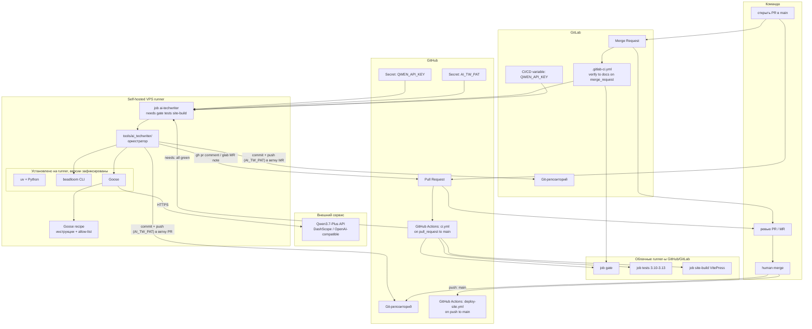

**GitHub** и **GitLab**. В обоих случаях в репозитории лежат: код, `docs/**`, `.beadloom/`, определение pipeline и открытые PR/MR.

**Консолидированный `ci.yml` (BDL-050).** Один workflow на `pull_request → main`: задания `gate`, `tests` (матрица 3.10–3.13) и `site-build` (сборка VitePress) идут **параллельно** на облачных runner-ах GitHub/GitLab; `ai-techwriter` имеет `needs: [gate, tests, site-build]` и стартует **только если все три зелёные** — сломанный PR не тратит токены Qwen. Отдельный `deploy-site.yml` — **единственное**, что запускается на `push: main` (публикует VitePress на GitHub Pages); под строгим trunk-based `main` зелёный по построению.

**VPS runner** — единственное место, где одновременно живут Goose, оркестратор и доступ к API-ключу. На том же сервере могут работать и GitHub Actions runner, и GitLab Runner. Job получает ephemeral workspace: каждый запуск начинается с чистого checkout.

**Qwen3.7-Plus** — облачный API. Локальной модели на сервере нет.

**Beadloom CLI** устанавливается на runner, но его исходники — часть репозитория в `src/beadloom/`. Это продукт, а не инфраструктура CI.

---

## Trunk-based + branch protection (BDL-049 / BDL-050)

`main` — точка интеграции и **защищённая ветка**: прямой push запрещён, всё едет через PR. Каждая фича — короткоживущая ветка `features/<KEY>` → один PR в `main` → merge, когда чек-раны зелёные.

**Branch protection (BDL-050):** `onboarding/branch_protection.py` требует **7 чек-ранов** консолидированного `ci.yml` как required status checks:

```
gate · tests (3.10) · tests (3.11) · tests (3.12) · tests (3.13) · site-build · ai-techwriter
```

`enforce_admins: true` (даже владелец интегрируется через PR — строгий trunk-based, BDL-049) + 0 required reviews (solo-maintainer сам мержит, но `main` не обходится). Применяется идемпотентно через `beadloom setup-branch-protection`.

GitHub treats a *skipped* required check как нейтральный/passing: при красном `gate`/`tests`/`site-build` задание `ai-techwriter` **skipped**, и PR блокируется красными верхними проверками, а не пропущенным `ai-techwriter`. Когда верхние три зелёные — `ai-techwriter` реально запускается, и его verdict гейтит.

---

## Что лежит в репозитории

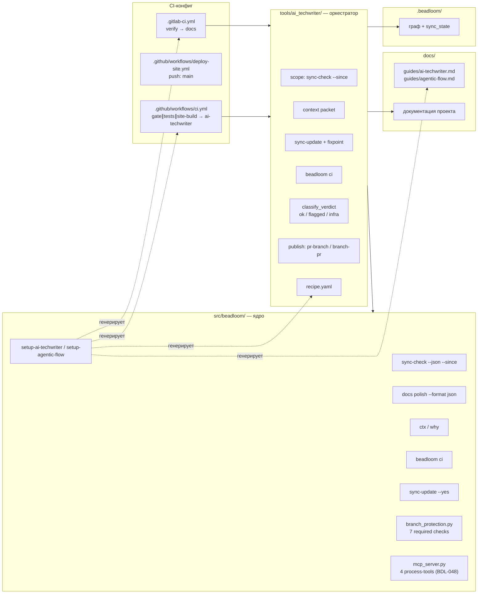

Важный момент: **цикл repair → fixpoint → verdict → publish не попадает в ядро Beadloom**. В `src/beadloom/` живут только примитивы (`sync-check --since`, неинтерактивный `sync-update --yes`, `ci`, `ctx`/`why`, `branch_protection`, `setup-*`). Сам оркестратор в `tools/ai_techwriter/` **не привязан к платформе**: один и тот же Python-код (`python -m tools.ai_techwriter`) вызывается и из GitHub Actions, и из GitLab CI — отличаются только триггер, имена секретов и флаг `--platform`.

---

## Границы ответственности: оркестратор vs Goose

Goose — агент, но его роль намеренно узкая. Оркестратор делает всё механическое, агент — только то, где нужно суждение.

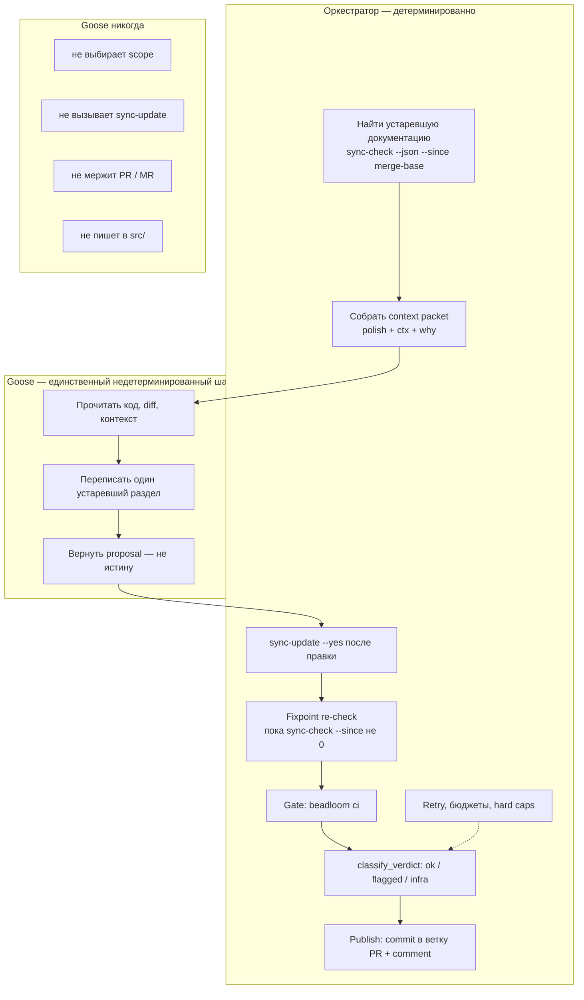

Так цикл остаётся воспроизводимым: можно заменить Goose на другой агентный рантайм, не трогая ядро Beadloom.

---

## Полный пайплайн CI — шаг за шагом

Один и тот же сценарий для **GitHub Actions** и **GitLab CI**, отличается только триггер, секреты и способ публикации правки.

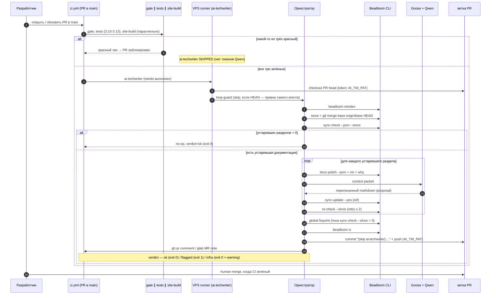

### Что происходит в начале

PR в `main` запускает `ci.yml`. Сначала параллельно прогоняются `gate` (вердикт `beadloom ci`), `tests` (матрица 3.10–3.13) и `site-build` (сборка VitePress). Если что-то красное — `ai-techwriter` **не стартует** (`skipped`), токены Qwen не тратятся, а PR блокируется красными проверками.

Когда все три зелёные, на VPS-runner-е стартует `ai-techwriter`. Сначала **loop-guard**: если HEAD ветки PR — это коммит самого агента (автор `beadloom-ai-techwriter` или subject содержит `[skip ai-techwriter]`), задание пропускается, чтобы push агента не запускал второй прогон. Иначе — `reindex`, вычисление baseline `since = git merge-base origin/<base> HEAD` (fallback — base SHA PR), затем `sync-check --json --since`.

Если устаревшей документации нет — verdict `ok`, no-op, exit 0.

### Что происходит, если дрейф есть

Оркестратор идёт по списку устаревших разделов. Для каждого собирает **context packet**, отдаёт Goose, тот переписывает раздел, оркестратор вызывает `sync-update --yes` и перепроверяет против `--since`.

После всех разделов — **global fixpoint**: повторять `sync-check --since` по репо и `sync-update` для новых flagged refs, пока не стабилизируется ноль (правка одного доменного раздела может «заразить» соседние пары — известный инвариант F4.1).

В конце — `beadloom ci`, затем агент **коммитит правку прямо в ветку PR** (сообщение `[skip ai-techwriter] …`, идентичность `beadloom-ai-techwriter`, push через `AI_TW_PAT` — чтобы коммит триггерил `gate`) и оставляет комментарий в PR/MR. **Verdict** определяет exit code (см. ниже).

---

## Verdict: `ok` / `flagged` / `infra` (BDL-050)

`ai-techwriter` — required-чек, который краснеет **только** при реальной нерешённой проблеме документации, но не при сбое инфраструктуры. Оркестратор (`runner.py::classify_verdict`) классифицирует прогон, а `cli.py` отображает verdict → exit code. Дискриминатор «проблема документации vs сбой инфраструктуры» — **дала ли модель хоть какой-то вывод** (`input_tokens + output_tokens > 0`):

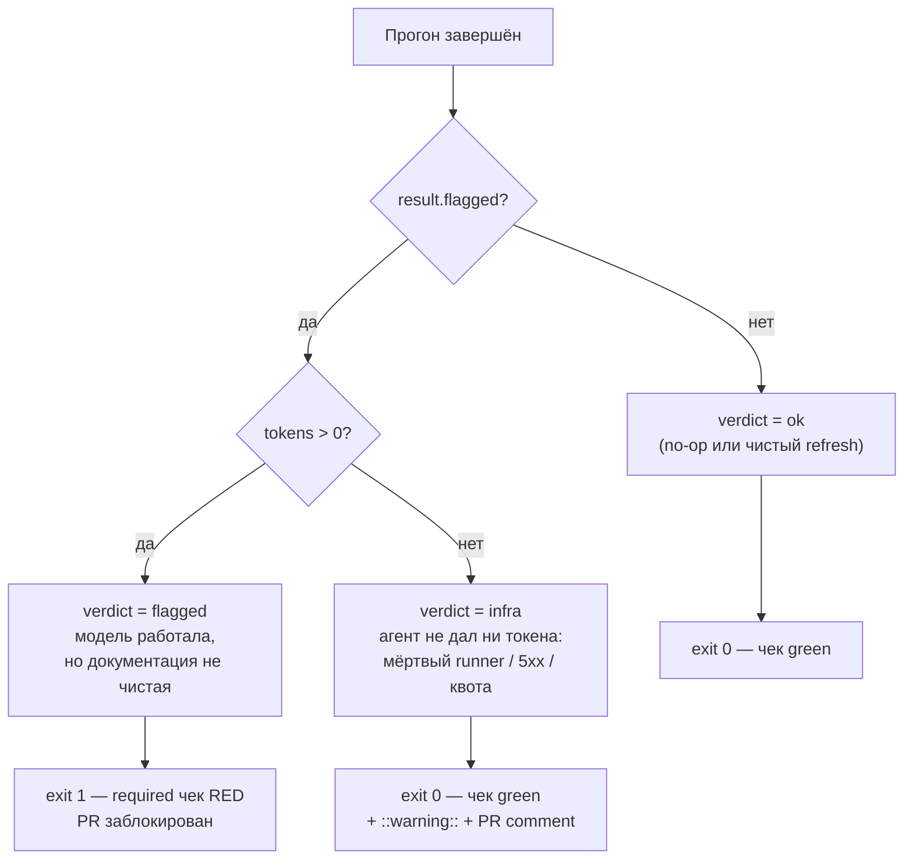

| Verdict | Когда | Exit | Эффект |
|---------|-------|------|--------|
| **ok** | 0 stale (no-op) **или** чистый refresh (`not flagged`) | `0` | чек зелёный |
| **flagged** | модель работала (`tokens > 0`), но документация всё ещё грязная: после правки `beadloom ci` красный / fixpoint не достигнут / превышен бюджет | `1` | **чек красный → PR заблокирован** («нужен человек») |
| **infra** | агент не дал ни одного токена (`tokens == 0`): мёртвый self-hosted runner, 5xx/timeout провайдера, исчерпана квота — он *не смог запуститься* | `0` | чек зелёный + громкий `::warning::` + best-effort комментарий в PR/MR («документация НЕ проверена — перезапустите») |

Итог: мёртвый VPS или исчерпанная квота `$30` **не** замораживают merge-и; реальный нерешённый дрейф — замораживает. Классификация консервативна (`tokens == 0 ⇒ infra`); ошибочный `infra` делается заметным через CI-аннотацию, чтобы человек перезапустил, а не молча отгрузил устаревшую документацию.

---

## Починка одного раздела документации — изнутри

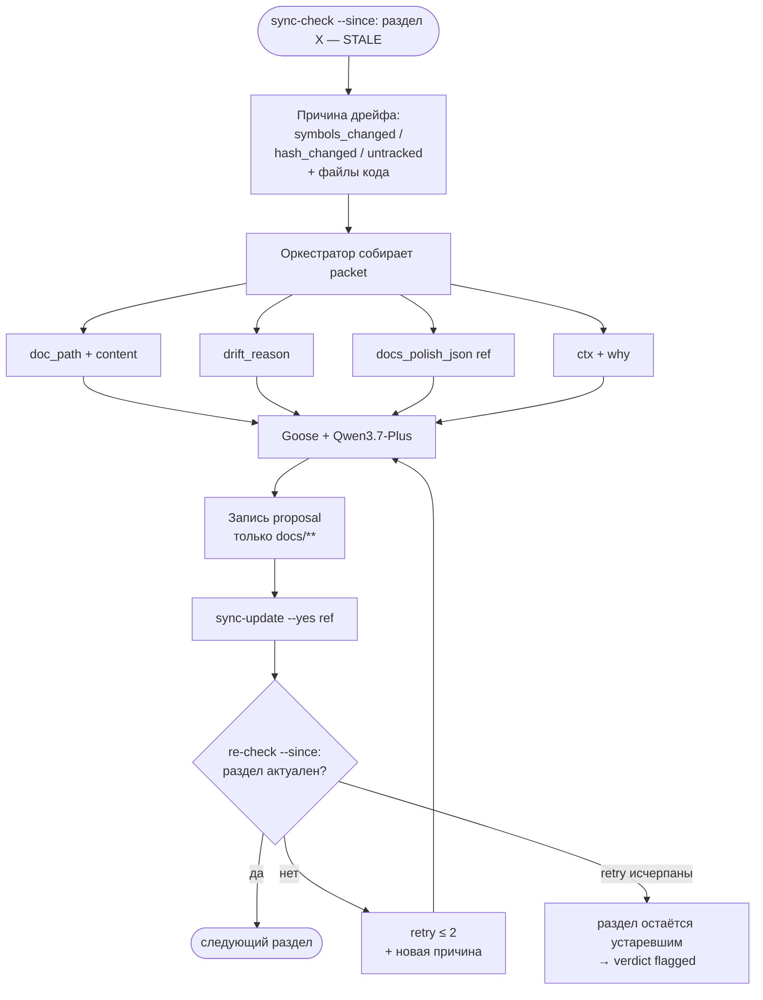

### Context packet — что именно получает агент

На каждый устаревший раздел оркестратор собирает пакет (`tools/ai_techwriter/packet.py`):

```
{
  doc_path,
  current_content,
  drift_reason,          // symbols_changed / hash_changed / untracked + файлы кода
  docs_polish_json[ref],
  ctx(ref),
  why(ref)
}
```

Агент не переписывает весь каталог `docs/` — только то, что `beadloom sync-check --since` пометил для этого PR.

---

## Поток данных: от кода до PR

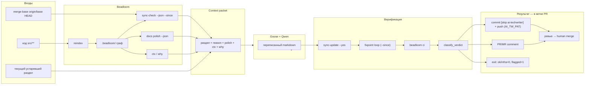

---

## Что Goose может и чего не может

Ограничение инструментов — часть безопасности. Даже если агент ошибётся, blast radius маленький.

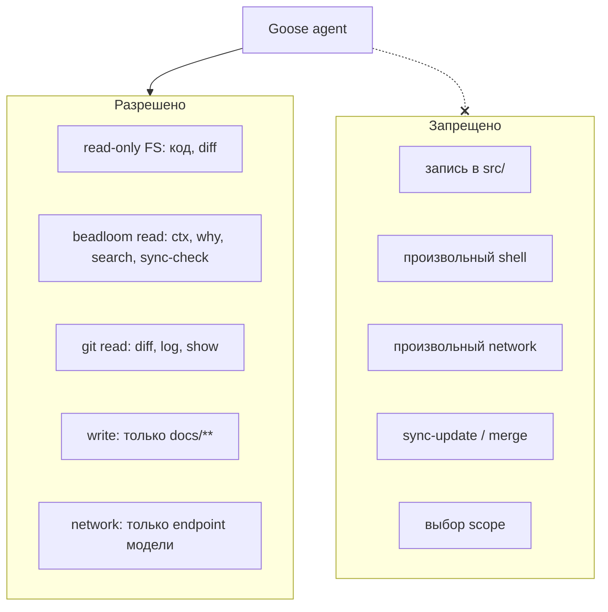

---

## Gate `beadloom ci` — детерминированная проверка

Перед `classify_verdict` оркестратор прогоняет полный gate:

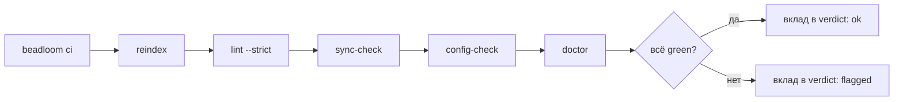

`sync-check = 0` доказывает **свежесть** — раздел документации ссылается на актуальные символы в коде. Это не проверка качества текста. За корректность формулировок отвечает человек на ревью PR. Тот же `gate` — это и отдельное задание `gate` в `ci.yml` (через composite Action `.github/actions/beadloom-gate`), и шаг внутри прогона агента.

---

## Сценарий для разработчика и ревьюера

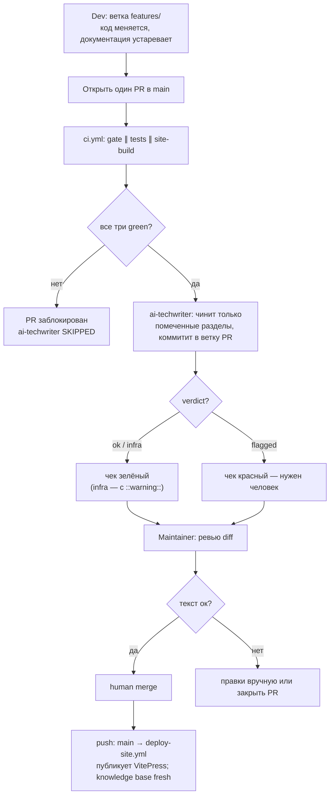

Типичный сценарий: ветка фичи → один PR в `main` → CI гоняет gate/tests/site-build, затем (если зелено) AI tech-writer кладёт правку документации **в тот же PR** → смотришь diff → мержишь. Merge в `main` запускает `deploy-site.yml` (единственное на `push: main`).

---

## Настройка: три шага для оператора

Подключение задумано простым — автоконфигурация + короткий чеклист, без ручных правок.

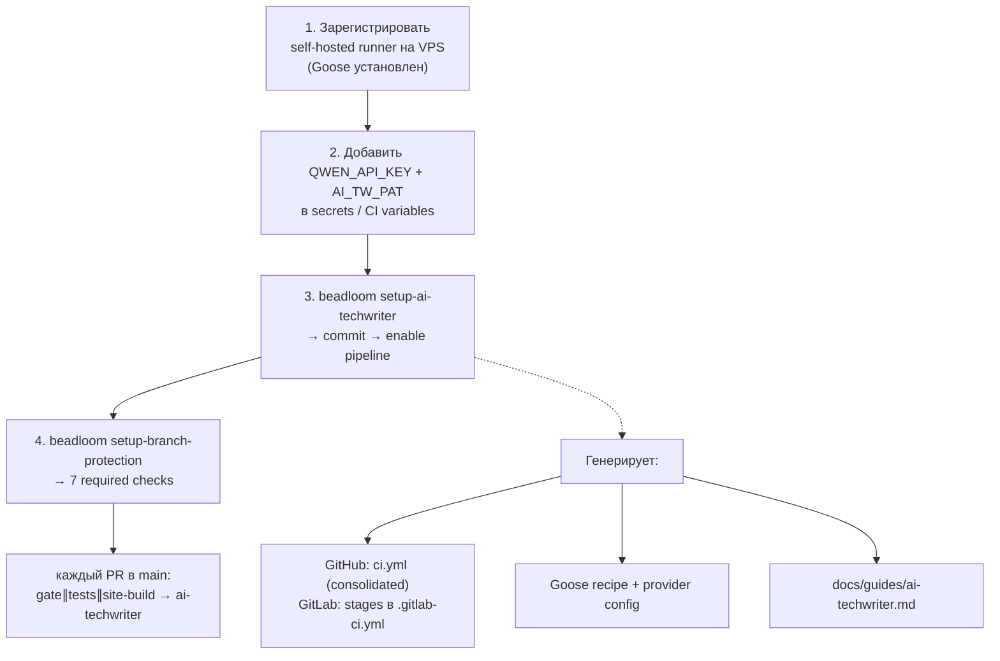

Команда `beadloom setup-ai-techwriter` идемпотентна. Агент **repo-agnostic** — читает граф и документацию конкретного репозитория. Для другого сервиса тот же паттерн: runner + secret + автоконфигурация + branch protection. Платформа CI — на выбор: GitHub Actions или GitLab CI.

| Платформа | Runner | Секреты | Публикация | Push |
|-----------|--------|---------|------------|------|
| **GitHub** | self-hosted Actions runner | `QWEN_API_KEY`, `AI_TW_PAT` (repo secrets) | commit в ветку PR + `gh pr comment` | `AI_TW_PAT` (fallback `github.token`) |
| **GitLab** | self-hosted GitLab Runner | `QWEN_API_KEY`, `AI_TW_PAT` (CI/CD variables) | commit в ветку MR + `glab` MR note | `AI_TW_PAT` (fallback `CI_JOB_TOKEN`) |

---

## Бюджеты, retry и что бывает при сбое

Стоимость контролируется **scope** (только устаревшие разделы, не весь каталог `docs/`) и порядком `needs` (сломанный PR не доходит до агента), а не отключением «рассуждения» у модели. Расширенное рассуждение остаётся включённым — качество важнее экономии на каждом вызове.

Hard caps — страховка от runaway, не ручка качества:

| Ограничение | Назначение |
|-------------|------------|
| retry на раздел ≤ 2 | повтор с новой причиной дрейфа |
| max fixpoint rounds (10) | bounded re-stale-siblings |
| max turns (50) / tokens (2M) | job не зависает |

При превышении бюджета или если gate не зеленеет (а агент при этом работал, `tokens > 0`) — verdict `flagged`, PR заблокирован. При сбое инфраструктуры (`tokens == 0`) — verdict `infra`, PR не блокируется, но громкий `::warning::`.

```
gate ∥ tests ∥ site-build:
    any red → ai-techwriter SKIPPED, PR blocked
    all green → ai-techwriter runs:

for each stale section:
    repair via Goose → sync-update --yes(ref) → re-check --since(section)
    if still stale: retry ≤ 2

global fixpoint:
    repeat sync-check --since → sync-update until stable 0
    OR round-cap / no-progress

gate: beadloom ci

verdict:
    ok    → exit 0 (чек green)
    infra → exit 0 (чек green + ::warning:: + comment)   # tokens == 0
    flagged → exit 1 (required чек red)                   # tokens > 0, docs dirty
```

---

## Честная граница

Заявлено намеренно, без приукрашивания:

- **Оркестрация остаётся в harness/Claude-Code.** MCP-сервер (BDL-048) отдаёт *инструменты* (`task_init` / `bead_context` / `complete_bead` / `checkpoint`), а **не** оркестрацию — он не умеет спавнить субагентов или крутить main loop. Coordinator и `Agent`-spawn-волны остаются Claude-Code-native (скаффолдятся `setup-agentic-flow`). MCP process-tools — детерминированный субстрат, который flow *вызывает*, а не замена harness.
- **`complete_bead` — advisory-strong, не источник истины.** Модель сама решает его вызвать; он сильнее Markdown-инструкций (реально отказывается закрывать bead при красном gate), но слабее CI.
- **CI — единственная точка истинного enforcement.** `beadloom ci` (задание `gate`) + `tests` + `site-build` + `ai-techwriter` гоняются в CI независимо и являются required-чеками. Это гейт, который ничто не обходит.

---

## Безопасность

**API-ключ** (`QWEN_API_KEY`) и push-token (`AI_TW_PAT`) живут в CI secrets (GitHub Secrets / GitLab CI/CD variables), доступны только job-у на self-hosted runner. В логах и репозитории их нет.

**Runner** привязан к проекту; ephemeral workspace на каждый прогон.

**Goose** пишет только в `docs/**`. Исходники не трогает.

**Auto-merge отсутствует**: `sync-check = 0` — это свежесть, не гарантия хорошего текста. Человек мержит PR.

**`sync-update` вне цикла** — та же операция, что интерактивный `sync-update`. Можно случайно «зеленить» плохой раздел. Поэтому ревью PR и rationale в описании — обязательная часть процесса.

---

## Шпаргалка на одну страницу

| Вопрос | Ответ |
|--------|-------|
| Где крутится gate/tests/site-build? | Облачные runner-ы GitHub/GitLab |
| Где крутится ai-techwriter? | Self-hosted runner на VPS (Goose + ключ) |
| Триггер | `on: pull_request → main` (один `ci.yml`); `deploy-site.yml` — единственное на `push: main` |
| Порядок | `gate ∥ tests ∥ site-build` → `ai-techwriter` (`needs:`) |
| Baseline дрейфа | `git merge-base origin/<base> HEAD` (`--since`) |
| Куда кладётся правка | commit в ветку **этого же** PR (`--target pr-branch`, push через `AI_TW_PAT`) |
| Verdict | `ok`/`infra` → exit 0; `flagged` → exit 1 (только реальный дрейф блокирует) |
| Required checks | 7: `gate`, `tests (3.10..3.13)`, `site-build`, `ai-techwriter` |
| Branch protection | `enforce_admins: true`, 0 reviews (strict trunk-based) |
| Как попадает в main | PR + human merge (нет auto-merge) |
| Что пишет агент | только `docs/**` |
| Какие CI | GitHub Actions и GitLab CI — один оркестратор, разные обёртки |

---

## Связанные документы

- [RFC BDL-050](./features/BDL-050/RFC.md) — консолидация CI + verdict (текущая модель)
- [RFC BDL-049](./features/BDL-049/RFC.md) — trunk-based + PR-triggered
- [RFC BDL-047](./features/BDL-047/RFC.md) — F4.1, первичная архитектура harness
- [`docs/guides/ai-techwriter.md`](../../../docs/guides/ai-techwriter.md) — гайд для оператора
- [`docs/guides/agentic-flow.md`](../../../docs/guides/agentic-flow.md) — упакованный multi-agent flow + MCP process-tools
- [ROADMAP](../ROADMAP.md) — место фич в дорожной карте
