# AI-агенты в CI: архитектура BDL-047

> Документ описывает, **где что разворачивается**, **кто за что отвечает** и **как части системы взаимодействуют друг с другом**.
>
> Основан на [RFC BDL-047](./features/BDL-047/RFC.md) (фича F4.1 — AI tech-writer в CI).

---

## Зачем это нужно

Beadloom отслеживает дрейф документации после изменения кода. `sync-check` говорит: «этот раздел документации устарел». Но дальше документацию актуализировать необходимо вручную.

BDL-047 закрывает это. В CI запускается цикл: найти устаревшие разделы документации → попросить агента переписать только их → проверить, что дрейфа больше нет → открыть PR или MR. Человек смотрит diff и решает, мержить или нет. Автоматического merge нет и не будет.

Одна фраза, которую стоит запомнить:

**Всё в этом цикле детерминировано, кроме одного шага — переписывания раздела документации. И даже этот шаг ограничен Beadloom Gate и ревью.**

---

## Три слоя — кто есть кто

Система разделена на три части, это архитектурное решение. Beadloom остаётся ядром, поставщиком инструментов и данных, не привязывается к конкретному агентному рантайму.

| Слой | Где живёт в репозитории | Что делает |
|------|-------------------------|------------|
| **Beadloom** | `src/beadloom/` | Граф архитектуры, `sync-check`, `ctx`/`why`, `beadloom ci`. Не знает про Goose. |
| **Оркестратор** | `tools/ai_techwriter/` + CI-конфиг | Детерминированный цикл: scope → починка → gate → PR/MR. В коде и RFC называется *harness*. |
| **Goose** | На VPS runner; recipe лежит в репо | Агент: читает контекст, переписывает один раздел документации за раз. |
| **Qwen3.7-Plus** | Внешний API (DashScope) | Модель. Ключ — только в CI secret. |

Beadloom **поставляет примитивы**. Оркестратор **собирает из них цикл**. Goose **занимается только актуализацией документации** — и только в рамках, которые оркестратор ему задал.

---

## Где что физически работает

«это в облаке GitHub/GitLab или у нас на сервере?»

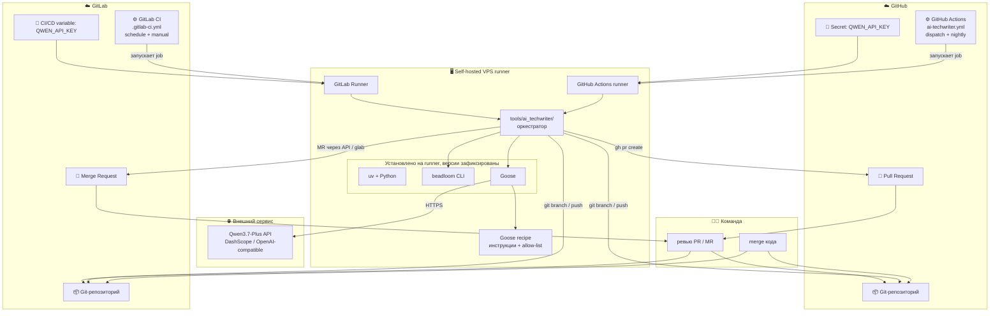

**GitHub** и **GitLab**. В обоих случаях, в репозитории лежат: код, `docs/**`, `.beadloom/`, определение pipeline и открытые PR/MR.

**VPS runner** — единственное место, где одновременно живут Goose, оркестратор и доступ к API-ключу. На том же сервере могут работать и GitHub Actions runner, и GitLab Runner — для разных репозиториев или окружений. Job получает ephemeral workspace: каждый запуск начинается с чистого checkout.

**Qwen3.7-Plus** — облачный API. Локальной модели на сервере нет.

**Beadloom CLI** устанавливается на runner, но его исходники — часть репозитория в `src/beadloom/`. Это продукт, а не инфраструктура CI.

---

## Что лежит в репозитории и что трогаем в BDL-047

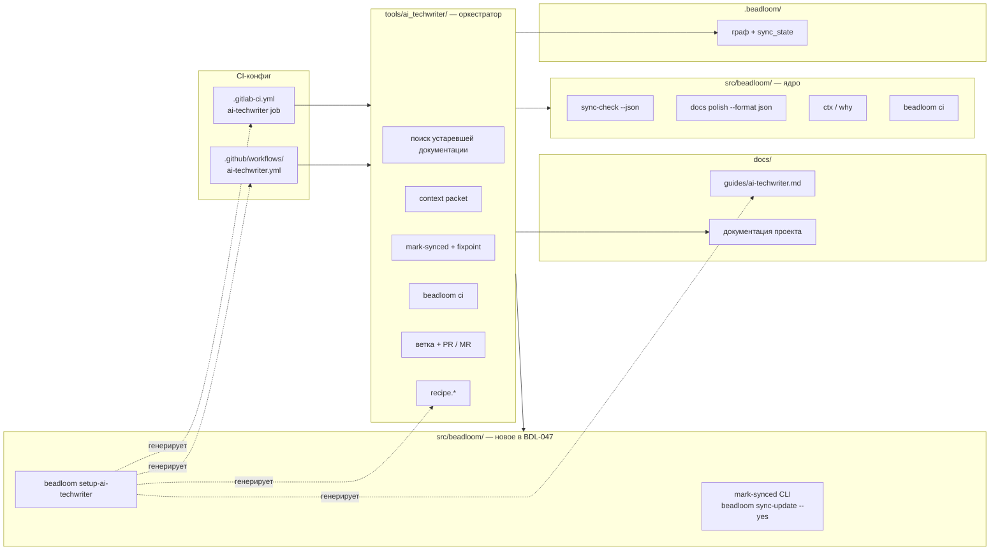

Важный момент: **цикл repair → fixpoint → PR/MR не попадает в ядро Beadloom**. В `src/beadloom/` добавляются только:

- Неинтерактивный `mark-synced` (нужен для fixpoint-цикла; заодно закрывает UX #106);
- `beadloom setup-ai-techwriter` — авто-настройка CI-конфига, рецепта для Goose-агента и пользовательский гайд.

Инуструменты в `tools/ai_techwriter/`. Сам оркестратор **не привязан к платформе**: один и тот же Python-код вызывается и из GitHub Actions, и из GitLab CI.

---

## Границы ответственности: оркестратор vs Goose

Goose - агент, но его роль намеренно узкая. Оркестратор делает всё механическое, агент — только то, где нужно суждение.

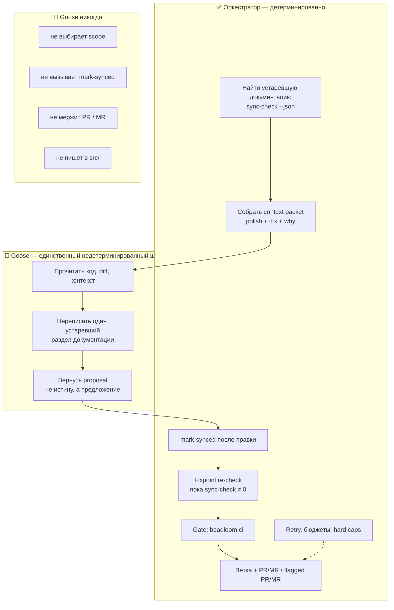

Так цикл остаётся воспроизводимым: можно заменить Goose на другой агентный рантайм, не трогая ядро Beadloom.

---

## Полный пайплайн CI — шаг за шагом

Один и тот же сценарий для **GitHub Actions** и **GitLab CI**, отличается только триггер, секреты и способ открытия PR/MR.

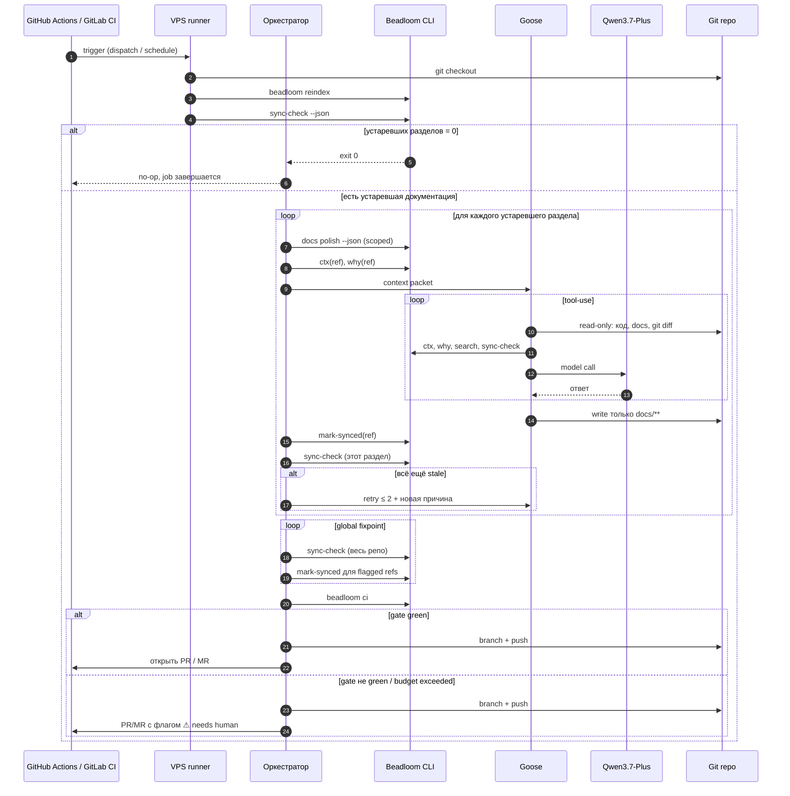

### Что происходит в начале

Пайплайн стартует по расписанию (nightly / `schedule`) или вручную/триггером (`workflow_dispatch` в GitHub, `manual` job в GitLab). Раннер делает checkout, `beadloom reindex`, потом `sync-check --json`.

Если устаревшей документации нет — job сразу завершается. Никакого агента, никаких затрат на API. Это нормальный сценарий.

### Что происходит, если дрейф есть

Оркестратор идёт по списку устаревших разделов. Для каждого собирает **context packet** (об этом ниже), отдаёт Goose, тот переписывает раздел, оркестратор вызывает `mark-synced` и перепроверяет.

После всех разделов — **global fixpoint**: повторять `sync-check` по всему репо и `mark-synced` для новых flagged refs, пока не стабилизируется ноль. Это нужно, потому что правка одного доменного раздела документации может «заразить» соседние пары — известный инвариант F4.1.

В конце — `beadloom ci`. Только если gate зелёный, PR/MR открывается как обычный. Иначе — с пометкой «нужен человек», но job не зависает.

---

## Починка одного раздела документации — изнутри

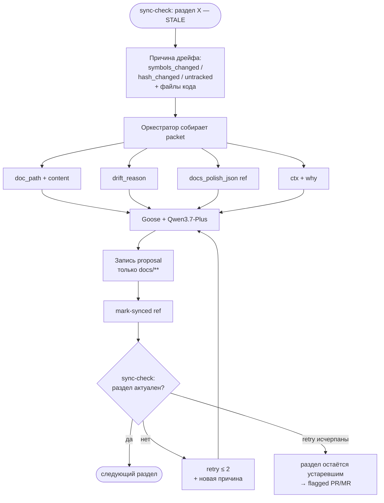

### Context packet — что именно получает агент

На каждый устаревший раздел оркестратор собирает пакет:

```
{
  doc_path,
  current_content,
  drift_reason,          // symbols_changed / hash_changed / untracked + файлы кода
  docs_polish_json[ref],
  ctx(ref),
  why(ref)
}
```

Beadloom отслеживает устаревшую документацию. Агент не переписывает весь каталог `docs/` — только то, что `beadloom sync-check` пометил.

---

## Поток данных: от кода до PR/MR

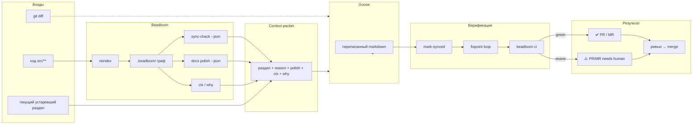

---

## Что Goose может и чего не может

Ограничение инструментов — часть безопасности. Даже если агент ошибётся, blast radius маленький.

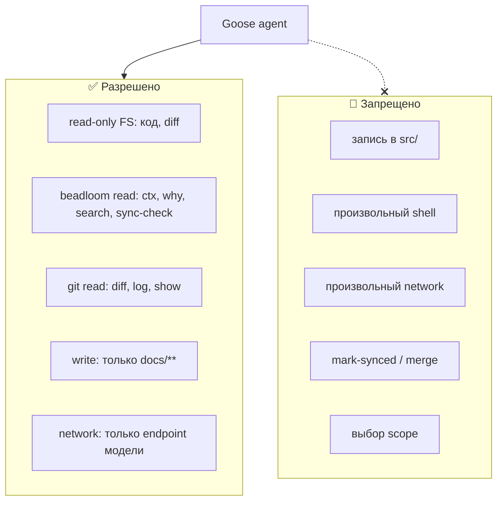

---

## Gate `beadloom ci` — финальная проверка

Перед открытием PR/MR оркестратор прогоняет полный gate:

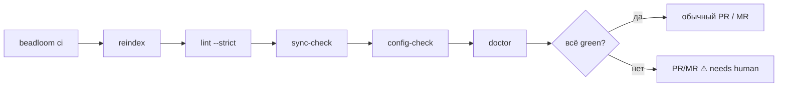

`sync-check = 0` доказывает **свежесть** — раздел документации ссылается на актуальные символы в коде. Это не проверка качества текста. За корректность формулировок отвечает человек на ревью.

---

## Сценарий для разработчика и ревьюера

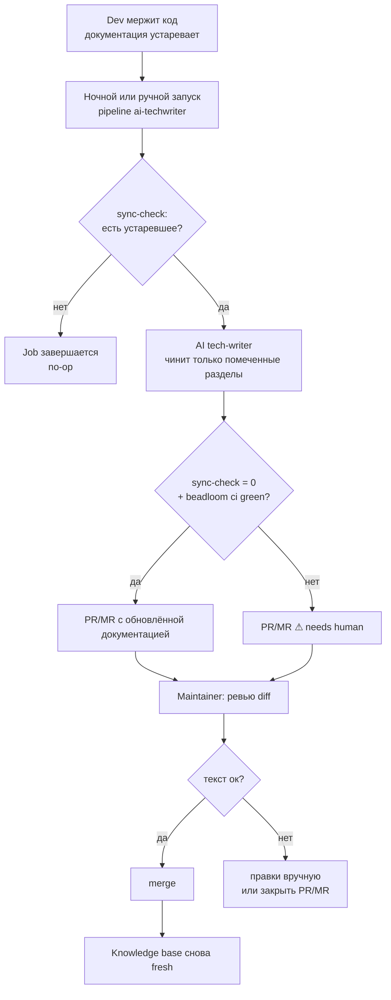

Типичный сценарий: код уехал в main → ночью (или по кнопке/триггеру) прилетает PR/MR с обновлённой документацией → смотришь diff → мержишь или правишь.

---

## Настройка: три шага для оператора

Подключение задумано простым — автоконфигурация + короткий чеклист, без ручных правок.

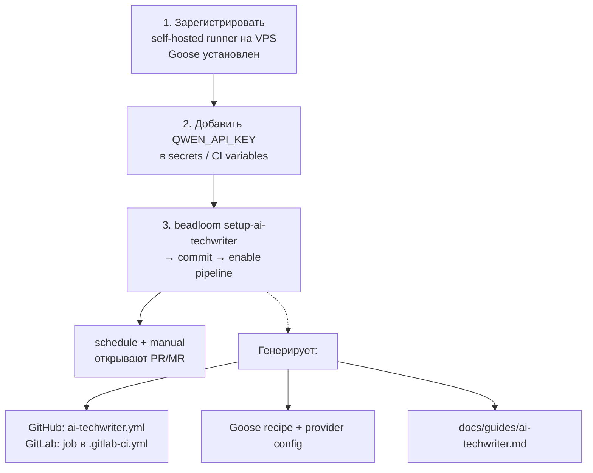

Команда `beadloom setup-ai-techwriter` идемпотентна: можно перегенерировать. Агент **repo-agnostic** — читает граф и документацию конкретного репозитория. Для другого сервиса тот же паттерн: runner + secret + автоконфигурация. Платформа CI — на выбор: GitHub Actions или GitLab CI.

| Платформа | Runner | Секрет | Открытие ревью |
|-----------|--------|--------|----------------|
| **GitHub** | self-hosted Actions runner | Repository secret `QWEN_API_KEY` | `gh pr create` |
| **GitLab** | self-hosted GitLab Runner | CI/CD variable `QWEN_API_KEY` | Merge Request через API / `glab` |

---

## Бюджеты, retry и что бывает при сбое

Стоимость контролируется **scope** (только устаревшие разделы, не весь каталог `docs/`), а не отключением "рассуждения" у модели. Расширенное рассуждение остаётся включённым — качество важнее экономии на каждом вызове.

Hard caps — страховка от runaway, не ручка качества:

| Ограничение | Назначение |
|-------------|------------|
| retry на раздел ≤ 2 | повтор с новой причиной дрейфа |
| max fixpoint rounds | bounded re-stale-siblings |
| max turns / tokens / wall-clock | job не зависает |

При превышении бюджета или если gate не зеленеет — **flagged PR/MR**, не зависший job и не auto-merge.

```
for each stale section:
    repair via Goose → mark-synced(ref) → sync-check(section)
    if still stale: retry ≤ 2

global fixpoint:
    repeat sync-check → mark-synced until stable 0
    OR round-cap / no-progress

gate: beadloom ci

deliver:
    green  → branch + PR/MR
    not green / cap → branch + PR/MR ⚠ needs human
```

---

## Безопасность

**API-ключ** живёт в CI secrets (GitHub Secrets / GitLab CI/CD variables), доступен только job'у на self-hosted runner. В логах и репозитории его нет.

**Runner** привязан к проекту.

**Goose** пишет только в `docs/**`. Исходники не трогает.

**Auto-merge отсутствует**: `sync-check = 0` — это свежесть, не гарантия хорошего текста.

**mark-synced вне цикла** — та же операция, что интерактивный `sync-update`. Можно случайно «зеленить» плохой раздел документации. Поэтому ревью PR/MR и rationale в описании — обязательная часть процесса, а не опция.

---

## План внедрения

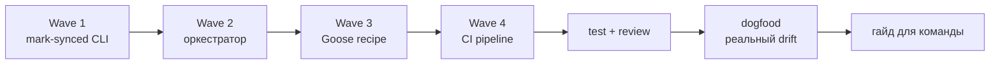

Каждая волна держит `beadloom ci` green сама по себе. Dogfood (G6) — реальный прогон на дрейфе в собственном репо (#130/#131), результатом должен стать reviewable PR.

---

## Шпаргалка на одну страницу

| Вопрос | Ответ |
|--------|-------|
| Где крутится job? | Self-hosted runner на VPS (GitHub Actions или GitLab Runner) |
| Где API-ключ? | `QWEN_API_KEY` в secrets / CI variables, только на runner |
| Где модель? | Qwen3.7-Plus, внешний API |
| Где оркестрация? | `tools/ai_techwriter/` (*harness*), не в ядре Beadloom |
| Что нового в ядре? | `mark-synced` CLI + `setup-ai-techwriter` |
| Что пишет агент? | Только `docs/**` |
| Как попадает в main? | PR/MR + human merge |
| Когда no-op? | `sync-check` = 0 stale |
| Триггеры v1 | manual + nightly (`workflow_dispatch` / GitLab `schedule`) |
| Какие CI? | GitHub Actions и GitLab CI — один оркестратор, разные обёртки |

---

## Связанные документы

- [PRD BDL-047](./features/BDL-047/PRD.md) — зачем и какие цели
- [RFC BDL-047](./features/BDL-047/RFC.md) — технические решения и границы
- [ROADMAP](../ROADMAP.md) — место фичи в дорожной карте
