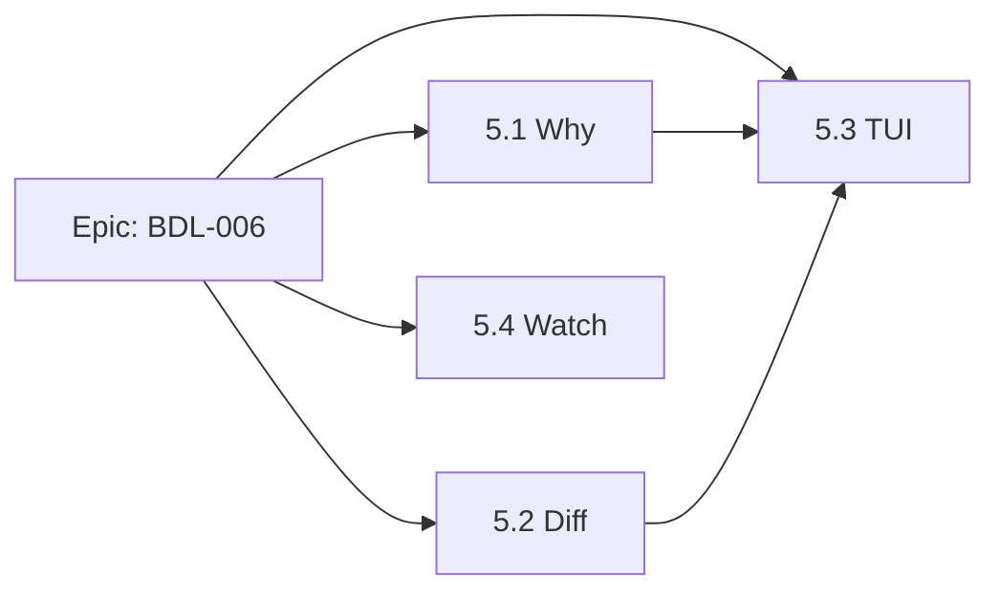

# PLAN: BDL-006 — Phase 5: Developer Experience (v0.7)

> **Last updated:** 2026-02-11
> **Status:** Approved

---

## DAG



## Beads

| # | Bead | Title | Priority | Effort | Depends on | Status |
|---|------|-------|----------|--------|------------|--------|
| 5.1 | beadloom-fzb | `beadloom why` — impact analysis | P1 | M | — | open |
| 5.2 | beadloom-q6b | `beadloom diff` — graph delta | P1 | M | — | open |
| 5.3 | beadloom-1c1 | `beadloom ui` — TUI dashboard | P1 | L | 5.1, 5.2 | blocked |
| 5.4 | beadloom-6fr | `beadloom watch` — auto-reindex | P2 | M | — | open |

## Critical Path

```
5.1 Why ──┐
          ├──> 5.3 TUI ──> version bump 0.7.0
5.2 Diff ─┘
```

5.4 Watch is independent and can be done in parallel with TUI.

## Implementation Order

1. **Sprint 1:** 5.1 Why + 5.2 Diff (parallel, no deps)
2. **Sprint 2:** 5.3 TUI (phases A→D) + 5.4 Watch (parallel)
3. **Sprint 3:** Integration, polish, version bump

## Files to Create

| Deliverable | New files |
|-------------|-----------|
| 5.1 Why | `src/beadloom/why.py`, `tests/test_why.py`, `tests/test_cli_why.py` |
| 5.2 Diff | `src/beadloom/diff.py`, `tests/test_diff.py`, `tests/test_cli_diff.py` |
| 5.3 TUI | `src/beadloom/tui/__init__.py`, `src/beadloom/tui/app.py`, `src/beadloom/tui/screens/main.py`, `src/beadloom/tui/widgets/domain_list.py`, `src/beadloom/tui/widgets/node_detail.py`, `src/beadloom/tui/widgets/graph_view.py`, `src/beadloom/tui/widgets/status_bar.py`, `src/beadloom/tui/styles/app.tcss`, `tests/test_tui.py` |
| 5.4 Watch | `src/beadloom/watcher.py`, `tests/test_watcher.py`, `tests/test_cli_watch.py` |

## Files to Modify

| File | Changes |
|------|---------|
| `pyproject.toml` | Add `[tui]`, `[watch]` extras; update `[all]` |
| `src/beadloom/cli.py` | Add `why`, `diff`, `ui`, `watch` commands |
| `src/beadloom/__init__.py` | Version bump to 0.7.0 (at end) |

## Quality Gates

- [ ] All tests pass (`uv run pytest`)
- [ ] >= 80% coverage
- [ ] mypy --strict clean
- [ ] ruff clean
- [ ] TUI launches on macOS
- [ ] Total tests >= 520
