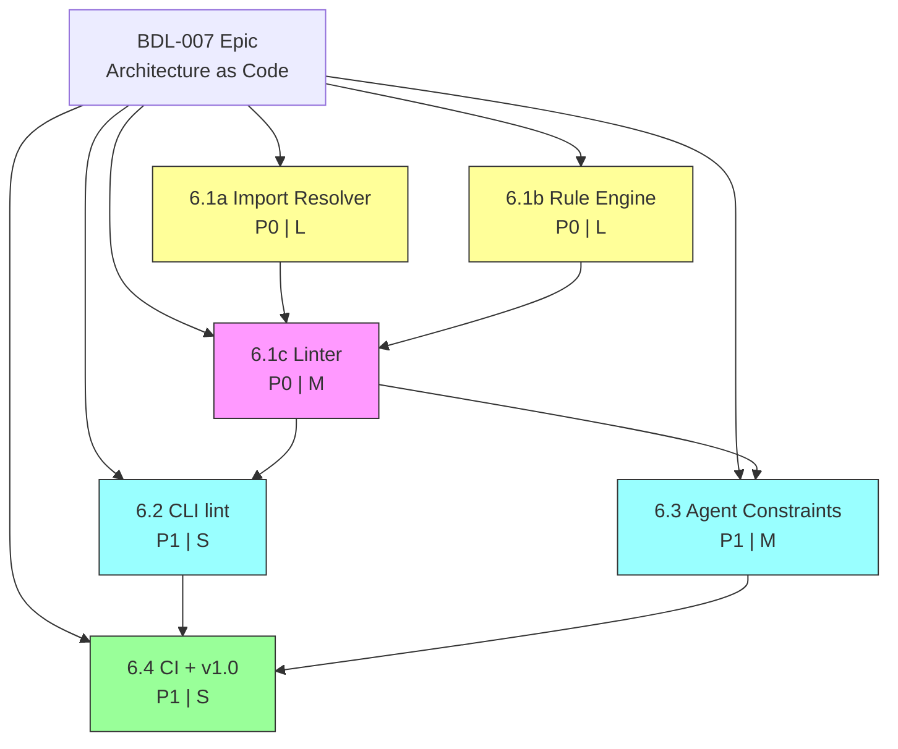

# PLAN: BDL-007 — Architecture as Code & Ecosystem (v1.0)

> **Date:** 2026-02-11
> **RFC:** RFC-0007
> **Beads:** 6 + 1 epic
> **Status:** Completed — all beads closed, v1.0.0 released

---

## 1. Bead DAG



**Legend:** Yellow = P0 foundation, Pink = P0 integration, Blue = P1 features, Green = P1 release

---

## 2. Critical Path

```
6.1a (Import Resolver) ──┐
                          ├──> 6.1c (Linter) ──> 6.2 (CLI) ──┐
6.1b (Rule Engine) ──────┘                                     ├──> 6.4 (CI + v1.0)
                                              6.3 (Constraints)┘
```

**Parallelization:** 6.1a and 6.1b can run in parallel (no dependencies). 6.2 and 6.3 can run in parallel after 6.1c.

---

## 3. Bead Details

### 6.1a — Import Resolver (P0, Large)

**Module:** `src/beadloom/import_resolver.py`
**Tests:** `tests/test_import_resolver.py` (~25 tests)

**Deliverables:**
1. `code_imports` table in `db.py` schema
2. Tree-sitter import extraction for Python, TS/JS, Go, Rust
3. Import path → file path normalization (per language)
4. File path → graph node resolution (annotation-based + heuristic)
5. Integration with `reindex.py` (full + incremental)

**Key functions:**
- `extract_imports(file_path: Path) -> list[ImportInfo]`
- `resolve_import_to_node(import_path: str, file_path: Path, conn) -> str | None`
- `index_imports(project_root: Path, conn: sqlite3.Connection) -> int`

**Test cases:**
- Python: `import X`, `from X import Y`, relative imports
- TypeScript: `import { X } from 'path'`, default import
- Go: single import, grouped imports
- Rust: `use path::module`, `mod X`
- Resolution: annotation match, heuristic match, unresolved (None)

---

### 6.1b — Rule Engine (P0, Large)

**Module:** `src/beadloom/rule_engine.py`
**Tests:** `tests/test_rule_engine.py` (~20 tests)

**Deliverables:**
1. `rules` table in `db.py` schema
2. `rules.yml` parser with schema validation
3. `NodeMatcher`, `DenyRule`, `RequireRule` dataclasses
4. Deny rule evaluator (imports × rules)
5. Require rule evaluator (nodes × rules)
6. `Violation` dataclass
7. Rules loading into SQLite during reindex

**Key functions:**
- `load_rules(rules_path: Path) -> list[Rule]`
- `validate_rules(rules: list[Rule], conn) -> list[str]`
- `evaluate_deny_rules(conn, rules) -> list[Violation]`
- `evaluate_require_rules(conn, rules) -> list[Violation]`
- `evaluate_all(conn, rules) -> list[Violation]`

**Test cases:**
- Parse valid rules.yml (deny, require, mixed)
- Schema validation errors (missing name, invalid kind, unknown ref_id)
- Deny: violation detected, no violation, unless_edge exemption
- Require: violation detected, edge exists (pass), wrong edge kind
- Edge cases: empty rules, disabled rules, same-node imports

---

### 6.1c — Linter Orchestrator (P0, Medium)

**Module:** `src/beadloom/linter.py`
**Tests:** `tests/test_linter.py` (~15 tests)
**Depends on:** 6.1a, 6.1b

**Deliverables:**
1. `LintResult` dataclass
2. `lint()` orchestrator function
3. Rich output formatter (human-readable)
4. JSON output formatter
5. Porcelain output formatter (machine-readable)

**Key functions:**
- `lint(project_root, *, rules_path=None, reindex=True) -> LintResult`
- `format_rich(result: LintResult) -> str`
- `format_json(result: LintResult) -> str`
- `format_porcelain(result: LintResult) -> str`

**Test cases:**
- Full lint with violations
- Full lint clean (no violations)
- No rules.yml → 0 violations
- Rich/JSON/porcelain format correctness
- Reindex integration (fresh index)

---

### 6.2 — CLI `lint` Command (P1, Small)

**Module:** `src/beadloom/cli.py` (extend)
**Tests:** `tests/test_cli_lint.py` (~10 tests)
**Depends on:** 6.1c

**Deliverables:**
1. `beadloom lint` command with Click
2. `--format` option (rich/json/porcelain)
3. `--strict` flag (exit code 1 on violations)
4. `--no-reindex` flag
5. TTY detection for default format

**Test cases:**
- `beadloom lint` (default, no violations)
- `beadloom lint --strict` (exit code 1 with violations)
- `beadloom lint --format json`
- `beadloom lint --format porcelain`
- `beadloom lint --no-reindex`
- No rules.yml → clean exit
- Invalid rules.yml → exit code 2

---

### 6.3 — Agent-Aware Constraints (P1, Medium)

**Module:** `src/beadloom/context_builder.py`, `src/beadloom/mcp_server.py` (extend)
**Tests:** `tests/test_constraints.py` (~10 tests)
**Depends on:** 6.1b

**Deliverables:**
1. `_collect_constraints()` in `context_builder.py`
2. `constraints` field in context bundle (v2)
3. Context bundle version bump (1 → 2)
4. Updated `get_context` MCP tool description
5. Optional `lint` MCP tool

**Test cases:**
- Context bundle includes constraints for focus node
- No rules → empty constraints list
- Deny rule relevant to focus node
- Require rule relevant to focus node
- Rule not relevant to focus node → not included
- Bundle version = 2

---

### 6.4 — CI Integration + v1.0 Release (P1, Small)

**Tests:** integration tests (~5)
**Depends on:** 6.2, 6.3

**Deliverables:**
1. GitHub Actions recipe in docs
2. GitLab CI recipe in docs
3. Update AGENTS.md with lint workflow
4. Update BACKLOG.md (Phase 6 done)
5. Update STRATEGY.md (Phase 6 done)
6. Version bump to 1.0.0
7. Update graph YAML (add lint domain/edges)
8. Self-test: run `beadloom lint` on beadloom itself with sample rules

---

## 4. Quality Gates

| Gate | Target | Actual |
|------|--------|--------|
| All tests pass | >= 620 total | 653 |
| New tests | >= 85 | 112 |
| Coverage | >= 80% | met |
| mypy --strict | 0 errors | 0 |
| ruff | 0 violations | 0 |
| CI green | Python 3.10–3.13 | pending push |
| Self-lint | beadloom lint on own codebase | 0 violations |

---

## 5. Execution Order

```
Phase A (parallel):
  Agent 1: 6.1a Import Resolver
  Agent 2: 6.1b Rule Engine

Phase B:
  6.1c Linter (depends on A)

Phase C (parallel):
  Agent 1: 6.2 CLI lint command
  Agent 2: 6.3 Agent constraints

Phase D:
  6.4 CI + v1.0 release (depends on C)
```

**Estimated beads:** 6 implementation + 1 epic = 7 total
