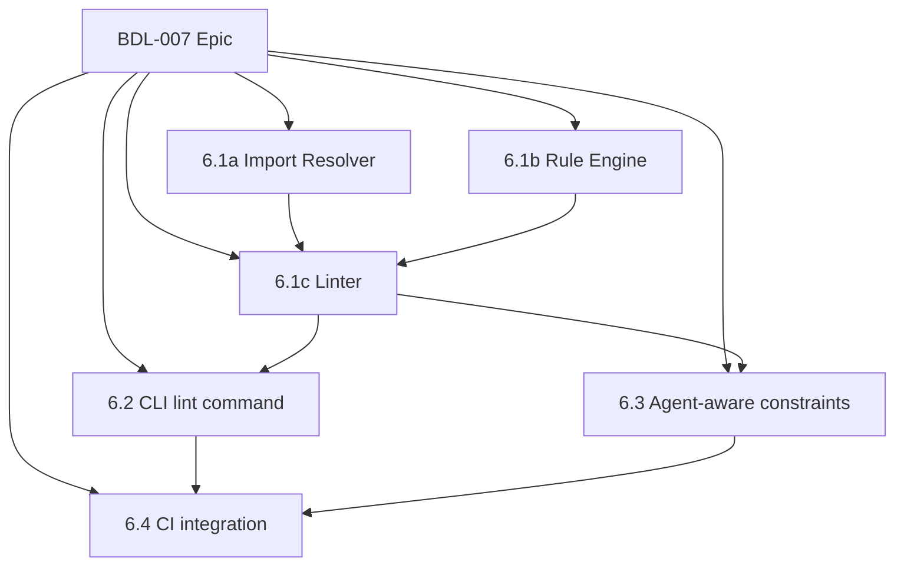

# RFC-0007: Architecture as Code — Rules, Lint & Constraints

> **Status:** Implemented
> **Date:** 2026-02-11
> **Phase:** 6 (v1.0)
> **PRD:** BDL-007

---

## 1. Overview

This RFC describes the technical architecture for turning Beadloom from an architecture documentation tool into an **Architecture as Code** platform. The key additions are:

1. **Import detection** — extract `import` statements from source code via tree-sitter
2. **Rule engine** — declarative YAML rules (`rules.yml`) that define architectural constraints
3. **Lint command** — `beadloom lint` validates code imports against rules
4. **Agent-aware constraints** — `get_context` MCP response includes active constraints
5. **CI integration** — `beadloom lint --strict` for CI pipelines

### Design Principles

- **Deterministic** — same code + same rules = same result, always
- **Declarative** — rules are YAML, not code; readable in PRs
- **Incremental** — leverages existing `file_index` for fast re-scans
- **Non-breaking** — projects without `rules.yml` behave exactly as before
- **Zero new dependencies** — uses tree-sitter (already in stack)

---

## 2. Architecture Overview

```
┌──────────────────────────────────────────────────────────────┐
│                     Beadloom v1.0                            │
│                                                              │
│  ┌───────────┐   ┌──────────────┐   ┌──────────────────┐    │
│  │ rules.yml │──>│ rule_engine   │──>│ linter           │    │
│  │ (YAML)    │   │ (parse+eval) │   │ (orchestrator)   │    │
│  └───────────┘   └──────┬───────┘   └────────┬─────────┘    │
│                         │                     │              │
│  ┌──────────────────────┴─────────────────────┘              │
│  │                                                           │
│  │  ┌──────────────────┐   ┌──────────────────┐             │
│  │  │ import_resolver   │   │ code_indexer     │             │
│  │  │ (tree-sitter AST) │   │ (existing)       │             │
│  │  └──────────────────┘   └──────────────────┘             │
│  │                                                           │
│  │  ┌──────────────────┐   ┌──────────────────┐             │
│  └─>│ context_builder  │   │ mcp_server       │             │
│     │ (+constraints)   │   │ (+constraints)   │             │
│     └──────────────────┘   └──────────────────┘             │
│                                                              │
│  ┌──────────────────┐                                        │
│  │ SQLite            │                                       │
│  │ +code_imports     │                                       │
│  │ +rules            │                                       │
│  └──────────────────┘                                        │
└──────────────────────────────────────────────────────────────┘
```

### New Modules

| Module | Responsibility |
|--------|---------------|
| `import_resolver.py` | Extract import statements from source via tree-sitter; map to graph nodes |
| `rule_engine.py` | Parse `rules.yml`, validate schema, evaluate rules against import data |
| `linter.py` | Orchestrate lint: load rules, resolve imports, evaluate, report |

### Modified Modules

| Module | Changes |
|--------|---------|
| `db.py` | Add `code_imports` and `rules` tables |
| `reindex.py` | Populate `code_imports` during reindex |
| `context_builder.py` | Add `constraints` field to context bundle |
| `mcp_server.py` | Include constraints in `get_context` response |
| `cli.py` | Add `lint` command |
| `graph_loader.py` | Load `rules.yml` alongside graph YAML |

---

## 3. Data Model

### 3.1 `code_imports` Table

Stores resolved import relationships extracted via tree-sitter.

```sql
CREATE TABLE IF NOT EXISTS code_imports (
    id          INTEGER PRIMARY KEY AUTOINCREMENT,
    file_path   TEXT NOT NULL,           -- relative path (e.g. "src/billing/invoice.py")
    line_number INTEGER NOT NULL,        -- line where import appears
    import_path TEXT NOT NULL,           -- raw import path (e.g. "src.auth.tokens")
    resolved_ref_id TEXT,               -- mapped graph node ref_id (nullable)
    file_hash   TEXT NOT NULL,           -- for incremental reindex
    UNIQUE(file_path, line_number, import_path)
);

CREATE INDEX IF NOT EXISTS idx_imports_file ON code_imports(file_path);
CREATE INDEX IF NOT EXISTS idx_imports_ref ON code_imports(resolved_ref_id);
```

**Resolution logic:**
1. Extract raw import path from AST
2. Convert import path to file path (language-specific normalization)
3. Look up file path in `code_symbols.file_path` to find annotations
4. Map annotation `domain`/`service` values to `nodes.ref_id`
5. If no annotation match, use file path heuristic (directory → node source path matching)

### 3.2 `rules` Table

Stores parsed rules from `rules.yml` for fast SQLite-based evaluation.

```sql
CREATE TABLE IF NOT EXISTS rules (
    id          INTEGER PRIMARY KEY AUTOINCREMENT,
    name        TEXT NOT NULL UNIQUE,
    description TEXT NOT NULL DEFAULT '',
    rule_type   TEXT NOT NULL CHECK(rule_type IN ('deny', 'require')),
    rule_json   TEXT NOT NULL,           -- full rule definition as JSON
    enabled     INTEGER NOT NULL DEFAULT 1
);
```

### 3.3 Schema Migration

SCHEMA_VERSION bumps from `"1"` to `"2"`. The new tables use `CREATE TABLE IF NOT EXISTS`, so existing databases get them on next `reindex`. No data migration needed — new tables are purely additive.

---

## 4. Rules Language (rules.yml)

### 4.1 File Location

```
.beadloom/
├── _graph/
│   ├── services.yml
│   └── rules.yml       <-- NEW
├── config.yml
└── beadloom.db
```

### 4.2 Schema

```yaml
# .beadloom/_graph/rules.yml
version: 1

rules:
  - name: billing-auth-boundary
    description: "Billing must not import from auth directly — use events"
    deny:
      from: { ref_id: billing }
      to: { ref_id: auth }

  - name: domain-isolation
    description: "Services must not cross domain boundaries without an explicit graph edge"
    deny:
      from: { kind: service }
      to: { kind: service }
      unless_edge: [depends_on, uses]

  - name: core-dependency-direction
    description: "Feature modules must not import from CLI layer"
    deny:
      from: { kind: feature }
      to: { ref_id: cli }
```

### 4.3 Rule Types

#### `deny` — Forbid imports between nodes

```yaml
deny:
  from: <node-matcher>     # source of the import
  to: <node-matcher>       # target of the import
  unless_edge: [edge_kind] # optional: allow if explicit edge exists in graph
```

**Node matcher:** matches graph nodes by `ref_id` and/or `kind`.

```yaml
# Match by ref_id (exact)
{ ref_id: billing }

# Match by kind (all nodes of this kind)
{ kind: service }

# Match by both (AND)
{ ref_id: billing, kind: service }
```

**Evaluation:** For every `code_import` row:
1. Resolve `file_path` → source node (via annotations/heuristic)
2. Resolve `resolved_ref_id` → target node
3. If source matches `from` AND target matches `to` → **violation**
4. Unless `unless_edge` is set AND an edge of that kind exists between from/to in the graph

#### `require` — Mandate relationships for nodes

```yaml
require:
  for: <node-matcher>          # nodes this rule applies to
  has_edge_to: <node-matcher>  # must have at least one edge to a matching node
  edge_kind: part_of           # optional: specific edge kind required
```

**Evaluation:** For each node matching `for`:
1. Check if it has at least one edge to a node matching `has_edge_to`
2. If `edge_kind` is specified, the edge must be of that kind
3. If no such edge exists → **violation**

### 4.4 Schema Validation

On load, `rules.yml` is validated against:
- `version` must be `1`
- Each rule must have `name` (unique) and exactly one of `deny` or `require`
- Node matchers must have at least one of `ref_id` or `kind`
- `ref_id` values are validated against existing graph nodes (warning if unknown)
- `kind` values are validated against node kind constraint (`domain|feature|service|entity|adr`)
- `unless_edge` values validated against edge kind constraint

Validation errors are reported clearly with rule name and line context.

---

## 5. Import Detection (import_resolver.py)

### 5.1 Tree-sitter Queries per Language

Extend the existing `code_indexer.py` `LangConfig` with import-related node types:

#### Python
```
import_statement          → "import X"
import_from_statement     → "from X import Y"
```
Extract: module name from `dotted_name` children.

#### TypeScript / JavaScript
```
import_statement          → "import { X } from 'path'"
```
Extract: string value from `source` field.

#### Go
```
import_declaration        → "import "path""
```
Extract: string value from `interpreted_string_literal`.

#### Rust
```
use_declaration           → "use path::to::module"
```
Extract: path from `scoped_identifier` / `use_wildcard` children.

### 5.2 Import Path to Graph Node Resolution

The resolver maps raw import paths to graph `ref_id` values using a multi-step strategy:

```
Step 1: Raw import path → file path
  Python: "beadloom.auth.tokens" → "src/beadloom/auth/tokens.py"
  TS/JS:  "./auth/tokens"        → "src/auth/tokens.ts"
  Go:     "myapp/auth/tokens"    → "auth/tokens/tokens.go"
  Rust:   "crate::auth::tokens"  → "src/auth/tokens.rs"

Step 2: File path → annotation lookup
  Check code_symbols for file_path match
  Extract domain=/service= annotation values

Step 3: Annotation value → node ref_id
  Annotation value directly maps to nodes.ref_id

Step 4: Fallback — file path heuristic
  Match file path against nodes.source column
  E.g., "src/beadloom/sync_engine.py" matches node with source="src/beadloom/"
  → node ref_id = "doc-sync" (via annotation in sync_engine.py)
```

### 5.3 Integration with Reindex

Import extraction runs as part of the reindex pipeline, after code symbols:

```python
# reindex.py (modified)
def reindex(...):
    # ... existing steps 1-5 ...

    # 6. Extract imports (NEW)
    _index_code_imports(project_root, conn, seen_ref_ids)

    # 7. Load rules (NEW)
    _load_rules(project_root, conn)

    # ... existing steps 6-8 (renumbered) ...
```

For incremental reindex, imports are re-extracted only for changed/added code files.

---

## 6. Rule Engine (rule_engine.py)

### 6.1 Data Structures

```python
@dataclass(frozen=True)
class NodeMatcher:
    """Matches graph nodes by ref_id and/or kind."""
    ref_id: str | None = None
    kind: str | None = None

    def matches(self, node_ref_id: str, node_kind: str) -> bool: ...

@dataclass(frozen=True)
class DenyRule:
    """Forbid imports between matched nodes."""
    name: str
    description: str
    from_matcher: NodeMatcher
    to_matcher: NodeMatcher
    unless_edge: list[str]   # edge kinds that exempt the import

@dataclass(frozen=True)
class RequireRule:
    """Require edges from matched nodes to target nodes."""
    name: str
    description: str
    for_matcher: NodeMatcher
    has_edge_to: NodeMatcher
    edge_kind: str | None = None

Rule = DenyRule | RequireRule

@dataclass(frozen=True)
class Violation:
    """A single rule violation."""
    rule_name: str
    rule_description: str
    rule_type: str            # "deny" | "require"
    file_path: str | None     # source file (for deny rules)
    line_number: int | None   # line number (for deny rules)
    from_ref_id: str | None   # source node
    to_ref_id: str | None     # target node
    message: str              # human-readable explanation
```

### 6.2 Core Functions

```python
def load_rules(rules_path: Path) -> list[Rule]:
    """Parse and validate rules.yml. Raises ValueError on schema errors."""

def evaluate_deny_rules(
    conn: sqlite3.Connection,
    rules: list[DenyRule],
) -> list[Violation]:
    """Evaluate deny rules against code_imports table."""

def evaluate_require_rules(
    conn: sqlite3.Connection,
    rules: list[RequireRule],
) -> list[Violation]:
    """Evaluate require rules against nodes and edges tables."""

def evaluate_all(
    conn: sqlite3.Connection,
    rules: list[Rule],
) -> list[Violation]:
    """Evaluate all rules. Returns sorted violations."""
```

### 6.3 Deny Rule Evaluation Algorithm

```
FOR each deny rule R:
  FOR each row in code_imports WHERE resolved_ref_id IS NOT NULL:
    source_ref_id = resolve_file_to_node(row.file_path)
    target_ref_id = row.resolved_ref_id

    IF source_ref_id == target_ref_id:
      SKIP  # same node, no boundary crossing

    source_node = get_node(source_ref_id)
    target_node = get_node(target_ref_id)

    IF R.from_matcher.matches(source_node) AND R.to_matcher.matches(target_node):
      IF R.unless_edge is not empty:
        IF exists_edge(source_ref_id, target_ref_id, R.unless_edge):
          SKIP  # edge exempts this import
      EMIT Violation(R, row.file_path, row.line_number, ...)
```

### 6.4 Require Rule Evaluation Algorithm

```
FOR each require rule R:
  FOR each node N WHERE R.for_matcher.matches(N):
    has_match = FALSE
    FOR each edge E FROM N:
      target = get_node(E.dst_ref_id)
      IF R.has_edge_to.matches(target):
        IF R.edge_kind is None OR E.kind == R.edge_kind:
          has_match = TRUE
          BREAK
    IF NOT has_match:
      EMIT Violation(R, node=N, ...)
```

---

## 7. Linter (linter.py)

### 7.1 Orchestration

```python
@dataclass
class LintResult:
    """Result of a lint run."""
    violations: list[Violation]
    rules_evaluated: int
    files_scanned: int
    imports_resolved: int
    elapsed_ms: float

def lint(
    project_root: Path,
    *,
    rules_path: Path | None = None,
    reindex: bool = True,
) -> LintResult:
    """Run architecture lint on the project.

    1. Ensure index is fresh (optional reindex)
    2. Load rules from rules.yml
    3. Evaluate all rules against code_imports + graph
    4. Return violations
    """
```

### 7.2 Output Formats

#### Rich (default, TTY)
```
beadloom lint

Rules: 3 loaded from .beadloom/_graph/rules.yml
Files: 25 scanned, 142 imports resolved

✗ billing-auth-boundary
  Billing must not import from auth directly — use events
  src/billing/invoice.py:12 → imports auth (auth.tokens)

✗ adr-required-for-new-services
  Every service node must have an associated ADR
  Node "notifications" (service) has no edge to any adr node

2 violations found (3 rules evaluated, 0.8s)
```

#### JSON (`--format json`)
```json
{
  "violations": [
    {
      "rule_name": "billing-auth-boundary",
      "rule_type": "deny",
      "file_path": "src/billing/invoice.py",
      "line_number": 12,
      "from_ref_id": "billing",
      "to_ref_id": "auth",
      "message": "..."
    }
  ],
  "summary": {
    "rules_evaluated": 3,
    "violations_count": 2,
    "files_scanned": 25,
    "elapsed_ms": 800
  }
}
```

#### Porcelain (`--format porcelain`)
```
billing-auth-boundary:deny:src/billing/invoice.py:12:billing:auth
adr-required-for-new-services:require:::notifications:
```

Format: `rule_name:rule_type:file_path:line:from_ref:to_ref`

---

## 8. CLI Integration

### 8.1 `beadloom lint` Command

```python
@main.command()
@click.option("--format", "fmt", type=click.Choice(["rich", "json", "porcelain"]),
              default="rich", help="Output format.")
@click.option("--strict", is_flag=True, help="Exit code 1 on any violation.")
@click.option("--no-reindex", is_flag=True, help="Skip reindex before lint.")
@click.pass_context
def lint(ctx, fmt, strict, no_reindex):
    """Validate code against architecture rules."""
```

**Exit codes:**
- `0` — no violations (or `--strict` not set)
- `1` — violations found with `--strict`
- `2` — configuration error (rules.yml missing/invalid)

**TTY detection:** When stdout is not a TTY, automatically use `porcelain` format (unless `--format` is explicitly set).

---

## 9. Context Builder Changes

### 9.1 Add `constraints` to Context Bundle

Extend `build_context()` to include constraints relevant to the focus node:

```python
def build_context(conn, ref_ids, *, depth=2, max_nodes=20, max_chunks=10):
    # ... existing steps 1-7 ...

    # Step 8: Collect constraints (NEW)
    constraints = _collect_constraints(conn, subgraph_ref_ids)

    return {
        "version": 2,  # bump version
        # ... existing fields ...
        "constraints": constraints,  # NEW
    }
```

### 9.2 Constraint Collection

```python
def _collect_constraints(
    conn: sqlite3.Connection,
    ref_ids: set[str],
) -> list[dict[str, Any]]:
    """Collect rules that apply to nodes in the subgraph."""
    rules = conn.execute("SELECT * FROM rules WHERE enabled = 1").fetchall()
    relevant: list[dict[str, Any]] = []

    for rule in rules:
        rule_def = json.loads(rule["rule_json"])
        # Check if rule's from/to/for matchers intersect with subgraph ref_ids
        if _rule_applies_to(rule_def, ref_ids, conn):
            relevant.append({
                "rule": rule["name"],
                "description": rule["description"],
                "type": rule["rule_type"],
                "definition": rule_def,
            })

    return relevant
```

### 9.3 Context Bundle v2 Format

```json
{
  "version": 2,
  "focus": { "ref_id": "auth", "kind": "domain", "summary": "..." },
  "graph": { "nodes": [...], "edges": [...] },
  "text_chunks": [...],
  "code_symbols": [...],
  "sync_status": { ... },
  "constraints": [
    {
      "rule": "billing-auth-boundary",
      "description": "Billing must not import from auth directly",
      "type": "deny",
      "definition": {
        "from": { "ref_id": "billing" },
        "to": { "ref_id": "auth" }
      }
    }
  ],
  "warning": null
}
```

**Backward compatibility:** `version: 2` signals the new format. Old consumers that don't read `constraints` are unaffected. When no `rules.yml` exists, `constraints` is an empty list.

---

## 10. MCP Server Changes

### 10.1 Updated `get_context` Tool

The tool description is updated to mention constraints:

```python
mcp.Tool(
    name="get_context",
    description=(
        "Get a compact context bundle for a feature/domain/service/entity "
        "by ref_id. Returns graph, documentation chunks, code symbols, "
        "sync status, and active architectural constraints."
    ),
    # ... existing inputSchema unchanged ...
)
```

No code change needed in `_dispatch_tool` — it already calls `build_context()`, which now returns constraints.

### 10.2 New `lint` Tool (optional)

```python
mcp.Tool(
    name="lint",
    description=(
        "Run architecture lint and return violations. "
        "Validates code imports against architectural rules defined in rules.yml."
    ),
    inputSchema={
        "type": "object",
        "properties": {
            "ref_id": {
                "type": "string",
                "description": "Filter violations to those involving this node (optional).",
            },
        },
    },
)
```

---

## 11. CI Integration

### 11.1 GitHub Actions Recipe

```yaml
# .github/workflows/architecture.yml
name: Architecture Check
on: [pull_request]
jobs:
  lint:
    runs-on: ubuntu-latest
    steps:
      - uses: actions/checkout@v4
      - name: Install uv
        uses: astral-sh/setup-uv@v5
      - name: Install beadloom
        run: uv tool install beadloom
      - name: Architecture lint
        run: beadloom lint --strict --format porcelain
```

### 11.2 GitLab CI Recipe

```yaml
architecture-lint:
  stage: test
  script:
    - pip install beadloom
    - beadloom lint --strict --format porcelain
```

---

## 12. Implementation Plan (Bead Decomposition)

### 12.1 Bead DAG



### 12.2 Bead Details

| Bead | Title | Priority | Effort | Dependencies |
|------|-------|----------|--------|--------------|
| 6.1a | Import resolver (`import_resolver.py`) + `code_imports` table + reindex integration | P0 | L | — |
| 6.1b | Rule engine (`rule_engine.py`) + `rules` table + `rules.yml` parser | P0 | L | — |
| 6.1c | Linter orchestrator (`linter.py`) + output formats | P0 | M | 6.1a, 6.1b |
| 6.2 | CLI `lint` command + exit codes + TTY detection | P1 | S | 6.1c |
| 6.3 | Agent-aware constraints in `context_builder` + MCP | P1 | M | 6.1b |
| 6.4 | CI recipes + docs + version bump to 1.0.0 | P1 | S | 6.2, 6.3 |

### 12.3 Test Targets per Bead

| Bead | Test File | Estimated Tests |
|------|-----------|-----------------|
| 6.1a | `test_import_resolver.py` | ~25 (5 langs × 5 cases) |
| 6.1b | `test_rule_engine.py` | ~20 (parse, validate, evaluate deny/require) |
| 6.1c | `test_linter.py` | ~15 (orchestration, formats, edge cases) |
| 6.2 | `test_cli_lint.py` | ~10 (commands, flags, exit codes) |
| 6.3 | `test_constraints.py` | ~10 (context builder, MCP response) |
| 6.4 | (integration, docs) | ~5 |
| **Total** | | **~85** |

---

## 13. Risks and Mitigations

| Risk | Impact | Mitigation |
|------|--------|------------|
| Import resolution ambiguity (aliases, re-exports) | Medium | Start with direct imports only; log unresolved imports as warnings |
| File path → node mapping heuristic may be imprecise | Medium | Primary: annotation-based mapping. Heuristic is fallback only. Document conventions. |
| tree-sitter grammar version mismatch | Low | Same grammar versions already used by `code_indexer.py` |
| Large projects may have many imports | Low | `code_imports` table is indexed; evaluation is O(imports × rules) which is fast for reasonable rule counts |
| Rules YAML schema evolution | Low | Version field (`version: 1`) allows forward-compatible changes |
| Context bundle version bump (v1→v2) | Low | Additive change only; `constraints` field is new, all existing fields unchanged |

---

## 14. Alternatives Considered

### 14.1 Python-based Rules (like ArchUnit)

**Rejected.** Requires users to write Python, less accessible, harder to review in PRs, doesn't fit the YAML-native design philosophy.

### 14.2 OPA/Rego DSL

**Rejected.** Adds a new dependency and learning curve. YAML deny/require covers the 80% case. Can be added later if demand exists.

### 14.3 Static import analysis without tree-sitter

**Rejected.** Regex-based import parsing is fragile and doesn't handle multi-line imports, comments, or language-specific syntax. tree-sitter is already in the dependency tree.

### 14.4 Store imports as graph edges

**Considered.** Instead of a separate `code_imports` table, store imports as `imports` edges in the `edges` table. **Rejected** because:
- Import edges are derived data (not user-defined), mixing them with user-defined edges complicates the graph
- Import count is much larger than graph edge count (hundreds vs. tens)
- Separate table allows independent lifecycle (rebuild imports without touching graph)

---

## 15. Open Items

1. **Relative import handling** — Python relative imports (`from . import X`) need special resolution. Defer to implementation; test with beadloom's own codebase.
2. **Wildcard imports** — `from X import *` is inherently unresolvable. Log warning, skip.
3. **Rule severity levels** — Currently binary (violation or not). Could add `warn` level later.
4. **Rule groups/tags** — For selective evaluation (`--tag security`). Defer to post-v1.0.
