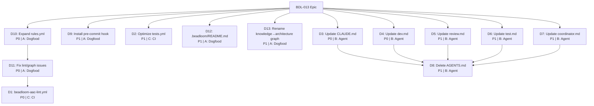

# PLAN: BDL-013 — Dogfood Beadloom + Agent Instructions + CI

> **Date:** 2026-02-14
> **Beads:** 12 tasks + 1 epic
> **Waves:** 5

---

## DAG



---

## Wave Breakdown

### Wave 1 — Foundation (independent, parallel)

| Bead | Deliverable | Priority | Package | Description |
|------|-------------|----------|---------|-------------|
| BEAD-01 | D10 | P0 | A: Dogfood | Add service-needs-parent + deny rule to rules.yml |
| BEAD-02 | D9 | P1 | A: Dogfood | Run `beadloom install-hooks --mode warn` |
| BEAD-03 | D2 | P1 | C: CI | Add path filters to tests.yml |
| BEAD-04 | D12 | P1 | A: Dogfood | Generate .beadloom/README.md (code + own project) |
| BEAD-13 | D13 | P1 | A: Dogfood | Rename "knowledge graph" → "architecture graph" codebase-wide |

### Wave 2 — Verification (depends on Wave 1)

| Bead | Deliverable | Priority | Package | Description |
|------|-------------|----------|---------|-------------|
| BEAD-05 | D11 | P0 | A: Dogfood | Run new rules, fix violations, fix graph edges |

**Blocked by:** BEAD-01 (rules must exist before verification)

### Wave 3 — Agent Instructions (parallel, after planning)

| Bead | Deliverable | Priority | Package | Description |
|------|-------------|----------|---------|-------------|
| BEAD-06 | D3 | P0 | B: Agent | Add Beadloom §2.1 to CLAUDE.md + update §0, §7 |
| BEAD-07 | D4 | P0 | B: Agent | Replace static structure in dev.md with dynamic |
| BEAD-08 | D5 | P1 | B: Agent | Add Beadloom checklist to review.md |
| BEAD-09 | D6 | P1 | B: Agent | Replace static structure in test.md |
| BEAD-10 | D7 | P1 | B: Agent | Add Beadloom to coordinator.md wave checklist |

### Wave 4 — Cleanup (depends on Wave 3)

| Bead | Deliverable | Priority | Package | Description |
|------|-------------|----------|---------|-------------|
| BEAD-11 | D8 | P1 | B: Agent | Delete AGENTS.md, verify no broken refs |

**Blocked by:** BEAD-06, BEAD-07, BEAD-08, BEAD-09, BEAD-10

### Wave 5 — CI Enablement (depends on Wave 2)

| Bead | Deliverable | Priority | Package | Description |
|------|-------------|----------|---------|-------------|
| BEAD-12 | D1 | P0 | C: CI | Create beadloom-aac-lint.yml, verify green |

**Blocked by:** BEAD-05 (lint must pass before CI enforces it)

---

## Critical Path

```
BEAD-01 (rules) → BEAD-05 (fix) → BEAD-12 (CI)
```

Total: 3 beads on critical path. Everything else is parallel.

---

## Summary

| Metric | Value |
|--------|-------|
| Total beads | 13 |
| P0 beads | 5 (BEAD-01, 05, 06, 07, 12) |
| P1 beads | 8 (BEAD-02, 03, 04, 08, 09, 10, 11, 13) |
| Packages | A: Dogfood (5), B: Agent (6), C: CI (2) |
| Waves | 5 |
| Critical path length | 3 |
| Code changes | 1 file (doc_generator.py + test) |
| Config/doc changes | 12+ files |
