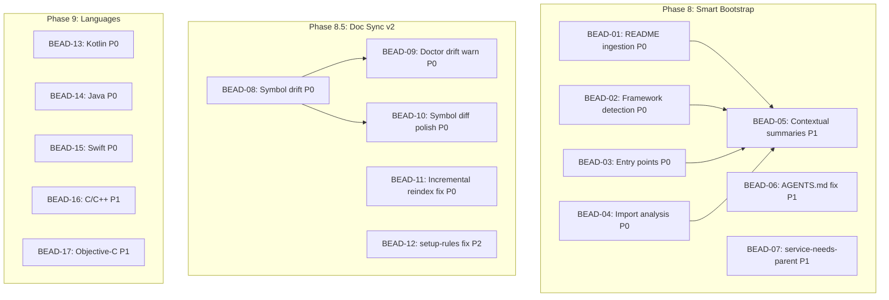

# BDL-015: Beadloom v1.5 — Plan

## Epic description
Solve three critical problems in Beadloom v1.5: shallow bootstrap, broken doc sync, and limited language support. Three phases run in parallel.

## Dependency DAG

**Critical paths:**
- Phase 8: BEAD-01/02/03/04 -> BEAD-05
- Phase 8.5: BEAD-08 -> BEAD-09, BEAD-10
- Phase 9: All standalone (parallel)

## Wave Execution Plan

### Wave 1 (all independent — max parallelism)

| BEAD | Task | Phase | P | Files |
|------|------|-------|---|-------|
| 01 | README/doc ingestion | 8.1 | P0 | scanner.py |
| 02 | Extended framework detection (15+) | 8.2 | P0 | scanner.py, presets.py |
| 03 | Entry point discovery | 8.3 | P0 | scanner.py |
| 04 | Import analysis at bootstrap | 8.4 | P0 | scanner.py, import_resolver.py |
| 06 | AGENTS.md in bootstrap (fix UX #19) | 8.6 | P1 | scanner.py |
| 07 | service-needs-parent rule | 8.7 | P1 | scanner.py |
| 08 | Symbol-level drift detection | 8.5.1 | P0 | doc_sync/engine.py, reindex.py, db.py |
| 11 | Incremental reindex: graph YAML (fix UX #21) | 8.5.4 | P0 | reindex.py |
| 12 | setup-rules auto-detect fix (fix UX #17) | 8.5.5 | P2 | setup_rules.py |
| 13 | Kotlin (.kt, .kts) | 9.1 | P0 | code_indexer.py, import_resolver.py, reindex.py |
| 14 | Java (.java) | 9.2 | P0 | code_indexer.py, import_resolver.py, reindex.py |
| 15 | Swift (.swift) | 9.3 | P0 | code_indexer.py, import_resolver.py, reindex.py |

### Wave 2 (depends on Wave 1 items)

| BEAD | Task | Phase | P | Depends on |
|------|------|-------|---|------------|
| 05 | Contextual node summaries | 8.5 | P1 | 01, 02, 03, 04 |
| 09 | Doctor drift warnings | 8.5.2 | P0 | 08 |
| 10 | Symbol diff in polish | 8.5.3 | P0 | 08 |
| 16 | C/C++ (.c, .cpp, .h) | 9.4 | P1 | — (standalone but lower priority) |
| 17 | Objective-C (.m, .mm) | 9.5 | P1 | — (standalone but lower priority) |

## Beads Overview

| ID | Name | P | Depends on | Status |
|----|------|---|------------|--------|
| 01 | README/doc ingestion | P0 | — | Pending |
| 02 | Extended framework detection | P0 | — | Pending |
| 03 | Entry point discovery | P0 | — | Pending |
| 04 | Import analysis at bootstrap | P0 | — | Pending |
| 05 | Contextual node summaries | P1 | 01,02,03,04 | Pending |
| 06 | AGENTS.md in bootstrap | P1 | — | Pending |
| 07 | service-needs-parent rule | P1 | — | Pending |
| 08 | Symbol-level drift detection | P0 | — | Pending |
| 09 | Doctor drift warnings | P0 | 08 | Pending |
| 10 | Symbol diff in polish | P0 | 08 | Pending |
| 11 | Incremental reindex fix | P0 | — | Pending |
| 12 | setup-rules auto-detect fix | P2 | — | Pending |
| 13 | Kotlin | P0 | — | Pending |
| 14 | Java | P0 | — | Pending |
| 15 | Swift | P0 | — | Pending |
| 16 | C/C++ | P1 | — | Pending |
| 17 | Objective-C | P1 | — | Pending |

## Bead Details

### BEAD-01: README/documentation ingestion (Phase 8.1)
**Priority:** P0 | **Effort:** S
Parse README.md, CONTRIBUTING.md, ARCHITECTURE.md. Extract project description, tech stack mentions, architecture notes. Store as root node metadata. New function `ingest_readme()` in scanner.py. Call from `bootstrap_project()`.

### BEAD-02: Extended framework detection (Phase 8.2)
**Priority:** P0 | **Effort:** M
Extend `_detect_framework_summary()` from 4 to 15+ frameworks. Detection via file markers + import analysis: FastAPI, Flask, Django, Express, NestJS, Next.js, Vue, Spring Boot, Gin, Actix, Expo/RN, SwiftUI, Jetpack Compose, UIKit.

### BEAD-03: Entry point discovery (Phase 8.3)
**Priority:** P0 | **Effort:** M
New function `_discover_entry_points()`. Detect `__main__.py`, `if __name__`, CLI (Click/Typer/argparse), `main()` in Go/Rust/Java/Kotlin, `@main` in Swift, `AppDelegate`/`@UIApplicationMain`, server bootstraps. Store in `nodes.extra["entry_points"]`.

### BEAD-04: Import analysis at bootstrap (Phase 8.4)
**Priority:** P0 | **Effort:** L
New function `_quick_import_scan()`. Reuse `extract_imports()` from import_resolver.py during `bootstrap_project()`. Map imports to cluster names to create `depends_on` edges in the first graph.

### BEAD-05: Contextual node summaries (Phase 8.5)
**Priority:** P1 | **Effort:** M | **Depends on:** 01, 02, 03, 04
Combine framework type, entry points, key symbols, README info into rich summaries. Replace "Domain: auth (15 files)" with "FastAPI service: auth — JWT auth, 3 routes, 5 public classes".

### BEAD-06: AGENTS.md in bootstrap (Phase 8.6)
**Priority:** P1 | **Effort:** S
Verify `generate_agents_md()` is called from `bootstrap_project()` and works correctly. Fix UX Issue #19.

### BEAD-07: service-needs-parent rule (Phase 8.7)
**Priority:** P1 | **Effort:** S
Add `service-needs-parent` rule to `generate_rules()`: every service must have a `part_of` edge.

### BEAD-08: Symbol-level drift detection (Phase 8.5.1)
**Priority:** P0 | **Effort:** M
Compute `symbols_hash` (SHA256 of sorted code_symbols) per node. Store in `sync_state`. On `sync-check`, compare current symbols_hash vs stored — if code changed but doc didn't, mark as stale. New column `symbols_hash` in sync_state table.

### BEAD-09: Doctor drift warnings (Phase 8.5.2)
**Priority:** P0 | **Effort:** S | **Depends on:** 08
Add to `run_doctor()`: "N nodes have code changes since last doc update". Uses symbols_hash from BEAD-08.

### BEAD-10: Symbol diff in polish (Phase 8.5.3)
**Priority:** P0 | **Effort:** M | **Depends on:** 08
`generate_polish_data()` includes diff: "added functions X, Y; removed class Z; changed signature W". Agent receives specific update instructions.

### BEAD-11: Incremental reindex: graph YAML (Phase 8.5.4)
**Priority:** P0 | **Effort:** M
Fix UX Issue #21: incremental reindex must detect graph YAML changes (services.yml, domains.yml, etc.) and trigger graph reload. Currently reports "Nodes: 0, Edges: 0" after editing services.yml.

### BEAD-12: setup-rules auto-detect fix (Phase 8.5.5)
**Priority:** P2 | **Effort:** S
Fix UX Issue #17: for Windsurf/Cline, check existing file content (is it a beadloom adapter?), not just file presence.

### BEAD-13: Kotlin (.kt, .kts) (Phase 9.1)
**Priority:** P0 | **Effort:** M
tree-sitter-kotlin: classes, data classes, annotations (@Composable, @HiltViewModel), imports. Add `_load_kotlin()`, `_extract_kotlin_imports()`, register extensions, update pyproject.toml, tests.

### BEAD-14: Java (.java) (Phase 9.2)
**Priority:** P0 | **Effort:** M
tree-sitter-java: classes, interfaces, annotations (@RestController, @Service), imports. Add `_load_java()`, `_extract_java_imports()`, register extensions, update pyproject.toml, tests.

### BEAD-15: Swift (.swift) (Phase 9.3)
**Priority:** P0 | **Effort:** M
tree-sitter-swift: classes, structs, protocols, @main, import. Add `_load_swift()`, `_extract_swift_imports()`, register extensions, update pyproject.toml, tests.

### BEAD-16: C/C++ (.c, .cpp, .h, .hpp) (Phase 9.4)
**Priority:** P1 | **Effort:** L
tree-sitter-c / tree-sitter-cpp: functions, classes, structs, #include. Add `_load_c()`, `_load_cpp()`, `_extract_cpp_imports()`, register extensions, update pyproject.toml, tests.

### BEAD-17: Objective-C (.m, .mm) (Phase 9.5)
**Priority:** P1 | **Effort:** M
tree-sitter-objc: classes, methods, #import, @interface. Add `_load_objc()`, `_extract_objc_imports()`, register extensions, update pyproject.toml, tests.
