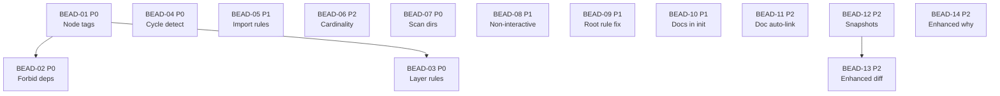

# PLAN: BDL-021 — v1.7.0: AaC Rules v2, Init Quality, Architecture Intelligence

> **Status:** Approved
> **Created:** 2026-02-17

---

## Epic Description

Implement v1.7.0 with three feature areas: AaC Rules v2 (architecture enforcement engine with 6 rule types), Init Quality (reliable first-time bootstrap), and Architecture Intelligence (change tracking and enhanced impact analysis). 14 beads across 3 phases.

## Dependency DAG

**Critical path:** BEAD-01 -> BEAD-02/BEAD-03

## Wave Plan

### Wave 1 — Foundation (parallel: 4 agents)
All independent P0 beads + quick P1 fixes:
- **Agent-1:** BEAD-01 (Node tags) — prerequisite, blocks 02+03
- **Agent-2:** BEAD-04 (Cycle detection) — standalone P0
- **Agent-3:** BEAD-07 (Scan dirs) + BEAD-09 (Root rule fix) — both small, same module
- **Agent-4:** BEAD-05 (Import rules) — standalone P1

### Wave 2 — Dependent rules + init features (parallel: 4 agents)
After BEAD-01 completes:
- **Agent-1:** BEAD-02 (Forbid deps) — depends on BEAD-01
- **Agent-2:** BEAD-03 (Layer rules) — depends on BEAD-01
- **Agent-3:** BEAD-08 (Non-interactive init) + BEAD-10 (Docs in init) — same module
- **Agent-4:** BEAD-12 (Snapshots) + BEAD-14 (Enhanced why) — standalone P2s

### Wave 3 — Final + integration (parallel: 2 agents)
After Wave 2:
- **Agent-1:** BEAD-06 (Cardinality) + BEAD-11 (Doc auto-link) — P2 cleanup
- **Agent-2:** BEAD-13 (Enhanced diff) — depends on BEAD-12

### Wave 4 — Validation
- Schema v3 integration test
- Dogfood on dreamteam project
- E2E validation: `beadloom lint --strict` on beadloom itself
- CHANGELOG.md update, version bump

## Beads

| ID | Name | Priority | Depends On | Status | Beads ID |
|----|------|----------|------------|--------|----------|
| BEAD-01 | Node tags/labels | P0 | - | Pending | beadloom-j9e.1 |
| BEAD-02 | Forbidden dependency rules | P0 | 01 | Pending | beadloom-j9e.2 |
| BEAD-03 | Layer enforcement rules | P0 | 01 | Pending | beadloom-j9e.3 |
| BEAD-04 | Circular dependency detection | P0 | - | Pending | beadloom-j9e.4 |
| BEAD-05 | Import-based boundary rules | P1 | - | Pending | beadloom-j9e.5 |
| BEAD-06 | Cardinality/complexity rules | P2 | - | Pending | beadloom-j9e.6 |
| BEAD-07 | Scan all code directories | P0 | - | Pending | beadloom-j9e.7 |
| BEAD-08 | Non-interactive init mode | P1 | - | Pending | beadloom-j9e.8 |
| BEAD-09 | Root service rule fix | P1 | - | Pending | beadloom-j9e.9 |
| BEAD-10 | Docs generate in init | P1 | - | Pending | beadloom-j9e.10 |
| BEAD-11 | Doc auto-linking | P2 | - | Pending | beadloom-j9e.11 |
| BEAD-12 | Architecture snapshot storage | P2 | - | Pending | beadloom-j9e.12 |
| BEAD-13 | Enhanced beadloom diff | P2 | 12 | Pending | beadloom-j9e.13 |
| BEAD-14 | Enhanced impact analysis | P2 | - | Pending | beadloom-j9e.14 |

## Bead Details

### BEAD-01: Node tags/labels in services.yml + NodeMatcher

**Priority:** P0
**Depends on:** -
**Blocks:** BEAD-02, BEAD-03

**What to do:**
- Add `tags` field support in services.yml node definitions
- Tags stored in `extra` JSON column (existing mechanism)
- Add `get_node_tags(conn, ref_id) -> set[str]` helper in `graph/loader.py`
- Extend `NodeMatcher` with `tag: str | None` field
- Update `NodeMatcher.matches()` to check tag membership
- Support optional top-level `tags:` block in rules.yml (sugar for bulk assignment)
- Bump rules.yml schema to v3 (backward compat with v1/v2)

**Done when:**
- [ ] Tags can be defined in services.yml and loaded into extra JSON
- [ ] NodeMatcher matches by tag
- [ ] get_node_tags() helper works
- [ ] Schema v3 loads, v1/v2 still work
- [ ] Tests: tag loading, matching, schema backward compat

### BEAD-02: Forbidden dependency rules (ForbidEdgeRule)

**Priority:** P0
**Depends on:** BEAD-01
**Blocks:** -

**What to do:**
- New `ForbidEdgeRule` dataclass in rule_engine.py
- `evaluate_forbid_edge_rules()` — iterates edges table, checks matchers
- YAML parsing for `forbid:` rule type
- Integration with `evaluate_all()`

**Done when:**
- [ ] ForbidEdgeRule detected and evaluated
- [ ] Tag-based from/to matching works
- [ ] Violations reported with clear messages
- [ ] Tests: basic forbid, tag-based, edge_kind filter

### BEAD-03: Layer enforcement rules (LayerRule)

**Priority:** P0
**Depends on:** BEAD-01
**Blocks:** -

**What to do:**
- New `LayerDef` + `LayerRule` dataclasses
- `evaluate_layer_rules()` — for each edge, check layer direction
- `enforce: top-down` means upper layer cannot import from lower
- `allow_skip: true/false` option
- YAML parsing for `layers:` rule type

**Done when:**
- [ ] LayerRule detected and evaluated
- [ ] Top-down enforcement works
- [ ] allow_skip option works
- [ ] Tests: layer violations, skip behavior, edge cases

### BEAD-04: Circular dependency detection (CycleRule)

**Priority:** P0
**Depends on:** -
**Blocks:** -

**What to do:**
- New `CycleRule` dataclass
- `evaluate_cycle_rules()` — iterative DFS with path tracking
- `max_depth` limit for performance
- Reports full cycle path in violation message

**Done when:**
- [ ] Cycles detected in uses/depends_on edges
- [ ] Full path reported (A → B → C → A)
- [ ] max_depth respected
- [ ] Tests: simple cycle, no cycle, deep cycle, max_depth

### BEAD-05: Import-based boundary rules (ImportBoundaryRule)

**Priority:** P1
**Depends on:** -
**Blocks:** -

**What to do:**
- New `ImportBoundaryRule` dataclass
- `evaluate_import_boundary_rules()` — query code_imports, match globs via fnmatch
- from_glob/to_glob for source and target file paths

**Done when:**
- [ ] Glob-based import restrictions work
- [ ] fnmatch matching on file paths
- [ ] Violations show source file, line, import target
- [ ] Tests: matching globs, non-matching, edge cases

### BEAD-06: Cardinality/complexity rules (CardinalityRule)

**Priority:** P2
**Depends on:** -
**Blocks:** -

**What to do:**
- New `CardinalityRule` dataclass
- `evaluate_cardinality_rules()` — count symbols, files, doc coverage per node
- Default severity: warn (architectural smell)

**Done when:**
- [ ] max_symbols, max_files, min_doc_coverage checks work
- [ ] Reports which threshold was exceeded
- [ ] Tests: over/under limits, missing data

### BEAD-07: Scan all code directories in bootstrap

**Priority:** P0
**Depends on:** -
**Blocks:** -

**What to do:**
- Fix `scan_project()` in scanner.py — always run both passes
- Pass 1: known `_SOURCE_DIRS` names
- Pass 2: all non-hidden, non-vendor dirs with code files (always, not just fallback)
- Merge + deduplicate results

**Done when:**
- [ ] React Native project with `components/`, `hooks/`, `modules/` all detected
- [ ] Existing projects still work (no regression)
- [ ] Tests: RN project structure, standard project, empty project

### BEAD-08: Non-interactive init mode

**Priority:** P1
**Depends on:** -
**Blocks:** -

**What to do:**
- Add `--mode`, `--yes/-y`, `--force` flags to `init` CLI command
- New `non_interactive_init()` function — no prompts, uses defaults
- If `--force`: overwrite existing .beadloom/

**Done when:**
- [ ] `beadloom init --mode bootstrap --yes` works without prompts
- [ ] `--force` overwrites existing config
- [ ] Tests: non-interactive flow, force overwrite

### BEAD-09: Root service rule fix

**Priority:** P1
**Depends on:** -
**Blocks:** -

**What to do:**
- Fix `generate_rules()` in scanner.py
- Don't generate `service-needs-parent` rule (root service has no parent)

**Done when:**
- [ ] Generated rules.yml doesn't include service-needs-parent
- [ ] Lint passes on freshly bootstrapped project
- [ ] Tests: rule generation without service-needs-parent

### BEAD-10: Docs generate in init flow

**Priority:** P1
**Depends on:** -
**Blocks:** -

**What to do:**
- Add doc skeleton generation step to `interactive_init()` and `non_interactive_init()`
- Interactive: prompt "Generate doc skeletons? [yes/no]" (default: yes)
- Non-interactive: always generate
- Call `generate_skeletons()` after reindex

**Done when:**
- [ ] Init flow offers doc generation
- [ ] Non-interactive mode auto-generates
- [ ] Doc coverage > 0% after init
- [ ] Tests: init with docs, init without docs

### BEAD-11: Doc auto-linking during init

**Priority:** P2
**Depends on:** -
**Blocks:** -

**What to do:**
- New `auto_link_docs()` function
- Scan `docs/` for .md files
- Match to graph nodes by ref_id in path/filename
- Update services.yml `docs:` field

**Done when:**
- [ ] Existing docs matched to nodes by path similarity
- [ ] services.yml updated with docs links
- [ ] Tests: matching heuristics, edge cases

### BEAD-12: Architecture snapshot storage

**Priority:** P2
**Depends on:** -
**Blocks:** BEAD-13

**What to do:**
- New `graph/snapshot.py` module
- `graph_snapshots` table in SQLite (DDL in db.py)
- `save_snapshot()`, `list_snapshots()`, `compare_snapshots()`
- CLI: `beadloom snapshot save/list/compare`

**Done when:**
- [ ] Snapshots saved with nodes, edges, symbol count
- [ ] List shows all snapshots with labels
- [ ] Compare returns GraphDiff between snapshots
- [ ] Tests: save, list, compare, empty DB

### BEAD-13: Enhanced beadloom diff

**Priority:** P2
**Depends on:** BEAD-12
**Blocks:** -

**What to do:**
- Enhance `compute_diff()` — include source, tags in change detection
- Add symbol-level tracking (count changes)
- Integration with snapshot storage for historical diffs

**Done when:**
- [ ] Diff tracks source, tags, symbol count changes
- [ ] Can diff between snapshots (not just git refs)
- [ ] Tests: enhanced change detection

### BEAD-14: Enhanced impact analysis (why --reverse)

**Priority:** P2
**Depends on:** -
**Blocks:** -

**What to do:**
- Add `--reverse` flag — emphasize upstream deps
- Add `--format tree` — clean tree output
- Configurable asymmetric depth

**Done when:**
- [ ] `beadloom why <ref> --reverse` shows upstream focus
- [ ] `--format tree` renders clean tree
- [ ] Tests: reverse, tree format
