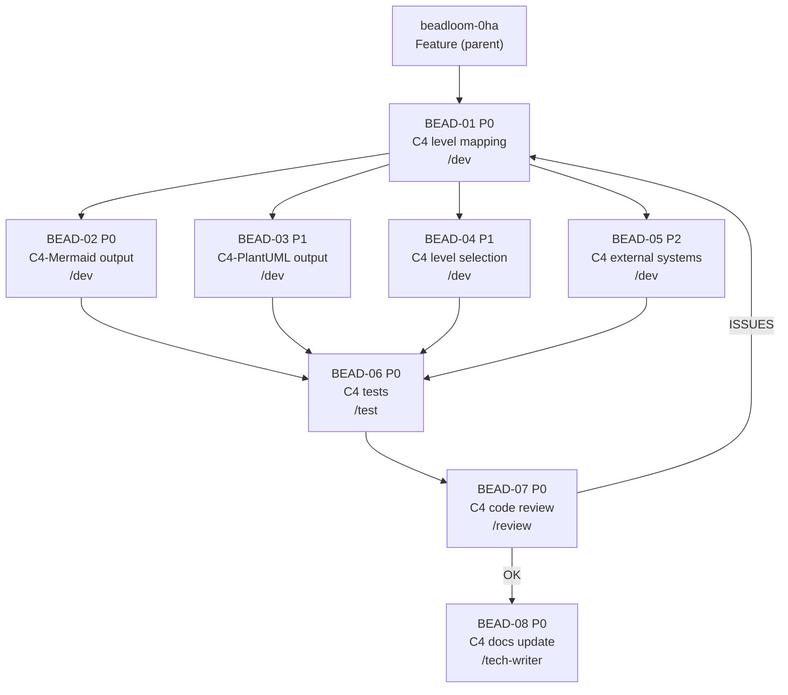

# PLAN: BDL-023 — C4 Architecture Diagrams

> **Status:** Draft
> **Created:** 2026-02-19

---

## Epic Description

Auto-generate C4 architecture diagrams from the Beadloom architecture graph. Extends `beadloom graph` with `--format=c4|c4-plantuml`, `--level=context|container|component`, and `--scope=<ref-id>` options. New module `graph/c4.py` handles C4 level mapping and rendering.

## Bead Hierarchy

```
beadloom-0ha [feature] BDL-023 C4 Architecture Diagrams (Phase 12.8)
├── beadloom-0ha.1 [task/dev]         BEAD-01: C4 level mapping
├── beadloom-0ha.2 [task/dev]         BEAD-02: C4-Mermaid output
├── beadloom-0ha.3 [task/dev]         BEAD-03: C4-PlantUML output
├── beadloom-0ha.4 [task/dev]         BEAD-04: C4 level selection
├── beadloom-0ha.5 [task/dev]         BEAD-05: C4 external systems
├── beadloom-0ha.6 [task/test]        BEAD-06: C4 tests
├── beadloom-0ha.7 [task/review]      BEAD-07: C4 code review
└── beadloom-0ha.8 [task/tech-writer] BEAD-08: C4 documentation update
```

## Dependency DAG



**Critical path:** Feature → BEAD-01 → BEAD-02 → BEAD-06 → BEAD-07 → BEAD-08

**Review feedback loop:** If BEAD-07 (review) returns issues, coordinator restarts dev→test→review cycle. Tech-writer starts ONLY after review = OK.

## Wave Plan

| Wave | Beads | Agents | Parallel |
|------|-------|--------|----------|
| Wave 1 | BEAD-01 (C4 level mapping) | /dev | No (single prerequisite) |
| Wave 2 | BEAD-02 + BEAD-03 + BEAD-04 + BEAD-05 | /dev x4 | Yes (all depend only on BEAD-01) |
| Wave 3 | BEAD-06 (tests) | /test | No (depends on all dev beads) |
| Wave 4 | BEAD-07 (review) | /review | No (depends on tests) |
| Wave 5 | BEAD-08 (docs) | /tech-writer | No (ONLY after review = OK) |

## Beads

| ID | Beads ID | Name | Agent | Priority | Depends On | Status |
|----|----------|------|-------|----------|------------|--------|
| BEAD-01 | beadloom-0ha.1 | C4 level mapping | /dev | P0 | Feature | Open |
| BEAD-02 | beadloom-0ha.2 | C4-Mermaid output | /dev | P0 | BEAD-01 | Blocked |
| BEAD-03 | beadloom-0ha.3 | C4-PlantUML output | /dev | P1 | BEAD-01 | Blocked |
| BEAD-04 | beadloom-0ha.4 | C4 level selection | /dev | P1 | BEAD-01 | Blocked |
| BEAD-05 | beadloom-0ha.5 | C4 external systems | /dev | P2 | BEAD-01 | Blocked |
| BEAD-06 | beadloom-0ha.6 | C4 tests | /test | P0 | BEAD-02..05 | Blocked |
| BEAD-07 | beadloom-0ha.7 | C4 code review | /review | P0 | BEAD-06 | Blocked |
| BEAD-08 | beadloom-0ha.8 | C4 docs update | /tech-writer | P0 | BEAD-07 | Blocked |

## Bead Details

### BEAD-01: C4 level mapping (/dev)

**Priority:** P0
**Depends on:** Feature (parent)
**Blocks:** BEAD-02, BEAD-03, BEAD-04, BEAD-05

**What to do:**
Create `src/beadloom/graph/c4.py` with `C4Node` and `C4Relationship` dataclasses, and `map_to_c4()` function that:
1. Reads all nodes from DB with `extra` JSON
2. Computes `part_of` depth via BFS from root
3. Assigns C4 level: explicit `c4_level` > depth heuristic > tags
4. Collects `uses`/`depends_on` edges as C4 relationships
5. Resolves boundary grouping via `part_of` parent

**Done when:**
- [ ] `C4Node` and `C4Relationship` dataclasses defined
- [ ] `map_to_c4()` returns correct C4 nodes for test graph
- [ ] Depth heuristic: root=System, depth1=Container, depth2+=Component
- [ ] Explicit `c4_level` overrides heuristic
- [ ] Tag detection: `external` → is_external, `database`/`storage` → is_database
- [ ] Unit tests for mapping logic pass
- [ ] mypy --strict + ruff clean

### BEAD-02: C4-Mermaid output (/dev)

**Priority:** P0
**Depends on:** BEAD-01
**Blocks:** BEAD-06

**What to do:**
Add `render_c4_mermaid()` to `graph/c4.py` that produces valid Mermaid C4 syntax. Extend `graph` CLI command with `--format` option. Default format remains `mermaid` (backward compatible).

**Done when:**
- [ ] `render_c4_mermaid()` generates valid `C4Container` diagram
- [ ] `System_Boundary()` groups containers by parent
- [ ] `Rel()` renders `uses`/`depends_on` edges
- [ ] CLI: `beadloom graph --format=c4` works
- [ ] Backward compatible: `beadloom graph` still outputs Mermaid flowchart
- [ ] Unit tests for renderer pass
- [ ] mypy --strict + ruff clean

### BEAD-03: C4-PlantUML output (/dev)

**Priority:** P1
**Depends on:** BEAD-01
**Blocks:** BEAD-06

**What to do:**
Add `render_c4_plantuml()` to `graph/c4.py` that produces C4-PlantUML syntax with standard macros. Wire to CLI via `--format=c4-plantuml`.

**Done when:**
- [ ] `render_c4_plantuml()` generates valid `@startuml`/`@enduml` with `!include`
- [ ] Standard macros: `System()`, `Container()`, `Component()`, `Rel()`
- [ ] `System_Boundary()` for grouping
- [ ] CLI: `beadloom graph --format=c4-plantuml` works
- [ ] Unit tests for PlantUML renderer pass
- [ ] mypy --strict + ruff clean

### BEAD-04: C4 level selection (/dev)

**Priority:** P1
**Depends on:** BEAD-01
**Blocks:** BEAD-06

**What to do:**
Add `--level=context|container|component` and `--scope=<ref-id>` options to CLI. Adjust `map_to_c4()` to filter nodes by requested level.

**Done when:**
- [ ] `--level=context` shows only system-level + external actors
- [ ] `--level=container` shows top-level domains (default)
- [ ] `--level=component --scope=<ref-id>` shows internals of one container
- [ ] Error message if `--level=component` used without `--scope`
- [ ] Unit tests for all three levels pass
- [ ] mypy --strict + ruff clean

### BEAD-05: C4 external systems (/dev)

**Priority:** P2
**Depends on:** BEAD-01
**Blocks:** BEAD-06

**What to do:**
Ensure nodes with `external` tag render as `System_Ext`/`Container_Ext`. Database nodes (`database`/`storage` tags) render as `ContainerDb`. Works in both Mermaid and PlantUML renderers.

**Done when:**
- [ ] `external` tag → `_Ext` suffix in both renderers
- [ ] `database`/`storage` tag → `Db` variant in both renderers
- [ ] Unit tests with external/database nodes pass
- [ ] mypy --strict + ruff clean

### BEAD-06: C4 tests (/test)

**Priority:** P0
**Depends on:** BEAD-02, BEAD-03, BEAD-04, BEAD-05

**What to do:**
Comprehensive test review and augmentation by /test agent:
1. Verify coverage >=80% for `graph/c4.py`
2. Add edge-case tests (empty graph, single node, cycles)
3. CLI integration tests with `CliRunner`
4. Parametrized tests for all C4 levels and formats

**Done when:**
- [ ] Coverage >=80% for `src/beadloom/graph/c4.py`
- [ ] Edge-case tests added
- [ ] CLI integration tests for all format/level combinations
- [ ] All tests pass (`uv run pytest`)

### BEAD-07: C4 code review (/review)

**Priority:** P0
**Depends on:** BEAD-06

**What to do:**
Code review by /review agent:
1. Architecture compliance (graph domain, no cross-domain leaks)
2. Code quality (ruff, mypy, no anti-patterns)
3. Test coverage adequacy
4. UX consistency (CLI options, error messages)
5. Beadloom validation (reindex, sync-check, lint)

**Done when:**
- [ ] No architecture violations
- [ ] mypy --strict clean
- [ ] ruff clean
- [ ] beadloom sync-check passes
- [ ] beadloom lint --strict passes
- [ ] Review = OK (no issues requiring dev fixes)

### BEAD-08: C4 documentation update (/tech-writer)

**Priority:** P0
**Depends on:** BEAD-07 (review = OK)

**What to do:**
Documentation update by /tech-writer agent:
1. Run `beadloom sync-check` — identify stale docs after C4 code changes
2. Update graph domain docs (new c4.py module, new CLI options)
3. Update CLI docs (new --format, --level, --scope options)
4. Reset baselines via `beadloom reindex`

**Done when:**
- [ ] `beadloom sync-check` reports 0 stale docs
- [ ] Graph domain doc updated with c4.py module description
- [ ] CLI doc updated with new options
- [ ] `beadloom reindex` — baselines reset
