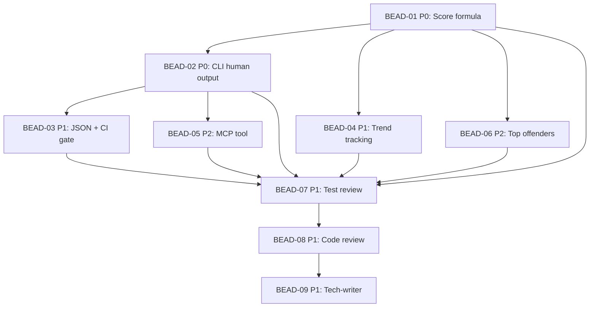

# PLAN: BDL-024 — Architecture Debt Report

> **Status:** Approved
> **Created:** 2026-02-20

---

## Epic Description

Implement Architecture Debt Report (Phase 12.9) — single command aggregating all health signals into a scored, categorized, trend-tracking report with CI gate and MCP support.

## Dependency DAG



**Critical path:** BEAD-01 → BEAD-02 → BEAD-03 → BEAD-07 → BEAD-08 → BEAD-09

## Waves

```
Wave 1: BEAD-01 (core module, blocks everything)
Wave 2: BEAD-02 + BEAD-04 + BEAD-06 (parallel, all depend on 01 only)
Wave 3: BEAD-03 + BEAD-05 (parallel, depend on 02)
Wave 4: BEAD-07 (test review, depends on all dev)
Wave 5: BEAD-08 (code review, depends on test)
Wave 6: BEAD-09 (tech-writer, depends on review)
```

## Beads

| ID | Name | Priority | Depends On | Agent | Status |
|----|------|----------|------------|-------|--------|
| BEAD-01 | Debt score formula + data collection | P0 | - | /dev | Pending |
| BEAD-02 | CLI status --debt-report (human) | P0 | 01 | /dev | Pending |
| BEAD-03 | JSON + CI gate output | P1 | 02 | /dev | Pending |
| BEAD-04 | Trend tracking vs snapshots | P1 | 01 | /dev | Pending |
| BEAD-05 | MCP tool get_debt_report | P2 | 02 | /dev | Pending |
| BEAD-06 | Top offenders list | P2 | 01 | /dev | Pending |
| BEAD-07 | Test review + augmentation | P1 | 01-06 | /test | Pending |
| BEAD-08 | Code review | P1 | 07 | /review | Pending |
| BEAD-09 | Documentation update | P1 | 08 | /tech-writer | Pending |

## Bead Details

### BEAD-01: Debt score formula + data collection

**Priority:** P0
**Depends on:** -
**Blocks:** BEAD-02, BEAD-04, BEAD-06, BEAD-07

**What to do:**
Create `src/beadloom/infrastructure/debt_report.py` with:
- Frozen dataclasses: `DebtWeights`, `DebtData`, `CategoryScore`, `NodeDebt`, `DebtTrend`, `DebtReport`
- `load_debt_weights(project_root)` — reads `config.yml` `debt_report` section, falls back to defaults
- `collect_debt_data(conn, project_root)` — aggregates from lint, sync-check, doctor, git_activity, test_mapper
- `compute_debt_score(data, weights)` — applies formula, returns `DebtReport`
- `_severity_label(score)` — maps score to clean/low/medium/high/critical
- Unit tests in `tests/test_debt_report.py`

**Done when:**
- [ ] All dataclasses defined and frozen
- [ ] `collect_debt_data()` pulls from all 4 categories
- [ ] `compute_debt_score()` applies weighted formula correctly
- [ ] Default weights match Strategy spec
- [ ] Config override works
- [ ] Severity labels correct for all thresholds
- [ ] Unit tests pass (>=15 tests)

### BEAD-02: CLI status --debt-report (human-readable)

**Priority:** P0
**Depends on:** BEAD-01
**Blocks:** BEAD-03, BEAD-05, BEAD-07

**What to do:**
- Add `--debt-report` flag to `status` command in `cli.py`
- Implement `format_debt_report(report)` — Rich tables/panels matching Strategy spec output
- Render: score with severity label, category breakdown with counts, top offenders

**Done when:**
- [ ] `beadloom status --debt-report` produces formatted output
- [ ] Categories show point totals and item counts
- [ ] Severity label shown with visual indicator
- [ ] Backward compatible: `beadloom status` unchanged
- [ ] Integration tests pass

### BEAD-03: JSON + CI gate output

**Priority:** P1
**Depends on:** BEAD-02
**Blocks:** BEAD-07

**What to do:**
- Add `--json` flag (when used with `--debt-report`)
- Add `--fail-if` flag with parsing: `score>N`, `errors>N`
- Add `--category` flag for filtering
- `format_debt_json(report)` — returns dict matching JSON schema from Strategy
- Non-zero exit on threshold breach

**Done when:**
- [ ] `--json` produces valid JSON matching spec schema
- [ ] `--fail-if=score>30` exits 1 when score > 30
- [ ] `--fail-if=errors>0` exits 1 when lint errors exist
- [ ] `--category=docs` filters to docs category only
- [ ] Tests for all flag combinations

### BEAD-04: Trend tracking vs snapshots

**Priority:** P1
**Depends on:** BEAD-01
**Blocks:** BEAD-07

**What to do:**
- Add `compute_debt_trend(conn, current_report, project_root)` — loads last snapshot, recomputes score, calculates delta
- Add `--trend` flag to CLI
- Render trend section with arrows (↓ improved, ↑ regressed, = unchanged)

**Done when:**
- [ ] Trend computed from last snapshot
- [ ] Delta shown per category
- [ ] Works when no snapshot exists (shows "no baseline")
- [ ] Arrows correctly show direction
- [ ] Tests for trend computation

### BEAD-05: MCP tool get_debt_report

**Priority:** P2
**Depends on:** BEAD-02
**Blocks:** BEAD-07

**What to do:**
- Add `get_debt_report` tool to MCP server
- Arguments: `trend` (bool), `category` (str|None)
- Returns: `format_debt_json(report)` result
- Register in `_TOOLS` list

**Done when:**
- [ ] Tool registered and dispatched
- [ ] Returns structured JSON
- [ ] `trend` argument works
- [ ] `category` filtering works
- [ ] Tool appears in `beadloom prime` output

### BEAD-06: Top offenders list

**Priority:** P2
**Depends on:** BEAD-01
**Blocks:** BEAD-07

**What to do:**
- Implement `compute_top_offenders(data, weights)` — rank nodes by debt contribution
- `NodeDebt` dataclass: `ref_id`, `score`, `reasons`
- Integrate into both human-readable and JSON output

**Done when:**
- [ ] Nodes ranked by debt score
- [ ] Reasons list populated per node
- [ ] Top 10 shown by default
- [ ] Tests for ranking logic

### BEAD-07: Test review + augmentation

**Priority:** P1
**Depends on:** BEAD-01 through BEAD-06
**Blocks:** BEAD-08

**What to do:** /test agent reviews all debt report tests, adds edge cases, ensures >=80% coverage

### BEAD-08: Code review

**Priority:** P1
**Depends on:** BEAD-07
**Blocks:** BEAD-09

**What to do:** /review agent performs quality review. Checks: mypy strict, ruff clean, patterns, error handling, naming.

### BEAD-09: Documentation update

**Priority:** P1
**Depends on:** BEAD-08

**What to do:** /tech-writer agent updates: infrastructure domain README, CLI docs, MCP docs, creates SPEC.md for debt-report feature node, updates services.yml graph.
