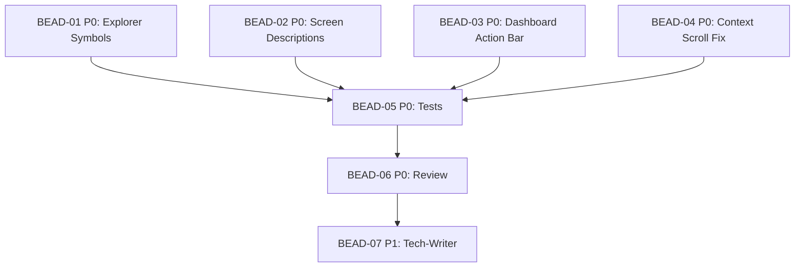

# PLAN: BDL-025-UX — TUI UX Polish (12.10.8)

> **Status:** Approved
> **Created:** 2026-02-20

---

## Epic Description

Four independent UX improvements to the Beadloom TUI: richer Explorer detail panel, screen descriptions, Dashboard action bar, and Context Inspector scroll fix.

## Dependency DAG

**Critical path:** Any BEAD-01..04 → BEAD-05 → BEAD-06 → BEAD-07

## Waves

| Wave | Beads | Agents | Parallel |
|------|-------|--------|----------|
| Wave 1 (dev) | BEAD-01, BEAD-02, BEAD-03, BEAD-04 | 4x /dev | Yes — all independent |
| Wave 2 (test) | BEAD-05 | 1x /test | After Wave 1 |
| Wave 3 (review) | BEAD-06 | 1x /review | After Wave 2 |
| Wave 4 (docs) | BEAD-07 | 1x /tech-writer | After Wave 3 |

## Beads

| ID | Name | Priority | Depends On | Status |
|----|------|----------|------------|--------|
| BEAD-01 | Explorer: Connections + Symbols | P0 | - | Pending |
| BEAD-02 | Screen Descriptions | P0 | - | Pending |
| BEAD-03 | Dashboard Action Bar | P0 | - | Pending |
| BEAD-04 | Context Inspector Scroll Fix | P0 | - | Pending |
| BEAD-05 | Tests (all features) | P0 | 01,02,03,04 | Pending |
| BEAD-06 | Code Review | P0 | 05 | Pending |
| BEAD-07 | Documentation Update | P1 | 06 | Pending |

## Bead Details

### BEAD-01: Explorer — Connections Summary + Symbols

**Priority:** P0
**Depends on:** —
**Blocks:** BEAD-05

**What to do:**
1. In `node_detail_panel.py`, replace the "Edges" section with:
   - "Connections" — one-line grouped summary of outgoing/incoming edges by kind
   - "Symbols" — list of top-level functions/classes from `code_indexer`
2. Add `GraphDataProvider.get_symbols(ref_id)` to `data_providers.py`
3. Use `extract_symbols(project_root / source_path)` for symbol data

**Done when:**
- [ ] Edges section replaced with Connections summary
- [ ] Symbols section renders function/class names with line numbers
- [ ] `get_symbols()` method added to GraphDataProvider
- [ ] Existing tests pass, new unit tests for rendering

### BEAD-02: Screen Descriptions

**Priority:** P0
**Depends on:** —
**Blocks:** BEAD-05

**What to do:**
1. Add `Label(id="screen-description", classes="screen-desc")` to `compose()` in all 3 screens
2. Dashboard: `"Architecture overview: graph structure, git activity, lint & debt health"`
3. Explorer: `"Node deep-dive: detail, dependencies, context bundle"`
4. Doc Status: `"Documentation health: coverage, freshness, staleness reasons"`
5. Add shared CSS rule in each screen's TCSS: dim, italic, 1 line, bottom border

**Done when:**
- [ ] All 3 screens show description below header
- [ ] Descriptions styled consistently (dim, italic)
- [ ] Existing tests pass

### BEAD-03: Dashboard Action Bar

**Priority:** P0
**Depends on:** —
**Blocks:** BEAD-05

**What to do:**
1. Add action bar `Label` to Dashboard's `compose()`, docked to bottom
2. Text: `"[Enter]explore  [r]eindex  [l]int  [s]ync-check  [S]napshot  [?]help"`
3. Style in `dashboard.tcss`: dock bottom, border-top, matching Explorer/Doc Status pattern

**Done when:**
- [ ] Dashboard has visible action bar at bottom
- [ ] Action bar shows available keybindings
- [ ] Style matches Explorer/Doc Status action bars
- [ ] Existing tests pass

### BEAD-04: Context Inspector Scroll Fix

**Priority:** P0
**Depends on:** —
**Blocks:** BEAD-05

**What to do:**
1. In `context_preview.py`, remove the 2000-char truncation limit
2. Verify/ensure `overflow-y: auto` in CSS (may already be set)
3. Add `self.scroll_home()` call when `show_context()` is called with new ref_id

**Done when:**
- [ ] Full context bundle displayed without truncation
- [ ] Content is scrollable
- [ ] Scroll resets to top on node change
- [ ] Existing tests pass

### BEAD-05: Tests

**Priority:** P0
**Depends on:** BEAD-01, BEAD-02, BEAD-03, BEAD-04
**Blocks:** BEAD-06

**What to do:**
1. Test `_render_node_detail()` shows Connections + Symbols (not raw edges)
2. Test `get_symbols()` returns expected symbol list
3. Test screen descriptions present in all 3 screens
4. Test Dashboard action bar present
5. Test ContextPreviewWidget renders full content (no truncation)

**Done when:**
- [ ] All new tests pass
- [ ] All 285+ existing tests pass
- [ ] Coverage >= 80%

### BEAD-06: Code Review

**Priority:** P0
**Depends on:** BEAD-05
**Blocks:** BEAD-07

**What to do:**
Review all changes per `/review` checklist: code quality, type safety, test coverage, no anti-patterns.

**Done when:**
- [ ] Review = OK (or issues fixed)

### BEAD-07: Documentation Update

**Priority:** P1
**Depends on:** BEAD-06
**Blocks:** —

**What to do:**
Update TUI service docs if `beadloom sync-check` reports staleness after code changes.

**Done when:**
- [ ] `beadloom sync-check` — 0 stale
- [ ] Docs reflect new widget behavior
