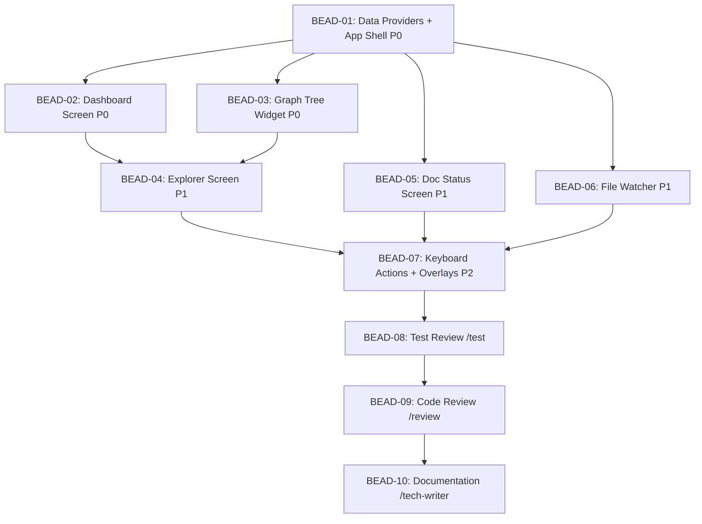

# PLAN: BDL-025 — Interactive Architecture TUI

> **Status:** Approved
> **Created:** 2026-02-20

---

## Epic Description

Build an interactive multi-screen architecture TUI with dashboard, graph explorer, doc status panel, live file watcher, and keyboard-driven actions. Transform the existing basic viewer into a full architecture workstation.

## Dependency DAG



**Critical path:** BEAD-01 → BEAD-02/03 → BEAD-04 → BEAD-07 → BEAD-08 → BEAD-09 → BEAD-10

## Beads

| ID | Name | Priority | Agent | Depends On | Status |
|----|------|----------|-------|------------|--------|
| BEAD-01 | Data Providers + App Shell | P0 | /dev | - | Pending |
| BEAD-02 | Dashboard Screen | P0 | /dev | 01 | Pending |
| BEAD-03 | Graph Tree Widget | P0 | /dev | 01 | Pending |
| BEAD-04 | Explorer Screen | P1 | /dev | 02, 03 | Pending |
| BEAD-05 | Doc Status Screen | P1 | /dev | 01 | Pending |
| BEAD-06 | File Watcher | P1 | /dev | 01 | Pending |
| BEAD-07 | Keyboard Actions + Overlays | P2 | /dev | 04, 05, 06 | Pending |
| BEAD-08 | Test Review | P1 | /test | 07 | Pending |
| BEAD-09 | Code Review | P1 | /review | 08 | Pending |
| BEAD-10 | Documentation | P1 | /tech-writer | 09 | Pending |

## Bead Details

### BEAD-01: Data Providers + App Shell

**Priority:** P0
**Agent:** /dev
**Depends on:** —
**Blocks:** BEAD-02, BEAD-03, BEAD-05, BEAD-06

**What to do:**
1. Upgrade `textual>=0.80` in pyproject.toml
2. Create `src/beadloom/tui/data_providers.py` with 7 data provider classes:
   - `GraphDataProvider` — nodes, edges from SQLite
   - `LintDataProvider` — `load_rules()` + `evaluate_all()`
   - `SyncDataProvider` — `check_sync()`
   - `DebtDataProvider` — `collect_debt_data()` + `compute_debt_score()`
   - `ActivityDataProvider` — `analyze_git_activity()`
   - `WhyDataProvider` — `analyze_node()`
   - `ContextDataProvider` — `build_context()` + `estimate_tokens()`
3. Rewrite `app.py`: multi-screen shell with Screen routing, keybindings, DB connection management
4. Create screen stubs: `screens/dashboard.py`, `screens/explorer.py`, `screens/doc_status.py`
5. Create `styles/` TCSS files for each screen
6. Update `__init__.py` launch entry point
7. Update CLI: rename `ui` → `tui` (keep `ui` alias), add `--no-watch`
8. Tests: data provider unit tests + app shell instantiation

**Done when:**
- [ ] All 7 data providers have unit tests and pass
- [ ] App launches with 3 screen stubs (empty but navigable via 1/2/3 keys)
- [ ] `beadloom tui` and `beadloom ui` both work
- [ ] Existing TUI tests updated and passing

### BEAD-02: Dashboard Screen

**Priority:** P0
**Agent:** /dev
**Depends on:** BEAD-01
**Blocks:** BEAD-04

**What to do:**
1. Create `widgets/debt_gauge.py` — DebtGaugeWidget showing score with severity coloring
2. Create `widgets/lint_panel.py` — LintPanelWidget showing errors/warnings count
3. Create `widgets/activity.py` — ActivityWidget showing per-domain activity (Rich bars)
4. Create `widgets/status_bar.py` — rewrite StatusBarWidget with watcher status, last action
5. Implement `screens/dashboard.py` with layout: graph placeholder (left) + activity/lint (right) + node summary + status bar
6. Wire data providers to widgets via `on_mount()` and refresh events
7. TCSS layout in `styles/dashboard.tcss`
8. Tests: dashboard screen renders all widgets, data binding works

**Done when:**
- [ ] Dashboard shows debt score gauge with severity color
- [ ] Lint panel shows error/warning counts
- [ ] Activity panel shows per-domain bars
- [ ] Status bar shows node/edge/doc/stale counts
- [ ] Layout is responsive (min 80x24 terminal)

### BEAD-03: Graph Tree Widget

**Priority:** P0
**Agent:** /dev
**Depends on:** BEAD-01
**Blocks:** BEAD-04

**What to do:**
1. Create `widgets/graph_tree.py` — GraphTreeWidget using Textual `Tree` widget
2. Build tree from graph hierarchy: root → domains → features/services
3. Show doc status indicators (fresh/stale/missing) per node
4. Show edge counts per node
5. Expand/collapse with Enter
6. Selection emits NodeSelected message
7. Integrate into DashboardScreen (left panel)
8. Tests: tree builds from DB, expand/collapse, node selection

**Done when:**
- [ ] Tree renders full graph hierarchy from SQLite
- [ ] Nodes show doc status indicators and edge counts
- [ ] Expand/collapse works on Enter
- [ ] Node selection emits message and updates summary bar
- [ ] 500+ nodes render smoothly

### BEAD-04: Explorer Screen

**Priority:** P1
**Agent:** /dev
**Depends on:** BEAD-02, BEAD-03

**What to do:**
1. Create `widgets/node_detail_panel.py` — shows symbols, edges, routes, tests for selected node
2. Create `widgets/dependency_path.py` — interactive `why` panel (upstream `u` / downstream `d`)
3. Create `widgets/context_preview.py` — context bundle preview with token count
4. Implement `screens/explorer.py` with layout: node detail (left) + dependency/context (right)
5. Navigation: Enter from graph tree → push ExplorerScreen, Esc → pop back
6. Wire `d`/`u`/`c`/`o` keybindings
7. `o` key: open primary source file in `$EDITOR`
8. Tests: explorer renders node detail, dependency paths, context preview

**Done when:**
- [ ] Explorer shows node symbols, edges, routes, test mapping
- [ ] `d` shows downstream, `u` shows upstream dependency trees
- [ ] `c` shows context bundle with token count
- [ ] `o` opens source file in $EDITOR
- [ ] Esc returns to dashboard

### BEAD-05: Doc Status Screen

**Priority:** P1
**Agent:** /dev
**Depends on:** BEAD-01

**What to do:**
1. Create `widgets/doc_health.py` — DocHealthTable using Textual `DataTable`
2. Columns: Node, Status (fresh/stale/missing), Doc Path, Reason
3. Color coding: green (fresh), yellow (stale), red (missing)
4. `g` key: generate doc skeleton for selected node
5. `p` key: view polish data for selected node
6. Implement `screens/doc_status.py` with header stats (coverage %, stale count)
7. TCSS in `styles/doc_status.tcss`
8. Tests: table renders sync data, color coding, action keys

**Done when:**
- [ ] Table shows all nodes with doc status
- [ ] Color coding works: green/yellow/red
- [ ] `g` generates doc skeleton (background worker)
- [ ] `p` shows polish data
- [ ] Header shows coverage percentage and stale count

### BEAD-06: File Watcher

**Priority:** P1
**Agent:** /dev
**Depends on:** BEAD-01

**What to do:**
1. Create `src/beadloom/tui/file_watcher.py` — Textual Worker using `watchfiles`
2. Watch source directories from graph config (source paths of all nodes)
3. Debounce changes (500ms) to avoid spam
4. Post `ReindexNeeded` message to app on change
5. StatusBar shows "changes detected, press [r]" badge
6. `r` key triggers background reindex via Worker, all widgets refresh
7. `--no-watch` CLI flag disables watcher
8. Tests: watcher detects changes, debounce works, reindex triggers refresh

**Done when:**
- [ ] File watcher monitors source directories
- [ ] Changes debounced at 500ms
- [ ] Status bar shows change detection badge
- [ ] `r` triggers reindex and widgets refresh
- [ ] `--no-watch` disables watcher
- [ ] Graceful handling when watchfiles not installed

### BEAD-07: Keyboard Actions + Overlays

**Priority:** P2
**Agent:** /dev
**Depends on:** BEAD-04, BEAD-05, BEAD-06

**What to do:**
1. Create `widgets/search_overlay.py` — FTS5 search overlay (`/` key)
2. Create `widgets/help_overlay.py` — keybinding reference (`?` key)
3. Wire all global keyboard actions: `l` (lint), `s` (sync-check), `S` (snapshot)
4. Action results shown in status bar notification (auto-dismiss after 3s)
5. Screen switching via `1`/`2`/`3` keys
6. `Tab` cycles panel focus within current screen
7. Integration testing: all keybindings work across all screens
8. Tests: overlays render, keyboard actions trigger correct commands

**Done when:**
- [ ] `/` opens search overlay with FTS5 results
- [ ] `?` shows help with all keybindings
- [ ] `l`, `s`, `S` trigger respective commands via Workers
- [ ] Results show in status bar notification
- [ ] `1`/`2`/`3` switch screens, `Tab` cycles focus
- [ ] All 17 keybindings tested

### BEAD-08: Test Review

**Priority:** P1
**Agent:** /test
**Depends on:** BEAD-07

**What to do:**
1. Review all tests for edge cases and coverage gaps
2. Add missing tests for error states (missing DB, no textual installed, empty graph)
3. Add performance tests (500+ nodes, startup time)
4. Verify coverage >= 80% on all TUI modules
5. Add integration tests: full screen navigation flow

**Done when:**
- [ ] All edge cases covered
- [ ] Error states tested (missing deps, empty DB)
- [ ] Coverage >= 80% on TUI modules
- [ ] Full navigation flow integration test passes

### BEAD-09: Code Review

**Priority:** P1
**Agent:** /review
**Depends on:** BEAD-08

**What to do:**
1. Review all TUI code for quality, patterns, typing
2. Check architecture boundaries (TUI reads only, no writes to DB)
3. Verify mypy --strict passes
4. Check ruff compliance
5. Verify beadloom lint --strict passes

**Done when:**
- [ ] Code review passed (no critical issues)
- [ ] mypy --strict clean
- [ ] ruff check clean
- [ ] Architecture boundaries respected

### BEAD-10: Documentation

**Priority:** P1
**Agent:** /tech-writer
**Depends on:** BEAD-09

**What to do:**
1. Update `docs/services/tui.md` with new screens, widgets, keybindings
2. Update services.yml TUI node summary
3. Run `beadloom reindex` + `beadloom sync-check`
4. Update CHANGELOG.md with v1.8.0 TUI section

**Done when:**
- [ ] `docs/services/tui.md` fully updated
- [ ] services.yml TUI summary reflects new capabilities
- [ ] `beadloom sync-check` reports 0 stale
- [ ] CHANGELOG updated

## Waves

```
Wave 1 (P0 foundation):
└── BEAD-01: Data Providers + App Shell

Wave 2 (P0 parallel — after BEAD-01):
├── BEAD-02: Dashboard Screen
└── BEAD-03: Graph Tree Widget

Wave 3 (P1 parallel — after Wave 2 for BEAD-04, after BEAD-01 for 05/06):
├── BEAD-04: Explorer Screen
├── BEAD-05: Doc Status Screen
└── BEAD-06: File Watcher

Wave 4 (P2 — after Wave 3):
└── BEAD-07: Keyboard Actions + Overlays

Wave 5 (quality):
└── BEAD-08: Test Review

Wave 6 (quality):
└── BEAD-09: Code Review

Wave 7 (docs):
└── BEAD-10: Documentation
```
