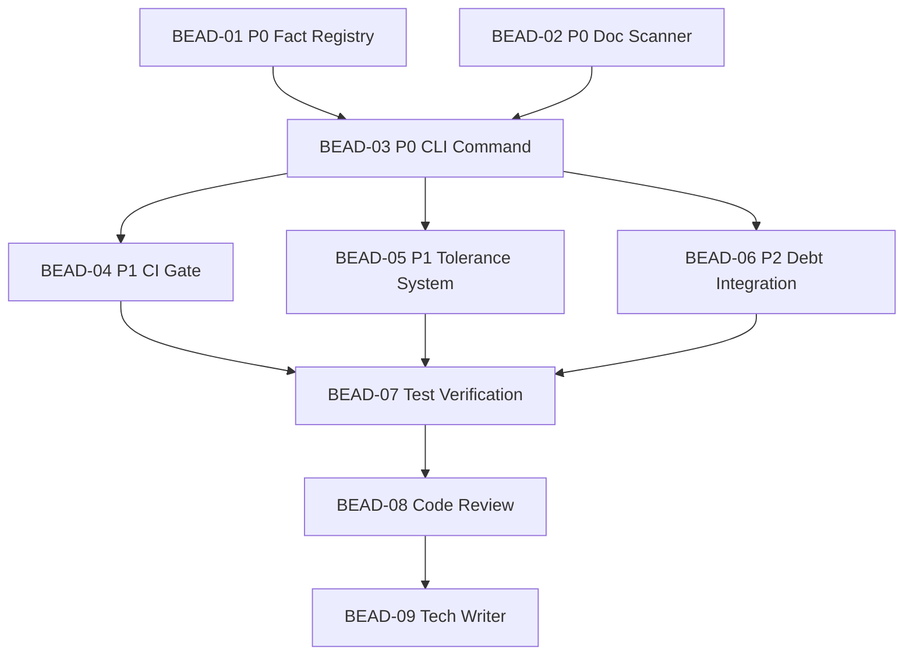

# PLAN: BDL-026 — Documentation Audit (Phase 12.11)

> **Status:** Approved
> **Created:** 2026-02-20

---

## Epic Description

Implement `beadloom docs audit` — zero-config meta-doc staleness detection. Six development beads covering fact registry, doc scanner, CLI command, CI gate, tolerance system, and debt report integration. Plus test, review, and tech-writer beads.

## Dependency DAG

**Critical path:** BEAD-01 + BEAD-02 (parallel) -> BEAD-03 -> BEAD-04/05/06 -> BEAD-07 -> BEAD-08 -> BEAD-09

## Waves

| Wave | Beads | Agents | Notes |
|------|-------|--------|-------|
| Wave 1 | BEAD-01, BEAD-02 | 2x /dev (parallel) | Independent: fact registry + doc scanner |
| Wave 2 | BEAD-03 | 1x /dev | CLI command (depends on Wave 1) |
| Wave 3 | BEAD-04, BEAD-05, BEAD-06 | 3x /dev (parallel) | CI gate + tolerance + debt (all depend on BEAD-03) |
| Wave 4 | BEAD-07 | 1x /test | Test verification (depends on all dev beads) |
| Wave 5 | BEAD-08 | 1x /review | Code review (depends on test bead) |
| Wave 6 | BEAD-09 | 1x /tech-writer | Documentation update (depends on review bead) |

## Beads

| ID | Name | Priority | Depends On | Status |
|----|------|----------|------------|--------|
| BEAD-01 | Fact Registry | P0 | - | Pending |
| BEAD-02 | Doc Scanner | P0 | - | Pending |
| BEAD-03 | CLI Command (`docs audit`) | P0 | 01, 02 | Pending |
| BEAD-04 | CI Gate (`--fail-if`) | P1 | 03 | Pending |
| BEAD-05 | Tolerance System | P1 | 03 | Pending |
| BEAD-06 | Debt Report Integration | P2 | 03 | Pending |
| BEAD-07 | Test Verification | P0 | 04, 05, 06 | Pending |
| BEAD-08 | Code Review | P0 | 07 | Pending |
| BEAD-09 | Tech Writer | P0 | 08 | Pending |

## Bead Details

### BEAD-01: Fact Registry

**Priority:** P0
**Depends on:** —
**Blocks:** BEAD-03

**What to do:**
Create `FactRegistry` class in `src/beadloom/doc_sync/audit.py`. Auto-compute ground truth facts from:
- Manifest parsing (version from pyproject.toml / package.json / Cargo.toml / go.mod)
- Graph DB queries (node_count, edge_count, language_count, test_count, framework_count)
- MCP tool count, CLI command count (introspection)
- Extensible via `config.yml` `docs_audit.extra_facts`

Data classes: `Fact(name, value, source)`.

**Done when:**
- [ ] `FactRegistry.collect()` returns dict of facts from all sources
- [ ] Manifest parsing works for pyproject.toml (primary), graceful fallback for others
- [ ] Graph DB queries return correct counts
- [ ] Extra facts from config.yml are supported
- [ ] Unit tests for all fact sources + edge cases (missing manifest, empty DB)
- [ ] `# beadloom:feature=docs-audit` annotation in module header

### BEAD-02: Doc Scanner

**Priority:** P0
**Depends on:** —
**Blocks:** BEAD-03

**What to do:**
Create `DocScanner` class in `src/beadloom/doc_sync/audit.py`. Scan markdown files, extract numeric mentions, match to facts via keyword proximity.

- Built-in keyword associations per fact type
- Proximity window: 5 words before/after number
- Version string regex: `v?\d+\.\d+\.\d+`
- False positive filters: dates, issue IDs, code blocks, hex colors, version pinning, line numbers, changelog
- Default scan paths: `*.md`, `docs/**/*.md`, `.beadloom/*.md`

Data classes: `Mention(fact_name, value, file, line, context)`.

**Done when:**
- [ ] `DocScanner.scan()` extracts mentions from markdown files
- [ ] Keyword proximity matching works with 5-word window
- [ ] Version string detection via regex
- [ ] All false positive filters implemented and tested
- [ ] Code blocks (fenced) are skipped
- [ ] CHANGELOG.md excluded by default
- [ ] Unit tests for matching, filtering, edge cases

### BEAD-03: CLI Command (`docs audit`)

**Priority:** P0
**Depends on:** BEAD-01, BEAD-02
**Blocks:** BEAD-04, BEAD-05, BEAD-06

**What to do:**
Add `@docs.command("audit")` to `services/cli.py`. Wire up FactRegistry + DocScanner + comparator. Human-readable Rich output with color-coded sections. `--json` flag.

- `compare_facts()` function: compare mentions vs ground truth
- `AuditFinding(mention, fact, status, tolerance)` data class
- `AuditResult(facts, findings, unmatched)` data class
- Rich output: Ground Truth table, Stale Mentions (red), Fresh (green), Unmatched (dim)
- `--json` output for scripting
- `--stale-only`, `--verbose`, `--path` options
- Experimental marker in output header

**Done when:**
- [ ] `beadloom docs audit` works zero-config
- [ ] Rich output with stale/fresh/unmatched sections
- [ ] `--json` returns structured JSON
- [ ] `--stale-only` and `--verbose` filter output
- [ ] `--path` overrides default scan paths
- [ ] Experimental marker shown in output
- [ ] Integration test with real project structure

### BEAD-04: CI Gate (`--fail-if`)

**Priority:** P1
**Depends on:** BEAD-03
**Blocks:** BEAD-07

**What to do:**
Add `--fail-if` option to `docs audit` command. Parse expression like `stale>0`, `stale>5`. Exit non-zero when condition is met.

**Done when:**
- [ ] `--fail-if=stale>0` exits with code 1 when stale mentions found
- [ ] `--fail-if=stale>N` supports custom threshold
- [ ] Clear error message on invalid expression
- [ ] Unit tests for parsing and exit code logic

### BEAD-05: Tolerance System

**Priority:** P1
**Depends on:** BEAD-03
**Blocks:** BEAD-07

**What to do:**
Add configurable per-fact tolerance to comparison logic. Defaults: exact for versions, +/-5% for test counts, +/-10% for growing metrics. Overridable in `config.yml`.

**Done when:**
- [ ] Built-in tolerance defaults applied during comparison
- [ ] `config.yml` `docs_audit.tolerances` section overrides defaults
- [ ] Tolerance shown in Rich output (e.g., "1657 ~ 1720 (tolerance: +/-5%)")
- [ ] Unit tests for tolerance application + config override

### BEAD-06: Debt Report Integration

**Priority:** P2
**Depends on:** BEAD-03
**Blocks:** BEAD-07

**What to do:**
Add `meta_doc_staleness` category to debt report. Add `meta_doc_stale_count` to `DebtData`. Add weight to `DebtWeights`. Update `compute_debt_score()`.

**Done when:**
- [ ] `DebtData` has `meta_doc_stale_count` field
- [ ] `DebtWeights` has `meta_doc_stale` weight (default 1.5)
- [ ] `compute_debt_score()` includes new category
- [ ] `beadloom status --debt-report` shows meta-doc staleness
- [ ] Unit tests for new category scoring

### BEAD-07: Test Verification

**Priority:** P0
**Depends on:** BEAD-04, BEAD-05, BEAD-06
**Blocks:** BEAD-08

**What to do:**
/test agent verifies all tests pass, coverage >= 80% for new code, edge cases covered. Run full suite.

**Done when:**
- [ ] `uv run pytest` — all tests pass
- [ ] Coverage >= 80% for `doc_sync/audit.py`
- [ ] Edge cases: empty project, no markdown files, malformed config
- [ ] Integration test: end-to-end audit on test fixture

### BEAD-08: Code Review

**Priority:** P0
**Depends on:** BEAD-07
**Blocks:** BEAD-09

**What to do:**
/review agent performs code review. Check quality, patterns, security, typing.

**Done when:**
- [ ] Code review completed
- [ ] All findings addressed or documented
- [ ] `ruff check`, `mypy --strict` clean

### BEAD-09: Tech Writer

**Priority:** P0
**Depends on:** BEAD-08
**Blocks:** —

**What to do:**
/tech-writer agent updates documentation:
- Add `docs-audit` feature node SPEC.md
- Update domain README for doc-sync
- Update AGENTS.md if needed
- Run `beadloom sync-check` to verify freshness

**Done when:**
- [ ] Feature SPEC.md created
- [ ] Domain docs updated
- [ ] `beadloom sync-check` clean
- [ ] `beadloom doctor` clean
