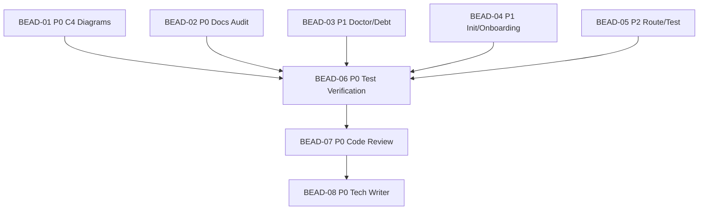

# PLAN: BDL-027 — UX Issues Batch Fix (Phase 12.12)

> **Status:** Approved
> **Created:** 2026-02-20

---

## Epic Description

Fix all 15 open UX issues from BDL-UX-Issues.md. Five independent domain areas developed in parallel, followed by test verification, code review, and documentation update.

## Dependency DAG

**Critical path:** BEAD-01/02/03/04/05 (parallel) -> BEAD-06 -> BEAD-07 -> BEAD-08

## Waves

| Wave | Beads | Agents | Notes |
|------|-------|--------|-------|
| Wave 1 | BEAD-01, BEAD-02, BEAD-03, BEAD-04, BEAD-05 | 5x /dev (parallel) | All 5 areas independent |
| Wave 2 | BEAD-06 | 1x /test | Test verification |
| Wave 3 | BEAD-07 | 1x /review | Code review |
| Wave 4 | BEAD-08 | 1x /tech-writer | Documentation |

## Beads

| ID | Name | Priority | Depends On | Status |
|----|------|----------|------------|--------|
| BEAD-01 | C4 Diagram Fixes | P0 | - | Pending |
| BEAD-02 | Docs Audit FP Reduction | P0 | - | Pending |
| BEAD-03 | Doctor/Debt Report Fixes | P1 | - | Pending |
| BEAD-04 | Init/Onboarding Fixes | P1 | - | Pending |
| BEAD-05 | Route/Test Context Fixes | P2 | - | Pending |
| BEAD-06 | Test Verification | P0 | 01,02,03,04,05 | Pending |
| BEAD-07 | Code Review | P0 | 06 | Pending |
| BEAD-08 | Tech Writer | P0 | 07 | Pending |

## Bead Details

### BEAD-01: C4 Diagram Fixes

**Priority:** P0
**Depends on:** —
**Blocks:** BEAD-06
**Issues:** #41, #42, #43, #44, #45

**What to do:**
Fix 5 C4 diagram issues in `graph/c4.py`:
1. `_compute_depths()`: Filter self-referencing edges (`if child != par`) before computing roots
2. `_build_c4_node()`: Generate label from ref_id (title-case, hyphen-to-space); keep summary as description
3. `_load_edges()`: Skip self-referencing `part_of` entries
4. Boundary rendering: Sort orphan boundaries root-first, then alphabetical
5. PlantUML include: Select `C4_Context.puml` / `C4_Container.puml` / `C4_Component.puml` based on `--level` flag

**Done when:**
- [ ] All 5 C4 issues fixed with tests
- [ ] `beadloom graph --format=c4-plantuml` renders correct element types
- [ ] `ruff check`, `mypy` clean

### BEAD-02: Docs Audit FP Reduction

**Priority:** P0
**Depends on:** —
**Blocks:** BEAD-06
**Issues:** #52, #53, #54, #55, #56, #57

**What to do:**
Fix 6 docs audit issues across `doc_sync/scanner.py`, `doc_sync/audit.py`, `services/cli.py`:
1. Scanner: Skip numbers < 10 for count facts (not version)
2. Scanner: Add standalone year regex `\b20[0-9]{2}\b` to false positive filters
3. Scanner: Add `_graph/features/*/SPEC.md` to default exclude + `docs_audit.exclude_paths` config
4. CLI: Label test_count as "(symbols)" in output
5. CLI: Show relative path from project root instead of basename
6. FactRegistry: Detect dynamic versioning (Hatch `[tool.hatch.version]`); fallback to `importlib.metadata.version()`

**Done when:**
- [ ] All 6 docs audit issues fixed with tests
- [ ] FP rate < 20% on beadloom project (dogfood verify)
- [ ] `ruff check`, `mypy` clean

### BEAD-03: Doctor/Debt Report Fixes

**Priority:** P1
**Depends on:** —
**Blocks:** BEAD-06
**Issues:** #38, #39, #40

**What to do:**
Fix 3 issues in `infrastructure/doctor.py` and `infrastructure/debt_report.py`:
1. Doctor: Change `Severity.INFO` to `Severity.WARNING` in `_check_nodes_without_docs()`
2. Debt: Return `(count, ref_ids)` from `_count_untracked()` and list them in output
3. Debt: In `_count_oversized()`, exclude symbol paths claimed by child nodes

**Done when:**
- [ ] All 3 issues fixed with tests
- [ ] `beadloom doctor` shows `[warn]` for undocumented nodes
- [ ] `beadloom status --debt-report` lists untracked nodes and shows 0 oversized false positives
- [ ] `ruff check`, `mypy` clean

### BEAD-04: Init/Onboarding Fixes

**Priority:** P1
**Depends on:** —
**Blocks:** BEAD-06
**Issues:** #32, #33, #34

**What to do:**
Fix 3 issues in `onboarding/scanner.py` and `services/cli.py`:
1. Scanner: Add React Native dirs to `_SOURCE_DIRS` (`components`, `hooks`, `contexts`, `modules`, `screens`, `navigation`, `store`, `assets`)
2. CLI: Add `--mode`, `--yes`/`--non-interactive`, `--force` flags to `init` command
3. Scanner: Verify `service-needs-parent` rule is already removed (explore found it may be); if still generated, fix

**Done when:**
- [ ] All 3 issues fixed with tests
- [ ] `beadloom init --mode bootstrap --yes` works non-interactively
- [ ] `ruff check`, `mypy` clean

### BEAD-05: Route/Test Context Fixes

**Priority:** P2
**Depends on:** —
**Blocks:** BEAD-06
**Issues:** #26, #29, #30

**What to do:**
Fix 3 issues in `context_oracle/route_extractor.py` and `context_oracle/test_mapper.py`:
1. Test mapper: Aggregate test mappings at domain level by summing child node test counts
2. Route extractor: Add self-exclusion (skip `route_extractor.py` own package files during extraction)
3. Route extractor: Improve formatting — wider path column, separate GraphQL section

**Done when:**
- [ ] All 3 issues fixed with tests
- [ ] `beadloom ctx context-oracle` shows aggregated test count
- [ ] `beadloom docs polish` shows no self-matching routes
- [ ] `ruff check`, `mypy` clean

### BEAD-06: Test Verification

**Priority:** P0
**Depends on:** BEAD-01, BEAD-02, BEAD-03, BEAD-04, BEAD-05
**Blocks:** BEAD-07

**What to do:**
/test agent verifies all tests pass, coverage >= 80% for changed modules, edge cases covered.

**Done when:**
- [ ] `uv run pytest` — all tests pass
- [ ] Coverage >= 80% for changed files
- [ ] Edge cases added for new filters/logic

### BEAD-07: Code Review

**Priority:** P0
**Depends on:** BEAD-06
**Blocks:** BEAD-08

**What to do:**
/review agent performs code review across all 5 areas.

**Done when:**
- [ ] Code review completed, all findings addressed
- [ ] `ruff check`, `mypy --strict` clean

### BEAD-08: Tech Writer

**Priority:** P0
**Depends on:** BEAD-07

**What to do:**
/tech-writer agent updates documentation:
- Update BDL-UX-Issues.md — mark all 15 issues as FIXED
- Update domain docs if sync-check reports stale
- Run `beadloom sync-check` + `beadloom doctor` to verify

**Done when:**
- [ ] All 15 issues marked FIXED in BDL-UX-Issues.md
- [ ] `beadloom sync-check` clean
- [ ] `beadloom doctor` clean
