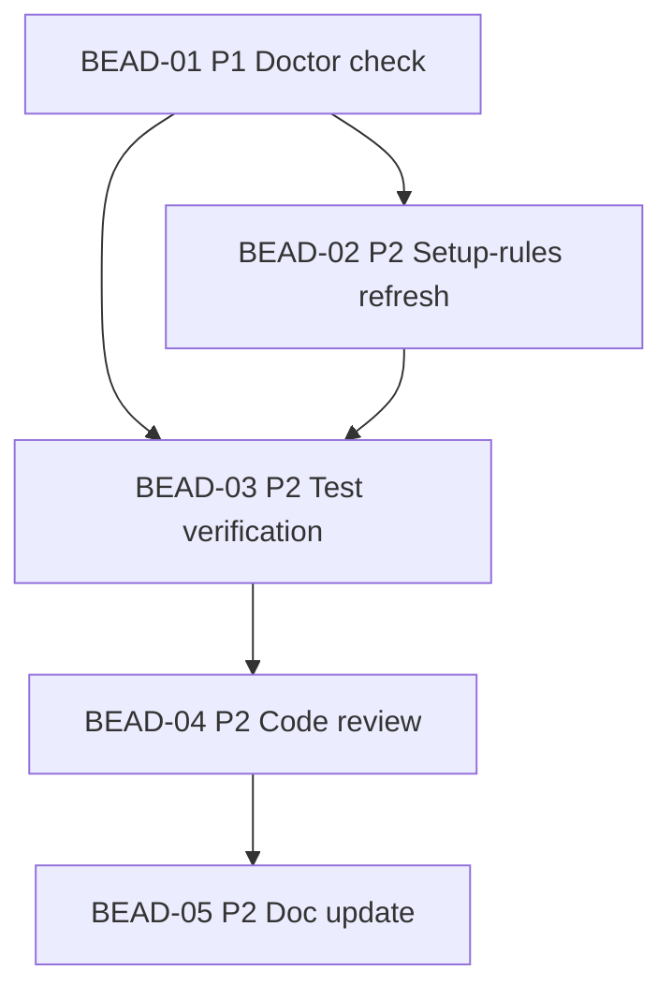

# PLAN: BDL-030 — Agent Instructions Freshness

> **Status:** Approved
> **Created:** 2026-02-21

---

## Epic Description

Add automated detection and auto-fix of stale facts in CLAUDE.md and AGENTS.md. Two-task delivery: doctor check (detection) then setup-rules --refresh (auto-fix).

## Dependency DAG

**Critical path:** BEAD-01 -> BEAD-02 -> BEAD-03 -> BEAD-04 -> BEAD-05

## Beads

| ID | Name | Priority | Agent | Depends On | Status |
|----|------|----------|-------|------------|--------|
| BEAD-01 | Agent instructions doctor check | P1 | /dev | - | Pending |
| BEAD-02 | Setup-rules --refresh + CLAUDE.md markers | P2 | /dev | 01 | Pending |
| BEAD-03 | Test verification | P2 | /test | 01, 02 | Pending |
| BEAD-04 | Code review | P2 | /review | 03 | Pending |
| BEAD-05 | BDL-UX-Issues.md + doc update | P2 | /tech-writer | 04 | Pending |

## Bead Details

### BEAD-01: Agent instructions doctor check (12.12.1)

**Priority:** P1
**Agent:** /dev
**Depends on:** —
**Blocks:** BEAD-02, BEAD-03

**What to do:**
Add `_check_agent_instructions(project_root: Path) -> list[Check]` to `infrastructure/doctor.py`:
- Read CLAUDE.md and AGENTS.md from project root (`.claude/CLAUDE.md`, `.beadloom/AGENTS.md`)
- Extract factual claims via regex: version, architecture packages, CLI command count, MCP tool count
- Compare with actual state: `__version__`, `main.commands`, `len(_TOOLS)`, directory scan
- Return `list[Check]` with `Severity.WARNING` for drift, `Severity.OK` for match
- Wire into existing `run_checks()` flow (needs `project_root` param added)
- Update CLI `doctor` command to pass `project_root`

Fact extraction helpers:
- `_extract_version_claim(text: str) -> str | None`
- `_extract_package_claims(text: str) -> set[str]`
- `_get_actual_version() -> str`
- `_get_actual_cli_commands() -> set[str]`
- `_get_actual_mcp_tool_count() -> int`
- `_get_actual_packages(project_root: Path) -> set[str]`

**Done when:**
- [ ] `beadloom doctor` outputs "Agent Instructions" section with drift/OK results
- [ ] At least 6 fact types checked (version, packages, CLI count, MCP count, stack, test framework)
- [ ] Tests: >=8 tests covering extraction, comparison, and integration
- [ ] ruff + mypy clean

### BEAD-02: Setup-rules --refresh + CLAUDE.md markers (12.12.2)

**Priority:** P2
**Agent:** /dev
**Depends on:** BEAD-01
**Blocks:** BEAD-03

**What to do:**
Add `refresh_claude_md(project_root: Path, *, dry_run: bool = False) -> list[str]` to `onboarding/scanner.py`:
- Parse `<!-- beadloom:auto-start SECTION -->` / `<!-- beadloom:auto-end -->` marker pairs
- Regenerate content between markers using fact sources from BEAD-01
- Preserve all content outside markers
- If no markers found and section 0.1 pattern detected, auto-insert markers
- Return list of changed section names

CLI changes:
- Add `--refresh` flag to `setup-rules` command
- Add `--dry-run` flag (only with `--refresh`)
- `--refresh` calls `refresh_claude_md()` + existing `generate_agents_md()`

Update `.claude/CLAUDE.md`:
- Add `<!-- beadloom:auto-start project-info -->` / `<!-- beadloom:auto-end -->` around section 0.1 dynamic facts (version, stack, architecture, phases)

**Done when:**
- [ ] `beadloom setup-rules --refresh` updates CLAUDE.md dynamic sections
- [ ] `--dry-run` shows changes without modifying
- [ ] Markers auto-inserted on first run if section 0.1 detected
- [ ] Policy sections fully preserved
- [ ] Tests: >=8 tests covering marker parsing, refresh, dry-run, auto-insert
- [ ] ruff + mypy clean

### BEAD-03: Test verification

**Priority:** P2
**Agent:** /test
**Depends on:** BEAD-01, BEAD-02
**Blocks:** BEAD-04

**What to do:**
- Run full test suite, verify all pass
- Verify coverage >= 80%
- Run regression tests for existing doctor and setup-rules functionality
- Verify beadloom reindex + sync-check + lint --strict all clean

**Done when:**
- [ ] All tests pass
- [ ] Coverage >= 80%
- [ ] beadloom validation clean

### BEAD-04: Code review

**Priority:** P2
**Agent:** /review
**Depends on:** BEAD-03
**Blocks:** BEAD-05

**What to do:**
- Review BEAD-01 and BEAD-02 code changes
- Check: type safety, error handling, edge cases, test coverage
- Verify no anti-patterns from CLAUDE.md section 7

**Done when:**
- [ ] Review = OK or issues fixed

### BEAD-05: BDL-UX-Issues.md + doc update

**Priority:** P2
**Agent:** /tech-writer
**Depends on:** BEAD-04
**Blocks:** —

**What to do:**
- Update BDL-UX-Issues.md with any UX issues found during dogfooding
- Update CHANGELOG.md if needed
- Run beadloom sync-check, fix any stale docs

**Done when:**
- [ ] BDL-UX-Issues.md updated
- [ ] beadloom sync-check clean

## Waves

### Wave 1 (dev) — BEAD-01
Single dev bead, no parallelism (BEAD-02 depends on BEAD-01).

### Wave 2 (dev) — BEAD-02
After BEAD-01 completes. Single dev bead.

### Wave 3 (test + review) — BEAD-03 then BEAD-04
Sequential: test verification, then code review.

### Wave 4 (tech-writer) — BEAD-05
After review = OK. Doc updates.
