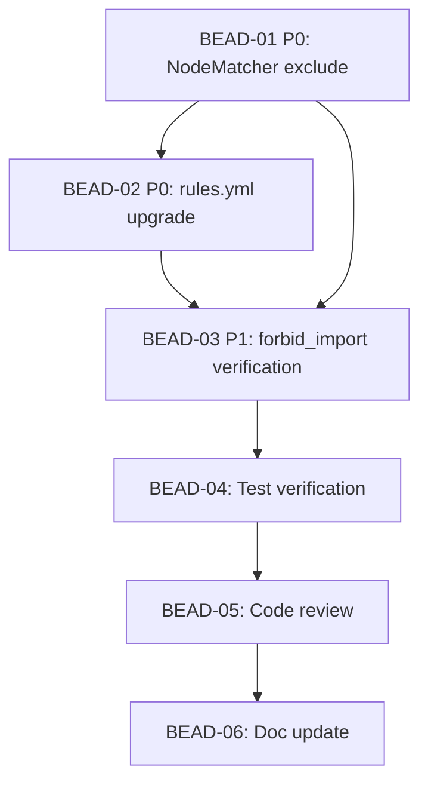

# PLAN: BDL-032 — Enhanced Architecture Rules

> **Status:** Approved
> **Created:** 2026-02-21

---

## Epic Description

Add `exclude` filter to NodeMatcher, upgrade rules.yml to v3 with all 7 rule types, making beadloom a comprehensive dogfood project for its AAC system.

## Dependency DAG

**Critical path:** BEAD-01 → BEAD-02 → BEAD-03 → BEAD-04 → BEAD-05 → BEAD-06

## Beads

| ID | Name | Priority | Depends On | Agent | Status |
|----|------|----------|------------|-------|--------|
| BEAD-01 | NodeMatcher exclude filter | P0 | - | /dev | Pending |
| BEAD-02 | rules.yml v3 upgrade | P0 | 01 | /dev | Pending |
| BEAD-03 | forbid_import verification + fix | P1 | 01, 02 | /dev | Pending |
| BEAD-04 | Test verification | P1 | 03 | /test | Pending |
| BEAD-05 | Code review | P2 | 04 | /review | Pending |
| BEAD-06 | Doc update | P2 | 05 | /tech-writer | Pending |

## Bead Details

### BEAD-01: NodeMatcher exclude filter

**Priority:** P0
**Depends on:** -
**Blocks:** BEAD-02, BEAD-03
**Agent:** /dev

**What to do:**
1. Add `exclude: tuple[str, ...] | None = None` field to NodeMatcher frozen dataclass
2. Update `matches()` method: if node's ref_id is in exclude tuple, return False
3. Update `_parse_node_matcher()` to parse `exclude` from YAML (accept string or list, normalize to tuple)
4. Write TDD tests: exclude single ref_id, exclude list, exclude empty, exclude None (backward compat)

**Done when:**
- [ ] NodeMatcher accepts exclude field
- [ ] matches() correctly excludes specified ref_ids
- [ ] YAML parsing works for both string and list formats
- [ ] All existing tests pass + 4+ new tests

### BEAD-02: rules.yml v3 upgrade

**Priority:** P0
**Depends on:** BEAD-01
**Blocks:** BEAD-03
**Agent:** /dev

**What to do:**
1. Upgrade `.beadloom/_graph/rules.yml` from version 1 to version 3
2. Add tags block: layer-service, layer-domain, layer-infra
3. Fix `service-needs-parent` to use `exclude: [beadloom]`
4. Add new rules: forbid_cycles, layer (warn), cardinality (warn)
5. Run `beadloom lint --strict` to verify 0 violations (errors)
6. Run `beadloom lint` to see warnings from layer/cardinality

**Done when:**
- [ ] rules.yml version 3 with tags
- [ ] service-needs-parent uses exclude filter
- [ ] forbid_cycles rule added for depends_on
- [ ] layer rule added with severity: warn
- [ ] cardinality rule added with severity: warn
- [ ] `beadloom lint --strict` passes (0 errors)

### BEAD-03: forbid_import verification + fix

**Priority:** P1
**Depends on:** BEAD-01, BEAD-02
**Blocks:** BEAD-04
**Agent:** /dev

**What to do:**
1. Add `forbid_import` rules to rules.yml: tui→infrastructure, onboarding→infrastructure
2. Run `beadloom reindex` then `beadloom lint --strict`
3. If violations found: either fix imports (if they're real boundary violations) or adjust glob patterns
4. Ensure all 9 rules pass lint

**Done when:**
- [ ] 2 forbid_import rules in rules.yml
- [ ] `beadloom lint --strict` passes with all 9 rules
- [ ] Any real boundary violations fixed or documented

### BEAD-04: Test verification

**Priority:** P1
**Depends on:** BEAD-03
**Agent:** /test

**What to do:**
1. Run full test suite: `uv run pytest`
2. Verify exclude filter tests exist and pass
3. Run `beadloom lint --strict` — 0 violations
4. Run `beadloom sync-check` — no stale docs
5. Run ruff + mypy checks

**Done when:**
- [ ] All tests pass
- [ ] ruff check clean
- [ ] mypy clean
- [ ] beadloom validation clean

### BEAD-05: Code review

**Priority:** P2
**Depends on:** BEAD-04
**Agent:** /review

**What to do:**
1. Review NodeMatcher changes for correctness and backward compatibility
2. Review rules.yml for completeness and correctness
3. Review any import fixes from BEAD-03
4. Verify all acceptance criteria from PRD

**Done when:**
- [ ] Review = OK or issues identified for fix cycle

### BEAD-06: Doc update

**Priority:** P2
**Depends on:** BEAD-05
**Agent:** /tech-writer

**What to do:**
1. Update AGENTS.md if rule count changed
2. Run `beadloom docs audit` — check for stale rule counts
3. Update BDL-UX-Issues.md with any UX feedback collected during implementation
4. Run `beadloom sync-check` to verify freshness

**Done when:**
- [ ] Documentation up to date
- [ ] UX feedback logged
- [ ] sync-check clean
