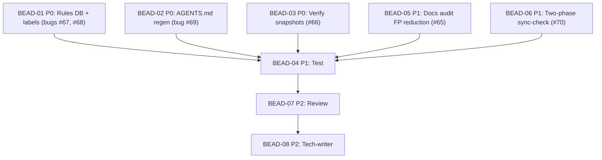

# PLAN: BDL-034 — UX Issues & Improvements Batch Fix

> **Status:** Approved
> **Created:** 2026-03-10

---

## Epic Description

Fix 3 bugs and 3 improvements from BDL-UX-Issues.md (#65-#70). Organized into dev beads by domain, followed by test, review, and tech-writer beads.

## Dependency DAG

**Critical path:** BEAD-01/02/03/05/06 (parallel) -> BEAD-04 -> BEAD-07 -> BEAD-08

## Beads

| ID | Name | Type | Priority | Depends On | Status |
|----|------|------|----------|------------|--------|
| BEAD-01 | Rules DB + type labels (#67, #68) | dev | P0 | - | Pending |
| BEAD-02 | AGENTS.md regen fix (#69) | dev | P0 | - | Pending |
| BEAD-03 | Verify snapshot diffing (#66) | dev | P0 | - | Pending |
| BEAD-05 | Docs audit FP reduction (#65) | dev | P1 | - | Pending |
| BEAD-06 | Two-phase sync-check (#70) | dev | P1 | - | Pending |
| BEAD-04 | Test verification | test | P1 | 01,02,03,05,06 | Pending |
| BEAD-07 | Code review | review | P2 | 04 | Pending |
| BEAD-08 | Documentation update | tech-writer | P2 | 07 | Pending |

## Waves

### Wave 1 — Dev (parallel, 5 agents)
- Agent-1: BEAD-01 (`/dev`) — Fix `_load_rules_into_db` + `_build_rules_section` + `_read_rules_data`
- Agent-2: BEAD-02 (`/dev`) — Fix `generate_agents_md` custom section preservation
- Agent-3: BEAD-03 (`/dev`) — Verify existing snapshot compare; close or patch
- Agent-4: BEAD-05 (`/dev`) — Implement 3-layer FP reduction in docs audit
- Agent-5: BEAD-06 (`/dev`) — Schema migration + two-phase sync logic

### Wave 2 — Test
- Agent: BEAD-04 (`/test`) — Verify all fixes, add missing test coverage

### Wave 3 — Review
- Agent: BEAD-07 (`/review`) — Code review all changes

### Wave 4 — Docs
- Agent: BEAD-08 (`/tech-writer`) — Update docs, close UX issues

## Bead Details

### BEAD-01: Rules DB + type labels (#67, #68)

**Priority:** P0
**Depends on:** —
**Blocks:** BEAD-04

**What to do:**
1. In `reindex.py:_load_rules_into_db()`: add generic serialization for 5 new v3 rule types (ForbidCyclesRule, LayerRule, CardinalityRule, ForbidImportRule, ForbidEdgeRule). Use class name as type, `vars(rule)` or structured dict for JSON.
2. In `scanner.py:_build_rules_section()` (line 985): replace binary `"require" if "require" in rule else "deny"` with `_detect_rule_type()` checking all 7 YAML keys.
3. In `scanner.py:_read_rules_data()` (line 1051): same fix as above.
4. Write tests verifying 9 rules in DB and correct labels.

**Done when:**
- [ ] `SELECT COUNT(*) FROM rules` returns 9 after reindex with v3 rules.yml
- [ ] `docs audit` reports `rule_type_count: 9`
- [ ] AGENTS.md and `beadloom prime` show correct type for all rules
- [ ] Tests pass

### BEAD-02: AGENTS.md regeneration fix (#69)

**Priority:** P0
**Depends on:** —
**Blocks:** BEAD-04

**What to do:**
1. Replace `## Custom` marker with HTML comment markers: `<!-- beadloom:custom-start -->` / `<!-- beadloom:custom-end -->`
2. Update template `_AGENTS_MD_TEMPLATE_V2` to use new markers
3. Update preservation logic in `generate_agents_md()` (lines 1005-1030) to extract between markers
4. Add backward-compatibility: if old `## Custom` found, migrate to new markers
5. Write tests: regeneration is idempotent, custom content preserved, old format migrated

**Done when:**
- [ ] Regeneration with custom content produces clean output (no duplication)
- [ ] Running `setup-rules --refresh` twice produces identical output
- [ ] Old-format files are migrated on first regeneration
- [ ] Tests pass

### BEAD-03: Verify snapshot diffing (#66)

**Priority:** P0
**Depends on:** —
**Blocks:** BEAD-04

**What to do:**
1. Verify existing `snapshot compare` CLI command works correctly
2. Test `snapshot save`, `snapshot list`, `snapshot compare` end-to-end
3. If working: close issue #66 as already resolved
4. If gaps: patch and test

**Done when:**
- [ ] `beadloom snapshot save --label "test-a"` works
- [ ] `beadloom snapshot list` shows saved snapshots
- [ ] `beadloom snapshot compare <id-a> <id-b>` shows correct diff
- [ ] Issue #66 status determined

### BEAD-05: Docs audit FP reduction (#65)

**Priority:** P1
**Depends on:** —
**Blocks:** BEAD-04

**What to do:**
1. **Layer 1 — Blocklist modifiers:** Add `_FP_MODIFIERS` set. In `_extract_number_mentions()`, check +-3 tokens around matched number for modifiers. Skip if found.
2. **Layer 2 — Proximity scoring:** Weight match confidence by distance to fact-type keywords. Low confidence → skip.
3. **Layer 3 — File-type heuristics:** Add `_LOW_CONFIDENCE_PATHS` and `_HIGH_CONFIDENCE_PATHS`. Apply confidence multiplier.
4. Write tests with known FP examples from beadloom itself.
5. Run `docs audit` on beadloom, measure FP rate.

**Done when:**
- [ ] FP rate <15% on beadloom project (was ~60%)
- [ ] Threshold numbers (>=, %, up to) not flagged
- [ ] Year values not flagged
- [ ] Tests pass

### BEAD-06: Two-phase sync-check (#70)

**Priority:** P1
**Depends on:** —
**Blocks:** BEAD-04

**What to do:**
1. **Schema migration:** Add `doc_hash_at_last_edit TEXT DEFAULT ''` to `sync_state` table in `db.py`. Use `ALTER TABLE ADD COLUMN` in `_ensure_schema()`.
2. **Reindex logic:** In `_build_initial_sync_state()`, set `code_hash_at_sync` but do NOT reset `doc_hash_at_last_edit`.
3. **sync-check logic:** In `check_sync()`, if `doc_hash_at_last_edit` is set, compare code changes since last doc edit. If code changed → stale.
4. **Doc edit detection:** When sync-check detects doc hash changed, update `doc_hash_at_last_edit`.
5. Write tests for all state transitions.

**Done when:**
- [ ] `reindex` does not mask stale docs
- [ ] `sync-check` reports stale when code changed but doc didn't
- [ ] Backward-compatible with existing DBs (empty column = legacy behavior)
- [ ] Schema migration runs automatically
- [ ] Tests pass

### BEAD-04: Test verification

**Priority:** P1
**Depends on:** BEAD-01, BEAD-02, BEAD-03, BEAD-05, BEAD-06
**Blocks:** BEAD-07

**What to do:**
1. Run full test suite: `uv run pytest`
2. Verify test coverage for all 6 fixes
3. Add integration tests if missing
4. Run `beadloom reindex && beadloom sync-check && beadloom lint --strict`

**Done when:**
- [ ] All tests pass
- [ ] Coverage >= 80% for changed files
- [ ] Beadloom validation passes

### BEAD-07: Code review

**Priority:** P2
**Depends on:** BEAD-04
**Blocks:** BEAD-08

**What to do:**
1. Review all changes from BEAD-01 through BEAD-06
2. Check code quality, patterns, edge cases
3. Verify no regressions
4. Return OK or ISSUES

**Done when:**
- [ ] All changes reviewed
- [ ] No blocking issues
- [ ] Review verdict: OK

### BEAD-08: Documentation update

**Priority:** P2
**Depends on:** BEAD-07
**Blocks:** —

**What to do:**
1. Update domain docs for changed files
2. Move issues #65-#70 to "Closed" in BDL-UX-Issues.md
3. Update CHANGELOG.md for v1.9.0
4. Run `beadloom sync-check` to verify

**Done when:**
- [ ] All domain docs updated
- [ ] UX issues moved to Closed
- [ ] `beadloom sync-check` passes
- [ ] `beadloom doctor` clean
