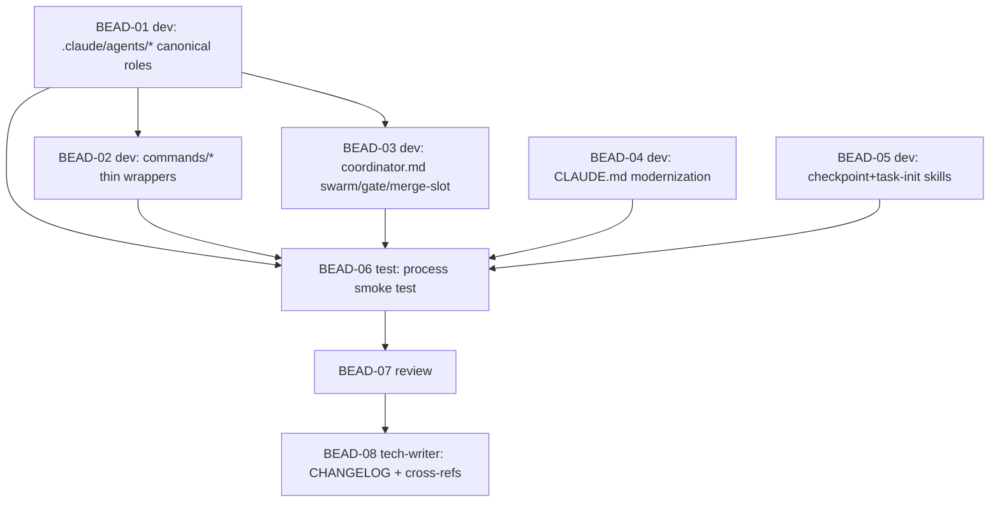

# PLAN: BDL-035 — Multi-Agent Process Modernization

> **Status:** Approved
> **Created:** 2026-05-29

---

## Epic Description

Modernize `.claude/CLAUDE.md`, `.claude/commands/*`, and add `.claude/agents/*` so the multi-agent process maximally uses Beads 1.0.4, current Claude Code, skills, and Beadloom dogfooding. Roles become canonical subagents in `.claude/agents/*`; the coordinator orchestrates via native `bd swarm`/`gate`/`merge-slot`.

## Dependency DAG

**Critical path:** BEAD-01 → BEAD-03 → BEAD-06 → BEAD-07 → BEAD-08

## Beads

| ID | Name | Role | Priority | Depends On |
|----|------|------|----------|------------|
| BEAD-01 | `.claude/agents/*` — 4 canonical role subagents | dev | P0 | - |
| BEAD-02 | `commands/{dev,test,review,tech-writer}.md` → thin wrappers | dev | P0 | 01 |
| BEAD-03 | `coordinator.md` rewrite (swarm/gate/merge-slot, Agent tool, /compact reframe, snapshot) | dev | P0 | 01 |
| BEAD-04 | `CLAUDE.md` modernization (setup, bd essentials, beadloom dogfooding) | dev | P0 | - |
| BEAD-05 | `checkpoint.md` + `task-init.md` updates (--session, /compact, `bd create --graph`, beads.role) | dev | P1 | - |
| BEAD-06 | Process smoke test (verify all command refs + dry-run coordinator primitives) | test | P0 | 01,02,03,04,05 |
| BEAD-07 | Review all changes (correctness, coherence, no stale refs, single-source) | review | P0 | 06 |
| BEAD-08 | CHANGELOG + cross-refs (STRATEGY-3 §Phase 0 link, skill index) | tech-writer | P1 | 07 |

## Bead Details

### BEAD-01: `.claude/agents/*` — canonical role subagents (dev)
Create `.claude/agents/{dev,test,review,tech-writer}.md` with frontmatter (`name`, `description`, scoped `tools`, `model: opus`) + the role protocol migrated from current `commands/*`. Fold in role-specific modernizations: `--session`/`CLAUDE_SESSION_ID` + `--suggest-next` on close; `bd ready --claim` (dev); `beadloom diff` (review); `beadloom link` bead↔node (dev); §E honest enforcement note (dev, review).
**Done when:** 4 agent files exist; every `bd`/`beadloom` command verified via `--help`.

### BEAD-02: `commands/*` thin wrappers (dev)
Convert `commands/{dev,test,review,tech-writer}.md` to 3-5 line wrappers: "adopt role X — follow `.claude/agents/X.md`". Verify the Skill-tool path still resolves.
**Done when:** wrappers point to agents; no duplicated protocol.

### BEAD-03: `coordinator.md` rewrite (dev)
First **verify** `bd swarm`/`gate`/`merge-slot` subcommands via `--help`. Then: map waves→`swarm`, review→tech-writer gate + CI waits→`gate`, merge serialization→`merge-slot`; replace `Task(...)`→`Agent(...)`; reframe `/compact` around auto-compaction + file memory; add `beadloom snapshot` per wave. Apply Option C fallback for any rough primitive (labeled honestly).
**Done when:** coordinator uses native primitives + Agent tool; commands verified.

### BEAD-04: `CLAUDE.md` modernization (dev)
Setup section: `git config beads.role maintainer`, `beadloom install-hooks`. bd essentials += swarm/gate/merge-slot, `--session`, `ready --claim`. beadloom essentials += `diff`/`snapshot`/`link`. Reference `.claude/agents/*`. Keep version 1.9.0 accurate.
**Done when:** CLAUDE.md consistent with the new process; commands verified.

### BEAD-05: process skills updates (dev)
`checkpoint.md`: `--session` on close; `/compact` reframe. `task-init.md`: document `bd create --graph <plan.json>` for batch DAG creation; `beads.role` setup reference. (`templates.md` only if a constraint changed.)
**Done when:** both skills updated + verified.

### BEAD-06: process smoke test (test)
(1) Grep every `bd`/`beadloom` command across all changed files and confirm each exists via `--help` (zero stale refs). (2) Dry-run coordinator primitives on a throwaway epic: `bd swarm validate/status`, `bd gate list/check`, `bd merge-slot check`. (3) Confirm `.claude/agents/*` frontmatter is valid and the `Agent` subagent types resolve.
**Done when:** zero broken references; primitives exercise cleanly (or fallbacks documented honestly).

### BEAD-07: review (review)
Review all diffs for correctness, coherence (§E honest, single-source-of-truth no drift, no over-ceremony), and that the process is actually runnable end-to-end.
**Done when:** review = OK (or fix cycle until OK).

### BEAD-08: tech-writer (tech-writer)
Update `CHANGELOG.md` (process modernization entry), ensure CLAUDE.md skill index + STRATEGY-3 §Phase 0 cross-reference are consistent.
**Done when:** docs consistent; sync-check clean for any touched graph docs (N/A if none).

## Waves

- **Wave 1 (parallel, independent):** BEAD-01, BEAD-04, BEAD-05
- **Wave 2 (after BEAD-01):** BEAD-02, BEAD-03
- **Wave 3 (test):** BEAD-06 (after all dev)
- **Wave 4 (review):** BEAD-07 → fix cycle if ISSUES
- **Wave 5 (tech-writer):** BEAD-08

## Execution Note

BDL-035 is executed on the **current** process (the modernized coordinator/agents do not exist yet). Because this is cross-cutting documentation where consistency dominates, execution may run largely single-threaded (or light parallel for the independent Wave 1 files) rather than full background-agent waves — to be decided at kickoff. **Epic 2 (Phase 0 / Beadloom #91) is the first true dogfood of the new multi-agent process.**
