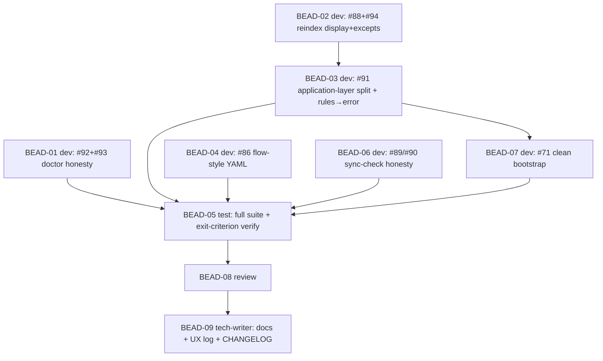

# PLAN: BDL-036 — Phase 0: Foundation / Honesty Gate

> **Status:** Approved
> **Created:** 2026-05-30

---

## Epic Description

Make Beadloom honestly pass its own checks. Wave 1 = cheap independent honesty fixes (fast green doctor). Wave 2 = the #91 `application`-layer split + restore rules to `error`. Wave 3 = remaining honesty fixes (#86 YAML, #89/#90 sync-check, #71 bootstrap). Then test → review → docs.

## Dependency DAG

**Critical path:** BEAD-02 → BEAD-03 (#91) → BEAD-07 → BEAD-05 → BEAD-08 → BEAD-09

## Beads

| ID | Name | Role | Priority | Depends On |
|----|------|------|----------|------------|
| BEAD-01 | #92 doctor version source + #93 MCP tool count | dev | P0 | - |
| BEAD-02 | #88 reindex true totals + #94 narrow excepts | dev | P0 | - |
| BEAD-03 | #91 split `application` layer + restore rules→`error` | dev | P0 | 02 |
| BEAD-04 | #86 flow-style YAML edges (parse or clear error) | dev | P1 | - |
| BEAD-06 | #89/#90 sync-check honesty (investigate → fix or re-scope) | dev | P1 | - |
| BEAD-07 | #71 clean bootstrap out-of-the-box (after rules=error) | dev | P1 | 03 |
| BEAD-05 | full pytest + exit-criterion verification | test | P0 | 01,03,04,06,07 |
| BEAD-08 | review all changes | review | P0 | 05 |
| BEAD-09 | docs + close UX issues + CHANGELOG | tech-writer | P1 | 08 |

## Bead Details

### BEAD-01 — #92 + #93 doctor honesty (dev, P0)
`doctor._get_actual_version()`: use in-tree `__version__` as source of truth (not stale `importlib.metadata`). `generate_agents_md()`: enumerate MCP tools from the live registry; regenerate AGENTS.md.
**Done when:** `beadloom doctor` shows no false version/tool drift on a consistent tree; TDD tests added.

### BEAD-02 — #88 + #94 (dev, P0)
`incremental_reindex`: assign true `nodes_loaded`/`edges_loaded` from live DB totals (mirror `cli.py:274-279`). Narrow `except Exception` (reindex.py:125,863,926) → `sqlite3.OperationalError` for missing-table cases.
**Done when:** incremental reindex prints true totals; narrowed excepts; tests cover both. (Done before #91 so the move starts from a known-honest reindex.)

### BEAD-03 — #91 application-layer split (dev, P0) 🎯 critical
1. Create `src/beadloom/application/`; move `reindex.py`, `doctor.py`, `debt_report.py` (mechanical, preserve APIs).
2. Update imports: `services/{cli,mcp_server}.py` + all tests (`infrastructure.X` → `application.X`).
3. Confirm `infrastructure/` is now domain-agnostic (no domain imports remain).
4. Graph: add `application` node + `layer-application` tag (`services.yml`); insert into `architecture-layers` rule order services→application→domains→infrastructure (`rules.yml`).
5. Restore `no-dependency-cycles` + `architecture-layers` to `severity: error`.
6. `beadloom reindex && lint --strict` → exit 0, zero violations; `beadloom doctor` clean.
**Done when:** lint --strict genuinely green (error-severity); pytest green; merge serialized via merge-slot. Log API CHANGE (module paths).

### BEAD-04 — #86 flow-style YAML (dev, P1)
Reproduce (`- { src: x, dst: y }` → reindex → 0 nodes). Fix `graph/loader.py` to parse flow-style mappings (preferred) or raise a clear line-referenced error. No silent 0-node.
**Done when:** flow-style edges parse OR error clearly; regression test added.

### BEAD-06 — #89/#90 sync-check honesty (dev, P1)
Investigate `doc_sync/engine.py`: why annotated+documented files report `untracked_files` (#89); whether `beadloom:track` markers can be honored (#90a) or must be documented unsupported (#90b). Deliver genuine 100% on a fully-annotated sample, OR an evidence-backed honest re-scope if larger than Phase 0.
**Done when:** sync-check reaches honest green on the sample, or re-scope documented with evidence.

### BEAD-07 — #71 clean bootstrap (dev, P1)
After rules=`error`: ensure `init --bootstrap` produces a graph passing `lint --strict` (fix feature-inside-service vs `feature-needs-domain` mismatch). Verify on a throwaway bootstrap.
**Done when:** fresh bootstrap exits 0 on `lint --strict`.

### BEAD-05 — test (test, P0)
Full `uv run pytest` + coverage ≥ 80%. Verify the **exit criterion** end-to-end: `beadloom doctor && lint --strict && sync-check` honestly green on Beadloom; fresh bootstrap clean. De-brittle (#96) any tests broken by the #91 move (touched modules only).
**Done when:** all green; exit criterion demonstrated.

### BEAD-08 — review (review, P0)
Review for correctness, DDD-layer correctness (no application↔domain cycle reintroduced), no faked green, honest re-scopes. OK / ISSUES.

### BEAD-09 — tech-writer (tech-writer, P1)
Update affected `docs/` (new `application` domain/layer doc, moved modules), close resolved UX issues (#91/#88/#92/#93/#94/#86/#71; #89/#90 per outcome), CHANGELOG entry (this IS package code → real release-worthy change), STRATEGY-3 Phase 0 status.

## Waves

- **Wave 1 (parallel dev):** BEAD-01, BEAD-02, BEAD-04, BEAD-06 (independent honesty fixes)
- **Wave 2 (dev):** BEAD-03 (#91 split — after BEAD-02; serialized via merge-slot)
- **Wave 3 (dev):** BEAD-07 (#71 — after BEAD-03 rules=error)
- **Wave 4 (test):** BEAD-05
- **Wave 5 (review):** BEAD-08 → fix cycle if ISSUES
- **Wave 6 (tech-writer):** BEAD-09

## Execution Note

First real-code dogfood of the BDL-035 process. Parent created as **`--type epic`** to enable `bd swarm` orchestration. Wave 1 beads are genuinely independent → candidates for parallel background subagents (`subagent_type: dev`); BEAD-03 (#91) runs solo (high-risk refactor) with `bd merge-slot`. To be confirmed at kickoff: full parallel swarm vs single-threaded (the #91 move touches many files — single-threaded for BEAD-03 regardless).
