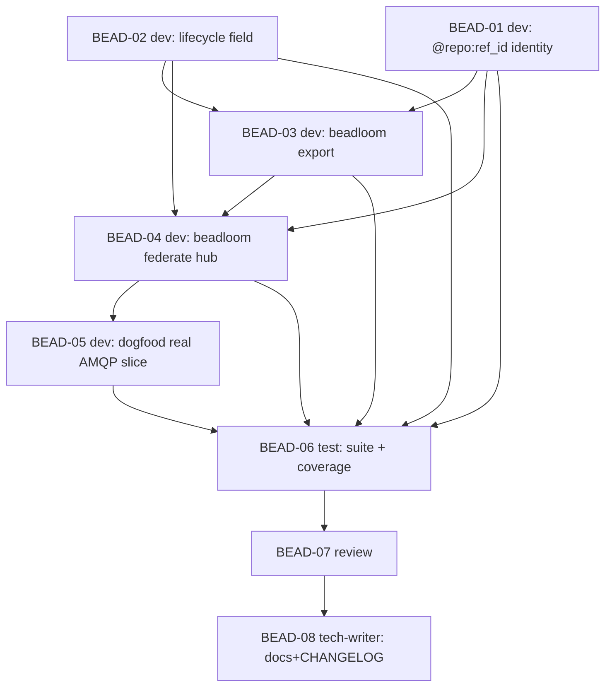

# PLAN: BDL-037 — F1: Federation Foundation

> **Status:** Approved
> **Created:** 2026-06-01

---

## Epic Description

Cross-repo federation thin slice: `@repo:ref_id` identity + `lifecycle` field (foundations) → `beadloom export` artifact → `beadloom federate` hub aggregation (three-valued drift + staleness) → dogfood on the real core-monolith↔integration-service AMQP contract → test → review → docs.

## Dependency DAG

**Critical path:** BEAD-01/02 → BEAD-03 → BEAD-04 → BEAD-05 → BEAD-06 → BEAD-07 → BEAD-08

## Beads

| ID | Name | Role | Priority | Depends On |
|----|------|------|----------|------------|
| BEAD-01 | `@repo:ref_id` cross-repo identity (FederatedRef, loader parse, foreign-edge flag) | dev | P0 | - |
| BEAD-02 | `lifecycle` field on Node/Edge (model + YAML + SQLite migration + rule-engine awareness) | dev | P0 | - |
| BEAD-03 | `beadloom export` — versioned JSON artifact (graph + lifecycle + contract meta) | dev | P0 | 01, 02 |
| BEAD-04 | `beadloom federate` — hub aggregation, resolve @repo, three-valued drift, staleness | dev | P0 | 03 |
| BEAD-05 | Dogfood: scratch federation of real core-monolith↔integration-service AMQP (both-sides) | dev | P1 | 04 |
| BEAD-06 | Test: full suite + exit-criterion + coverage ≥ 80% | test | P0 | 01,02,03,04,05 |
| BEAD-07 | Review (correctness, no scope-creep, no regression, honest re-scopes) | review | P0 | 06 |
| BEAD-08 | Docs (federation domain doc, export/federate CLI) + CHANGELOG + close UX | tech-writer | P1 | 07 |

## Bead Details

### BEAD-01 — `@repo:ref_id` identity (dev, P0)
`FederatedRef(repo: str|None, ref_id)`; parse `@<repo>:<ref_id>` in `graph/loader.py` (local refs unchanged); malformed → `result.errors` (never silent); foreign edge (target non-local) flagged, not error. TDD.
**Done when:** local refs work as before; `@repo:id` parses to FederatedRef; foreign edges flagged; tests cover valid/malformed/foreign.

### BEAD-02 — `lifecycle` field (dev, P0)
Add `lifecycle: active|planned|deprecated|dead` (default `active`) to Node + Edge models, YAML load, additive SQLite column + migration. Rule engine: `planned`/`deprecated` edges not counted as live cycle/layer violations. TDD.
**Done when:** lifecycle loads from YAML + persists; default active = no regression; rule engine lifecycle-aware; migration test green.

### BEAD-03 — `beadloom export` (dev, P0)
New CLI `beadloom export [--out FILE]`. Deterministic JSON (schema_version=1, repo, commit_sha, exported_at, generator, nodes[lifecycle], edges[lifecycle, contract meta]). `repo` from config.yml `repo:` / git remote basename. TDD.
**Done when:** export produces valid deterministic artifact incl. lifecycle + AMQP contract meta; CLI tested.

### BEAD-04 — `beadloom federate` hub (dev, P0)
New CLI `beadloom federate <exports...>` (or hub config). Compose federated graph, resolve `@repo:node`, compute three-valued intent-vs-reality (active+absent=DRIFT, planned+absent=expected, deprecated+present=cleanup, undeclared+present=UNDECLARED), both-sides contract check, per-satellite staleness (commit_sha + age). Output `.beadloom/federated.json` + text report. TDD on synthetic 2-repo fixtures.
**Done when:** ≥2 exports aggregate; @repo resolved; all 5 lifecycle×reality verdicts tested; staleness reported.

### BEAD-05 — Dogfood real AMQP slice (dev, P1)
Hand-curate a tiny `.beadloom/` slice (scratch copies, NOT mutating real repos) for core-monolith + integration-service with the RabbitMQ contract edge (`start_plan_version_upload`/`ensure_plans_folder_path` produces↔consumes + `*_completed`). `export` each, `federate`, verify contract shows confirmed-both-sides. Log friction to `BDL-UX-Issues.md`.
**Done when:** real-slice federation runs; AMQP edge confirmed both-sides; dogfooding notes captured.

### BEAD-06 — Test (test, P0)
Full `uv run pytest` + coverage ≥ 80%. Verify: no single-repo regression (refs/lifecycle defaults), federation unit fixtures, export determinism, all drift verdicts. beadloom lint --strict / doctor green on Beadloom itself.
**Done when:** all green; coverage ≥ 80%; no regression.

### BEAD-07 — Review (review, P0)
Adversarial: correctness of @repo resolution + drift logic; NO scope-creep beyond AMQP/manual/thin; NO regression (default active, local refs); honest re-scopes; security (parameterized SQL, safe_load). OK / ISSUES.

### BEAD-08 — Tech-writer (tech-writer, P1)
New federation domain doc + `export`/`federate` CLI docs; CHANGELOG [Unreleased] F1 entry; update STRATEGY-3 F1 status; close any UX issues raised. sync-check honest for touched docs.

## Waves

- **Wave 1 (parallel dev, foundations):** BEAD-01 (identity), BEAD-02 (lifecycle) — independent.
- **Wave 2 (dev):** BEAD-03 (export) — after 01+02.
- **Wave 3 (dev):** BEAD-04 (federate) — after 03.
- **Wave 4 (dev):** BEAD-05 (dogfood) — after 04 (solo; touches real repo copies).
- **Wave 5 (test):** BEAD-06.
- **Wave 6 (review):** BEAD-07 → fix cycle if ISSUES.
- **Wave 7 (tech-writer):** BEAD-08.

## Execution Note

Parent created as **`--type epic`** (enables `bd swarm`). Wave 1 = genuinely independent foundations → parallel background `dev` subagents. BEAD-04 (federate) is the heaviest/most novel — solo, careful. BEAD-05 (dogfood) solo (scratch real-repo copies; merge-slot for landing). Dogfooding feedback → `BDL-UX-Issues.md` throughout (this epic exercises the new multi-agent process per the user's request).
