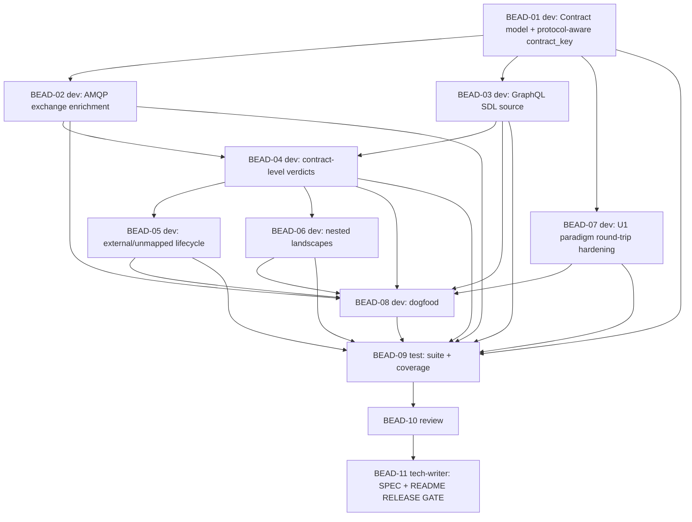

# PLAN: BDL-038 — F2: Cross-Service Contract Graph

> **Status:** Approved
> **Created:** 2026-06-01

---

## Epic Description

Promote the cross-service contract to a first-class, protocol-agnostic, language-neutral contract graph computed at the hub: `Contract` model + protocol-aware `contract_key` (foundation) → AMQP exchange enrichment → GraphQL SDL source (client-as-consumer) → contract-level intent-vs-reality verdicts (incl. GraphQL BREAKING) → `external`/`unmapped` lifecycle → nested landscapes (product vs company) → paradigm-agnostic round-trip hardening → dogfood (live mismatch + Product-B FSD) → test → review → tech-writer (README RELEASE GATE).

## Dependency DAG

**Critical path:** BEAD-01 → BEAD-03 → BEAD-04 → BEAD-06 → BEAD-08 → BEAD-09 → BEAD-10 → BEAD-11

## Beads

| ID | Name | Role | Priority | Depends On |
|----|------|------|----------|------------|
| BEAD-01 | `Contract` model + protocol-aware `contract_key` (`contracts.py`; refactor F1 reconciliation onto it, no behavior change) | dev | P0 | - |
| BEAD-02 | AMQP exchange/routing enrichment of `contract_key` (G4) | dev | P0 | 01 |
| BEAD-03 | GraphQL SDL source: `sdl.py` surface extractor + producer/consumer wiring (G2/G3) | dev | P0 | 01 |
| BEAD-04 | Contract-level verdicts: `ContractVerdict`, `classify`, report + federated.json (G5) | dev | P0 | 02, 03 |
| BEAD-05 | `external`/`unmapped` lifecycle + DB CHECK rebuild migration (G7/U4) | dev | P1 | 04 |
| BEAD-06 | Nested landscapes: `landscape` provenance + scoped matching (product vs company) (G8/U5) | dev | P0 | 04 |
| BEAD-07 | U1 paradigm-agnostic round-trip hardening (audit + guards for arbitrary kind/edge_kind) (G6) | dev | P1 | 01 |
| BEAD-08 | Dogfood: live contract mismatch (success criterion) + Product-B FSD round-trip (G9) | dev | P1 | 02,03,04,05,06,07 |
| BEAD-09 | Test: full suite + backward-compat + determinism + coverage ≥ 80% | test | P0 | 01–08 |
| BEAD-10 | Review (correctness, no scope-creep, no regression, version-compat, honest unknowns) | review | P0 | 09 |
| BEAD-11 | Tech-writer: SPEC contract-graph + **README positioning rewrite (RELEASE GATE)** + CHANGELOG + docs audit | tech-writer | P1 | 10 |

## Bead Details

### BEAD-01 — `Contract` model + protocol-aware `contract_key` (dev, P0)
New `graph/contracts.py`: `Contract` + `ContractEndpoint` dataclasses, `contract_key(contract_payload) -> str` (protocol-prefixed). Refactor F1's `_reconcile_contracts` (in `federation.py`) to **delegate** to `contracts.reconcile_contracts`, producing first-class `Contract` objects — **no behavior change yet** (AMQP message_type still reconciles, F1 tests stay green). Generalize loader `_contract_key` to call the new derivation. TDD.
**Done when:** `Contract`/`ContractVerdict` skeleton exists; F1 AMQP reconciliation runs through `contracts.py` with identical output; F1 federation tests still pass; `contract_key` is protocol-prefixed and back-compatible (`amqp:*:<mt>` for v1).

### BEAD-02 — AMQP exchange/routing enrichment (dev, P0)
Fold `exchange`/`routing_key` (when declared in the AMQP contract payload) into `contract_key` → `amqp:<exchange>/<routing>:<message_type>`. Two services sharing a message *name* under a different exchange are no longer falsely confirmed. Missing exchange → wildcard (`amqp:*:<mt>`), preserving F1 compat. TDD.
**Done when:** exchange/routing participate in the key; differing exchanges don't confirm; v1 (no exchange) still reconciles; tests cover same-name/different-exchange + back-compat.

### BEAD-03 — GraphQL SDL source (dev, P0)
New `graph/sdl.py`: minimal dependency-free SDL surface extractor (top-level `Query`/`Mutation`/`Subscription` field names + type names) → `extract_surface(text) -> set[str]`. Producer declares `produces` with `contract: {protocol: graphql, source_file}`; loader/export folds parsed `exposed: [...]` into the contract payload (satellite-side, at reindex). Consumer declares `consumes @backend:<Schema>` with `contract: {protocol: graphql, references: [...]}`. Unparseable SDL → `exposed: []` + recorded error (honest). TDD.
**Done when:** SDL surface extracted deterministically; producer `exposed` folded into export; consumer `references` carried; `graphql:<schema>` key resolves producer↔consumer across the language boundary; malformed SDL reported not faked.

### BEAD-04 — Contract-level verdicts (dev, P0)
`ContractVerdict` (CONFIRMED / DRIFT / ORPHANED_CONSUMER / UNDECLARED_PRODUCER / BREAKING / EXPECTED / EXTERNAL / DEAD) + `classify(producers, consumers, lifecycle, protocol)`. GraphQL `BREAKING` = consumer `references ⊄` producer `exposed`. Wire verdicts into `FederatedGraph.contracts` (now `list[Contract]`), `serialize_federation`, and `render_federation_report`. F1's "confirmed/one-sided" maps onto CONFIRMED / ORPHANED_CONSUMER / UNDECLARED_PRODUCER. Bump `FEDERATION_SCHEMA_VERSION` 1→2. TDD.
**Done when:** every verdict produced for its case incl. GraphQL BREAKING; report + JSON carry contract verdicts; determinism held (sorted); F1 report subset preserved.

### BEAD-05 — `external`/`unmapped` lifecycle (dev, P1)
Add `external` to `VALID_LIFECYCLES`; DB migration **rebuilds** the `nodes`/`edges` `lifecycle` CHECK to include it (SCHEMA_VERSION 3→4; additive + idempotent; rows default `active`). `classify` → `EXTERNAL` for external targets (suppress DRIFT); a foreign ref that resolves but is undescribed → hub `unmapped`. TDD.
**Done when:** `external` loads + persists + survives migration; external targets never DRIFT; `unmapped` reported honestly; `test_db.py` covers the CHECK rebuild (additive, idempotent, no data loss).

### BEAD-06 — Nested landscapes (dev, P0)
Add optional `landscape` to export provenance (config `landscape:` key > falls back to `repo`). Implicit contract matching grouped by `(landscape, contract_key)`; explicit `@repo:` edges resolve cross-landscape regardless. `federate` composes one product-landscape **or** a company-landscape of several. TDD on synthetic 2-product fixtures.
**Done when:** two contract-less products → zero mutual DRIFT/UNDECLARED; a real cross-product edge appears with both-sides verdict; single-product run identical to F1 (landscape defaults to repo) — explicit regression test.

### BEAD-07 — U1 paradigm round-trip hardening (dev, P1)
Audit `federation.py` / `contracts.py` / `linter.py` for hard-coded DDD-kind (`domain`/`service`) assumptions on the export/federate/contract path; generalize any found. Ensure arbitrary `kind`/`edge_kind` (FSD `page`/`feature`/`entity`/`repository`) survive `export → federate` with zero loss/rejection. TDD with FSD-kind fixtures.
**Done when:** no DDD assumption on the contract path; FSD-kind graph round-trips byte-faithfully; tests assert arbitrary kinds survive.

### BEAD-08 — Dogfood (dev, P1)
(a) Hand-curate scratch `.beadloom/` slices for the maintainer's live landscape and induce/detect a **real contract mismatch before it ships** (the F2 success criterion) — AMQP and/or the backend `schema.graphql` ↔ a client. (b) Run the U1 paradigm round-trip on Product-B's real FSD mobile graph (**anonymized**). Capture friction in `BDL-UX-Issues.md`. Does NOT mutate the real repos.
**Done when:** a real mismatch is detected by `federate` and explained; the Product-B FSD round-trip passes intact; dogfood notes + any UX issues captured (anonymized).

### BEAD-09 — Test (test, P0)
Full `uv run pytest` + coverage ≥ 80%. Verify: F1 backward-compat (v1 export federates; AMQP-only = F1 behavior; single-product = F1), all `ContractVerdict` cases, GraphQL surface + BREAKING, exchange enrichment, external/landscape, determinism (byte-identical), no single-repo regression. `beadloom lint --strict` / `doctor` / `sync-check` green on Beadloom itself.
**Done when:** all green; coverage ≥ 80%; backward-compat + determinism asserted; no regression.

### BEAD-10 — Review (review, P0)
Adversarial: correctness of reconciliation/verdicts/SDL surface; **no scope-creep** (no REST/gRPC/version-diff/CI/VitePress leaking in); **no regression** (v1 compat, AMQP-only, single-product, default `active`); honest unknowns (unparseable SDL, unmapped, external never faked); version bumps independent + back-readable; security (parameterized SQL, `yaml.safe_load`, safe SDL parse). OK / ISSUES.

### BEAD-11 — Tech-writer (tech-writer, P1)
Extend `docs/domains/graph/features/federation/SPEC.md` with the contract graph (Contract model, protocol-aware key, GraphQL source, ContractVerdict, landscapes, external). **README positioning rewrite (RELEASE GATE):** lead `README.md` / `README.ru.md` with the STRATEGY-3 §2 federation positioning + a federation headline section (contract graph, drift, landscape). CHANGELOG [Unreleased] F2 entry; update STRATEGY-3 F2 status → delivered; close UX issues raised. `beadloom sync-check` + `docs audit` honest for touched docs (re-run to fixpoint per the F4.1 loop invariant).

## Waves

- **Wave 1 (dev, foundation):** BEAD-01 — solo (everything builds on the Contract model).
- **Wave 2 (parallel dev):** BEAD-02 (AMQP), BEAD-03 (GraphQL), BEAD-07 (U1 hardening) — all depend only on 01, independent of each other.
- **Wave 3 (dev):** BEAD-04 (verdicts) — after 02 + 03 (needs both protocols).
- **Wave 4 (parallel dev):** BEAD-05 (external), BEAD-06 (landscapes) — after 04, independent.
- **Wave 5 (dev):** BEAD-08 (dogfood) — after all dev; solo (scratch real-repo copies; merge-slot for landing; anonymized).
- **Wave 6 (test):** BEAD-09.
- **Wave 7 (review):** BEAD-10 → fix cycle if ISSUES.
- **Wave 8 (tech-writer):** BEAD-11 (README RELEASE GATE).

## Execution Note

Parent created as **`--type epic`** (enables `bd swarm`). Wave 2 is the genuinely-parallel front (AMQP / GraphQL / paradigm-hardening on disjoint files) → background `dev` subagents. BEAD-04 (verdicts) is the heaviest/most novel — solo, careful. BEAD-08 (dogfood) solo + anonymized (Product-B name never committed). README rewrite (BEAD-11) is a hard RELEASE GATE for the next release. Dogfooding feedback → `BDL-UX-Issues.md` throughout. Larger than F1 (11 beads vs 8) — F2 is the differentiated killer phase.
