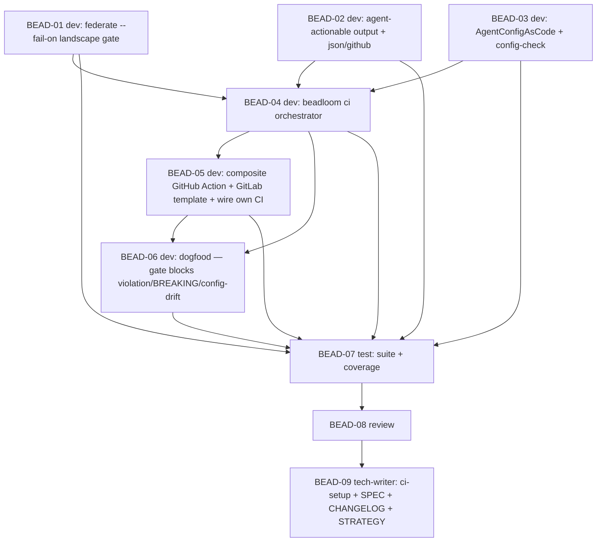

# PLAN: BDL-039 — F3: Tool-Agnostic Enforcement Everywhere

> **Status:** Approved
> **Created:** 2026-06-01

---

## Epic Description

Turn detection into enforcement: landscape gate (`federate --fail-on`) → agent-actionable violation output (`Violation.remediation` + json/github formats) → AgentConfigAsCode (regenerate-and-diff freshness) → unified `beadloom ci` gate → reusable composite GitHub Action + GitLab template → dogfood on Beadloom's own CI → test → review → tech-writer (ci-setup guide, SPEC, CHANGELOG, STRATEGY F3→delivered).

## Dependency DAG

**Critical path:** BEAD-01 → BEAD-04 → BEAD-05 → BEAD-06 → BEAD-07 → BEAD-08 → BEAD-09

## Beads

| ID | Name | Role | Priority | Depends On |
|----|------|------|----------|------------|
| BEAD-01 | `federate --fail-on` landscape gate (`gate_failures` pure fn + CLI exit codes) | dev | P0 | - |
| BEAD-02 | Agent-actionable output: `Violation.remediation` + per-rule deriver + lint `--format json`/`github` + contract remediation | dev | P1 | - |
| BEAD-03 | AgentConfigAsCode: `onboarding/config_sync.py` regenerate-and-diff + `beadloom config-check [--fix]` | dev | P0 | - |
| BEAD-04 | `beadloom ci` orchestrator (`application/gate.py`): reindex→lint→sync→config-check→federate-gate, one exit, `--format` | dev | P0 | 01, 02, 03 |
| BEAD-05 | Reusable CI: composite GitHub Action + GitLab template; wire Beadloom's own CI to `beadloom ci` | dev | P1 | 04 |
| BEAD-06 | Dogfood: anonymized `tests/fixtures/` hub exports; gate blocks boundary violation + cross-service BREAKING + drifted AGENTS.md, agent-actionable output | dev | P1 | 04, 05 |
| BEAD-07 | Test: suite + no-false-gate + determinism + coverage ≥ 80% | test | P0 | 01–06 |
| BEAD-08 | Review (correctness, no false gates, no regression, DRY generator, honest gate) | review | P0 | 07 |
| BEAD-09 | Tech-writer: `ci-setup.md` + federation SPEC + CHANGELOG + STRATEGY-3 §F3 → delivered | tech-writer | P1 | 08 |

## Bead Details

### BEAD-01 — `federate --fail-on` landscape gate (dev, P0)
`gate_failures(fed, fail_on: set[str]) -> list[GateFailure]` in `federation.py` (pure: scans edge `EdgeVerdict`s + contract `ContractVerdict`s against the fail-set, case-insensitive). `federate --fail-on <csv>` (bare flag / `default` token → `breaking,drift,orphaned_consumer,undeclared_producer`). Writes `federated.json`/`.txt` FIRST, then exits 1 on failures; exit 0 when clean. NEVER fails on `external/expected/dead/unmapped/confirmed/ok/cleanup_candidate`. Output names each failing contract/edge + (BREAKING) missing names. TDD.
**Done when:** `--fail-on` gates the documented verdicts, artifact always written, clean landscape → exit 0, safe verdicts never fail; tests cover each gated verdict + the no-false-gate set.

### BEAD-02 — Agent-actionable output (dev, P1)
Additive `Violation.remediation: str | None` + `_remediation_for(rule_type, violation)` (deny/forbid/cycle/layer/cardinality templated hints). Contract findings carry analogous hints (BREAKING/ORPHANED/UNDECLARED). Add `--format github` (Actions `::error file=…,line=…::msg` annotations) and ensure `--format json` emits a stable findings array `{kind, rule, severity, locations[], why, remediation}`. `rich` stays default. TDD.
**Done when:** every gated finding carries a remediation hint; json + github formats deterministic + documented; existing lint formats unaffected.

### BEAD-03 — AgentConfigAsCode (dev, P0)
NEW `onboarding/config_sync.py`: `check_config_drift(project_root, conn) -> list[ConfigDrift]` — re-run the EXISTING `setup-rules --refresh` generator (AGENTS.md + CLAUDE.md auto-managed section + IDE adapters) in-memory, diff vs disk, report drift. Checks ONLY auto-managed regions (`beadloom:auto-start`/`auto-end`) — never user prose. `beadloom config-check [--fix]` (`--fix` = regenerate). TDD.
**Done when:** a drifted AGENTS.md/CLAUDE.md auto-section/adapter is reported stale; editing human prose does NOT trip it; `--fix` clears it; generator code is reused (not reimplemented).

### BEAD-04 — `beadloom ci` orchestrator (dev, P0)
NEW `application/gate.py`: compose reindex (unless `--no-reindex`) → `lint --strict` → `sync-check` → `config-check` → (if `--hub <exports>`) `federate --fail-on`. One `GateResult`, single exit code (1 if any step failed). Uniform `--format rich|json|github`. Honest: reports which steps ran + each result. `beadloom ci` CLI command. TDD.
**Done when:** composes all steps with one exit; `--format` uniform; `--no-reindex` works; honest step reporting; clean repo → exit 0.

### BEAD-05 — Reusable CI integration (dev, P1)
Composite GitHub Action `.github/actions/beadloom-gate/action.yml` (inputs `fail-on`, `hub-exports`, `format`) invoking `beadloom ci`. GitLab template + pull-based hub pattern documented (in ci-setup.md by tech-writer; the snippet authored here). Wire Beadloom's own CI: `beadloom-aac-lint.yml` → `beadloom-gate.yml` calling the Action (dogfood infra). TDD where logic is testable (the Action is thin; logic lives in `beadloom ci`).
**Done when:** the Action runs `beadloom ci` and gates; Beadloom's own CI uses it; GitLab snippet documented; green on Beadloom's repo.

### BEAD-06 — Dogfood (dev, P1)
Anonymized `tests/fixtures/` hub export artifacts (committed; NOT the gitignored scratch). Demonstrate the gate BLOCKS: (a) a deliberately-introduced boundary violation (lint), (b) a cross-service `BREAKING` (federate --fail-on on the fixtures), (c) a drifted `AGENTS.md` (config-check) — each with agent-actionable output. Capture friction in `BDL-UX-Issues.md`. Does NOT mutate real repos.
**Done when:** each of the three break-classes is blocked by the gate with a non-zero exit + actionable message; dogfood notes captured (anonymized).

### BEAD-07 — Test (test, P0)
Full `uv run pytest` + coverage ≥ 80% on F3 surface (`gate.py`, `config_sync.py`, `gate_failures`, remediation, formats). Verify: no-false-gate (clean → exit 0; external/expected/dead/unmapped/cleanup never fail), determinism (sorted findings; stable json/github), no regression (existing lint/sync/federate behavior), honest step reporting. `beadloom lint --strict`/`doctor`/`sync-check` green on Beadloom itself.
**Done when:** all green; coverage ≥ 80%; no-false-gate + determinism + no-regression asserted.

### BEAD-08 — Review (review, P0)
Adversarial: gate correctness; **no false gates** (the excluded verdicts; auto-managed-only config check); **no regression** (additive remediation, formats, no schema bump); DRY generator (config_sync reuses setup-rules generator, no parallel impl); honest gate (no silent skipped step); security (parameterized SQL, safe generation, Action injects no secrets); agent-actionable output is genuinely actionable. OK / ISSUES.

### BEAD-09 — Tech-writer (tech-writer, P1)
Update `docs/guides/ci-setup.md` (landscape gate, the composite Action, `--fail-on`, AgentConfigAsCode, `beadloom ci`, the pull-based hub pattern + GitLab template); relevant domain/SPEC docs + federation SPEC enforcement note; CHANGELOG [Unreleased] F3 entry; STRATEGY-3 §F3 → delivered. `sync-check` + `docs audit` honest, re-run to fixpoint (F4.1).

## Waves

- **Wave 1 (dev, foundation):** BEAD-01 (landscape gate) — solo.
- **Wave 2 (dev):** BEAD-02 (remediation/formats), BEAD-03 (AgentConfigAsCode) — independent of 01 and each other in logic, but both touch `cli.py` (new flag/command); run sequentially (shared-tree write safety, per the F2 experience) unless worktree-isolated.
- **Wave 3 (dev):** BEAD-04 (`beadloom ci`) — after 01+02+03.
- **Wave 4 (dev):** BEAD-05 (CI Action) — after 04.
- **Wave 5 (dev):** BEAD-06 (dogfood) — after 04+05; solo (committed fixtures; merge-slot to land).
- **Wave 6 (test):** BEAD-07.
- **Wave 7 (review):** BEAD-08 → fix cycle if ISSUES.
- **Wave 8 (tech-writer):** BEAD-09.

## Execution Note

Parent created as **`--type epic`** (enables `bd swarm`). Subagent writes are now permission-fixed (BDL-038: `Edit`/`Write`/`Bash(mkdir:*)` in `permissions.allow`), so background dev/test/review/tech-writer subagents run end-to-end. `cli.py` is touched by BEAD-01/02/03/04 → those run sequentially (the F2-proven conflict-safe pattern), not parallel-in-shared-tree. Each dev bead commits via `bd merge-slot`. Dogfood fixtures are anonymized + committed (real landscape stays gitignored). 9 beads — comparable to F2; much of the per-repo gate already exists (`beadloom-aac-lint.yml`, lint/sync machine output), so F3 adds the landscape gate, AgentConfigAsCode, remediation, and reusable CI rather than rebuilding.
