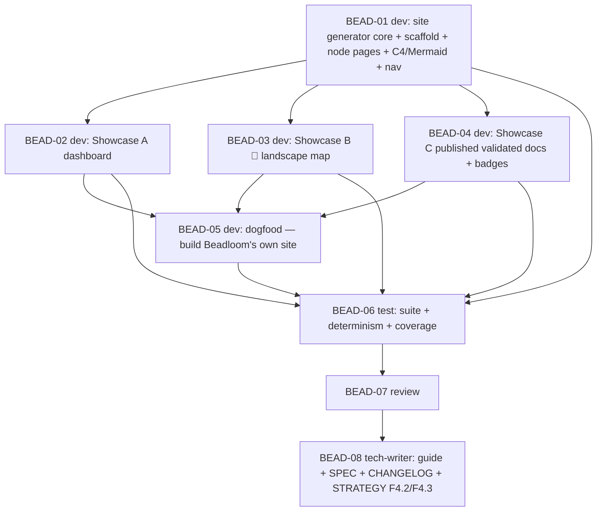

# PLAN: BDL-040 — F4: Living Knowledge Base + Visual Landscape (VitePress)

> **Status:** Approved
> **Created:** 2026-06-02

---

## Epic Description

Make VitePress the showcase of three Beadloom products via a new `beadloom docs site` generator: generator core + scaffold + intra-repo architecture pages (Showcase B/intra) → metrics dashboard (Showcase A) → 🌟 landscape map (Showcase B/cross) → published validated `docs/` with badges (Showcase C) → dogfood (build Beadloom's own site) → test → review → tech-writer. Beadloom produces, VitePress renders. No LLM (F4.1 deferred), no schema bump.

## Dependency DAG

**Critical path:** BEAD-01 → BEAD-04 → BEAD-05 → BEAD-06 → BEAD-07 → BEAD-08

## Beads

| ID | Name | Role | Priority | Depends On |
|----|------|------|----------|------------|
| BEAD-01 | Site generator core + VitePress scaffold + intra-repo architecture pages + C4/Mermaid + nav (G1 + Showcase B/intra G3) | dev | P0 | - |
| BEAD-02 | Showcase A — AaC/DocAsCode metrics dashboard (`dashboard.md` + `.data.json`) (G2) | dev | P0 | 01 |
| BEAD-03 | Showcase B — 🌟 cross-repo landscape map (Mermaid, clickable, verdict/health overlays) (G4) | dev | P0 | 01 |
| BEAD-04 | Showcase C — publish real `docs/` + per-doc `doc_sync` validation badges (G5) | dev | P0 | 01 |
| BEAD-05 | Dogfood — generate Beadloom's own site (3 showcases) + anonymized landscape; `npm run docs:build` succeeds (G6) | dev | P1 | 02, 03, 04 |
| BEAD-06 | Test: suite + determinism (byte-identical) + no-mutation of source docs + coverage ≥ 80% | test | P0 | 01–05 |
| BEAD-07 | Review (honest metrics/badges, determinism, no source-docs mutation, no scope-creep, no schema bump) | review | P0 | 06 |
| BEAD-08 | Tech-writer: VitePress workflow guide + SPEC + CHANGELOG + STRATEGY §F4.2/§F4.3 → delivered (§F4.1 → follow-up) | tech-writer | P1 | 07 |

## Bead Details

### BEAD-01 — Generator core + scaffold + architecture pages (dev, P0)
NEW `application/site.py` + `beadloom docs site [--out DIR=site] [--federated FILE] [--project DIR]`. Load graph (read-only) → emit `index.md` (overview + top-level C4 + health summary), per-node pages `domains|services|features/<ref>.md` (summary, source, symbols, edges-as-links, embedded scoped C4/Mermaid via reused `graph`/`c4`), and the VitePress nav/sidebar config. Committed scaffold `site/.vitepress/config.mjs` + pinned `site/package.json` (VitePress + Mermaid plugin) so the tree builds; add `site/.vitepress/dist` + `site/node_modules` to `.gitignore`. Deterministic (sorted, byte-stable). TDD (Python only; no node).
**Done when:** `docs site` emits a deterministic tree (overview + node pages + nav); scaffold present; Python tests cover generation; `# beadloom:domain=application` annotation on new module; sync-check honest 0.

### BEAD-02 — Showcase A: metrics dashboard (dev, P0)
`dashboard.md` + `dashboard.data.json` from the EXISTING metric code paths: lint (count/severity/trend), `debt_report` (score/category/worst), docs coverage %, `sync-check` freshness % + stale count, `doctor` summary, federated rollup (when `--federated`). Numbers computed in Python (front-end never invents). TDD. Depends 01.
**Done when:** dashboard renders the metrics; values match the CLI commands; `.data.json` deterministic; honest-by-construction (same code paths).

### BEAD-03 — Showcase B: 🌟 landscape map (dev, P0)
`landscape.md` — Mermaid diagram from `--federated <federated.json>` (else single-repo graph): nodes = services, edges = contracts labelled by `ContractVerdict`, health overlay via `classDef`, clickable nodes (`click <id> "<url>"`) → service pages. Generated from data, never hand-drawn. Thin slice = Mermaid only. TDD. Depends 01.
**Done when:** map generated from federate/graph; verdict labels + health classes + clickable links present; deterministic; degenerate single-repo case handled.

### BEAD-04 — Showcase C: published validated docs + badges (dev, P0)
Copy/include the REAL `docs/` tree into `site/docs/…` (source NEVER mutated) and inject a per-doc **validation badge** from the `doc_sync` engine: `✅ fresh` / `⚠️ stale — <reason>` + last-synced + coverage; untracked docs badged honestly. Badge is a stable marker-delimited prefix (regeneration overwrites only it). Same data as `sync-check`. TDD. Depends 01.
**Done when:** real docs published as a first-class section; per-doc badge matches `sync-check` status; source `docs/` unmodified (asserted); deterministic.

### BEAD-05 — Dogfood (dev, P1)
Run `beadloom docs site --out site` on Beadloom itself (6 domains / 4 services / features + the 3 showcases) AND generate `landscape.md` from an anonymized committed F2/F3 fixture landscape. `npm ci && npm run docs:build` succeeds. Spot-check: dashboard matches CLI, architecture renders, docs show correct fresh/stale badges, map nodes link. Capture friction in `BDL-UX-Issues.md`. Anonymization verified (`git grep`). Depends 02,03,04.
**Done when:** Beadloom's own site builds; all 3 showcases render correctly; friction captured; no real private names committed.

### BEAD-06 — Test (test, P0)
Full `uv run pytest` + coverage ≥ 80% on `application/site.py` (+ any split). Verify: **determinism** (re-generate → byte-identical), **source `docs/` never mutated** by the badge injection, dashboard numbers equal the CLI metric paths, badge status equals `sync-check`, map generated from data, nav populated. `beadloom lint --strict`/`doctor`/`sync-check`/`ci` green on Beadloom itself.
**Done when:** all green; coverage ≥ 80%; determinism + no-mutation + honest-metrics asserted.

### BEAD-07 — Review (review, P0)
Adversarial: honest metrics + badges (same code paths, no front-end-invented numbers); determinism; **source `docs/` not mutated**; no scope-creep (no LLM call, no Cytoscape/D3, no hosting); no schema bump; generated into `site/` not `docs/`; security (parameterized SQL, `yaml.safe_load`, safe file writes within `--out`); pinned scaffold. OK / ISSUES.

### BEAD-08 — Tech-writer (tech-writer, P1)
New `docs/guides/` VitePress workflow page (`beadloom docs site`, `npm run docs:build`, optional gh-pages deploy, the 3 showcases); relevant domain/SPEC docs; CHANGELOG [Unreleased] F4 entry; STRATEGY-3 §F4.2/§F4.3 → delivered + §F4.1 noted as the follow-up. `sync-check` + `docs audit` honest, re-run to fixpoint (F4.1 loop invariant).

## Waves

- **Wave 1 (dev, foundation):** BEAD-01 — generator core + scaffold + architecture pages (everything builds on it).
- **Wave 2 (dev, sequential — shared `site.py`/`cli.py`):** BEAD-02 (dashboard), BEAD-03 (map), BEAD-04 (validated docs) — independent in logic, but all extend the generator; run sequentially (the F2/F3-proven conflict-safe pattern).
- **Wave 3 (dev):** BEAD-05 (dogfood) — after 02+03+04; solo (builds the site; merge-slot to land).
- **Wave 4 (test):** BEAD-06.
- **Wave 5 (review):** BEAD-07 → fix cycle if ISSUES.
- **Wave 6 (tech-writer):** BEAD-08.

## Execution Note

Parent created as **`--type epic`** (enables `bd swarm`). Subagent writes are permission-fixed (BDL-038). `site.py` + `cli.py` are touched by BEAD-01..05 → Wave 2 runs sequentially (not parallel-in-shared-tree). The Python generator is fully pytest-testable without node; `npm run build` is dogfood/CI-validated (BEAD-05), not pytest. Landscape-map dogfood uses committed anonymized fixtures (real landscape stays gitignored). 8 beads. **F4.1 (AI tech-writer in CI) is OUT of scope — a deferred follow-up epic.** Much of the raw material already exists (`graph` Mermaid/C4/json, `docs polish --json`, `debt_report`/`doctor`/`lint`/`doc_sync` metrics, `federated.json`); F4 assembles them into the site rather than recomputing.
