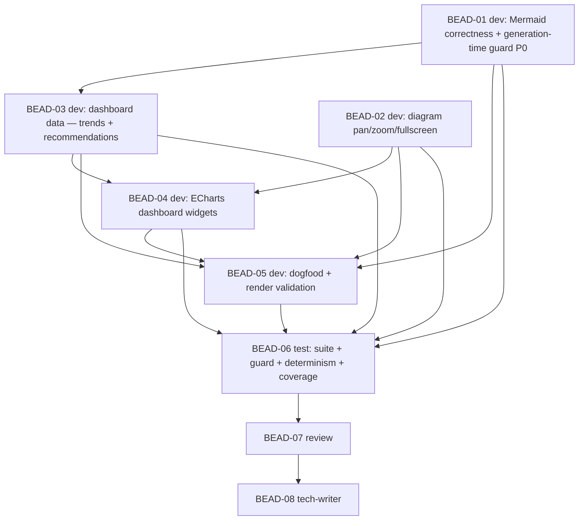

# PLAN: BDL-041 — F4.4: Site rendering fixes + dashboard UX

> **Status:** Approved
> **Created:** 2026-06-02

---

## Epic Description

Fix the F4 render bugs + add a generation-time Mermaid guard (P0) → diagram pan/zoom/fullscreen → dashboard data (trends + recommendations) → ECharts dashboard widgets → dogfood with real render validation → test → review → tech-writer. Beadloom produces deterministic data; Vue/ECharts render it. F4 + F4.4 ship together.

## Dependency DAG

**Critical path:** BEAD-01 → BEAD-03 → BEAD-04 → BEAD-05 → BEAD-06 → BEAD-07 → BEAD-08

## Beads

| ID | Name | Role | Priority | Depends On |
|----|------|------|----------|------------|
| BEAD-01 | Mermaid correctness (landscape id prefix + C4 Rel integrity) + generation-time validity guard (G1+G2) | dev | P0 | - |
| BEAD-02 | Diagram pan/zoom/fullscreen — custom theme + `DiagramViewer.vue` + `svg-pan-zoom` (G3) | dev | P1 | - |
| BEAD-03 | Dashboard data — trends (`site_metrics_history.py`) + recommendations into `dashboard.data.json` (G5+G6) | dev | P1 | 01 |
| BEAD-04 | ECharts dashboard widgets — `HealthGauges`/`CategoryChart`/`TrendCharts`/`Recommendations` + theme registration + `dashboard.md` mounts (G4) | dev | P1 | 02, 03 |
| BEAD-05 | Dogfood — regenerate + `npm run docs:build` + validate the real render (no errors, pan/zoom, live dashboard) (G7) | dev | P1 | 01,02,03,04 |
| BEAD-06 | Test: guard catches bug classes + determinism + honest data/trends + coverage ≥ 80% | test | P0 | 01–05 |
| BEAD-07 | Review (render correctness, no false metrics, honest trends, no scope-creep, determinism) | review | P0 | 06 |
| BEAD-08 | Tech-writer: VitePress guide (widgets/interactivity/guard) + SPEC + CHANGELOG + STRATEGY note | tech-writer | P1 | 07 |

## Bead Details

### BEAD-01 — Mermaid correctness + guard (dev, P0)
(a) `application/site_landscape.py` `_mermaid_id`: prefix ids (`n_…`) so no node id can equal a reserved keyword (`graph`/`end`/…); apply to decls + `click` + edges (label unchanged). (b) `graph/c4.py`: emit `Rel(a,b)` ONLY when both endpoints are declared diagram nodes (drop Rels to the `System` root); fix top-level AND scoped per-node C4. (c) NEW `application/site_mermaid_guard.py` `validate_mermaid(text) -> list[MermaidIssue]` (reserved-id/charset + C4 Rel-integrity, extensible); `generate_site` calls it on every diagram and raises on issue. TDD: known-bad fixtures (a `graph` node id; a Rel to an undeclared node) are caught; the real generated diagrams pass.
**Done when:** a node named `graph` renders (sanitized); C4 has no `drawRels` crash; the guard fails generation+pytest on either bug class; existing site tests green.

### BEAD-02 — Diagram pan/zoom/fullscreen (dev, P1)
NEW `site/.vitepress/theme/index.js` (extends default theme) + `site/.vitepress/theme/components/DiagramViewer.vue` wrapping rendered Mermaid SVGs with `svg-pan-zoom` (pan + wheel-zoom + reset) and a fullscreen toggle. Add pinned `svg-pan-zoom` to `site/package.json`. Graceful static fallback. (Frontend; validated by build + dogfood, not pytest.)
**Done when:** each rendered diagram supports pan/zoom/fullscreen; theme committed + pinned; `npm run docs:build` still succeeds.

### BEAD-03 — Dashboard data: trends + recommendations (dev, P1)
NEW `application/site_metrics_history.py`: append/read a `metrics_history` store (`{ts, lint, debt, coverage, sync_pct, nodes, edges, symbols}`); `docs site` appends one point per run (ts injected in tests); backfill structural counts from `graph_snapshots`. `site_dashboard.py`: emit `trends` (time-series) + `recommendations` (worst-debt / stale-docs / contract-risks BREAKING-DRIFT / lint-hotspots, prioritized) into `dashboard.data.json` — honest (same gate code paths), deterministic. TDD. Depends BEAD-01.
**Done when:** `dashboard.data.json` carries deterministic `trends` (only real points) + `recommendations` (from gate data); history append is deterministic with injected ts.

### BEAD-04 — ECharts dashboard widgets (dev, P1)
NEW Vue widgets `site/.vitepress/theme/components/{HealthGauges,CategoryChart,TrendCharts,Recommendations}.vue` rendering ECharts (`vue-echarts` + `echarts`, pinned) from `dashboard.data.json`; register in the theme (BEAD-02). `dashboard.md` (generator) mounts them. Beautiful + responsive + themed; numbers still == the data. Add pinned `echarts`/`vue-echarts` to `package.json`. Depends BEAD-02 (theme) + BEAD-03 (data shape).
**Done when:** dashboard shows live gauges/bars/donut + trend lines + recommendations; renders from `dashboard.data.json`; build succeeds.

### BEAD-05 — Dogfood + render validation (dev, P1)
Regenerate Beadloom's own site (`beadloom docs site --out site --federated <fixture>`), `npm run docs:build`, and **validate the real render**: guard 0 issues, no `Syntax error in text`/console errors on the C4/landscape pages, pan/zoom/fullscreen work, dashboard shows live charts + trends + recommendations. Capture friction + a SUCCESS entry in `BDL-UX-Issues.md`. Coordinator runs `npm` (network-approved). Depends BEAD-01..04.
**Done when:** the live site renders with zero diagram/console errors; all UX targets verified; friction captured.

### BEAD-06 — Test (test, P0)
Full `uv run pytest` + coverage ≥ 80% on the F4.4 Python surface (`site_mermaid_guard.py`, `site_metrics_history.py`, the `site_landscape`/`c4`/`site_dashboard` changes). Verify: the guard catches both bug classes (reserved-id, C4 Rel) + passes the real generated diagrams; determinism (data.json + Mermaid byte-identical); honest data (dashboard==gate, trends only-real-points, recommendations from gate data); no regression. `beadloom lint --strict`/`doctor`/`sync-check`/`ci` green.
**Done when:** all green; coverage ≥ 80%; guard + determinism + honest-data asserted.

### BEAD-07 — Review (review, P0)
Adversarial: render correctness (the two bugs truly fixed + guard sound, not a fake parser); no false metrics (dashboard/recommendations == gate paths); honest trends (no fabricated points, ts from storage); C4 Rel-drop not lossy; determinism; no scope-creep (no LLM, no bespoke graph engine, no hosting, no new metric kinds); pinned deps; security. OK / ISSUES.

### BEAD-08 — Tech-writer (tech-writer, P1)
Update `docs/guides/vitepress-site.md` (dashboard widgets, diagram pan/zoom/fullscreen, the Mermaid guard); relevant domain/SPEC docs; CHANGELOG [Unreleased] F4.4 entry; STRATEGY-3 note (render-fix + dashboard UX). `sync-check` + `docs audit` honest, re-run to fixpoint (F4.1 invariant).

## Waves

- **Wave 1 (dev, P0 foundation):** BEAD-01 — Mermaid correctness + guard (honest render unblocked).
- **Wave 2 (dev):** BEAD-02 (pan/zoom, frontend-only) and BEAD-03 (dashboard data, Python) — disjoint surfaces; run sequentially by default (the proven conflict-safe pattern), or BEAD-02 may run in parallel via worktree (pure frontend) if desired.
- **Wave 3 (dev):** BEAD-04 — ECharts widgets (needs theme from 02 + data from 03).
- **Wave 4 (dev):** BEAD-05 — dogfood + render validation (solo; coordinator runs npm; merge-slot to land).
- **Wave 5 (test):** BEAD-06.
- **Wave 6 (review):** BEAD-07 → fix cycle if ISSUES.
- **Wave 7 (tech-writer):** BEAD-08.

## Execution Note

Parent created as **`--type epic`** (enables `bd swarm`). Subagent writes are permission-fixed (BDL-038). Beads touching the Python generator (`site.py`/`site_dashboard.py`/`c4.py`) and the shared `site/.vitepress/theme/` + `package.json` (BEAD-02/04) run sequentially per wave (conflict-safe). The Python generator + guard are fully pytest-testable; the Vue/ECharts frontend + `npm run docs:build` + the render-validation in BEAD-05 cover the front-end (node v18 available; coordinator runs npm with network approval). 8 beads. **F4 + F4.4 push together** once render is fixed.
