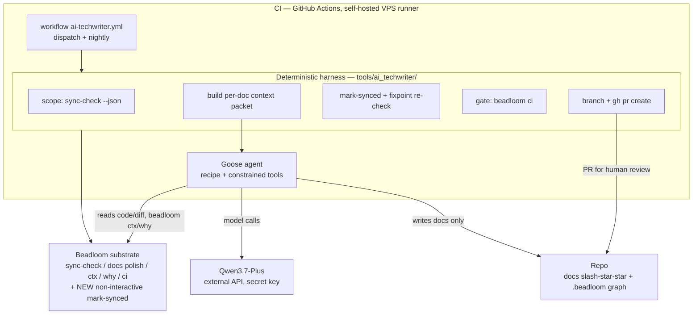
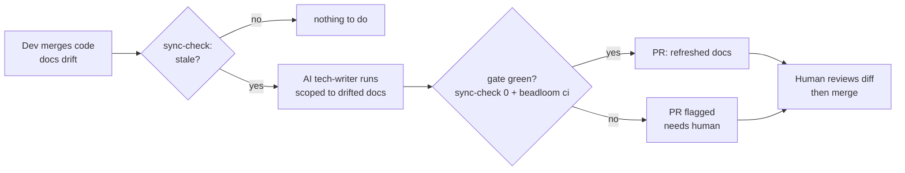
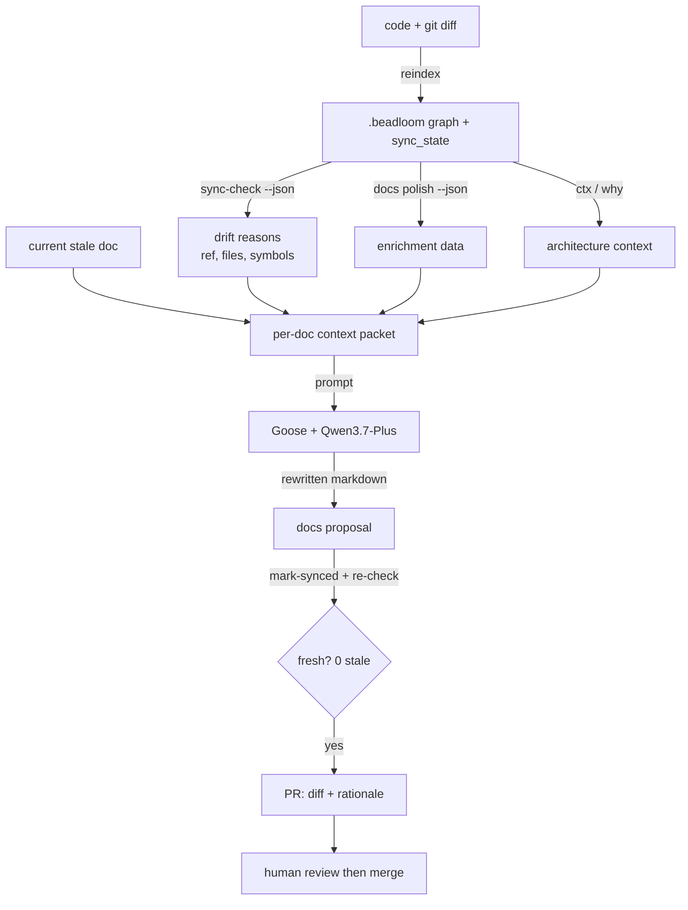

# RFC: BDL-047 (F4.1) — AI tech-writer in CI

> **Status:** Approved
> **Created:** 2026-06-04
> **PRD:** ./PRD.md

---

## Summary

A **deterministic CI harness** drives a **Goose agent** to repair drifted docs, scoped by Beadloom's existing structured outputs, verified to a fixpoint by Beadloom's own gate, and delivered as a PR for human review. The split is the whole design:

- **Beadloom = substrate (provides primitives, stays Goose-agnostic).** `sync-check --json` (scope + reasons), `docs polish --format json` (enrichment input), `ctx`/`why` (architecture context), `beadloom ci` (gate), + **one new core primitive: a non-interactive mark-synced CLI** (closes UX #106; the fixpoint loop needs it).
- **Harness = deterministic orchestrator (NOT in Beadloom core).** Owns: discover stale → per-doc loop → mark-synced → fixpoint re-check → `beadloom ci` → open PR/MR. Lives in repo CI tooling (`tools/ai_techwriter/`), not `src/beadloom/`. **Platform-agnostic by design:** one Python codebase invoked by BOTH GitHub Actions and GitLab CI; only the trigger, secret-naming, and the review-open step differ via a thin **platform adapter** (`gh pr create` vs `glab`/GitLab API). Dual-platform (GitHub + GitLab) is a deliberate, first-class requirement.
- **Stack note:** F4.1 runtime = **Goose + Beadloom + Qwen** (no Beads — Beads is the dev-flow tracker + a future agentic-stack component, out of F4.1 runtime scope).
- **Goose = the non-deterministic step, bounded by the gate.** Per stale doc: read the drift reason + polish-json + ctx/why + the relevant code/diff (tool-use), rewrite the doc. Output is a **proposal**; truth is the gate + human review.

Architecture principle (mirrors honest-by-construction): **everything except the per-doc rewrite is deterministic; the one non-deterministic step is bounded by `sync-check`→0 + `beadloom ci` + a human PR.** No auto-merge.

## Diagrams

### Architecture — what it's made of



### User Flow — how it works for the end user



### Data Flow — what data goes where



## Why this split (substrate, not orchestrator)

REVIEW-2 §8 + STRATEGY-3 principle 5/7: Beadloom is the architectural-truth substrate; orchestration belongs to a harness, enforcement to CI. Putting the loop inside `beadloom` core would couple the product to Goose and a fast-moving agent runtime — wrong. So the loop is repo tooling that *consumes* Beadloom; the only core change is a primitive (mark-synced) that is independently useful.

## Resolving the 5 open architecture questions (from the PRD)

### Q1 — Goose recipe vs deterministic harness boundary

| Step | Owner | Why |
|------|-------|-----|
| Discover stale docs + reasons | Harness (`sync-check --json`) | deterministic |
| Build per-doc context packet | Harness (`docs polish --format json` filtered to the stale ref + `ctx`/`why`) | deterministic assembly |
| **Rewrite the drifted doc** | **Goose agent** (tool-use) | the only step needing judgment + dynamic code exploration |
| Re-baseline freshness | Harness (**new** non-interactive mark-synced) | mechanical |
| Fixpoint re-check | Harness (`sync-check` loop) | deterministic |
| Gate | Harness (`beadloom ci`) | deterministic |
| Branch + PR/MR | Harness — **platform adapter** (`git` + `gh pr create` on GitHub / `glab` or GitLab API on GitLab) | deterministic |

Goose never decides scope, never marks synced, never merges. It only proposes doc content. The harness is one platform-agnostic codebase; the adapter is the only platform-specific seam.

### Q2 — Model-call boundary

- Goose configured with an **OpenAI-compatible provider → Qwen3.7-Plus** (DashScope / Model-Studio endpoint or an OpenAI-compatible gateway). No local model.
- **API key = CI secret** available only to the VPS-runner job (`QWEN_API_KEY`), never in the repo.
- **Quality first; cost bounded by scope, not by crippling reasoning** (revised per owner, 2026-06-04): extended **thinking stays ENABLED** — a quality refresh genuinely reasons (what changed, reconcile doc↔new semantics, what to keep/restructure, catch subtle inconsistencies), so capping think would cap quality. Cost is controlled by **scope** (only drifted docs + scoped context — already cheap per the F4.1 forecast) plus a **generous per-run hard ceiling** (max turns / tokens / wall-clock) acting ONLY as a runaway safety net, never as a per-call quality knob. Top-tier model only — **no tiering** (principle 10).

### Q3 — Acceptance gate + retry / budget policy

```
for each stale doc (from sync-check --json):
    repair via Goose  →  mark-synced(ref)  →  sync-check(doc)
    if still stale: retry Goose ≤ N=2, feeding back the sync-check reason
global fixpoint:
    repeat { sync-check (whole repo) → mark-synced flagged refs } until stable 0
    OR no-progress / round-cap reached  (re-stale-siblings invariant is bounded)
gate: beadloom ci   (reindex → lint --strict → sync-check → config-check → doctor)
deliver:
    gate GREEN → branch + push + open PR
    gate not green within budget → branch + push + open PR flagged "⚠ needs human"
                                    (PR body lists what's still stale/failing)
hard caps: max total turns / tokens / wall-clock → on exceed, flagged PR
```

Never auto-merge; never hang (a flagged PR is the failure mode, not a stuck job).

### Q4 — Scoped-context contract + Goose tool surface

**Per-doc input packet (harness → Goose):** `{ doc_path, current_content, drift_reason (symbols_changed/hash_changed/untracked + the code files), docs_polish_json[ref], ctx(ref), why(ref) }`.

**Goose allowed tools (constrained):**
- read-only filesystem (read code + diffs),
- `beadloom` read commands (`ctx`, `why`, `search`, `sync-check`),
- `git` read (`diff`, `log`, `show`),
- **write restricted to `docs/**`** (and tracked doc files) — no `src/`, no arbitrary shell, no network except the model endpoint.

This is G4's "safe by gate, not trust" + a small blast radius.

### Q5 — CI topology (GitHub **and** GitLab, first-class)

- **Self-hosted runner on the VPS** (where Goose + the API key live). The same VPS can host a **GitHub Actions runner** and a **GitLab Runner** (for different repos/environments). Ephemeral workspace per run (clean checkout).
- **Two thin wrappers around one harness:**

| | GitHub | GitLab |
|---|---|---|
| Wrapper file | `.github/workflows/ai-techwriter.yml` | `.gitlab-ci.yml` (an `ai-techwriter` job) |
| Trigger (v1) | `workflow_dispatch` + `schedule` | `manual` + `schedule` |
| Secret | Repository secret `QWEN_API_KEY` | CI/CD variable `QWEN_API_KEY` |
| Open review | `gh pr create` | `glab` / GitLab MR API |

- **Job (both):** checkout → install (uv + Beadloom + Goose, pinned) → `beadloom reindex` → `sync-check --json`; **0 stale → exit 0 (no-op)**; else run the harness → on a green gate, open the PR/MR via the platform adapter.
- **Generalization to a private service:** same wrapper + runner pattern in that repo; the harness + Goose recipe are **repo-agnostic** (read that repo's own graph + docs). Platform is the operator's choice — GitHub Actions or GitLab CI.

## Component / file impact

| Component | Change | Tested by |
|-----------|--------|-----------|
| `src/beadloom/…` (doc_sync CLI) | **NEW core primitive:** non-interactive mark-synced CLI (e.g. `beadloom sync-update <ref> --yes` / `--all`), wrapping the existing `mark_synced_by_ref`. Closes UX #106. | unit + CLI test |
| `tools/ai_techwriter/` (NEW, repo tooling) | the deterministic, **platform-agnostic** harness: discover → packet → invoke Goose → mark-synced → fixpoint → `beadloom ci` → PR/MR; retry/budget caps; **PR/MR platform adapter** (`gh` / `glab`\|GitLab API); **emits the run-record** (G9) | unit (harness logic + adapter + emission, Goose mocked) + dogfood |
| `src/beadloom/application/site_dashboard.py` + Vue widget (G9) | "AI tech-writer activity" dashboard widget reading `.beadloom/ai_techwriter_runs.json` (docs refreshed + token spend; tokens fact, $ labeled estimate) | unit (data builder) + dogfood render |
| `tools/ai_techwriter/recipe.*` (NEW) | the Goose recipe: instructions (the tech-writer protocol, ported from `.claude/agents/tech-writer.md`), tool allow-list, provider=Qwen3.7-Plus | dogfood |
| `.github/workflows/ai-techwriter.yml` + `.gitlab-ci.yml` (NEW) | the two thin wrappers (dispatch/schedule), VPS runner, secret wiring — both call the same harness | dogfood (GitHub real run; GitLab on team repo) |
| `src/beadloom/…` (setup, NEW) | `beadloom setup-ai-techwriter` — scaffolds the chosen platform's wrapper (GitHub workflow OR GitLab job) + Goose recipe + getting-started guide (setup-* family; idempotent, config-check-friendly) for simple opt-in (G8) | unit + CLI test |
| docs (guide) + CHANGELOG + ROADMAP status | tech-writer | — |

The Python harness logic is unit-testable with Goose + the model **mocked** (deterministic parts: scoping from a fixture `sync-check --json`, the fixpoint loop, the gate decision, the PR-vs-flagged-PR branching). The Goose+model integration is proven by the dogfood run (G6) — consistent with the "real run is the acceptance test" discipline.

## Getting started (end-user setup must be simple — G8)

Setup is a `beadloom` scaffold + a short checklist, not hand-wiring. Target: **3 steps**.

- **`beadloom setup-ai-techwriter [--platform github|gitlab]`** (NEW, in the `setup-*` family alongside `setup-mcp`/`setup-rules`) drops, idempotently: the chosen platform's wrapper (`.github/workflows/ai-techwriter.yml` OR a `.gitlab-ci.yml` `ai-techwriter` job), the Goose recipe + provider config (Qwen3.7-Plus, env-keyed), and `docs/guides/ai-techwriter.md` (the checklist). Regenerable + `config-check`-friendly (no hand-maintained adapters — principle 5).
- **End-user 3-step setup (same shape on both platforms):**
  1. Register a self-hosted runner on the VPS (GitHub Actions runner **or** GitLab Runner; Goose installed).
  2. Add `QWEN_API_KEY` (GitHub repo secret **or** GitLab CI/CD variable).
  3. `beadloom setup-ai-techwriter --platform <github|gitlab>` → commit → enable the pipeline.
- After that the loop runs on schedule / dispatch and opens PRs/MRs. **Nothing else to configure per-repo** — the harness + recipe are repo-agnostic (read that repo's own graph). This is G8 made first-class: opt-in via one command + a 3-item checklist.

## Observability — run-record + dashboard widget (G9, variant A)

Honest-by-construction, mirroring `site_metrics_history.py`:

- **Emission (in the harness, BEAD-02).** Each run appends a **run-record** to an append-only store (`.beadloom/ai_techwriter_runs.json`): `{ ts (stored, not now()), platform, docs_refreshed[], input_tokens, output_tokens, model, gate (green/flagged), pr_url }`. Token counts come from the model API's `usage` field — **fact, not estimate**.
- **Widget (BEAD: dashboard).** `site_dashboard.py` reads the store → an "AI tech-writer activity" widget (reusing the ECharts `TrendCharts` infra): docs-refreshed over time + input/output token spend per run + cumulative. **Only real recorded runs** (no interpolation; sparse-at-first is correct, like the existing trends).
- **Cost framing (honesty).** Tokens = fact. Any **$ cost = tokens × a configured rate → a clearly-labeled estimate** ("est. @ $X/1M"), never presented as a hard figure (tiered pricing makes it approximate). Default may show tokens only.

## Alternatives considered

- **`beadloom docs ai-refresh` (loop inside Beadloom core, shelling to Goose).** Rejected: couples the substrate to a fast-moving agent runtime; violates substrate-not-orchestrator + tool-agnostic. The loop is repo tooling.
- **Thin script + direct model API (no Goose).** Rejected per the prior decision: good docs need dynamic code exploration (tool-use), and Goose is the substrate for the future agent fleet.
- **Auto-merge on a green gate.** Rejected: `sync-check`→0 proves *freshness* (the doc references current symbols), **not prose correctness** — only human review covers correctness. PR is mandatory.
- **Agent marks synced / decides scope.** Rejected: those are deterministic; keeping them in the harness makes the loop reproducible and the agent's blast radius small.

## Risks & mitigations

- **A doc passes `sync-check` (fresh) but the prose is wrong.** Honest framing: sync-check is a *freshness* gate, not a *correctness* gate. Mitigation: human PR review is the correctness gate; the agent is grounded by polish-json/ctx/why; the PR shows the diff + the agent's rationale. We do **not** claim the loop guarantees correct docs — it guarantees *fresh, reviewed* docs.
- **mark-synced re-baselines a bad doc → false green.** Same mitigation (PR review); the harness records per-doc the drift reason it addressed so the reviewer can verify.
- **Cost runaway / non-termination.** Token/turn/wall-clock caps + bounded fixpoint rounds + no-progress detection → flagged PR, never a stuck job.
- **Goose non-determinism / version drift.** Pin Goose version + recipe; the deterministic gate bounds output; nothing merges without review.
- **Self-hosted runner security** (box holds the API key). Mitigation: runner scoped to this repo, ephemeral workspace, constrained Goose tool surface (docs-only writes), no auto-merge, no secrets in logs.
- **The new mark-synced CLI could mask drift if misused outside the loop.** It only re-baselines (records "doc matches code now"); document honest use; it is the same operation `sync-update` already performs interactively.

## Rollout

Single epic, waves: dev (1: non-interactive mark-synced CLI → 2: harness + PR/MR adapter → 3: Goose recipe + provider → 4: both CI wrappers (GitHub + GitLab) → 5: `setup-ai-techwriter`) → test → review → **dogfood (G6: GitHub real run on Beadloom's own drift, e.g. #130/#131 → reviewable PR; GitLab path validated on the team's private GitLab repo)** → tech-writer. Each dev step keeps Beadloom green on its own `beadloom ci`.
