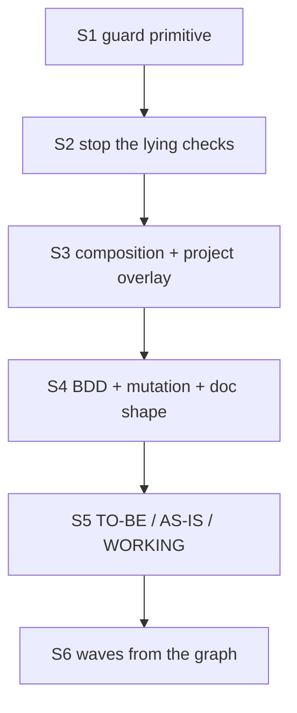

# PLAN: BDL-061 — Enforced agentic flow

> **Status:** Approved
> **Created:** 2026-08-22

---

## Epic Description

Six sequential slices, each `dev → test → review → tech-writer`, each merged to `main` on its
own PR. The order is not arbitrary: S2 must precede S3 because S3's acceptance criterion is
deleting the rules S2's bugs forced into the prose, and S1 must precede everything because it
is the primitive the rest bind to.

Slices are independently shippable. **S1–S3 alone deliver the owner's core request** — the flow
becomes enforced, stops lying, and becomes extensible. S4–S6 build on that foundation.

## Dependency DAG

**Critical path:** S1 → S2 → S3 → S4 → S5 → S6 (`.1` → `.24`)

Within each slice: `dev → test → review → tech-writer`, gated by bead dependencies.

## Beads

This table is the plan as approved. Live bead status is in ACTIVE.md and the tracker, which also
carry the beads filed after approval (`.25`–`.51`).

| ID | Name | Priority | Depends On | Status |
|----|------|----------|------------|--------|
| .1 | [dev] S1: guard primitive — registry, verdict, CLI, liveness | P1 | – | Pending |
| .2 | [test] S1: verdict matrix, exclusion validation, liveness | P1 | .1 | Pending |
| .3 | [review] S1: portability, read-only, honest `skip` | P1 | .2 | Pending |
| .4 | [tech-writer] S1: guards guide + flow.yml reference | P1 | .3 | Pending |
| .5 | [dev] S2: #142 import edges, #146 component pairs, #147 read-only lint | P1 | .4 | Pending |
| .6 | [test] S2: false-green regressions for all three | P1 | .5 | Pending |
| .7 | [review] S2: the deleted rules are actually gone | P1 | .6 | Pending |
| .8 | [tech-writer] S2: reindex/sync-check/lint docs + core CLAUDE.md shrinks | P1 | .7 | Pending |
| .9 | [dev] S3: compose(core, arch, stack, project) for roles/commands/CLAUDE.md | P1 | .8 | Pending |
| .10 | [test] S3: overlay survives upgrade, core drift still caught, suppression reported | P1 | .9 | Pending |
| .11 | [review] S3: guard cannot be silently disabled; migration is non-destructive | P1 | .10 | Pending |
| .12 | [tech-writer] S3: overlay guide + upgrade/migration notes | P1 | .11 | Pending |
| .13 | [dev] S4: scenario binding, `scenario-coverage`, doc templates, section + quality checks, shared writing standard | P2 | .12 | Pending |
| .14 | [test] S4: scenario/bead/node binding both ways; section + quality checks | P2 | .13 | Pending |
| .15 | [review] S4: BDD is not ceremony; mutation scope is honest | P2 | .14 | Pending |
| .16 | [tech-writer] S4: BDD guide, doc-kind reference, role duties | P2 | .15 | Pending |
| .17 | [dev] S5: doc roots, TO-BE/AS-IS/WORKING kinds, TO-BE→AS-IS check | P2 | .16 | Pending |
| .18 | [test] S5: kind validation, WORKING exemption, computed facts | P2 | .17 | Pending |
| .19 | [review] S5: our ROADMAP + issue log validate as instances | P2 | .18 | Pending |
| .20 | [tech-writer] S5: spec-space guide; ROADMAP/BDL-UX restructured | P2 | .19 | Pending |
| .21 | [dev] S6: `beadloom waves` decides; review isolation; #118, #133 | P2 | .20 | Pending |
| .22 | [test] S6: independence matrix, serialisation, baseline safety | P2 | .21 | Pending |
| .23 | [review] S6: waves decide honestly; override is recorded | P2 | .22 | Pending |
| .24 | [tech-writer] S6: coordinator + parallelism docs | P2 | .23 | Pending |

## Bead Details

### S1 — The guard primitive (`.1`–`.4`)

**What to do:** `application/guards/` — a registry of named guards, an evaluation entry point,
the verdict model `{guard, outcome: pass|warn|block|skip, why, not_covered[], remediation}`,
and a firing record. `beadloom guard <name> [--json] [--context k=v]` plus
`beadloom guard --liveness`. Strictness per work kind and exclusions (`reason` + `until`
mandatory) read from `.beadloom/flow.yml`. Claude Code hook adapters emitted by
`setup-agentic-flow`; the adapter contains no logic.

**Done when:**
- [ ] A guard verdict is identical from the CLI and from the hook adapter
- [ ] An exclusion without `reason` or `until` is a configuration error
- [ ] `skip` always carries a reason
- [ ] `--liveness` reports guards that never fired or are excluded everywhere
- [ ] Every guard has a test proving it FAILS on the condition it guards
- [ ] No guard writes to the index

### S2 — Stop the lying checks (`.5`–`.8`)

**What to do:** #142 — incremental reindex re-extracts imports for changed files. #146 —
`component` nodes produce sync pairs. #147 — a read-only lint evaluation path. Then delete the
three defensive rules from this epic's CONTEXT.

**Correction, measured in `.7` (2026-08-23).** This criterion was originally written as "delete
the three defensive rules from the shipped `CLAUDE.md` core and from this epic's CONTEXT". The
three rules were never in the shipped core: `grep` over `.claude/CLAUDE.md`, `.beadloom/AGENTS.md`
and `src/beadloom/onboarding/templates/agentic_flow/` finds no clean-DB, component-blindness or
lint-writes rule. They lived in exactly two places — CONTEXT's Standing Verification Rules 1–3
and their echo in ACTIVE — and that is the whole deletion `.8` performed. The criterion was
written against an assumption nobody checked, which is why it is corrected here rather than
reported as met. S3's own "the core `CLAUDE.md` shrinks" is a separate, real deliverable and is
unaffected.

**Done when:**
- [x] A boundary violation introduced after an *incremental* reindex is caught — proved on the
      real graph and re-derived twice: incremental and full rebuild give byte-identical JSON
- [x] A `component` node's doc freshness is genuinely checked, and "clean" means checked — every
      one of the 22 `component` nodes carries at least one pair; 275 of 279 declared pairs are
      checked and the other 4 are named with a reason
- [x] `lint` has a path that leaves `beadloom.db` byte-identical — `--no-reindex`, measured under
      both journal modes; it creates the `-wal`/`-shm` sidecars, so the property holds for the
      file rather than for `.beadloom/`
- [x] Reindex timing measured before/after and the number recorded, not described — full 755 ms;
      import refresh +29 ms (1 file) / +42 ms (5 files); `build_sync_state` 170 ms → 4 ms
- [x] **The three rules are gone from the prose** — deleted in `.8`; two leave a replacement
      sentence in the CLI reference rather than a rule
- [x] The record does not claim more than the code delivers — S2 fixed three NAMED checks and
      left the class open (#173, #174, #175; beads `.45`–`.51`), and says so in CONTEXT and ACTIVE

### S3 — Composition with a project overlay (`.9`–`.12`)

**What to do:** generalise `compose_role` to `compose(core, architecture, stack, project)` and
apply it to roles, commands and `CLAUDE.md`. Project layer in `.beadloom/flow/`.
`config-check` verifies the composition result. Language and stack from `flow.yml` (#136).
Cross-major re-init reports orphans (#137). Relocate role-owned rules out of the core
`CLAUDE.md` into role templates.

**Correction, measured in `.9` (2026-08-23).** The last criterion was written as
"the core `CLAUDE.md` shrinks" on the assumption that what leaves it are the three standing
rules S2 retired. `.7` established that those rules were never in the shipped `CLAUDE.md` at
all, so that assumption was already false when it was written. Re-derived from the file itself,
what genuinely does not belong in a **stack-neutral** core is different and larger:

| Removed from the core | Lines | Replacement |
|---|---|---|
| §8 Quick Reference + §9 Agent Checklist | 61 | §0 CRITICAL RULES, which both restated command-for-command |
| §7 "Code" + "Shell" anti-patterns | 11 | `templates/claude/stack/python/CLAUDE.md.txt` (already duplicated in `roles/stack/python/dev.md.txt`) |
| §0 `uv run pytest` / `ruff check` / `mypy` | 5 | the same stack overlay — a TypeScript adopter was being told to run `uv run pytest` in their CRITICAL RULES |
| §3 "MUST be written in English" | 1 | the `doc-language` auto-region, rendered from `language:` in `flow.yml` (#136) |
| *(added)* provenance stamp + pointers | +14 | — |

**Measured, not described.** Shipped CORE: **440 → 376 lines** (−78/+14, −14.5%). Composed for
a `ddd`+`python` project: **406** (the 30-line stack overlay returns). Beadloom's own live file
is 432 = 376 core + 30 stack + 26 project layer.

**Corrected by review `.11` (m2), because the claim a grep contradicts is the one this epic
exists to remove.** The line above originally read "A non-Python project's `CLAUDE.md` no longer
contains a single Python command." Re-derived on the composition for `stack=(typescript,)`, two
Python references survive in the 376-line core, both outside the critical rules:

| line (of the 376) | text | what it is |
|---|---|---|
| 92 | ``#       the core is stack-neutral and `uv run pytest` is not every project's suite.`` | a comment explaining why the command is *not* there — the pointer that replaced it |
| 133 | ``**Role subagents …:** `dev` (TDD implementation), `test` (pytest, coverage), …`` | a genuine residue in the role-description table |

So the honest claim is: **a non-Python project's `CLAUDE.md` carries no Python command to run.**
The `uv run pytest` / `ruff` / `mypy` block and the Python anti-patterns are gone from the core
and live in the stack overlay, and a TypeScript adopter is no longer told to run them. Line 133
is a one-word template edit that belongs to `.58`; it is recorded rather than quietly dropped.

**A second, unplanned finding this criterion depended on.** #177 left open whether
`config-check` was right to print `PASS: agent-config in sync` over two files that demonstrably
differed. It was not "correct by design under the composition-result rule" — the `CLAUDE.md`
body was verified by **nothing**. Measured on a scaffolded project before the fix: appending a
paragraph → 0 drifts; deleting all of §7 → 0 drifts; replacing the whole file with `# gone` →
0 drifts. The propagation loop itself was a **test** (`TestSyncAgenticFlow`) that rewrote the
shipped template from the live file, sha256 `f360bc60…` → `6fcae821…`, passing while it did so.

**Done when:**
- [x] A project overlay survives an upgrade
- [x] Drift in the shipped core is still detected while an overlay exists
- [x] Suppressing a core rule requires reason + exit condition and is reported — and expiry and
      dead declarations are reported too, at check time rather than in the composed bytes (`.57`)
- [~] A hand-edited vendored file is reported with migration guidance and never rewritten — true
      of the slash commands and `CLAUDE.md`, and of the *report* everywhere. Two measured gaps,
      both filed and both `.58`'s: `config-check --fix` still rewrites a hand edit in a role
      adapter, byte-identically to the scaffold, one line after the check said it would not
      (BDL-UX #186); and `ScaffoldResult.migration_notes` has **no caller**, so the guidance
      naming `.beadloom/flow/<kind>/<name>.md` reaches a library caller and not the person
      running `setup-agentic-flow` (BDL-UX #188)
- [~] #139, #152, #132, #136, #137 close — #139/#152 (a project extension is legal), #132
      (nothing writes the core, so `--force` cannot overwrite its placeholder) and #136
      (`language:` + the `doc-language` region) close. **#137 does not:** `orphaned_flow_files()`
      computes the list and the exact `rm -f` command, and no caller prints it (BDL-UX #188)
- [x] The core `CLAUDE.md` shrinks, with each removed line mapped to its replacement — see the
      correction above; the criterion was re-derived rather than satisfied as written

**The composition delivers the request; the CLI does not yet deliver all of it.** Three findings
measured by the tech-writer bead `.12` while writing the adopter guide, all in the command layer
rather than in the composition, all filed and routed to `.58`: BDL-UX #186 (destructive `--fix`
on a role adapter), #187 (a virgin scaffold without a `flow.yml` leaves `config-check` at exit 1
with four errors), #188 (orphans and migration notes computed and never printed). None of them
touches the four layers, the manifest or the suppression mechanism, which is why S3 ships.

### S4 — Executable behaviour and document shape (`.13`–`.16`)

**What to do:** `.feature` as source of truth with bead + node binding; `scenario-coverage`
rule (`warn`); doc templates move from `doc_generator.py` string literals into
`templates/docs/` and compose like roles; new staleness reason `missing_sections` (`warn`);
**section-quality checks** (measurable goal, decision with a reason, risk with a mitigation,
no `Pending` question in an `Approved` document, no unfilled placeholder), all `warn`; the
**shared writing standard** moves out of `tech-writer` into `templates/roles/core/_writing.md.txt`
and composes into all four roles, language-selectable (#136); BDD + mutation duties into the
role templates; `templates.md` acceptance criteria become scenarios and BRIEF gains a named
non-behavioural decision.

**Done when:**
- [ ] A behaviour-bearing node with no scenario is reported; a scenario naming no bead is reported
- [ ] A PRD-referenced scenario absent from the suite is reported
- [ ] A document missing a required section is reported; a project overlay can add sections
- [ ] A goal without a measurable clause, a decision without a reason, a risk without a
      mitigation, a `Pending` question in an `Approved` document, and an unfilled placeholder
      are each reported
- [ ] All four roles carry the same writing standard, and it is selectable by language
- [ ] A mutation target outside the configured source paths is reported
- [ ] A chore may declare itself non-behavioural with a named reason and is accepted

### S5 — TO-BE / AS-IS / WORKING (`.17`–`.20`)

**What to do:** configurable doc roots; kinds for all three spaces; `.claude/development/`
indexed **in place** (Q4); the TO-BE → AS-IS relation checkable; WORKING exempt from freshness;
our ROADMAP and issue log restructured as instances with computed facts.

**Done when:**
- [ ] The TO-BE space is indexed and searchable, bound to beads
- [ ] An epic with closed beads whose criteria never reached AS-IS is reported
- [ ] A WORKING document is exempt from freshness
- [ ] The issue log's counts are computed — the hand-written tally cannot return
- [ ] Our ROADMAP and issue log validate against the shipped kinds

### S6 — Waves from the graph (`.21`–`.24`)

**What to do:** `beadloom waves <bead>...` decides parallelism from code-level independence of
the beads' node scopes; review receives diff and spec without the author's summary; #118
(shared pre-commit collision) and #133 (per-worktree baseline falsification) close.

**Done when:**
- [ ] Independent subgraphs run in parallel; shared nodes serialise
- [ ] A human override is recorded as an exclusion with reason and exit condition
- [ ] A reviewer's input excludes the author's summary
- [ ] Integrating a parallel wave does not re-baseline untouched pairs
- [ ] Parallel agents no longer collide on the shared pre-commit hook

## Notes

- **Slice boundary is a PR boundary.** Each slice is `beadloom ci` green on `main` before the
  next begins.
- **If a slice proves to be an epic**, that is reported rather than absorbed — most likely
  candidates are S5 and S6.
- **This epic is dogfooded under the flow it builds.** From S1 onward its own beads run under
  the guards being written, and friction is recorded as findings rather than worked around.
- **Carried, not forgotten:** #160 (AsyncAPI wired to nothing) stays deferred with its plan in
  ROADMAP; #158, #161 are separate items this epic's mechanisms may later absorb.
