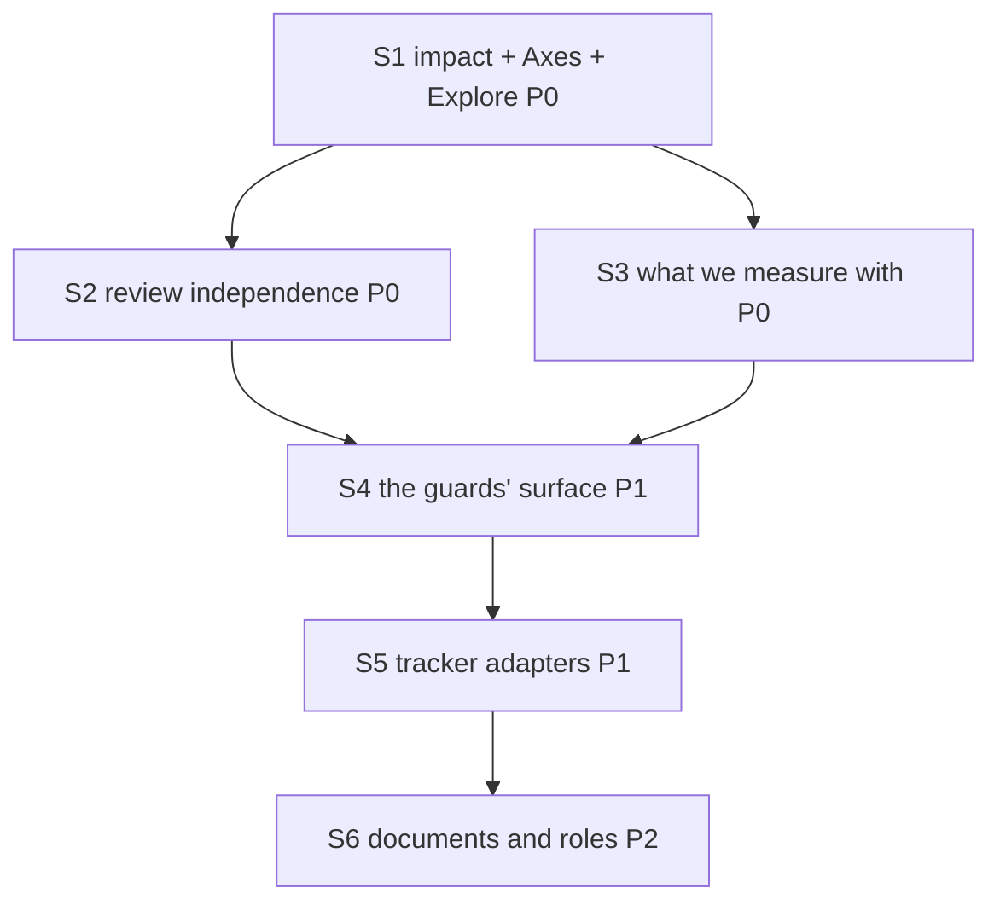

# PLAN: BDL-068 — The flow's rules are advice; make them instruments

> **Status:** Approved
> **Created:** 2026-09-02

---

## Epic Description

Six ordered slices. S1 builds the instrument; S2–S6 are the first five things measured by it,
and each is independently shippable. The epic's DAG is the six slices. **A slice's beads are
created when the preceding slice's review closes** — the architectural decision in CONTEXT,
and the re-plan rule expressed as structure rather than as discipline.

## Dependency DAG

**Critical path:** S1 → S2 → S4 → S5 → S6. S3 runs after S1 and may run beside S2.

## Beads

Only S1's beads are created now. S2–S6 are carried as slice-level placeholders so the DAG is
visible and the ordering is enforced by dependency rather than by memory.

| ID | Name | Priority | Depends On | Status |
|----|------|----------|------------|--------|
| S1.1 | Lift the three AST derivations out of `tests/` into a production package | P0 | - | Pending |
| S1.2 | `beadloom impact <path\|symbol>` over the lifted derivations, with the unresolved population in the answer | P0 | S1.1 | Pending |
| S1.3 | Validate the derivations retroactively against BDL-067's first dev bead | P0 | S1.1 | Pending |
| S1.4 | `## Axes` in the BRIEF and RFC core templates; `doc-quality` reports its absence | P0 | S1.2 | Pending |
| S1.5 | `Explore` role file, composed by `role-composer`, positioned in `/task-init` step 0.5 | P0 | S1.2 | Pending |
| S1.6 | The commit-scope check: a change outside the work item's declared axes is a finding | P0 | S1.4 | Pending |
| S1.7 | test — the derivations as shapes, the unresolved population, and the two new checks | P0 | S1.3, S1.5, S1.6 | Pending |
| S1.8 | review | P0 | S1.7 | Pending |
| S1.9 | tech-writer | P0 | S1.8 | Pending |
| S2 | slice: the review's independence, reported rather than asserted (#204, #212, #219) | P0 | S1.8 | Pending |
| S3 | slice: what we measure with — mutation runner, the platform axis, the clean-room limit | P0 | S1.8 | Pending |
| S4 | slice: the guards' enforcement surface (#170, `mr2l.81`, `mr2l.60`, `mr2l.82`, `mr2l.92`) | P1 | S2, S3 | Pending |
| S5 | slice: the tracker adapters (#187, #194, #171, #165, #164, #97, #207, #210) | P1 | S4 | Pending |
| S6 | slice: the flow's documents and roles (`mr2l.72`, `mr2l.91`, #191, #213, `iur5`, `ec1a`) | P2 | S5 | Pending |

## Bead Details

### S1.1: Lift the three AST derivations out of `tests/` into a production package

**Priority:** P0 · **Depends on:** — · **Blocks:** S1.2, S1.3

**What to do.** `tests/test_init_branches_that_reach_the_bootstrap.py` (30 cases) derives a
command's writing branches from its own source; `tests/test_one_parent_post_condition_over_every_writer.py`
(25) derives the graph writers by shape; `tests/test_graph_files_are_read_under_one_policy.py`
(15) derives the readers as *lists a directory and parses YAML* over six listing verbs and six
loaders. Move the derivations into a production package under `application/`; the tests keep
their assertions and import the lifted code.

**Done when:**
- [ ] No derivation logic remains in `tests/`, and each test still fails on the shape it was
      written to catch — verified by re-running the mutants those modules already carry.
- [ ] A derivation with no test that fails on a fifth body is NOT lifted; it is reported.
- [ ] `beadloom lint --strict` rc 0 with the new package placed inside the layer rules.

### S1.2: `beadloom impact <path|symbol>`

**Priority:** P0 · **Depends on:** S1.1 · **Blocks:** S1.4, S1.5

**What to do.** Four questions answered from the source — who else writes these files, who
else calls these symbols, how many branches the enclosing command has and how many ways it
terminates — plus the boundary from the graph: which domain each found site belongs to, and
therefore when a change leaves one. Human and `--json` output.

**Done when:**
- [ ] The answer names the population it could not resolve — unparseable module, dynamic
      dispatch, call through a variable — as a field, not an omission.
- [ ] Run against `onboarding/scanner/bootstrap.py` it lists both writers of graph nodes.
- [ ] Run against `services/commands/setup.py` it lists four entry points of `init` and the
      exit forms including `sys.exit`.
- [ ] It is NOT a graph walk: a node whose axes live entirely inside it still produces an answer.

### S1.3: Validate the derivations against BDL-067 retroactively

**Priority:** P0 · **Depends on:** S1.1 · **Blocks:** S1.7

**What to do.** Run the lifted derivations against the tree as it stood at BDL-067's first dev
bead (2026-08-31, before `acf4066`) and answer one question: would they have listed **both**
writers of graph nodes and **four** entry points of `init`?

**Done when:**
- [ ] The answer is recorded with the commit it was measured at, whichever way it comes out.
- [ ] If it is no, S1.2's acceptance is rewritten against what the derivation actually finds
      before any further slice consumes it. A feature justified by an argument where a
      measurement was available is the defect this epic exists to remove.

### S1.4: `## Axes` as a required section

**Priority:** P0 · **Depends on:** S1.2 · **Blocks:** S1.6

**What to do.** Add the heading to the BRIEF and RFC core templates.
`doc_templates.required_sections` already derives required sections from the composed
template's literal `## ` headings, so the heading makes the section required by the same act
and `doc-quality` reports its absence as `missing_sections` does for any other.

**Done when:**
- [ ] A BRIEF without `## Axes` is a `doc-quality` finding, verified on a document that lacks it.
- [ ] An `## Axes` section that is present and empty is also a finding.
- [ ] The section records the derivation's output AND the human's scope decision, and the
      bead's `refs:` is generated from it (CONTEXT Q1).

### S1.5: The `Explore` role

**Priority:** P0 · **Depends on:** S1.2 · **Blocks:** S1.7

**What to do.** A role file composed by `role-composer` like the other four, whose deliverable
is fixed: the `## Axes` section, paths and lines, no narrative. Positioned inside `/task-init`
before the type is chosen, because the axis count is what says whether a work item is a bug.

**Done when:**
- [ ] `config-check` sees it as a composed artifact, so `setup-agentic-flow` cannot drift it
      independently (#191's shape).
- [ ] `/task-init` cannot reach the type decision without it having run.

### S1.6: The commit-scope check

**Priority:** P0 · **Depends on:** S1.4 · **Blocks:** S1.7

**What to do.** A change touching a call site outside the work item's declared axes is a
finding. `sync-check --staged` and the commit-scoped hook already judge a commit by its paths;
this compares those paths against the axes the work item declared.

**Done when:**
- [ ] A commit touching a path outside the declared axes is reported, verified on a commit
      that does.
- [ ] A commit inside them is silent, verified on one that is — an always-red check is an
      ignored check.
- [ ] The finding names which axis the path fell outside, not merely that it did.

### S1.7: test

**Priority:** P0 · **Depends on:** S1.3, S1.5, S1.6 · **Blocks:** S1.8

Every derivation is asserted as a SHAPE with at least three evasion spellings measured, the
way `.25` did for the readers. Every new check is verified red on a named tree. Any assertion
that cannot fail is declared with its reason.

### S1.8: review · S1.9: tech-writer

**Priority:** P0

The review's assignment is fixed in advance: say whether `impact` under-reports, and on what
tree. A second ISSUES verdict on this slice re-plans it rather than opening a tenth cycle.
