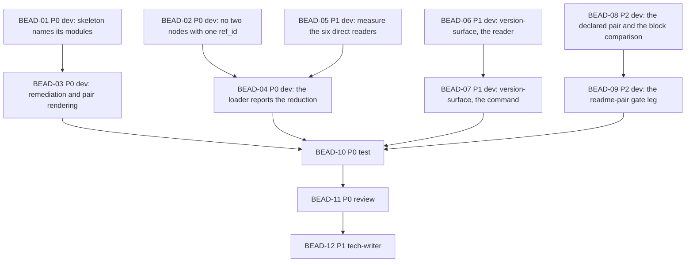

# PLAN: BDL-069 — The checks an adopter meets first, and the populations they run over

> **Status:** Approved
> **Created:** 2026-09-10

---

## Epic Description

Four defects of one shape, in four slices. S1 and S2 are the adopter blockers and are
independent of each other, so they run in parallel. S3 and S4 are this repository's own records
and land after. Every slice ends with its BDL-UX entry re-run against current behaviour before
it is moved to `Closed Issues` — that section's own standard, which a previous sweep proved
necessary by finding three of four entries still live.

## Dependency DAG

**Critical path:** BEAD-02 -> BEAD-04 -> BEAD-10 -> BEAD-11 -> BEAD-12

## Beads

| ID | Name | Priority | Depends On | Status |
|----|------|----------|------------|--------|
| BEAD-01 | S1 dev: the skeleton names the modules it already knows | P0 | - | Pending |
| BEAD-02 | S2 dev: a root node and the sole package cannot share one `ref_id` | P0 | - | Pending |
| BEAD-03 | S1 dev: a remediation that can be followed, and a stale line that names its pair | P0 | 01 | Pending |
| BEAD-04 | S2 dev: the loader reports the reduction instead of performing it | P0 | 02, 05 | Pending |
| BEAD-05 | S2 dev: measure what each of the six direct readers reads for | P1 | - | Pending |
| BEAD-06 | S3 dev: the reader behind `version-surface` | P1 | - | Pending |
| BEAD-07 | S3 dev: the `version-surface` command | P1 | 06 | Pending |
| BEAD-08 | S4 dev: the declared document pair and the block comparison | P2 | - | Pending |
| BEAD-09 | S4 dev: the `readme-pair` gate leg | P2 | 08 | Pending |
| BEAD-10 | test: the acceptance scenarios, on foreign projects and the built artifact | P0 | 03, 04, 07, 09 | Pending |
| BEAD-11 | review | P0 | 10 | Pending |
| BEAD-12 | tech-writer | P1 | 11 | Pending |

## Bead Details

### BEAD-01: S1 dev — the skeleton names the modules it already knows

**Priority:** P0 · **Depends on:** — · **Blocks:** BEAD-03

**What to do:** `generate_skeletons` writes a domain README that never names the node's modules,
and `missing_modules` is the rule that requires them. The modules are already in the index the
same `init` run built, and `_symbols_for_node` in `doc_generator.py` reads them for other
sections. Name them in the skeleton.

**Done when:**
- [ ] a virgin `init --yes --mode bootstrap` on a two-package `src/` project is followed by
      `beadloom ci` rc 0, with no hand editing, measured on a project that is not this one
- [ ] the same holds on the single-package layout once BEAD-02 lands
- [ ] no pair is attested at write time — the green comes from the document describing the code

### BEAD-02: S2 dev — a root node and the sole package cannot share one `ref_id`

**Priority:** P0 · **Depends on:** — · **Blocks:** BEAD-04

**What to do:** on a single-package `src/` layout the bootstrap emits a `service` root and a
`domain` with the same `ref_id`. Both node emitters are in scope: `bootstrap.py:94,119,140,175`
and `doc_classify.py:135`.

**Done when:**
- [ ] `init` on `myapp` with `src/myapp/` writes no two nodes with one `ref_id`
- [ ] `beadloom status` counts every node `init` reported writing
- [ ] `domain-needs-parent` fires over a population that contains the domain, and the graph
      satisfies it — the rule is not touched

### BEAD-03: S1 dev — a remediation that can be followed, and a stale line that names its pair

**Priority:** P0 · **Depends on:** BEAD-01 · **Blocks:** BEAD-10

**What to do:** three related repairs on one surface.
1. A staleness reason carries whether re-attesting can clear it (`doc_sync/engine.py`), and the
   `doc-stale` remediation is chosen from that flag (`gate.py:1211`).
2. `sync-update` names the pairs it left stale and why attesting could not move them (Q1). Its
   scope is untouched.
3. The stale line prints the `code_path` that distinguishes one pair from another, and the
   summary counts pairs rather than documents (Q3).

**Done when:**
- [ ] no check prints a remediation that cannot clear the reason it was printed for
- [ ] `sync-update --yes --all` over a content-reason staleness reports what it did not clear
- [ ] two pairs over one document render as two distinguishable lines
- [ ] the summary reads `pair(s)`, and its number equals the number of entries in `--json`

### BEAD-04: S2 dev — the loader reports the reduction instead of performing it

**Priority:** P0 · **Depends on:** BEAD-02, BEAD-05 · **Blocks:** BEAD-10

**What to do:** two nodes with one `ref_id` are reduced to one at parse and nothing says so.
Report it in `parse_graph_file` / `load_graph`, which every one of the seven readers reaches.
Whether the report is also routed through `each_graph_file` is decided by BEAD-05's measurement.

**Done when:**
- [ ] a graph file carrying one `ref_id` twice is reported, and the report names which node was
      kept and which was dropped
- [ ] the report reaches a reader that does NOT go through `each_graph_file` — demonstrated on
      one of the six by name
- [ ] the verdict the report feeds is stated: a report, not a refusal, so no shipped graph goes
      red on upgrade

### BEAD-05: S2 dev — measure what each of the six direct readers reads for

**Priority:** P1 · **Depends on:** — · **Blocks:** BEAD-04

**What to do:** six bodies read `.beadloom/_graph/` without the declared policy —
`graph/loader.py:186,283`, `graph/diff.py:220`, `reindex/change_detection.py:89`,
`reindex/indexing.py:62`, `commands/index_ops.py:235`, `commands/setup.py:967`. Measure what
each does with what it reads. A reader that parses nodes is routed through the policy. A reader
that hashes bytes or reads at a git ref is outside the policy's real population, and then the
policy's own sentence is what is wrong and gets narrowed.

**Done when:**
- [ ] each of the six is classified, by measurement, as parsing nodes or not
- [ ] every reader that parses nodes goes through `each_graph_file`, or its exception is stated
      with a reason in the module
- [ ] `graph_files.py`'s docstring states the population it actually holds

### BEAD-06: S3 dev — the reader behind `version-surface`

**Priority:** P1 · **Depends on:** — · **Blocks:** BEAD-07

**What to do:** a new module, because `beadloom impact` reads Python and four of the nine
surfaces are `unreadable-target`. It takes the source of truth from the manifest and finds that
literal elsewhere, recording for each place what checks it. `version_subjects` is not extended.

**Done when:**
- [ ] the nine places are found by derivation, not by a list in the source
- [ ] each place carries its checker, and the ones nothing checks are named as such
- [ ] the module states the population it searched and what it could not read

### BEAD-07: S3 dev — the `version-surface` command

**Priority:** P1 · **Depends on:** BEAD-06 · **Blocks:** BEAD-10

**What to do:** `beadloom version-surface`, named for symmetry with `typed-surface`. Reports the
places, their checkers, and the gap.

**Done when:**
- [ ] the command names every place, its checker, and the places checked by nothing
- [ ] it reports its own population and what it could not read
- [ ] run on this repository before the next release, its answer matches what the release
      actually had to edit

### BEAD-08: S4 dev — the declared document pair and the block comparison

**Priority:** P2 · **Depends on:** — · **Blocks:** BEAD-09

**What to do:** a pair declared in `.beadloom/config.yml`, modelled on `issue_log:`, and a
comparison that splits both files into blocks — heading, paragraph, code, list, table — and
compares the sequences with row counts. It reuses `doc_sync/tables.py`, which already reads a
document as blocks, rather than becoming a fifth reader of markdown.

**Done when:**
- [ ] the pair is declared, never hard-coded — an adopter's translated README is their business
- [ ] the comparison finds the paragraph that was present in Russian and absent in English on
      2026-09-10, on the files as they stood that day
- [ ] the comparison reports how many blocks it compared

### BEAD-09: S4 dev — the `readme-pair` gate leg

**Priority:** P2 · **Depends on:** BEAD-08 · **Blocks:** BEAD-10

**What to do:** a `beadloom ci` leg over the declared pairs.

**Done when:**
- [ ] the leg skips with a reason when no pair is declared, as `issue-log` does
- [ ] no adopter's Gate changes verdict on upgrade
- [ ] the leg's summary names the pairs it holds and the blocks it compared

### BEAD-10: test — the acceptance scenarios

**Priority:** P0 · **Depends on:** BEAD-03, BEAD-04, BEAD-07, BEAD-09 · **Blocks:** BEAD-11

**What to do:** the six scenarios the PRD references, tagged `@bead:` and `@node:`. Both adopter
scenarios build a project that is NOT this repository, on both layouts, and the acceptance runs
against the built artifact rather than the working tree.

**Done when:**
- [ ] all six scenarios exist under the exact names the PRD references
- [ ] coverage >= 80%; `beadloom ci` rc 0; `ruff` and `mypy --strict` clean
- [ ] each adopter scenario is red before its dev bead and green after, measured

### BEAD-11: review

**Priority:** P0 · **Depends on:** BEAD-10 · **Blocks:** BEAD-12

**What to do:** review under withholding — the reviewer receives `beadloom review-brief` and not
the epic's documents. Verify in a clean room built by `beadloom clean-room`, and state the
verdict in those words.

**Done when:**
- [ ] every finding carries the file, the line and a reproduction
- [ ] the four BDL-UX entries are re-run against current behaviour before any is moved to
      `Closed Issues`
- [ ] the room's verdict is reported as a room's verdict, not as the tree's

### BEAD-12: tech-writer

**Priority:** P1 · **Depends on:** BEAD-11 · **Blocks:** —

**What to do:** refresh what the change made stale.

**Done when:**
- [ ] the temporary sentence in both READMEs — "the first `beadloom ci` is worth reading rather
      than assuming green" — is removed, in the Russian source first and the English after
- [ ] `docs/services/cli.md` carries `version-surface` and the `readme-pair` leg
- [ ] `CHANGELOG` records the new command, the new leg, and the loader's new report
- [ ] `beadloom sync-check` rc 0 with no pair left unattested by a run nobody read
