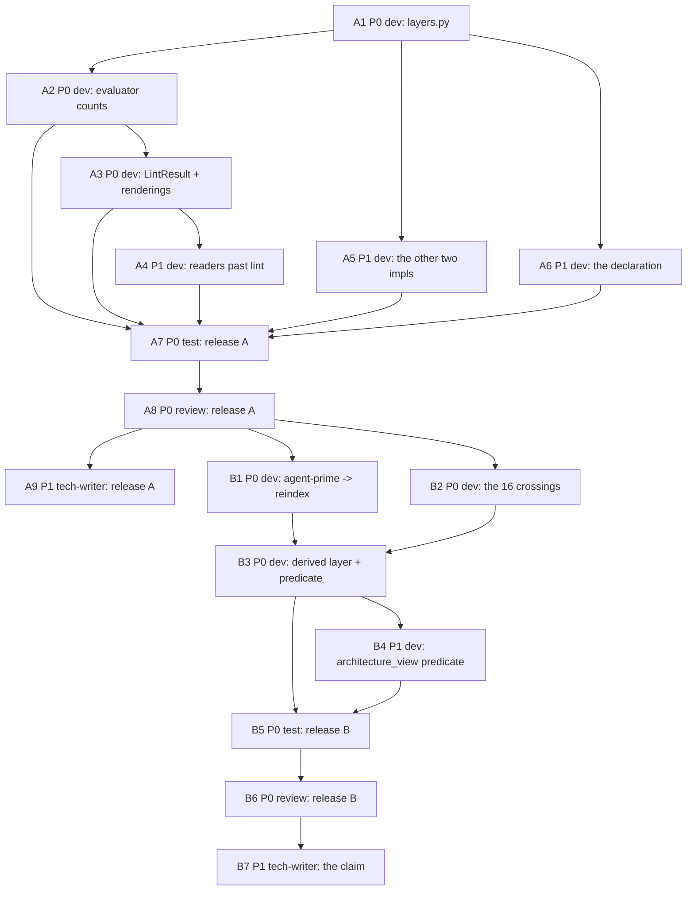

# PLAN: BDL-070 — The layer a node is in, answered once and reported over its population

> **Status:** Approved
> **Created:** 2026-09-12

---

## Epic Description

Release A makes `architecture-layers` state its population and unifies the three layer computations
without moving any rendered verdict. Release B changes what the rule evaluates — derived layers and
the shared-ancestor predicate — after the one reverse edge and the 16 peer crossings are resolved.

## Dependency DAG

**Critical path:** A1 -> A2 -> A3 -> A7 -> A8 -> B1/B2 -> B3 -> B5 -> B6 -> B7

## Waves

| Wave | Beads | Why they run together |
|---|---|---|
| 1 | A1 | Everything reads the shared lookup; nothing else can start. |
| 2 | A2 | `beadloom waves` serialised A2, A5 and A6 — see below. A2 first: P0, and A3 waits on it. |
| 3 | A5 | Serialised against A2 on `rule-engine`. |
| 4 | A6 | Serialised against both on `rule-engine` and `debt-report`. |
| 5 | A3 | `LintResult` needs the evaluator's population to exist. |
| 6 | A4 | The readers past `lint()` need the rendering settled. |
| 7 | A7 | Test, over all of Release A. |
| 8 | A8 | Review, withheld. |
| 9 | A9, B1, B2 | Docs for A; the reverse edge and the 16 crossings, both triage. |
| 10 | B3 | The verdict change, after triage. |
| 11 | B4 | `architecture_view`'s predicate. |
| 12 | B5 | Test, over Release B. |
| 13 | B6 | Review. |
| 14 | B7 | The claim, at its source in `.beadloom/flow/`, then recomposed. |

**This table was authored wrong and the graph corrected it, which is recorded rather than quietly
fixed.** It first read `Wave 2: A2, A5, A6 — disjoint files`. That was a guess. `beadloom waves
--parent beadloom-5tcc` returned three waves for the three beads and named every pair:

    beadloom-06dz | beadloom-1ylk — shared_node: rule-engine
    beadloom-06dz | beadloom-punn — shared_node: debt-report
    beadloom-1ylk | beadloom-punn — shared_node: rule-engine

All three touch `graph/rules/`, and `debt-report` is `part_of` `application`, which A5 declares — an
overlap the file-level guess could not see. The wave count rises from 12 to 14 and the dependency
DAG is unchanged; what changed is that three beads run one after another instead of together.

## Beads

| ID | Name | Priority | Depends On | Status |
|---|---|---|---|---|
| A1 | the shared layer lookup, pure and declaration-reading | P0 | - | Pending |
| A2 | the evaluator counts its population without changing a verdict | P0 | A1 | Pending |
| A3 | LintResult carries a per-rule population, in all four renderings | P0 | A2 | Pending |
| A4 | the readers that bypass lint() receive the population | P1 | A3 | Pending |
| A5 | liveness and architecture_view compute the layer through the shared lookup | P1 | A1 | Pending |
| A6 | one validated layer declaration, with an owner | P1 | A1 | Pending |
| A7 | tests for release A, including the verdict-neutrality proof | P0 | A2,A3,A4,A5,A6 | Pending |
| A8 | review of release A | P0 | A7 | Pending |
| A9 | docs for release A — what the rule now reports | P1 | A8 | Pending |
| B1 | the agent-prime -> reindex edge, resolved or accounted | P0 | A8 | Pending |
| B2 | the 16 peer crossings, triaged | P0 | A8 | Pending |
| B3 | the rule decides on the derived layer and the shared-ancestor predicate | P0 | B1,B2 | Pending |
| B4 | architecture_view's predicate joins the shared one | P1 | B3 | Pending |
| B5 | tests for release B, on graphs that are not this repository | P0 | B3,B4 | Pending |
| B6 | review of release B | P0 | B5 | Pending |
| B7 | the shipped claim brought to what the rule checks | P1 | B6 | Pending |

## Bead Details

### A1: the shared layer lookup, pure and declaration-reading

**Priority:** P0 · **Depends on:** — · **Blocks:** A2, A5, A6

**What to do:** `graph/rules/layers.py` — `layer_of(ref_id, layers, parents, tags)` returning the
node's own declared layer, else the nearest `part_of` ancestor's, else `None`. Reads the rule's
`layers` list; hardcodes nothing. Reuses `import_resolver._part_of_ancestors` or lifts the walk
beside it — never a third implementation. Also the population counter: evaluated / skipped-untagged,
over a given edge set.

**Done when:**
- [ ] `layer_of` is pure — no connection, no I/O — and its inputs are the declaration, the parent map and the tag map
- [ ] A cycle in `part_of` terminates rather than looping
- [ ] A node with its own tag keeps it and does not climb
- [ ] There is exactly one `part_of` ancestry walk reachable from `graph/rules/`, and a test names it
- [ ] No layer tag appears as a literal anywhere in `src/` outside a test fixture

### A2: the evaluator counts its population without changing a verdict

**Priority:** P0 · **Depends on:** A1 · **Blocks:** A3, A7

**What to do:** `evaluate_layer_rules` keeps deciding on own-tags and additionally counts, via
`layer_of`, what it would judge under ancestry. Emit the population the way
`scenario_coverage._population_statement` does — a finding from inside the evaluator. Collapse the
five `_cached_tags` closures onto one lookup.

**Done when:**
- [ ] `lint --strict` on this repository REMOVES no finding and changes no decision, and adds exactly the population advisory — and the test asserts that. **Corrected 2026-09-12:** this first read "produces a findings list identical to the pre-change one", which cannot hold beside the line below it — a population emitted as a finding adds one. Measured across `a8c306d8 -> ff4fb866` with each commit's own sources: 0 removed, 1 added (`architecture-layers:layer_population:warn`).
- [ ] The population names both numbers: edges evaluated, edges skipped for an untagged end
- [ ] The four other rule kinds' verdicts are unchanged, asserted rather than assumed
- [ ] A graph declaring layers no node carries reports its zero denominator once, not per edge

### A3: LintResult carries a per-rule population, in all four renderings

**Priority:** P0 · **Depends on:** A2 · **Blocks:** A4, A7

**What to do:** `LintResult` gains a per-rule population, additively. A clause beside `_inert_note` /
`_suppressed_note` / `_unattributed_note` in `format_rich`; the same fact in `format_json`,
`format_github`, `format_porcelain`, and in `beadloom lint`'s own line at `federation.py:325`.

**Done when:**
- [ ] All four renderings carry the population, each asserted by a test reading its output
- [ ] `format_json`'s existing keys are unchanged — additive only
- [ ] The green line and the red line both carry it; a population is not a consolation for a failure

### A4: the readers that bypass lint() receive the population

**Priority:** P1 · **Depends on:** A3 · **Blocks:** A7

**What to do:** `application/gate.py` `lint_step`, `services/mcp_server.py` `handle_lint`,
`tui/data_providers.py` + `widgets/lint_panel.py`, `application/debt_report/collect.py`,
`onboarding/scanner/prime.py`. The TUI and the debt report call `evaluate_all` directly, so they
take the population from the finding rather than from the summary.

**Done when:**
- [ ] Each of the five surfaces shows the population, asserted per surface
- [ ] A test names the set of callers of `evaluate_all` and fails when a new one appears unhandled
- [ ] `prime`'s output stays inside its declared token budget

### A5: liveness and architecture_view compute the layer through the shared lookup

**Priority:** P1 · **Depends on:** A1 · **Blocks:** A7

**What to do:** `liveness._layer_reasons` and `_GraphFacts.tags` call `layer_of`.
`architecture_view` drops `_LAYER_TAGS`, `_LAYER_RANK`, `_layer_of`, `_own_layers`, `_layer_rank`
and calls it too. **Its verdict predicate at `:268` is not touched here** — that is B4.

**Done when:**
- [ ] `_LAYER_TAGS` and `_LAYER_RANK` no longer exist
- [ ] A test asserts the rule engine and the architecture view return the same layer for every node in the graph
- [ ] The architecture view's rendered output is byte-identical across the change on this repository
- [ ] Liveness verdicts for `architecture-layers` are unchanged

### A6: one validated layer declaration, with an owner

**Priority:** P1 · **Depends on:** A1 · **Blocks:** A7

**What to do:** `validate_rules` gains the `LayerRule` case, so a layer tag matching no node is
reported. Resolve the `tags:` catalog at `rules.yml:3`–`:7` — **RFC Q5 is open and this bead decides
it, in writing**: it becomes the declaration, or it is removed. Give `rules.yml` an owning node. Four
sites load the file; they load it once or each states why it does not.

**Done when:**
- [ ] Q5 is answered in the bead's comments with a reason, before the code changes
- [ ] A layer tag matching no node is a finding, with a test
- [ ] `beadloom impact` on a node names `rules.yml` under `Owns unread` for exactly one node
- [ ] The catalog's 10-node / 12-node disagreement is gone, either by removal or by reconciliation

### A7: tests for release A, including the verdict-neutrality proof

**Priority:** P0 · **Depends on:** A2, A3, A4, A5, A6 · **Blocks:** A8

**What to do:** The Gherkin scenarios the PRD references, plus the neutrality proof.

**Done when:**
- [ ] `Scenario: the layer rule states how many edges it evaluated and how many it skipped`
- [ ] `Scenario: a graph where every node is tagged reports no skipped edges`
- [ ] `Scenario: the population reaches a reader that calls the evaluators without lint`
- [ ] `Scenario: the rule engine and the architecture view agree on every node's layer`
- [ ] `Scenario: a layer declared only in rules.yml is honoured without being hardcoded`
- [ ] `Scenario: a layer tag matching no node is reported by validate_rules`
- [ ] Neutrality is proved on this repository AND on a fixture that is not it, in the corrected sense recorded under A2 — nothing removed, no decision changed
- [ ] The neutrality measurement is taken BEFORE the Gherkin is added and again after, and both numbers are stated: adding any `.feature` file rewrites ~40 `scenario-coverage` messages, which is why A2 wrote no scenario and left the Gherkin to this bead
- [ ] Coverage >= 80%; `layers.py` is added to the mutation targets, or the bead says why not

### A8: review of release A

**Priority:** P0 · **Depends on:** A7 · **Blocks:** A9, B1, B2

**What to do:** Read-only review. The launch prompt carries the bead id and declares anything else
it carries (BDL-UX #286).

**Done when:**
- [ ] The verdict-neutrality claim is checked by the reviewer's own run, not read from a test name
- [ ] The reader set is re-derived by a method other than name-matching, and the result is reported either way
- [ ] Findings posted to bead comments; no code edited

### A9: docs for release A — what the rule now reports

**Priority:** P1 · **Depends on:** A8 · **Blocks:** —

**What to do:** Docs for the population report only. **The claim in `dev.md.txt:13` is NOT corrected
here** — it becomes true in Release B, and correcting it early would make the docs wrong in the other
direction.

**Done when:**
- [ ] `sync-check` rc 0
- [ ] The SPEC states the rule's population, and states that inheritance has not shipped yet

### B1: the agent-prime -> reindex edge, resolved or accounted

**Priority:** P0 · **Depends on:** A8 · **Blocks:** B3

**What to do:** `agent-prime` (part_of `onboarding`, a domain) -> `reindex` (part_of `application`),
`extra {"derived": "imports"}`. Decide whether it is a real layering violation, a defect in import-
derived edges, or a legitimate exception — then act.

**Done when:**
- [ ] The import is fixed, or the exception is recorded in `rules.yml` with its reason
- [ ] If it is an edge-derivation defect, that is filed separately rather than fixed silently here
- [ ] Release B's run over this repository reports no finding for this edge

### B2: the 16 peer crossings, triaged

**Priority:** P0 · **Depends on:** A8 · **Blocks:** B3

**What to do:** `onboarding -> graph` 5, `onboarding -> context-oracle` 3,
`cli-commands -> mcp-server` 2, and one each of `graph -> context-oracle`, `graph -> doc-sync`,
`cli-commands -> tui`, `cli-commands -> guard-probes`, `guard-probes -> mcp-server`,
`mcp-server -> guard-probes`. Each is fixed or exempted with a stated reason.

**Done when:**
- [ ] All 16 are dispositioned, none left undecided
- [ ] Every exemption names its reason in `rules.yml`; a bare allow is not an outcome
- [ ] The count is re-measured after the work rather than assumed to be 16

### B3: the rule decides on the derived layer and the shared-ancestor predicate

**Priority:** P0 · **Depends on:** B1, B2 · **Blocks:** B4, B5

**What to do:** `evaluate_layer_rules` decides on `layer_of`'s answer. Same-layer edges are legal
when both ends share a tagged ancestor and a finding when they do not (RFC Q1).

**Done when:**
- [ ] The evaluated population on this repository is the ancestry figure, and the run states it
- [ ] `lint --strict` rc 0 on this repository after B1 and B2
- [ ] The CHANGELOG carries an upgrade note naming the verdict change before the release ships
- [ ] A fixture with no `part_of` at all behaves as it did before the change

### B4: architecture_view's predicate joins the shared one

**Priority:** P1 · **Depends on:** B3 · **Blocks:** B5

**What to do:** Replace `dst_rank <= src_rank` at `:268` with the shared predicate.

**Done when:**
- [ ] The two instruments flag the same edge set on this repository, asserted
- [ ] Any change to the rendered architecture view is intentional and named in the bead

### B5: tests for release B, on graphs that are not this repository

**Priority:** P0 · **Depends on:** B3, B4 · **Blocks:** B6

**Done when:**
- [ ] `Scenario: a component inherits its layer from the nearest tagged ancestor`
- [ ] `Scenario: an import from infrastructure into a domain is reported`
- [ ] `Scenario: a node with its own tag keeps it rather than inheriting`
- [ ] A nested-component fixture and a no-`part_of` fixture, neither of them this repository
- [ ] A test asserts the 114/16 split is recomputed rather than written down

### B6: review of release B

**Priority:** P0 · **Depends on:** B5 · **Blocks:** B7

**Done when:**
- [ ] The reviewer runs the upgrade path — an index built before the change, read after it
- [ ] The verdict change is checked against the CHANGELOG note's claim
- [ ] Findings posted to bead comments; no code edited

### B7: the shipped claim brought to what the rule checks

**Priority:** P1 · **Depends on:** B6 · **Blocks:** —

**What to do:** `onboarding/templates/roles/architecture/ddd/dev.md.txt:13`, the rule-engine SPEC,
`docs/domains/graph/README.md:81`, the `cli-commands` and `guard-probes` `DOC.md`s, and
`.beadloom/AGENTS.md:57`. **Edit at the source in `.beadloom/flow/`, then `beadloom
setup-agentic-flow`** — never the composed `.claude/` copies.

**Done when:**
- [ ] Every claim about what a green `lint --strict` proves matches the rule's own report
- [ ] `test_live_flow_equals_its_composition` passes
- [ ] `sync-check` rc 0 and `docs audit` clean
