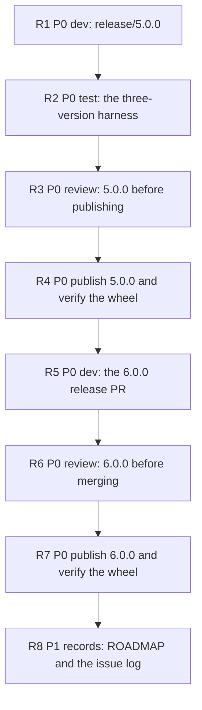

# PLAN: BDL-071 — Release 5.0.0, then 6.0.0: the population report ships before the verdict change

> **Status:** Approved
> **Created:** 2026-09-13

---

## Epic Description

Publish 5.0.0 from `release/5.0.0` on `7efa4006`, verify it on the downloaded wheel, then publish
6.0.0 from `main` and verify that too. Every step waits on the one before, because each release is
measured on the artifact the previous step produced.

## Dependency DAG

**Critical path:** R1 -> R2 -> R3 -> R4 -> R5 -> R6 -> R7 -> R8 — the whole plan.

## Beads

| ID | Name | Priority | Depends On | Status |
|---|---|---|---|---|
| R1 | release/5.0.0: the bump, the audit triples and the 5.0.0 change log | P0 | - | Pending |
| R2 | a harness that tells 4.0.0, 5.0.0 and 6.0.0 apart on a project that is not ours | P0 | R1 | Pending |
| R3 | review of 5.0.0 before it is published | P0 | R2 | Pending |
| R4 | publish 5.0.0 and verify the downloaded wheel | P0 | R3 | Pending |
| R5 | the 6.0.0 release pull request | P0 | R4 | Pending |
| R6 | review of 6.0.0 before it is merged | P0 | R5 | Pending |
| R7 | publish 6.0.0 and verify the downloaded wheel | P0 | R6 | Pending |
| R8 | the records: ROADMAP and the issue log | P1 | R7 | Pending |

## Bead Details

### R1: release/5.0.0 — the bump, the audit triples and the 5.0.0 change log

**Priority:** P0 · **Depends on:** — · **Blocks:** R2 · **Role:** dev

**What to do:** Branch `release/5.0.0` from `7efa4006`. Raise every current-version row the RFC names
to `5.0.0`. Recompose with `beadloom setup-agentic-flow`. Add the three `docs_audit.ignore` triples,
each with its reason. Review `docs/architecture.md` and `docs/guides/ci-setup.md`, then re-attest with
`beadloom sync-update beadloom`. Rename `[Unreleased]` to `[5.0.0] - <date>` and add a short release
note: population reporting, no verdict change. Push the branch. Do not tag and do not publish.

**Done when:**
- [ ] `beadloom version-surface` on the branch sweeps `5.0.0` and reports every checked place agreeing
- [ ] No history line is edited: the diff against `7efa4006` touches only the RFC's `yes` rows
- [ ] `[5.0.0]` contains none of `inherited_evaluated`, `inherited_total`, `unjudged`, `Release B`,
      `357 of 365`, measured by grep
- [ ] `beadloom ci` rc 0, `ruff` rc 0, `mypy --strict` rc 0, and the full coverage suite green on the
      branch commit, run in the foreground with no commit or push during it
- [ ] `692205d7` is not an ancestor of the branch head

### R2: a harness that tells 4.0.0, 5.0.0 and 6.0.0 apart on a project that is not ours

**Priority:** P0 · **Depends on:** R1 · **Blocks:** R3 · **Role:** test

**What to do:** A fixture project, not this repository, whose graph makes the three versions differ
exactly as documented: 4.0.0 prints no population and passes; 5.0.0 prints the population statement
and returns 4.0.0's verdict; 6.0.0 judges by inheritance and returns the verdict its upgrade note
states. A script that installs a given wheel or PyPI version into a fresh environment, runs
`beadloom --version`, `lint --strict`, `lint --format json` and the porcelain form over the fixture,
and prints one comparable record per version.

**Done when:**
- [ ] Run against PyPI 4.0.0 and the local R1 build, its records differ only as 5.0.0 documents
- [ ] Run against a build of `main`, the 6.0.0 difference shows — the verdict and five JSON keys
- [ ] It fails loudly when the installed version is not the one requested, because a silently skipped
      publish is the failure it exists to catch
- [ ] It lives under `tests/` or the scratchpad and is not scanned by the docs audit

### R3: review of 5.0.0 before it is published

**Priority:** P0 · **Depends on:** R2 · **Blocks:** R4 · **Role:** review

**Done when:**
- [ ] The reviewer re-derives the version surface on the branch rather than trusting R1's account
- [ ] Every edited line is a current-version claim, and no history line moved
- [ ] The three ignore triples are the three measured false positives and nothing broader
- [ ] `[5.0.0]` describes exactly what the branch contains
- [ ] The R2 harness run is repeated by the reviewer, not read from its report
- [ ] Verdict posted to bead comments; no code edited

### R4: publish 5.0.0 and verify the downloaded wheel

**Priority:** P0 · **Depends on:** R3 · **Blocks:** R5 · **Role:** coordinator — an outward, irreversible
action, taken in the main loop

**What to do:** `gh release create v5.0.0 --target <R1 head>`, with `[5.0.0]` as the notes. Watch the
publish run to completion. Then run the R2 harness against `beadloom==5.0.0` from PyPI.

**Done when:**
- [ ] The tag resolves to R1's head, `7efa4006` is its ancestor and `692205d7` is not
- [ ] The publish run completed with success
- [ ] The downloaded wheel reports `5.0.0`, and the harness record matches the pre-publish one
- [ ] If the run is red for a reason that is not a flake, stop and report; do not re-tag

### R5: the 6.0.0 release pull request

**Priority:** P0 · **Depends on:** R4 · **Blocks:** R6 · **Role:** dev

**What to do:** Branch from `main`. Raise every current-version row from `4.0.0` to `6.0.0`,
recompose, add the same three triples, re-attest. Split the change log: `[5.0.0]` copied byte-for-byte
from the **published** `release/5.0.0` file; `[6.0.0]` above it with Release B's text; the
open-decision paragraph removed; the sentence claiming no published version carried the three keys
replaced by a `### Removed` entry naming `inherited_evaluated`, `inherited_total`, `unjudged` and the
sixth porcelain field. Open the pull request.

**Done when:**
- [ ] `[5.0.0]` on the branch is byte-identical to `[5.0.0]` in the published branch, compared by
      `diff`
- [ ] `[6.0.0]` names the three keys and the porcelain field under `### Removed`
- [ ] No sentence in the change log says a published version never carried those keys
- [ ] `beadloom ci`, `ruff`, `mypy` and the full coverage suite green, run in the foreground

### R6: review of 6.0.0 before it is merged

**Priority:** P0 · **Depends on:** R5 · **Blocks:** R7 · **Role:** review

**Done when:**
- [ ] The byte-identity of `[5.0.0]` is checked by the reviewer's own `diff`
- [ ] The `### Removed` entry matches the shapes measured at `7efa4006` and on `main`
- [ ] The version surface is re-derived and no history line moved
- [ ] Verdict posted to bead comments; no code edited

### R7: publish 6.0.0 and verify the downloaded wheel

**Priority:** P0 · **Depends on:** R6 · **Blocks:** R8 · **Role:** coordinator

**What to do:** Nine green checks, merge, `gh release create v6.0.0 --target <merge commit>`, watch
the run, run the R2 harness against `beadloom==6.0.0` from PyPI.

**Done when:**
- [ ] The tag resolves to the merge commit on `main`
- [ ] The publish run completed with success
- [ ] The downloaded wheel reports `6.0.0`, changes the verdict as its upgrade note states, and emits
      five population keys

### R8: the records — ROADMAP and the issue log

**Priority:** P1 · **Depends on:** R7 · **Blocks:** — · **Role:** dev, not tech-writer, because these
files live outside `docs/`

**What to do:** `ROADMAP.md` "Current version" set to 6.0.0, verified on the downloaded wheel, and a
release row each for 5.0.0 and 6.0.0. An issue-log entry, number allocated first, for the docs audit
reading dated history as a current-version claim. Land it through a pull request.

**Done when:**
- [ ] Both rows and the current version are in `ROADMAP.md`, and nothing is written into a scanned
      document
- [ ] The issue-log entry is filed with its number allocated by `beadloom issue-number allocate`
- [ ] The pull request is merged with nine green checks
