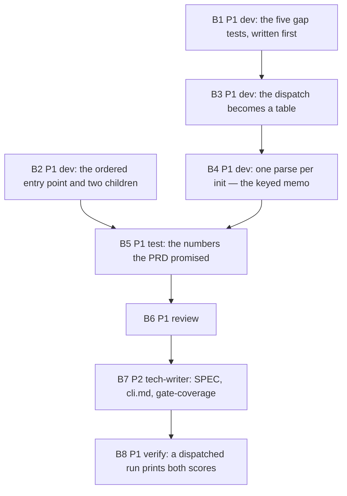

# PLAN: BDL-073 — The mutation duty becomes executable

> **Status:** Approved
> **Created:** 2026-09-25

---

## Epic Description

Three fronts from the approved RFC: order each mutant's covering tests cheapest-first and halve the
concurrency (tooling); close the five gaps the surviving `load_rules` mutants name (tests); collapse
the twelve-branch dispatch into a table and parse `rules.yml` once per `init` (product). Proven by a
dispatched run that prints both scores.

## Dependency DAG

**Critical path:** B1 → B3 → B4 → B5 → B6 → B7 → B8. B2 runs beside B1 in the first wave.

**Waves:** W1 {B1, B2} — disjoint (B1 `tests/` for the loader; B2 `.github/`, the entry point,
`tests/test_mutation_ci_job.py`) · W2 {B3} · W3 {B4} — the same file as B3, so serial · W4 {B5} ·
W5 {B6} · W6 {B7} · W7 {B8}.

## Beads

| ID | Name | Priority | Depends On | Status |
|---|---|---|---|---|
| B1 | the five gap tests, each seen red against its mutant, before any refactor | P1 | - | Pending |
| B2 | two mutmut children (restated 2026-09-25: the ordering entry point was withdrawn) | P1 | - | Done |
| B3 | the twelve-branch dispatch becomes a table, and the authoring keys become one list | P1 | B1 | Pending |
| B4 | one parse per `init`: `load_rules` memoised on path, mtime and size | P1 | B3 | Pending |
| B5 | test: the numbers the PRD promised, measured | P1 | B2, B4 | Pending |
| B6 | review — the table hides no special case (the entry point question lapsed with its withdrawal) | P1 | B5 | Done |
| F1 | the review's minors: the memo returns a copy, the upstream ordering pinned, a seam to forget (`beadloom-nzlc.1`) | P1 | B6 | Pending |
| B7 | tech-writer: the four stale doc pairs, the cli.md mutation section, gate-coverage | P2 | F1 | Pending |
| B8 | verify: a dispatched `Mutation` run prints both scores | P1 | B7 | Pending |

## Bead Details

### B1: the five gap tests, written first

**Scope:** `tests/` only. One test per surviving mutant of `load_rules` (2, 15, 33, 41, 233): the
codec at `loader.py:883`, the empty-`rules:` default at `:900`, the message texts at `:887`, `:902`
and the twelve per-rule bodies.
**Done when:** each test is green on the tree and red against its mutant, and the invocation that
proved red is written in the bead comment — `PYTHONPATH=<repo>/mutants/src` and
`MUTANT_UNDER_TEST=beadloom.graph.rules.loader.x_load_rules__mutmut_<N>` from inside `mutants/`.
A red that was not produced that way is not a red.

### B2: ordered covering tests and two children

**Scope:** a repo-local entry point that imports mutmut, replaces the unordered `set` handed to
pytest at `mutmut/__main__.py:1443` with the tests sorted by `mutmut.duration_by_test`, asserts the
mutmut version and the shape of the line it replaces, and then calls mutmut's own CLI. The workflow's
two `mutmut run` steps move to it; `--max-children` 4 → 2. `tests/test_mutation_ci_job.py:103` moves
with its reason restated — no runner invocation decides the verdict.
**Done when:** the entry point refuses to run against a mutmut whose line has moved (a test proves
it), every existing pin of `test_mutation_ci_job.py` and `test_mutation_runner_scope.py` still holds,
and the same six mutants as the baseline (50, 68, 85, 217, 250, 333) keep their verdicts with a
mean time-to-kill at or under 6 s against 21.8 s.

### B3: the dispatch becomes a table

**Scope:** `graph/rules/loader.py` lines ~954-1067, and `onboarding/scanner/rules_gen.py:82` reading
the same table instead of keeping its own twelve-key map. `has_layers` and the `forbid_cycles`
`else` arm stay explicit.
**Done when:** B1's tests and every test the RFC names as pinning the current dispatch pass
unchanged; `test_rule_engine.py:3941`, `:3950` and `test_onboarding.py:2801` pass; and the generated
tree holds at most 160 `def x_load_rules__mutmut_N`.

### B4: one parse per init

**Scope:** `load_rules` memoised on `(path, st_mtime_ns, st_size)`, returning the shared list of
frozen rules. `reindex` and `lint` touch the same `rules.yml` once per `beadloom init`.
**Done when:** a call counter shows one parse per `init` over one path;
`tests/test_bead14_s4_binding.py::TestTheConfiguredLocationCannotBuyASilentGreen::test_moving_the_location_through_the_real_lint_command_is_not_a_clean_run`
passes; and the TUI's `LintDataProvider.refresh()` sees a `rules.yml` edited between two refreshes,
proven by a test.

### B5: the numbers

**Scope:** measure, do not re-implement. The mutant count of `load_rules` in a freshly generated tree;
the six-mutant ordering benchmark against its 21.8 s baseline; the covering-test count of
`load_rules` (unchanged at 827 is the expected answer — say so if it moves); coverage ≥80% on what
B1-B4 touched; the full suite green on the tree.
**Done when:** each number is in the bead comment beside the invocation that produced it.

### B6: review

Read-only. The review brief withholds the authors' accounts. Two questions a green suite cannot
answer are the review's: whether the table hid a special case, and whether the entry point would
keep patching silently after a mutmut upgrade.

### B7: the documents

`docs/domains/graph/features/rule-engine/SPEC.md` if the dispatch description changes;
`docs/services/cli.md`'s mutation section and `gate-coverage/DOC.md` for the ordered entry point
and the two children; the workflow header's prose in the same measured register.

### B8: verify

Dispatch `Mutation` on the branch after the owner's `gh auth refresh -s workflow`. Both scoring
steps print a score, or the bead records where and how the run died, against the eight deaths
already on `beadloom-5isv`. The numbers go on the bead against the two floors; a breach is a finding.
