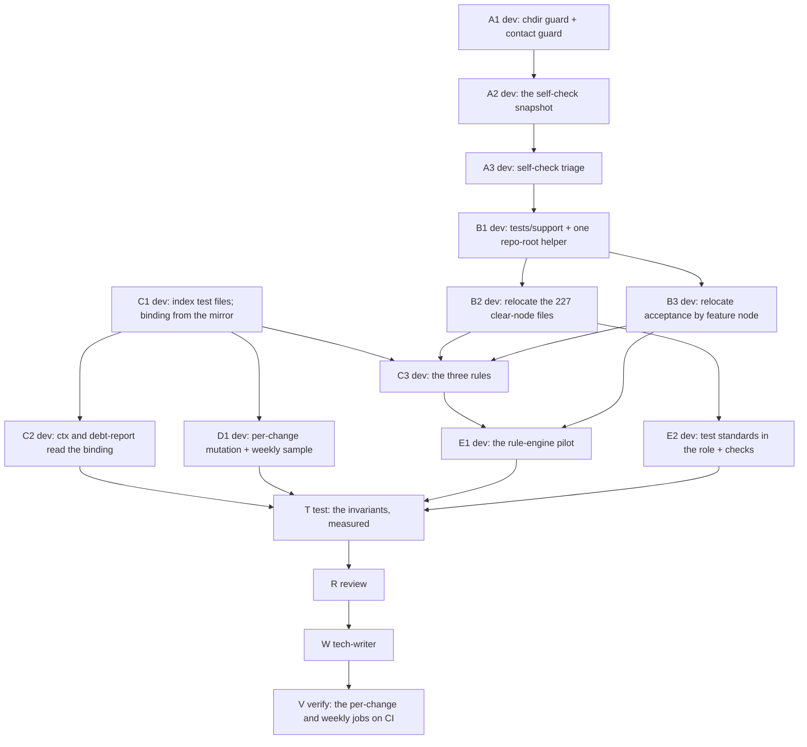

# PLAN: BDL-074 — Tests that belong to the graph

> **Status:** Approved
> **Created:** 2026-09-28

---

## Epic Description

Isolation first, because every later measurement depends on a suite that does not race for the
repository's own index. Then the product side of the binding in parallel with the test-side moves,
then the rules and the per-change mutation over the binding, then the pilot. One pull request per
phase, each landing with nine green checks.

## Dependency DAG

**Critical path:** A1 → A2 → A3 → B1 → B2 → C3 → E1 → T → R → W → V.

**Waves:** W1 {A1, C1} · W2 {A2, C2, D1} · W3 {A3} · W4 {B1} · W5 {B2, B3} · W6 {C3, E2} · W7 {E1} ·
W8 {T} · W9 {R} · W10 {W} · W11 {V}. `beadloom waves` decides each wave's real shape; test-side and
product-side beads are disjoint by file, which is what lets C1, C2 and D1 run beside the A beads.

**Pull requests:** after W3 (isolation and self-checks), after W5 (layout), and at the end — each with
nine green checks.

## Beads

| ID | Tracker | Name | Priority | Depends On | Status |
|---|---|---|---|---|---|
| A1 | `beadloom-l67s` | the chdir guard and the contact guard, measured before the fix | P1 | - | Done |
| A2 | `beadloom-kixx` | the self-check snapshot replaces `live_repo_reindexed` | P1 | A1 | Done |
| A3 | `beadloom-2esy` | the self-check triage: 547 checks by what they guard, Gate duplicates removed | P1 | A2 | Done |
| B1 | `beadloom-51yx` | `tests/support/` and one repository-root helper | P1 | A3 | Done |
| B2 | `beadloom-1bd6` | relocate the 227 clear-node files, collected set unchanged | P1 | B1 | Done |
| B3 | `beadloom-d0bp` | relocate acceptance by feature node, `@node:` matches | P1 | B1 | Done |
| B4 | `beadloom-2mj3.4` | acceptance one folder per node (added 2026-09-28, owner ruling) | P1 | B3 | Done |
| C1 | `beadloom-5qgt` | index test files; the binding from the mirror, with a `tests:` override | P1 | - | Done |
| C2 | `beadloom-3z94` | `ctx` and `debt-report` read the binding, shape kept | P1 | C1 | Done |
| C3 | `beadloom-kag9` | the rules: `test_binding`, `test_import_boundary`, `scenario_binding` | P1 | C1, B2, B3, B4 | Done |
| D1 | `beadloom-vr0b` | mutation per change and the weekly sample | P1 | C1 | Done |
| E1 | `beadloom-cs2o` | the rule-engine pilot, invariants before and after; the 15 rule-engine survivors (added 2026-09-28, owner) | P1 | C3, B3, B4 | Done |
| E2 | `beadloom-kug7` | test standards in the `test` role, and the checkable ones checked | P2 | B2 | Done |
| W1 | `beadloom-2mj3.1` | docs: the pairs C1 made stale (added 2026-09-27) | P1 | C1 | Done |
| W2 | `beadloom-2mj3.2` | docs: the pairs C2 made stale (added 2026-09-27) | P1 | C2 | Done |
| W3 | `beadloom-2mj3.3` | docs: the pairs D1 made stale (added 2026-09-28) | P1 | D1 | Done |
| W4 | `beadloom-2mj3.5` | docs: the pairs C3 made stale (added 2026-09-28) | P1 | C3 | Done |
| T | `beadloom-75pl` | test: the invariants, measured | P1 | C2, D1, E1, E2 | Done |
| F1 | `beadloom-2mj3.6` | truthful suite numbers (added 2026-09-28, owner, after T) | P1 | T | Done |
| F2 | `beadloom-2mj3.7` | reindex and test-mapping get bound tests (added 2026-09-28) | P1 | T | Done |
| F3 | `beadloom-2mj3.8` | the three tags; self-checks and scenarios outside the outcomes (added 2026-09-28) | P1 | T | Done |
| W5 | `beadloom-2mj3.9` | docs: the pairs the fix wave made stale (added 2026-09-28) | P1 | F1 | Done |
| R | `beadloom-b9ll` | review | P1 | T, F1, F2, F3, W5 | Pending |
| W | `beadloom-7u77` | tech-writer | P2 | R | Pending |
| V | `beadloom-paze` | verify: the per-change and weekly jobs on CI; the ai-techwriter index cache key (added 2026-09-28) | P1 | W | Pending |

> **Status is as of 2026-09-28 and is copied from the tracker by hand.** The tracker (`bd list --all --parent beadloom-2mj3`) and ACTIVE.md, which a pre-commit hook reconciles from it, are authoritative; this column is not. Rows B4, W1–W3 and the edges from B4 were added during the run and are recorded in ACTIVE.md and CONTEXT.md.

## Bead Details

### A1: the chdir guard and the contact guard

**Scope:** `tests/conftest.py`, `tests/tracked_write_guard`, and whichever tests break. An autouse
fixture moves each test into an empty temporary directory; the contact guard fails a non-self-check
test that opens the repository's `.beadloom/beadloom.db` or runs `bd`/`git` rooted at it.
**Done when:** the number of breaking tests is measured before any fix and written on the bead; each
is fixed by an explicit root; the map's tracer finds 0 contacts outside `live_repo_reindexed` users.

### A2: the self-check snapshot

**Scope:** a session fixture that copies the tracked files once and reindexes the copy; the 12 files
using `live_repo_reindexed` move to it; a `self_check` marker.
**Done when:** the tracer finds 0 contacts with the live index across the whole suite, and the four
files that wrote it no longer do.

### A3: the self-check triage

**Scope:** the 547 tests in 76 files, each classified by what it guards and whether a required Gate
leg checks the same thing. Duplicates leave with the leg named; the checker keeps a synthetic-fixture
test. The rest move to `tests/self_check/{architecture,docs,config,process}/`.
**Done when:** a table on the bead accounts for all 547; the self-check time is re-measured against
145.5 s.

### B1: `tests/support/` and one root helper

**Scope:** shared helpers (`adopter_project` and the 14 test-module imports) move to `tests/support/`;
the 97 files that find the root from their own depth use one helper that finds `pyproject.toml`.
**Done when:** no test module imports another test module; the collected set and results unchanged.

### B2: relocate the 227 clear-node files

**Scope:** `git mv` into `tests/{unit,integration}/<mirror>/` by the map's primary node and kind; the
mutation pool in `pyproject.toml` regenerated; `tests/test_mutation_runner_scope.py` kept green.
**Done when:** identical collected ids modulo path, identical results, pool regenerated.

### B3: relocate acceptance

**Scope:** `.feature` files whose `@node:` names the measured node move to
`tests/acceptance/<domain>/<feature>.feature`; step files to `steps/<domain>/` and `steps/common/`;
`scenarios(...)` paths and `rules.yml:413` updated; mismatches listed, not moved.
**Done when:** 510 scenarios collected before and after, identical results.

### C1: the test index and the binding

**Scope:** reindex records test files (path, node, kind, count, imports) in their own tables; the
binding derives from the mirror with an optional `tests:` override; the heuristic stops overwriting
`extra["tests"]`, which is rebuilt from the binding in its four-key shape — no `mutants/`, a parent's
count the union of its children's files.
**Done when:** test-first; `extra["tests"]` for every node from the binding; 0 entries under
`mutants/`.

### C2: consumers read the binding

**Scope:** `ctx`'s `Tests:` line, `debt-report`'s untested count.
**Done when:** `ctx rule-engine` reports the tests bound to it; `debt-report` agrees with the binding.

### C3: the rules

**Scope:** three rule types with populations stated; this repository's `rules.yml` declares them with
exemptions (reason + exit condition) for the mixed files not yet split.
**Done when:** each rule fires on a synthetic fixture and states its population on this repository.

### D1: mutation per change, and the weekly sample

**Scope:** diff → changed functions → exact mutant names from `.meta` → a generated per-run selection
of the bound tests → `mutmut run <names>` → survivors by node; a pull-request job and a weekly sample
job replace the retired nightly's file.
**Done when:** on a fixture change to one rule-engine function the job finishes locally with its
population and time stated; the weekly sample prints a kill rate with its interval.

### E1: the rule-engine pilot

**Scope:** its mixed files split by node; a unit layer beside the loader, layer reach and node tags;
its acceptance features rewritten with `Rule:`, `Scenario Outline`, declarative steps over a driver
layer and a shared step vocabulary.
**Done when:** test count, per-node line coverage and the kill rate on a fixed sample, measured before
and after, have not fallen.

### E2: test standards

**Scope:** the shipped `test` role template states what a test is here; checks: no test-module
imports, no root from a file's depth, no bead or slice id in a test file's name.
**Done when:** the checks run in the suite and pass on the relocated tree; the role recomposes
cleanly.

### T, R, W, V

**T** measures the PRD's criteria end to end (tracer contacts, `ctx` numbers, rule populations, the
per-change job's time, the pilot's invariants, the full suite). **R** reviews with the authors'
accounts withheld. **W** updates the docs the change made false and writes the testing guide. **V**
runs the per-change job on a real pull request and the weekly sample on CI, and records both.
