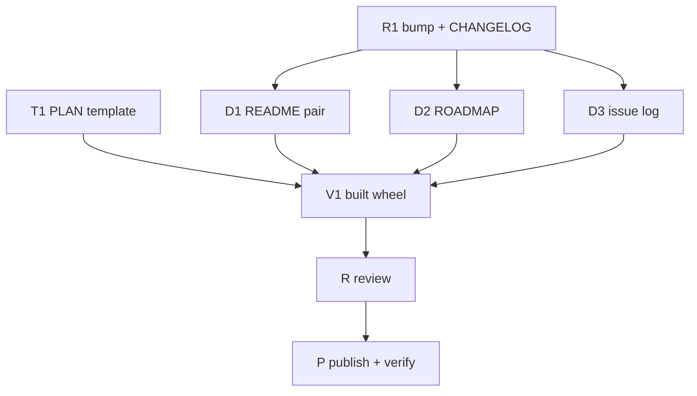

# PLAN: BDL-075 — Release 7.0.0 with the documentation current

> **Status:** Approved
> **Created:** 2026-09-29

---

## Epic Description

The version bump and the change log land first. Three documentation passes follow in parallel on
disjoint files. Then the built wheel is verified on a project that is not this repository, the
change is reviewed, one pull request is opened, and 7.0.0 is published from the merged `main` and
verified on the wheel downloaded from PyPI.

## Dependency DAG

**Critical path:** R1 → D1 → V1 → R → P

## Beads

Status lives in ACTIVE.md, reconciled from the tracker (`beadloom-10er`). This table names the
plan.

| ID | Tracker | Name | Priority | Depends On |
|---|---|---|---|---|
| T1 | `beadloom-10er` | dev: the PLAN template carries the tracker id and no status column | P1 | - |
| T2 | `beadloom-3nwz` | dev: the BRIEF template, the same change (added 2026-09-29, owner) | P1 | T1 |
| R1 | `beadloom-nxf7` | dev: the version to 7.0.0 and the `[7.0.0]` change log | P1 | T2 |
| D1 | `beadloom-fdvz` | tech-writer: README.ru.md, then README.md | P1 | R1 |
| D2 | `beadloom-n5w5` | tech-writer: ROADMAP.md | P1 | R1 |
| D3 | `beadloom-o2z4` | tech-writer: BDL-UX-Issues.md, plus a bead for the `issue-number check` blind spot | P1 | R1 |
| V1 | `beadloom-adbg` | test: the release harness on the built wheel; the README's steps followed literally | P1 | T1, D1, D2, D3 |
| R | `beadloom-bz48` | review: authors' accounts withheld, clean launch prompt — first run CHANGES REQUIRED | P1 | V1 |
| F1 | `beadloom-uk2e.1` | tech-writer: the review's findings in ROADMAP, CHANGELOG and the issue log (added 2026-09-29) | P1 | R |
| F2 | `beadloom-uk2e.2` | dev: the `--sample-of` help names the population (added 2026-09-29, owner) | P1 | F1 |
| P | `beadloom-vgst` | publish: merge, tag, release; verify the downloaded wheel; close-out | P1 | R |

## Bead Details

### T1: the PLAN template

**Scope:** `src/beadloom/onboarding/templates/agentic_flow/commands/templates.md.txt` — the PLAN
template's bead table loses its `Status` column and gains `Tracker`, with a sentence that status
lives in ACTIVE.md, reconciled from the tracker. Recompose with `beadloom setup-agentic-flow`
(never hand-edit `.claude/commands/templates.md`). Check every reader of PLAN tables — `/task-init`,
`/coordinator`, `docs quality`, `active-sync`, the templates' own tests — so nothing depends on the
removed column; the `[7.0.0]` change log names the change (R1 is told). Closes `beadloom-10er`.
**Done when:** the composed template has no status column; `config-check` rc 0; the suite green.

### R1: the bump and the change log

**Scope:**
- Every current-version site in the RFC's Axes.
- `CLAUDE.md` through `beadloom setup-agentic-flow`.
- `CHANGELOG.md` gets a `[7.0.0]` section with Breaking, Removed, Added and Fixed, compiled from the
  explore supplement (`axes.md`) and the BDL-072–074 docs.
- `ROADMAP.md:3,8` state 7.0.0 as *not yet verified*.
- `docs_audit.ignore` triples, only where the audit flags a true history line.

**Done when:**
- `test_version_surface.py` is green;
- `beadloom ci` exits 0;
- the full suite passes;
- no history line was rewritten.

### D1: the README pair

**Scope:** fix the audit's 12 defects in `README.ru.md` first, measuring each against the R1 build.
Add one section on what 7.0.0 publishes: tests bound to the graph, the suite rules, per-change and
weekly mutation, and the testing guide. Then bring `README.md` into line with the corrected Russian,
including the three content differences the audit found.

**Done when:** every command, number and install step in both files holds on the 7.0.0 build, and
`readme-pair` passes.

### D2: ROADMAP

**Scope:**
- the audit's 22 findings;
- shipped items leave "being worked on";
- the owner's ranking;
- federation recorded as deferred until needed;
- `beadloom-txeq` reconciled against its merged PR;
- every open P0/P1 bug named.

The version line is left to R1.

**Done when:** no item under "being worked on" is shipped, and every statement the audit found false
is corrected.

### D3: the issue log

**Scope:**
- 55 fixed Open entries move to Closed, each with one line of evidence;
- 21 partly fixed entries are amended;
- open/closed duplicates are removed;
- number order is restored;
- the `
` block and the second H1 are repaired;
- the chronology is marked historical up to 2026-08-26;
- a bead is filed for `issue-number check`, which misses duplicates in summary lines.

**Done when:** no Open entry describes a defect the audit measured as fixed, no number is both open
and closed, and `beadloom issue-number check` and `beadloom ci` both pass.

### V1: the built wheel

**Scope:** build the wheel from the release commit. On a project that is not this repository, run
the harness:
- `--version` reports 7.0.0;
- `ctx` shows mirror-bound tests;
- `mutation --changed-since` states its population;
- the debt report carries `test_population`.

Then follow the README's install and first-run steps literally in a fresh environment.

**Done when:**
- the harness is first shown to tell 6.0.0 from 7.0.0 (6.0.0 comes from PyPI);
- it exits 0 on the 7.0.0 wheel;
- every README step runs as written.

### R: review

Authors' accounts are withheld. The launch prompt lists only the documents the reviewer may read.

### P: publish

The owner-gated sequence:
1. merge;
2. tag `v7.0.0` on the merge commit, and create the GitHub release;
3. once the publish run is green, download the wheel from PyPI with `UV_NO_CACHE=1` and rerun V1's
   harness on it;
4. close-out: ROADMAP's version line marked verified, documents set to Done, and the tracker export.
