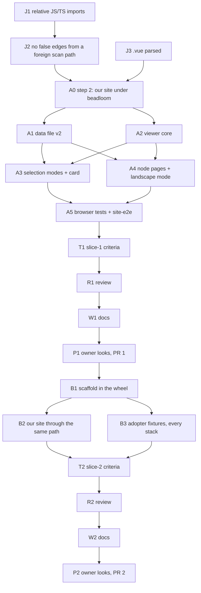

# PLAN: BDL-076 — The architecture graph viewer, made a working tool for the team and for adopters

> **Status:** Approved
> **Created:** 2026-09-30

---

## Epic Description

Two slices, each with its own pull request. **Slice 1** gives the team the viewer: data file v2,
the shared core, the selection modes and the card, node pages and landscape on the core, and
browser tests. **Slice 2** ships the portal to adopters: the scaffold in the wheel, identity from
the project, our own site through the same path, and fixtures for every claimed stack.

## Dependency DAG

**Critical path:** J1 → J2 → A0 → A2 → A3 → A5 → T1 → R1 → W1 → P1 → B1 → B3 → T2 → R2 → W2 → P2

**Waves:**
-1. J1 ∥ J3 (import_resolver against code_indexer; disjoint files), then J2 (the same resolver as J1)
0. A0 step 2
1. A1 ∥ A2 (Python against JS; disjoint files)
2. A3 ∥ A4
3. A5
4. T1
5. R1
6. W1
7. P1, then slice 2: B1
8. B2 ∥ B3
9. T2, R2, W2, P2

## Beads

Status lives in ACTIVE.md, reconciled from the tracker. This table names the plan.

| ID | Tracker | Name | Priority | Depends On |
|---|---|---|---|---|
| J1 | `beadloom-hjr1` | dev: relative JS/TS imports resolve to the files and nodes they name (owner, 2026-09-30) | P0 | A0 step 1 |
| J2 | `beadloom-g9fb` | dev: a non-Python scan path adds no false `depends_on` edges; `.vue` imports and `import()` extracted (owner, 2026-09-30; the second half moved here from J3, same file) | P0 | J1 |
| J3 | `beadloom-tmxa` | dev: `.vue` script blocks parsed with line offsets; `export const` and `import()` read (owner, 2026-09-30) | P0 | A0 step 1 |
| A0 | `beadloom-kcwz` | dev: this repository's site under beadloom — is `.vue` read; the viewer's nodes, docs and bound tests | P0 | - |
| A1 | `beadloom-o2ua` | dev: the data file v2 — node card fields, edge kinds, layers, a `url` for every kind | P0 | A0 |
| A2 | `beadloom-iehv` | dev: the viewer core — navigation, colours, edges, filters, URL state, toolbar, full screen, panel | P0 | A0 |
| A3 | `beadloom-7091` | dev: neighbourhood (depth, direction), impact mode, the node card | P0 | A1, A2 |
| A4 | `beadloom-k0s6` | dev: node pages focused on their node; landscape as the core's second mode | P0 | A1, A2 |
| A5 | `beadloom-rjp1` | test: Playwright cases for every slice-1 goal, and the `site-e2e` CI job | P0 | A3, A4 |
| T1 | `beadloom-bp8n` | test: slice 1's criteria, measured end to end | P0 | A5 |
| R1 | `beadloom-arak` | review: slice 1, authors' accounts withheld | P0 | T1 |
| W1 | `beadloom-qlii` | tech-writer: the site SPEC, the portal guide, the data contract | P0 | R1 |
| P1 | `beadloom-srrn` | coordinator: the owner's browser look, PR 1 | P0 | W1 |
| B1 | `beadloom-dfwt` | dev: the scaffold ships in the wheel; `docs site` writes it with the project's identity and layers | P0 | P1 |
| B2 | `beadloom-qki6` | dev: this repository's site through the same path; `--pages-workflow`; workflows | P0 | B1 |
| B3 | `beadloom-hmqn` | test: adopter fixtures for Python, Go, JS/TS, Java, Kotlin and Swift; build every one; browser tests on Go and TS | P0 | B1 |
| T2 | `beadloom-19l6` | test: slice 2's criteria, measured end to end | P0 | B2, B3 |
| R2 | `beadloom-fht7` | review: slice 2, authors' accounts withheld | P0 | T2 |
| W2 | `beadloom-ri5a` | tech-writer: adopter-facing docs for the portal | P0 | R2 |
| P2 | `beadloom-la3t` | coordinator: the owner's browser look, PR 2 | P0 | W2 |

## Bead Details

### J1, J2, J3: beadloom reads JS/TS/Vue honestly (owner, 2026-09-30)

The scope is in the RFC's approach ("First: …"). Every bead is test-first, on fixtures that are not
this repository: a TS package with relative imports, a Vue app, and a mixed Python + JS repository.
J1 and J3 run in parallel. J2 follows J1, because both edit `import_resolver.py`.

**Done when:**
- on the fixtures, `why` finds the dependents a relative import names;
- `.vue` symbols appear in `ctx` with their correct lines;
- a mixed repository's edge count equals the edges its imports name;
- this repository's Python graph is unchanged (379 `depends_on` edges before and after).

### A0: our site under beadloom (owner, 2026-09-30)

**Re-scoped 2026-09-30, after J1–J3 and the owner's FSD rule.** Step 2 brings the theme into the scan
and proves that the tools see it, under the existing `vitepress-site` node. It does not split the
node. Splitting it now would name today's file layout, and A2 moves every file into FSD layers. So
the node split, one node per FSD slice with a document and the FSD layer rule in `rules.yml`, moves
into A2, where the slices are created.

**Scope:**
- Measure first whether beadloom reads `.vue` single-file components, and which parts of them it
  reads. It should be checked with the `languages` extra on this repository and on a two-file Vue
  fixture.
- Add `site/.vitepress/theme` to the scan, in the one graph of this repository; no nested
  `.beadloom`.
- Split `vitepress-site` into nodes for the viewer core, the architecture mode, the landscape mode,
  the dashboard widgets, and the scaffold/config. Each node gets a document, and the `docs_absent`
  reason goes where a document now exists.
- Declare how the Playwright tests under `site/e2e/` bind: through the mirror, beside the code, or
  through `tests:`.
- Show that `ctx`, `impact`, `sync-check` and the suite rules see the viewer.

If `.vue` is not read, record it with the measurement and stop, so that the owner can decide whether
Vue support joins this epic. Do not add it silently.

**Done when:** the measurement is on the bead; the nodes exist and `beadloom ci` passes; the RFC's
`vitepress-site` axis row is re-derived from real nodes.

### A1: the data file v2

**Scope:** `architecture_view.py`, `site.py` and `site_pages.py`, with the `landscape_view.py` keys
the core needs.

- `schema_version: 2`, keeping every v1 key.
- Per node, add:
  - `source`, `lifecycle`, `tags`;
  - `docs` as a list of `{path, status}` from `sync_state`;
  - `tests` from the binding: files, count, placement;
  - `symbols`, capped at 50, plus the number left out;
  - `activity`;
  - `debt`, from `NodeDebt`;
  - `findings`: `{rule, severity, message}` from the lint run, replacing the boolean-only view, with
    `lint_clean` kept;
  - `url` for every kind, including `other/`.
- Edges: add `consumes` and `produces`.
- Top level: add `generated_at`, `beadloom_version`, `project` and `layers` (name, rank, order).
- Test-first. A test pins the schema, and a test runs on a project that is not this repository.

**Done when:** the schema tests pass; `beadloom docs site` writes v2 on this repository and on a
fixture.

### A2: the viewer core (restructured into FSD; creates the site's graph nodes per slice and the FSD layer rule — moved from A0)

**Scope:** `GraphViewer.vue` plus the composables `useViewerStyle`, `useFilters` and `useUrlState`,
and the theme token modules.

- **The viewer's own space:** toolbar, canvas and a collapsible panel. Full screen covers the whole
  space, with a CSS fallback.
- **Navigation:**
  - `autoungrabify` by default, parents pannable, no box selection;
  - an "Arrange" toggle;
  - zoom, fit, centre, and the keyboard shortcuts.
- **Colours** are resolved from the CSS variables at runtime and rebuilt on a theme switch.
- **Edge styles** per kind; the legend is generated from the edge kinds present.
- **Filters** keep the ancestors of visible nodes; the domain filter covers the full subtree; plus a
  search box.
- **URL state:** filters, focus, depth, direction and mode.
- **The test handle** `window.__beadloomViewer`, in test mode only.
- `ArchitectureMap` becomes a wrapper around the core.

**Done when:** the architecture page renders on the core with every A2 behaviour, the build passes,
and each behaviour's Playwright case is written and seen failing on the old viewer (A5 owns the job).

### A3: selection modes and the card

**Scope:**
- The neighbourhood walk: depth 1–5 or "all", direction in, out or both, and a dim or hide toggle.
- Impact mode:
  - the incoming walk with no depth limit;
  - distance rings;
  - a summary of count, domains, services and layer boundaries crossed;
  - risk marks for nodes with no bound tests, stale docs or open findings;
  - the "graph view — not a reading of the code" statement;
  - the `why` and `impact` commands, ready to copy.
- The node card with every PRD field, clickable edges, and copy buttons for `ctx` and `why`.

**Done when:** each behaviour is visible on this repository's portal, and its Playwright case passes.

### A4: node pages and landscape

**Scope:**
- `render_node_page` embeds `<GraphViewer mode="architecture" focus="<ref>">` in place of the Mermaid
  `## Diagram`.
- `DiagramViewer`'s base-path rewrite gains `/other/`.
- Landscape becomes the core's second mode, with its own filters in the mode's toolbar slot, full
  screen and the card.
- `architecture-diagram.md` keeps the Mermaid C4 view.

**Done when:** a node page opens focused, and the landscape page runs on the core.

### A5: browser tests

**Scope:**
- `site/e2e/` holds the Playwright config and one case per slice-1 goal:
  - pan leaves positions unchanged;
  - no fallback colour;
  - edge kinds and legend;
  - filters keep children;
  - URL round-trip;
  - neighbourhood depth and direction;
  - impact rings and summary;
  - full screen contains toolbar and panel;
  - node page focus;
  - landscape mode.
- The `site-e2e` job in `ci.yml` runs after `site-build`. It is not required.

**Done when:** every case passes locally and in the job on the PR.

### T1, R1, W1, P1

- **T1:** measures every slice-1 acceptance criterion of the PRD.
- **R1:** reviews with the authors' accounts withheld and a clean launch prompt.
- **W1:** updates the site-generation SPEC, `docs/guides/vitepress-site.md` and the data-file
  contract.
- **P1:** the owner looks at the viewer in a browser. Then PR 1 is opened and merged on the owner's
  word.

### B1: the scaffold in the wheel

**Scope:**
- Move the scaffold into `src/beadloom/site_scaffold/` as package data: the theme, the components,
  the composables, `package.json` with `engines.node`, the lockfile, `config.mjs` and `e2e/`.
- `docs site` writes the scaffold. Each written file carries a generated marker and is rewritten on
  a version change. A file without the marker is never overwritten and is reported.
- The override directory `.beadloom/site/` is copied last.
- The `site:` block in `config.yml` sets title, description, base and repo URL, with defaults.
- The layer palette comes from the declared layers.
- The ai-techwriter panel is conditional.

**Done when:** a project that is not this repository builds its portal from `docs site` alone, with
its own identity.

### B2: our site through the same path

**Scope:**
- Remove `site/`'s tracked scaffold and add it to `.gitignore`.
- `.beadloom/config.yml` gets a `site:` block.
- `deploy-site.yml` and `site-build` run `docs site`, then build.
- `docs site --pages-workflow` writes a GitHub Pages workflow.

**Done when:** our portal builds through `docs site` and deploys unchanged in content.

### B3: adopter fixtures

**Scope:**
- One small project per claimed stack under `tests/fixtures/site/`.
- A slow integration test for each: `init`, then `docs site`, then `npm ci`, then `vitepress build`.
- The browser tests run on Go and TS.

**Done when:** all six build, and the browser tests pass on Go and TS.

### T2, R2, W2, P2

As in slice 1, for slice 2. W2 writes the adopter-facing portal documentation: `getting-started`,
the portal guide, and the config reference for `site:`.
