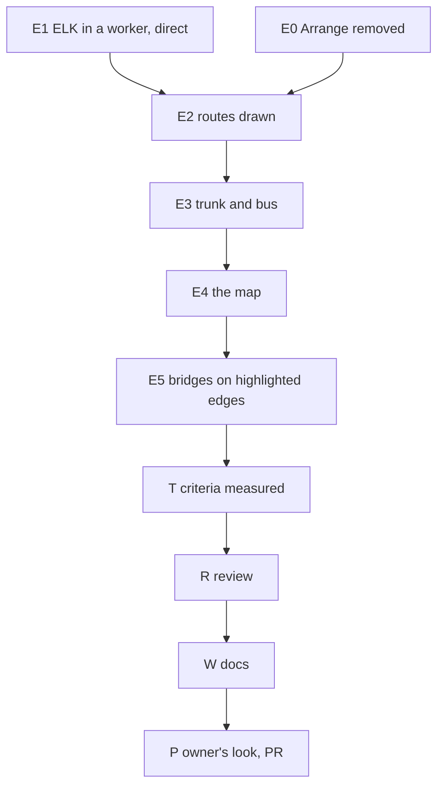

# PLAN: BDL-077 — The viewer draws edges like a classic diagram

> **Status:** Approved
> **Created:** 2026-10-03

---

## Epic Description

Draw ELK's routes in the viewer, remove Arrange, bundle staircases into trunks and buses, build the
map-like overview, and add bridges on highlighted edges — then test every PRD number in the suite,
review, document, and ship one PR after the owner's look.

## Dependency DAG

**Critical path:** E1 → E2 → E3 → E4 → E5 → T → R → W → P. The dev beads share the
`site-graph-viewer` node, so they run one after another; E0 and E1 may run together if
`beadloom waves` allows — it serialised them (shared node `site-app`), so E1 runs first.

Epic: `beadloom-m6k7`.

## Beads

| ID | Tracker | Name | Priority | Depends On |
|---|---|---|---|---|
| E0 | `beadloom-nvux` | dev: Arrange removed | P1 | - |
| E1 | `beadloom-7y2i` | dev: ELK in a worker, elkjs 0.12 direct, cytoscape-elk removed | P0 | - |
| E2 | `beadloom-5x4g` | dev: ELK's routes drawn exactly; compound sizes from ELK | P0 | E0, E1 |
| E3 | `beadloom-bcqk` | dev: trunk and bus instead of staircases | P0 | E2 |
| E4 | `beadloom-94h4` | dev: the map-like overview | P0 | E3 |
| E5 | `beadloom-a6a6` | dev: bridges on highlighted edges | P1 | E4 |
| T | `beadloom-lb1v` | test: every PRD criterion measured in the suite | P0 | E5 |
| R | `beadloom-87o6` | review: the whole change, authors' accounts withheld | P0 | T |
| W | `beadloom-t3pw` | tech-writer: viewer docs and the portal guide | P0 | R |
| P | `beadloom-zaba` | coordinator: the owner's look, PR | P0 | W |

## Bead Details

### E0: Arrange removed

**What to do:** boxes are never draggable; remove the Arrange control, `toggleArrange`,
`applyArrangePolicy`, the help text, and the Arrange browser cases (navigation, node page); keep
"a drag pans and never moves a node".

**Done when:**
- [ ] No Arrange control on any page; a drag on a node pans; cases updated and green.

### E1: ELK in a worker, elkjs 0.12 direct

**What to do:** `shared/elk` builds the ELK graph from the data (today's options), runs elkjs 0.12 in
a Web Worker, returns positions, compound boxes and edge sections in root coordinates; the viewer
shows a laying-out state; `cytoscape-elk` removed from the scaffold's package and lock (closes
`beadloom-f2we`); `test_site_viz_deps.py` follows.

**Done when:**
- [ ] Positions identical to today's layout (within 1 unit) on this repository's graph.
- [ ] The toolbar responds during layout on the adopter-sized graph; no nested elkjs in the lock.

### E2: ELK's routes drawn exactly

**What to do:** `round-segments` with per-edge weights/distances from the sections; every compound
sized from ELK, `compound-sizing-wrt-labels: exclude`; loops kept; the landscape mode too; test
handle `edgeRoutes()`.

**Done when:**
- [ ] Drawn routes within 0.5 units of ELK's; 0 routed edges through a box they do not connect;
      A2 (no common endpoint) 0 edges more than half shared; existing cases green.

### E3: trunk and bus

**What to do:** the post-process in RFC D3 (bus on every node, trunks at ≥ 20 drawn edges,
hub-to-hub on the source trunk, fallback, junction dots for the visible set) with a spatial index;
test handle `junctions()`.

**Done when:**
- [ ] `cli-commands`: one channel per side and direction; lanes at 150 units ≤ 11; no node moves;
      through-box 0; A2 (no common endpoint) unchanged; ≤ 50 ms at adopter size.

### E4: the map

**What to do:** RFC D4: levels from one layout, collapsed boxes with children removed and restored,
aggregated edges per unordered pair with medoid routes, the 100-edge budget with "+N" on the box,
open-what-is-in-view at 600 px, selection and walk opening, constant-size map marks, root-wrapper
loops hidden at the overview; filters, URL focus and node pages compose; test handle `level()`,
`openBoxes()`, `aggregatedEdges()`.

**Done when:**
- [ ] Overview of this repository's graph: top-level boxes only, 37 drawn edges; box displacement 0
      across levels; a selection opens its ancestors; ≤ 100 aggregated edges at adopter size.

### E5: bridges on highlighted edges

**What to do:** RFC D5: an overlay redrawn on Cytoscape's render; bridges where a highlighted edge
(hover, neighbourhood, impact) crosses another drawn edge; none between bundle siblings; theme
colours; test handle `bridges()`.

**Done when:**
- [ ] Bridges on every crossing of a highlighted edge, none otherwise, in light and dark.

### T: every PRD criterion measured

**What to do:** a metrics case on this repository's portal and on an adopter fixture; frame bounds
per environment; each PRD criterion with a verdict.

### R, W, P

R reviews with the authors' accounts withheld; W updates the viewer slice docs, the portal guide and
removes Arrange from them; P: the owner looks in a browser, PR opened, merged on the owner's word.
