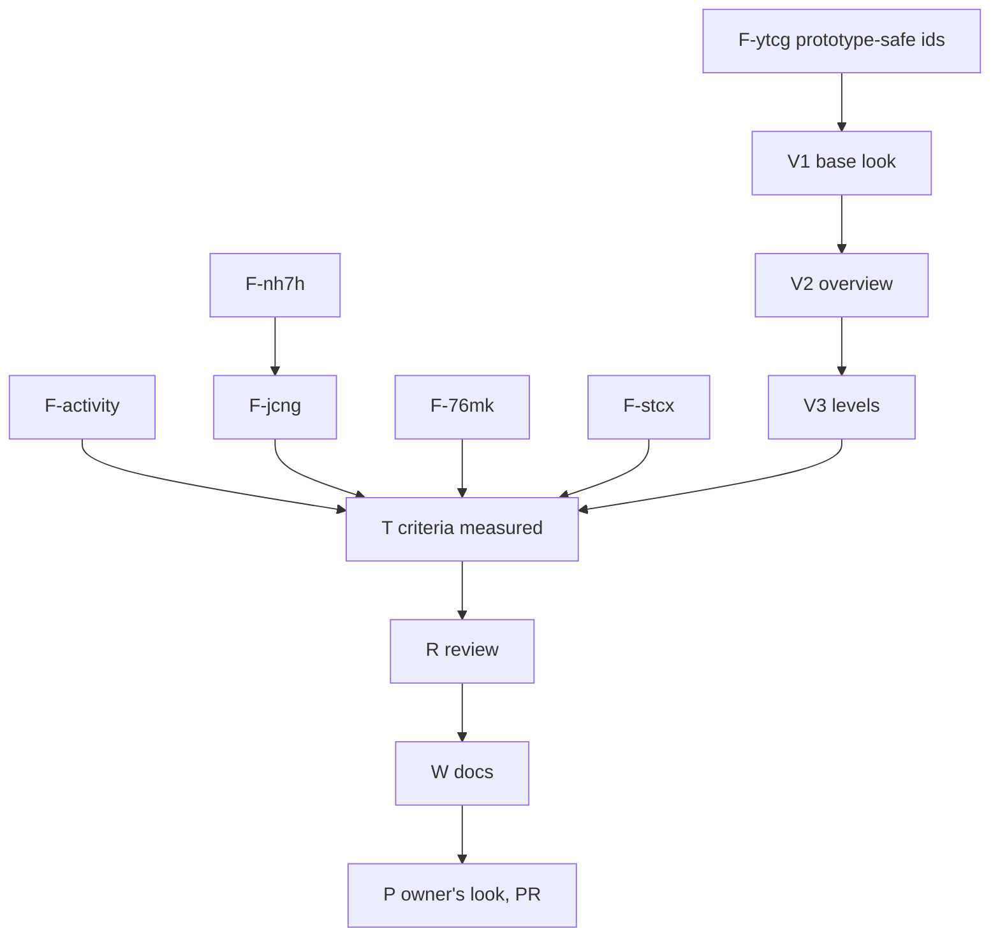

# PLAN: BDL-078 — The viewer looks finished, and five defects are fixed

> **Status:** Done
> **Created:** 2026-10-05
> **Approval:** delegated by the owner on 2026-10-05.

---

## Epic Description

Make the viewer look finished (base look, a routed calm overview, calm open boxes), make the
activity metric mean something, fix five defects; then test every PRD criterion, review, document,
and ship one PR after the owner's look.

## Dependency DAG

**Critical path:** F-ytcg → V1 → V2 → V3 → T → R → W → P. The Python fixes run beside the viewer
chain as `beadloom waves` allows.

Epic: `beadloom-btkd`.

## Beads

| ID | Tracker | Name | Priority | Depends On |
|---|---|---|---|---|
| F-ytcg | `beadloom-ytcg` | fix: a node named `__proto__` is drawn | P1 | - |
| V1 | `beadloom-xv87` | dev: the base look — one weight, no bridges, no dots, no gradient, casing, cards, legends | P0 | F-ytcg |
| V2 | `beadloom-0gyz` | dev: the overview — its own routing, calm by default, pills, titles, shared heads | P0 | V1 |
| V3 | `beadloom-hnff` | dev: levels — sibling rule, "+N", own edges on hover, opening by readability, zoom to selection | P0 | V2 |
| F-activity | `beadloom-lw56` | dev: activity by changed lines, relative levels, roll-up | P1 | - |
| F-nh7h | `beadloom-nh7h` | fix: incremental and fresh reindex resolve imports identically | P1 | - |
| F-jcng | `beadloom-jcng` | fix: a manifest is an input of the files it governs | P1 | F-nh7h |
| F-76mk | `beadloom-76mk` | fix: flat Python tests bind to their node | P1 | - |
| F-stcx | `beadloom-stcx` | fix: the portal loads under `vitepress dev` | P1 | - |
| T | `beadloom-q63p` | test: every PRD criterion measured | P0 | V3, F-* |
| R | `beadloom-ak1i` | review: the whole change, authors' accounts withheld | P0 | T |
| W | `beadloom-1hle` | tech-writer: viewer docs, the portal guide, activity | P0 | R |
| P | `beadloom-hpat` | coordinator: the owner's look, PR | P0 | W |

## Bead Details

Scope and done-when for each bead are the RFC's sections of the same name (V1, V2, V3,
F-activity, the five defects) and the PRD's criteria; T measures every PRD goal and criterion on
this portal and the adopter-sized graph; R reviews with the authors' accounts withheld; W updates
the viewer slice docs, the portal guide and the activity description; P: the owner looks in a
browser, the PR is opened, merged on the owner's word.
