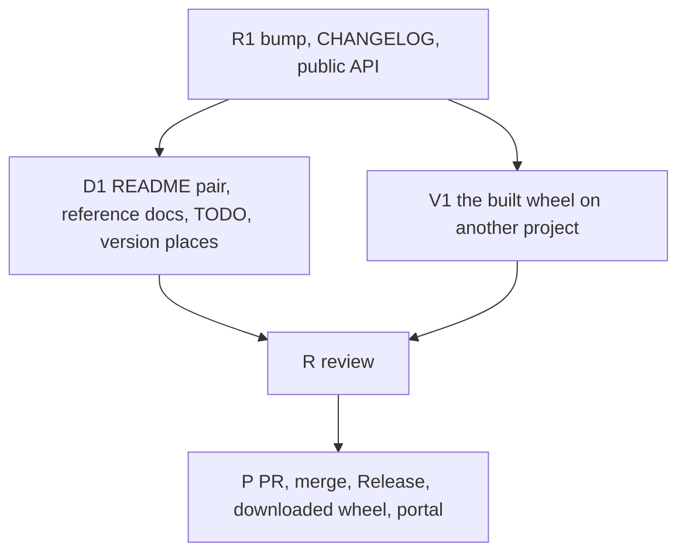

# PLAN: BDL-079 — Release 8.0.0

> **Status:** Done
> **Created:** 2026-10-08

---

## Epic Description

The public API is declared and the version bumped with the change log (R1). The documentation
follows (D1) and the built wheel is verified on another project (V1), in parallel. The change is
reviewed (R), one PR is opened and merged on green, the Release publishes, the downloaded wheel
and the published portal are verified (P).

## Dependency DAG

Epic: `beadloom-1l8d`.

**Critical path:** R1 → D1 → R → P. D1 and V1 run together (`beadloom waves` decides).

## Beads

| ID | Tracker | Name | Priority | Depends On |
|---|---|---|---|---|
| R1 | `beadloom-91iv` | dev: the bump in every place, the public API declared, the `[8.0.0]` change log | P0 | - |
| D1 | `beadloom-ghu3` | tech-writer: README pair, eight drifted reference docs, the TODO marker, unchecked version places | P0 | R1 |
| V1 | `beadloom-jxp4` | test: the built wheel verified on a project that is not this repository; the script re-usable on the downloaded wheel; red on 7.0.0 | P0 | R1 |
| R | `beadloom-urgi` | review: the release change, bead id only | P0 | D1, V1 |
| P | `beadloom-fymn` | coordinator: PR, merge on green, Release v8.0.0, publish, downloaded wheel, published portal, close-out | P0 | R |

## Bead Details

### R1: the bump, the declaration, the change log

**What to do:** `__version__` 8.0.0 and every version place (checked and unchecked; the composed
CLAUDE.md line through the flow layer as BDL-075 did; state whether the scaffold's `package.json`
carries a version); `CONTRIBUTING.md` gains a *Public API* section and `docs/guides/public-api.md`
is written (the composition in CONTEXT.md, with "not public" stated); `CHANGELOG.md` gains
`[8.0.0] - <date>` built from RFC's table — *Breaking* first (the activity vocabulary with the old
and new sets; the debt values; the refusal of an unusable block), then *Added*, *Changed*,
*Fixed*, each line naming its PR (#90, #91, #92, #94) — and the top paragraph says why the
version is major in one sentence; `beadloom lint --strict`, `docs audit`, `ci` rc 0.

**Done when:** `grep -rn 7\.0\.0` finds only history; `beadloom ci` rc 0; the three documents
read as one declaration.

### D1: the documentation

**What to do:** README.ru.md then README.md: does an adopter learn that `docs site` gives a
portal with the viewer? if not, one section, Russian first; the eight reference documents with
surface drift (README pair, `docs/architecture.md`, `docs/guides/testing.md`,
`project-overlays.md`, `bdd-scenarios`, …) read against the current CLI and graph, corrected or
attested by a reader; the `TODO` marker in `docs/services/vitepress-site.md` filled with PR #94's
site-e2e case count (job 113056037571); `ROADMAP.md:3`, the docs-audit SPEC and the
`test_integration_v1.py` docstring; `beadloom ci` rc 0 and `readme-pair` green.

### V1: the built wheel

**What to do:** `uv build`; a fresh venv on a scratch copy of an adopter fixture
(`tests/fixtures/site/python`) or a throwaway project; the script asserts: `beadloom --version`,
`__version__`, the metadata read 8.0.0; `init` + `reindex` on a full history give five activity levels read from `ctx --json`
(or the data file; `reindex` names only a shallow history); `docs site` writes the scaffold and the portal
builds under Node 22; `ctx --json` carries `lines_30d`; the script takes the wheel path or a PyPI
version as its argument so P re-runs it on the downloaded wheel; the same script on the 7.0.0
wheel from PyPI is red (the first assertion that fails, named).

### R, P

R with the bead id only. P: push, PR, merge on green CI (read the advisory legs), the GitHub
Release `v8.0.0` from the merged `main`, the publish run watched, `UV_NO_CACHE=1 uv pip install
beadloom==8.0.0` in a fresh venv and V1's script on it, the published portal's activity levels
read after `deploy-site`, documents to Done, ROADMAP and memory.
