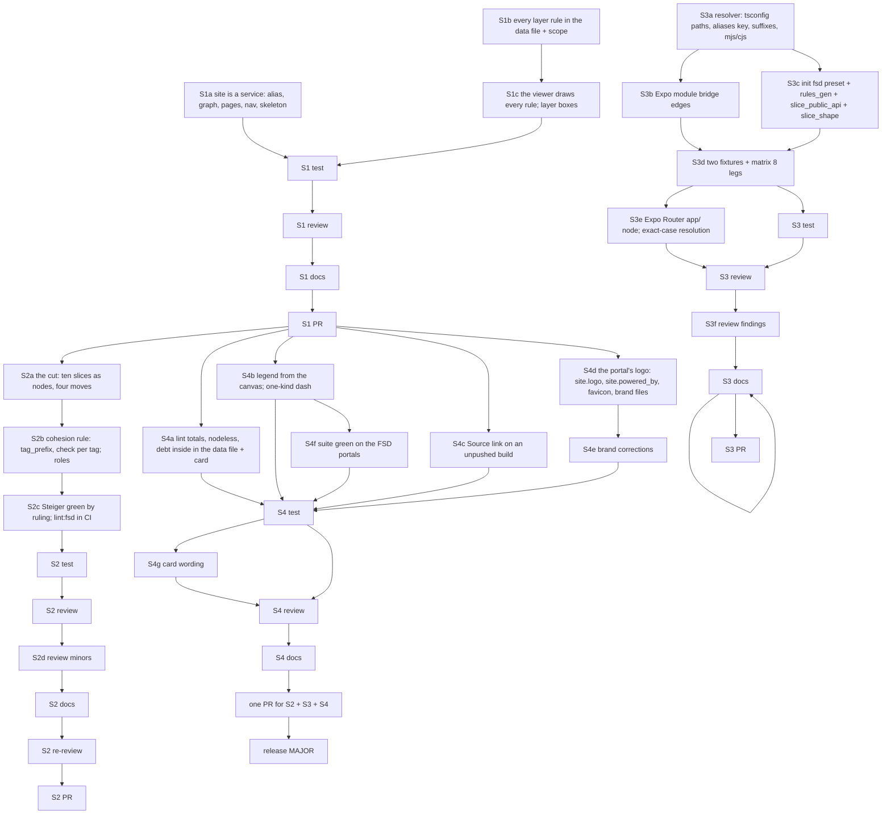

# PLAN: BDL-080 — The portal is a service, and the viewer serves a Feature-Sliced frontend

> **Status:** Approved
> **Created:** 2026-10-08

---

## Epic Description

Four slices, each with its own dev beads, a test bead, a review (bead id only), a docs bead and
a PR. S1 and S2 touch the viewer's node and run one after the other; S3 is mostly Python and
may run beside S2 where `beadloom waves` allows; S4 follows S1 (it reads the new data keys).

## Dependency DAG

Epic: `beadloom-af99`.

**Critical path:** S1 → S2 → release. S3 runs beside S2; S4 beside S2 after S1.

## Beads

| ID | Tracker | Name | Priority | Depends On |
|---|---|---|---|---|
| S1a | `beadloom-je0i` | dev: `site` an alias of `service`; this graph; pages, nav, skeleton, impact boundary | P0 | - |
| S1b | `beadloom-kgh6` | dev: every layer rule in the data file, additively; `scope:` on the rule | P0 | - |
| S1c | `beadloom-i3zs` | dev: the viewer draws every rule — key (rule, rank), legend per rule, filter, lanes, sixth tone, layer boxes at the overview | P0 | S1b |
| S1T | `beadloom-lsev` | test: S1 criteria on this portal and the fixtures | P0 | S1a, S1c |
| S1R | `beadloom-m7xq` | review: S1, bead id only | P0 | S1T |
| S1W | `beadloom-we9t` | tech-writer: S1 docs, Gate green | P0 | S1R |
| S1P | `beadloom-z30s` | coordinator: S1 PR, merge on green | P0 | S1W |
| S2a | `beadloom-7jgr` | dev: the cut — ten slices as nodes, four moves, byte-identical dump | P0 | S1P |
| S2b | `beadloom-5wh2` | dev: cohesion — `tag_prefix`, `check` per FSD tag calibrated, `fsd` and `ddd` overlays, explore/dev protocols | P0 | S2a |
| S2c | `beadloom-af99.8` | dev: Steiger green by the owner's ruling — `insignificant-slice` off with the reason, slices renamed, `lint:fsd` in CI (2026-10-09) | P0 | S2b |
| S2T/R | `beadloom-tnya` `beadloom-cp4u` | as S1 | P0 | chain (S2T after S2c) |
| S2d | `beadloom-af99.10` | dev: the S2 review's minors (liveness reason, Steiger rule name in the overlays, this site's slice rules, numbers, empty folders on upgrade) | P0 | S2R |
| S2W/R2/P | `beadloom-s6mb` `beadloom-af99.11` `beadloom-jkqc` | docs; re-review of docs + S2d; PR | P0 | S2d → S2W → S2R2 → S2P |
| S3a | `beadloom-cwzc` | dev: resolver — tsconfig paths/baseUrl, `imports.aliases`, platform suffixes, `.mjs/.cjs` | P0 | - |
| S3b | `beadloom-wbqd` | dev: Expo module bridge edges (`expo-module.config.json` → `uses`) | P1 | S3a |
| S3c | `beadloom-5t8d` | dev: `init` fsd preset, legacy as nodes, rules_gen with `layers`+`scope`, `slice_public_api`, `slice_shape`, cohesion `check` | P0 | S3a |
| S3d | `beadloom-chdx` | dev: fixtures `vue-fsd` and `rn-fsd`, `FIXTURES_BY_STACK`, matrix 8 legs | P0 | S3b, S3c |
| S3e | `beadloom-af99.12` | dev: Expo Router `app/` owner node; exact-case resolution (S3d's gaps 1, 3; 2026-10-10) | P0 | S3d |
| S3T/R | `beadloom-hvnv` `beadloom-jtki` | as S1 | P0 | chain (S3R after S3e) |
| S3f | `beadloom-af99.14` | dev: the S3 review's findings (fsd preset evidence, package.json indent, slice rule resolution, one walk) | P0 | S3R |
| S3W/P | `beadloom-ql96` `beadloom-iapw` | docs after S3f and the re-check; PR | P0 | S3f |
| S4a | `beadloom-5pxv` | dev: `lint` totals and nodeless findings, debt inside — data file and card | P1 | S1P |
| S4b | `beadloom-bjrw` | dev: legend from the canvas; one-kind aggregated dash | P1 | S1P |
| S4c | `beadloom-e1xo` | dev: the Source link on an unpushed build; `source_ref`; the warning | P1 | S1P |
| S4e | `beadloom-af99.9` | dev: brand corrections from the owner's look — the square icon is the only mark; theme-adaptive monochrome favicon; footer line 1 without a link; adopter favicon from site.logo (2026-10-09) | P1 | S4d |
| S4d | `beadloom-af99.7` | dev: the portal's logo — `site.logo`, `site.powered_by`, the favicon, the brand files, the social preview (owner, 2026-10-09) | P1 | S1P |
| S4f | `beadloom-af99.13` | dev: the shipped browser suite green on the two FSD portals (S3d's gap 2; 2026-10-10) | P0 | S4b |
| S4T | `beadloom-brgd` | test: goal 5 on nine portals; the full tree once | P1 | S4a–S4f |
| S4g | `beadloom-af99.15` | dev: the card's Rule findings wording names both populations (owner, 2026-10-10) | P1 | S4T |
| S4R/W | `beadloom-xkrn` `beadloom-n644` | review; docs | P1 | S4g → S4R → S4W |
| PR | `beadloom-3dqv` | coordinator: ONE PR for S2 + S3 + S4, merge on green (owner, 2026-10-10; `beadloom-jkqc` and `beadloom-iapw` folded in) | P0 | S4W |
| REL | — | the MINOR release (its own /task-init, by BDL-079's recipe) | P1 | S2P, S3P, S4P |

The sub-beads are created as one plan per slice when that slice starts (the tracker ids fill
the table then), so a slice's DAG reflects what the earlier slices taught.

## Bead Details

Each dev bead's "what to do" is the RFC decision it names; "done when" is the PRD goal's
*Done when*, plus: cases red first; two-level verification; the full tree once per slice by its
test bead; docs listed for the slice's W; commits under the slot by path. The test bead of each
slice measures the slice's PRD criteria independently on this portal and the fixtures.
