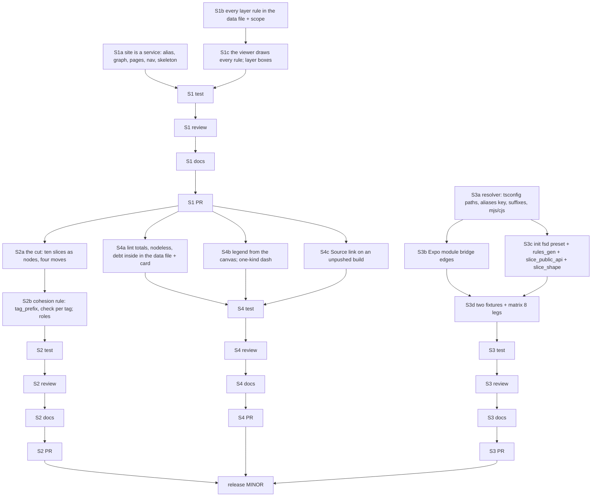

# PLAN: BDL-080 — The portal is a service, and the viewer serves a Feature-Sliced frontend

> **Status:** Approved
> **Created:** 2026-10-08

---

## Epic Description

Four slices, each with its own dev beads, a test bead, a review (bead id only), a docs bead and
a PR. S1 and S2 touch the viewer's node and run one after the other; S3 is mostly Python and
may run beside S2 where `beadloom waves` allows; S4 follows S1 (it reads the new data keys).

## Dependency DAG

Epic: `beadloom-af99`.

**Critical path:** S1 → S2 → release. S3 runs beside S2; S4 beside S2 after S1.

## Beads

| ID | Tracker | Name | Priority | Depends On |
|---|---|---|---|---|
| S1a | `beadloom-je0i` | dev: `site` an alias of `service`; this graph; pages, nav, skeleton, impact boundary | P0 | - |
| S1b | `beadloom-kgh6` | dev: every layer rule in the data file, additively; `scope:` on the rule | P0 | - |
| S1c | `beadloom-i3zs` | dev: the viewer draws every rule — key (rule, rank), legend per rule, filter, lanes, sixth tone, layer boxes at the overview | P0 | S1b |
| S1T | `beadloom-lsev` | test: S1 criteria on this portal and the fixtures | P0 | S1a, S1c |
| S1R | `beadloom-m7xq` | review: S1, bead id only | P0 | S1T |
| S1W | `beadloom-we9t` | tech-writer: S1 docs, Gate green | P0 | S1R |
| S1P | `beadloom-z30s` | coordinator: S1 PR, merge on green | P0 | S1W |
| S2a | — | dev: the cut — ten slices as nodes, four moves, byte-identical dump | P0 | S1P |
| S2b | — | dev: cohesion — `tag_prefix`, `check` per FSD tag calibrated, `fsd` and `ddd` overlays, explore/dev protocols | P0 | S2a |
| S2T/R/W/P | — | as S1 | P0 | chain |
| S3a | — | dev: resolver — tsconfig paths/baseUrl, `imports.aliases`, platform suffixes, `.mjs/.cjs` | P0 | - |
| S3b | — | dev: Expo module bridge edges (`expo-module.config.json` → `uses`) | P1 | S3a |
| S3c | — | dev: `init` fsd preset, legacy as nodes, rules_gen with `layers`+`scope`, `slice_public_api`, `slice_shape`, cohesion `check` | P0 | S3a |
| S3d | — | dev: fixtures `vue-fsd` and `rn-fsd`, `FIXTURES_BY_STACK`, matrix 8 legs | P0 | S3b, S3c |
| S3T/R/W/P | — | as S1 | P0 | chain |
| S4a | — | dev: `lint` totals and nodeless findings, debt inside — data file and card | P1 | S1P |
| S4b | — | dev: legend from the canvas; one-kind aggregated dash | P1 | S1P |
| S4c | — | dev: the Source link on an unpushed build; `source_ref`; the warning | P1 | S1P |
| S4T/R/W/P | — | as S1 | P1 | chain |
| REL | — | the MINOR release (its own /task-init, by BDL-079's recipe) | P1 | S2P, S3P, S4P |

The sub-beads are created as one plan per slice when that slice starts (the tracker ids fill
the table then), so a slice's DAG reflects what the earlier slices taught.

## Bead Details

Each dev bead's "what to do" is the RFC decision it names; "done when" is the PRD goal's
*Done when*, plus: cases red first; two-level verification; the full tree once per slice by its
test bead; docs listed for the slice's W; commits under the slot by path. The test bead of each
slice measures the slice's PRD criteria independently on this portal and the fixtures.
