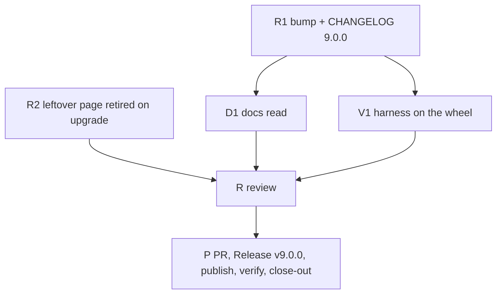

# PLAN: BDL-081 — Release 9.0.0

> **Status:** Approved
> **Approval:** delegated by the owner on 2026-10-10.
> **Created:** 2026-10-10

---

## Epic Description

One release, one PR. R1 (the bump and the change log) and R2 (the leftover page) are the dev
beads; D1 reads the documentation after R1; V1 extends the harness beside R1; R reviews by bead
id only; P publishes and verifies.

## Dependency DAG

Parent: `beadloom-48ex`.

## Beads

| ID | Tracker | Name | Priority | Depends On |
|---|---|---|---|---|
| R1 | `beadloom-qfk9` | dev: the bump in every place `version-surface` names (except the harness file, V1's), `[9.0.0]` with Breaking first by RFC D1 | P0 | - |
| R2 | `beadloom-ehts` | dev: `docs site` retires `other/<ref>.md` when the node's page moved to `services/` (RFC D4) | P0 | - |
| D1 | `beadloom-d7qq` | tech-writer: the documentation read (RFC D2): the public-API guide's items 3, 5, 6 and the refusal sentence; the "since" lines; the README pair's Gate paragraph; surface-drift docs read | P0 | R1 |
| V1 | `beadloom-3iu5` | test: the harness verifies the new surfaces on the published artifact, red on 8.0.0 (RFC D3) | P0 | R1 |
| R | `beadloom-g0a0` | review: the release change, bead id only | P0 | R2, D1, V1 |
| P | `beadloom-1ov1` | coordinator: PR on green, Release `v9.0.0`, `pypi-publish.yml`, the downloaded wheel verified, the published portal, close-out | P0 | R |

## Bead Details

R1's done-when: `version-surface` every checked place 9.0.0; `beadloom ci` rc 0; the CHANGELOG's
Breaking section names the five classes with the measured exit-code moves and the Upgrading steps
of RFC D1; `setup-agentic-flow` recomposed. R2's: an 8.0.0 portal rewritten leaves no
`other/<ref>.md` for a node whose page is under `services/`; the scaffold line counts it. D1's:
`docs audit`, `sync-check`, `docs quality`, the pair leg green on a fresh index. V1's: the script
exits non-zero on `beadloom==8.0.0` and 0 on the built wheel, its report names what it ran. P's:
the wheel downloaded from PyPI passes the harness; the portal published.
