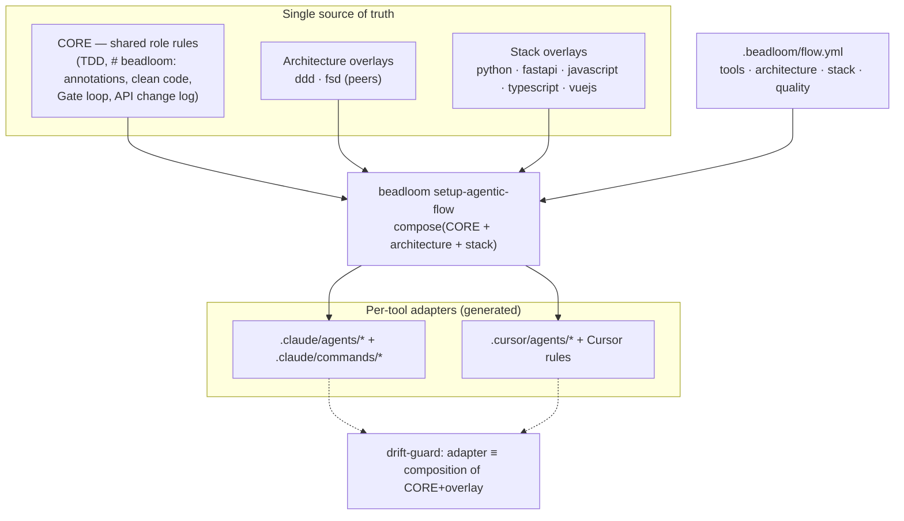
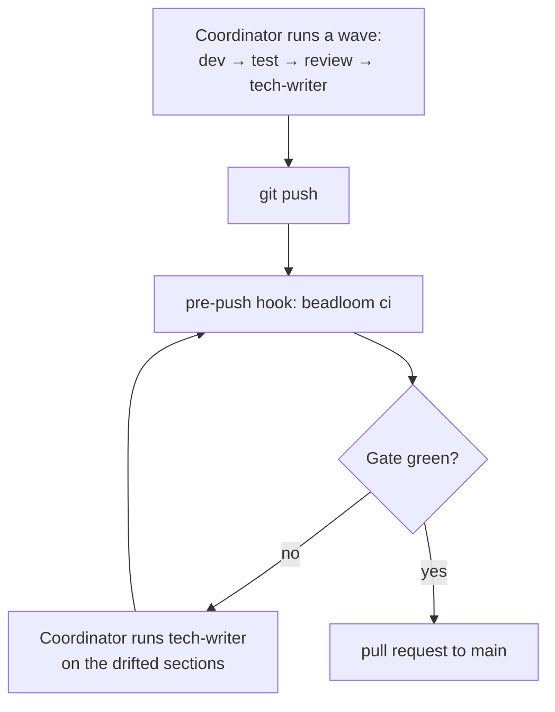
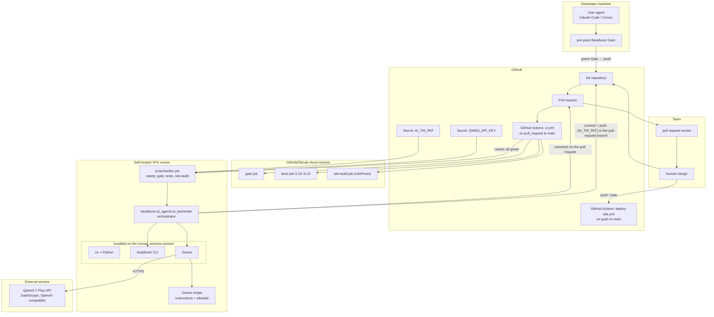
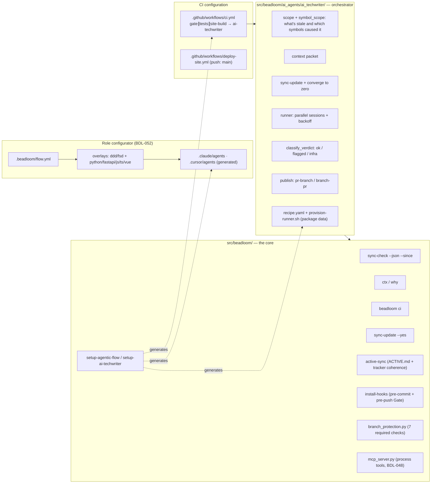
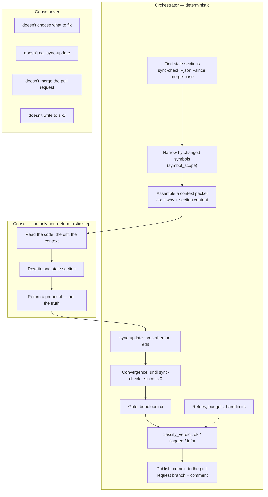
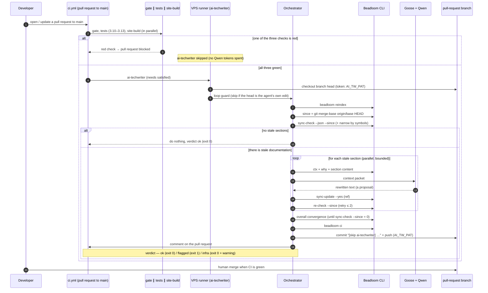
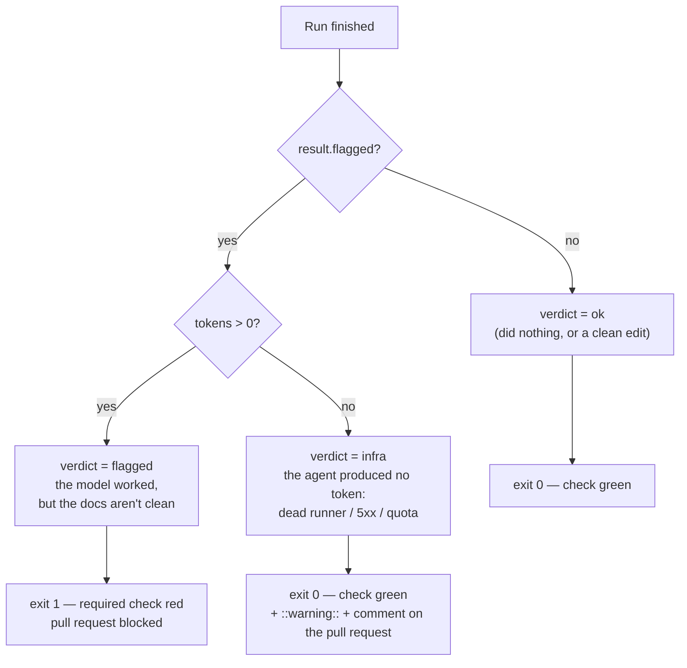
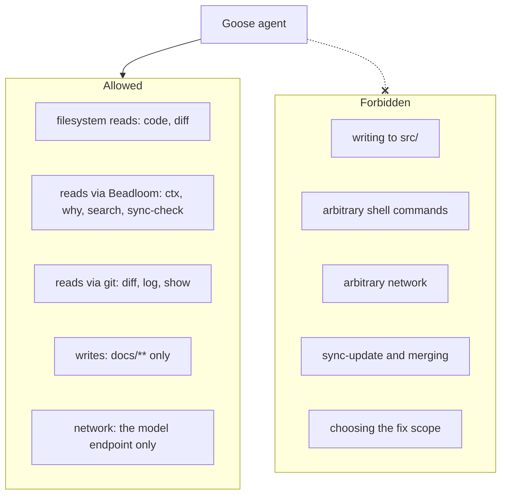
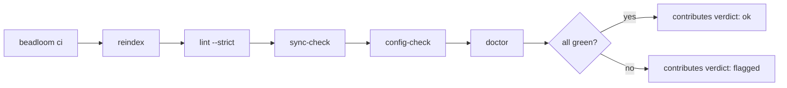
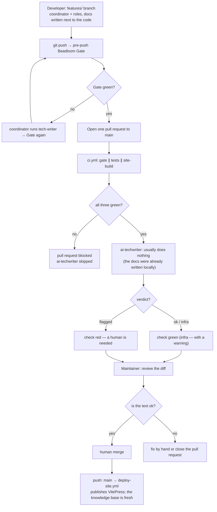

# Agentic development in Beadloom: architecture

> Read this in other languages: [Русский](./multi-agent-development.ru.md)

> This document describes **where each part runs**, **who is responsible for what**, and **how the parts interact** — in the current, released state.
>
> Change history: BDL-047 (the first AI tech-writer in CI) → BDL-048 (packaging the multi-agent workflow and the MCP tools) → BDL-049 (the move to trunk-based and pull-request triggering) → BDL-050 (consolidating CI into a single `ci.yml` and the verdict system) → BDL-051 ("Beadloom governs itself") → BDL-053 (tracker / `ACTIVE.md` coherence) → BDL-052 (the configurable, tool-agnostic agentic workflow and the pre-push Gate).

---

## Why this exists

Beadloom keeps a project's architecture and its documentation in a single graph and watches that the two don't drift apart. When the code changes, `sync-check` says plainly: "this documentation section no longer matches the code." But then someone has to sit down and rewrite the section — and that is exactly the step that gets put off in real life, so the documentation falls badly out of date.

Beadloom 2.0.0 closes that gap: updating the documentation becomes part of the ordinary development workflow.

The core principle:
**No code reaches `main` without up-to-date documentation.** This isn't a matter of discipline — tools watch for it: the deterministic Beadloom Gate before push and on the CI side. You can't forget to update the documentation — the Gate simply won't let the change through.

---

## The core principle of 2.0.0: two layers, one invariant

Documentation is written in two places, but it is checked by the same deterministic barrier.

**The first, primary layer — locally, on the developer's own agent.** Beadloom's packaged agentic workflow (`/task-init` → `/coordinator` → the dev / test / review / tech-writer roles → push → Beadloom Gate) runs in the tool the developer already has open: Claude Code, Cursor, and so on. The tech-writer role writes documentation right here, next to the code. There is no need to bring up a second language model locally — the Goose + Qwen pair stays server-side only.

**The barrier — the pre-push Beadloom Gate.** Before every push, `beadloom ci` (the full set of deterministic checks) runs as a blocking git hook. If the Gate is red — for example, the documentation has drifted from the code — the push is stopped. Then the coordinator runs the tech-writer role, runs the Gate again, and only lets the change reach a pull request once it is green.

**The second, fallback layer — on the CI side.** The server-side AI tech-writer on the Goose + Qwen pair (inherited from BDL-049/050) hasn't gone anywhere, but it now kicks in rarely — only when a pull request did arrive without fresh documentation, having skipped the local Gate (for example, from an external contributor or from someone who bypassed the workflow). Then it must bring the documentation into order. And because the local Gate makes such cases rare, its fifteen-minute run no longer holds up every merge.

One sentence worth keeping in mind:

**Everything in this loop is deterministic except one step — writing the documentation text itself. And even that step is bounded by the Beadloom Gate and human pull-request review.**

---

## The participants: who's who

The system is split into parts on purpose: Beadloom stays the core — a supplier of tools and data — and is not tied to any particular agentic tool.

| Participant | Where it lives in the repo | What it does |
|------|-------------------------|------------|
| **Beadloom** | `src/beadloom/` | The architecture graph, `sync-check`, `ctx` / `why`, `beadloom ci`, the role configurator. Knows nothing about Goose. |
| **Local agent** | the developer's tool (Claude Code, Cursor) | Runs the packaged workflow: the coordinator and the dev / test / review / tech-writer roles. Writes documentation next to the code. |
| **Orchestrator (harness)** | `src/beadloom/ai_agents/ai_techwriter/` | The deterministic loop of the server-side AI tech-writer: find stale sections → fix → converge to zero → Gate → verdict → publish. |
| **Goose** | on a self-hosted runner; the recipe (`recipe.yaml`) ships inside the `beadloom` package | The server-side agent: reads context, rewrites one documentation section at a time. |
| **Qwen3.7-Plus** | an external API (DashScope, OpenAI-compatible) | The model (`model = qwen3.7-plus`). The key lives only in a CI secret. |

Beadloom **supplies the primitives**. The orchestrator **assembles them into a loop**. Goose **only writes documentation** — and only within the bounds the orchestrator gives it.

An important change in 2.0.0: the server-side AI tech-writer orchestrator moved out of the utility `tools/` directory and straight into the package — into the `ai_agents` domain. It is now a full, graph-tracked component of Beadloom (with its own node, symbols, `sync-check`, and architectural boundaries), not an external add-on. It is invoked as `python -m beadloom.ai_agents.ai_techwriter` and ships inside the installable package — no more copying sources into someone else's repository.

**Process tools for MCP (BDL-048).** Separately from the AI tech-writer, Beadloom exposes the deterministic process steps as MCP tools (`services/mcp_server.py`): `task_init`, `bead_context`, `complete_bead`, `checkpoint`. This is **not orchestration** — see the [Limitations](#limitations) section.

---

## The configurable agentic workflow: the role configurator (BDL-052)

The main 2.0.0 advance for teams is that the packaged workflow is no longer tied to one programming language or one tool. Roles are now composed from parts according to configuration.



How it works:

- **CORE** — the universal role core, independent of both language and tool: test-driven development, annotation discipline (the dev role itself places `# beadloom:domain=…` / `feature=…` / `component=…` markers in the code so the graph stays honest), clean-code principles, the Beadloom Gate loop, and the public-API change log for the review and tech-writer roles.
- **Architecture overlays** — **ddd** (Domain-Driven Design for the backend) and **fsd** (Feature-Sliced Design for the frontend) as peers: each adds its own layer and boundary rules and its own annotation vocabulary to a role.
- **Stack overlays** — the language and framework specifics: `python`, `fastapi`, `javascript`, `typescript`, `vuejs` (each brings its own code samples and lint, type-check, and test commands).
- **The configuration** `.beadloom/flow.yml` describes what to compose: which tools (Claude Code, Cursor), which architecture (ddd or fsd), which stack. `beadloom setup-agentic-flow --tool/--stack/--architecture` composes CORE with the chosen overlays and writes the per-tool adapters. A **drift-guard** (a dedicated test) ensures the generated adapters always match the composition. This means roles are not edited by hand: the composer always regenerates them, and a hand-edit to an adapter is overwritten on the next build.

Beadloom's own configuration is modest — `tools: [claude]`, `architecture: [ddd]`, `stack: [python]`. A team working on, say, a Vue frontend in TypeScript following Feature-Sliced Design in Cursor gets the same quality CORE plus the overlays it needs — all of it turned on by a single line in `flow.yml`.

Cursor's agent capabilities (its own subagents, orchestration with result hand-off, background tasks, worktrees) are today on par with Claude Code, so the full workflow — coordinator plus roles — runs the same on both tools. For a tool with no subagents there is a fallback: the same workflow runs sequentially, following the description in `AGENTS.md`. Correctness doesn't suffer — the Gate is responsible for it — only parallelism is lost.

---

## The pre-push Beadloom Gate and the coordinator loop (BDL-052)

The local barrier is an ordinary git hook installed by `beadloom install-hooks`.



The loop itself is described in `/coordinator` as an explicit sequence of steps, not as a wish the agent should "remember": run `beadloom ci`, look at the exit code, and if it is red — run the tech-writer role on the drifted sections and run the Gate again (with a cap on retries so it can't loop forever). Only a green Gate opens the way to a pull request.

`pre-commit` stays a light check (linting and a quick `sync-check`), while **`pre-push` is the authoritative blocking Gate**. The emergency exit is documented honestly: `git push --no-verify` will bypass the hook, but that is a deliberate exception, not the norm. In a repository without Beadloom the hook simply does nothing and blocks nothing.

---

## Beadloom governs itself (BDL-051)

The context without which the two-layer model would make no sense: in 2.0.0 Beadloom applied its own thesis to itself.

- A **component** node kind appeared (an internal building block alongside feature) and a **module-coverage** check in **error** mode: every module in `src/` is either a graph node (feature or component) or an explicitly listed exemption. No "shadow" code the graph doesn't know about: a new untracked module fails `beadloom ci`.
- The server-side AI tech-writer became a first-class `ai_agents` domain inside the package (rather than an external directory), with its own import boundaries.
- Every module in the project is classified and documented.

This is exactly why Beadloom is the first and strictest consumer of its own workflow: the "no code without documentation" rule applies to its own code too.

---

## Where each part physically runs

A frequent question: "is this in the GitHub/GitLab cloud or on our server?"



**Locally** lives the primary layer: the developer's agent and the pre-push Gate. What reaches the cloud is an already-consistent pair — code and documentation together.

**In the GitHub/GitLab cloud** live the code, the `docs/**` directory, the `.beadloom/` directory, the CI pipeline definition, and the open pull requests. The single `ci.yml` runs on every pull request to `main`: the `gate` job (the `beadloom ci` verdict), `tests` (a matrix of Python 3.10–3.13), and `site-build` (the VitePress build) run **in parallel** on cloud runners. The `ai-techwriter` job is declared via `needs: [gate, tests, site-build]` and starts **only if all three are green** — a broken pull request doesn't spend Qwen tokens. A separate `deploy-site.yml` is **the only** thing that runs on `push: main` and publishes the site to GitHub Pages. With strict trunk-based, the `main` branch is green by construction.

**The self-hosted VPS runner** is the only place where Goose, the orchestrator, and access to the model key live at the same time. Each run starts from a clean checkout.

**Qwen3.7-Plus** is a cloud API. There is no local model on the server.

**The Beadloom CLI** is installed on the runner, but its sources are part of the repository in `src/beadloom/`. It is the product, not CI infrastructure.

---

## Trunk-based and branch protection (BDL-049 / BDL-050)

`main` is the integration point and a **protected branch**: direct push is forbidden, everything travels through a pull request. Each task is a short-lived `features/<KEY>` branch → one pull request to `main` → merge when the checks are green.

Protection is configured by `onboarding/branch_protection.py`: the set of required checks of the consolidated `ci.yml` —

```
gate · tests (3.10) · tests (3.11) · tests (3.12) · tests (3.13) · site-build · ai-techwriter
```

The `enforce_admins: true` flag means even the owner integrates through a pull request (strict trunk-based), and 0 required reviews leave a solo maintainer able to merge themselves — but the `main` branch still can't be bypassed. Applied idempotently by `beadloom setup-branch-protection`.

A GitHub behavior subtlety: it treats a skipped required check as neutral, that is, as passing. So when `gate`, `tests`, or `site-build` is red, the `ai-techwriter` job ends up skipped, and the pull request is blocked precisely by the red upstream checks, not by the skipped `ai-techwriter`. When the upstream three are green, `ai-techwriter` runs for real, and its verdict becomes the barrier.

---

## What's in the repository



An important principle holds: **the "fix → converge → verdict → publish" loop does not enter the Beadloom core**. Only primitives live in `src/beadloom/` (`sync-check --since`, the non-interactive `sync-update --yes`, `ci`, `ctx` / `why`, branch protection, the `setup-*` command family, the role configurator). The orchestrator itself lives in the `ai_agents` domain and is platform-agnostic: the same code (`python -m beadloom.ai_agents.ai_techwriter`) is invoked from both GitHub Actions and GitLab CI — only the trigger, the secret names, and the `--platform` flag differ.

---

## Responsibility boundaries: the orchestrator and Goose

Goose is an agent, but its role is intentionally narrow. The orchestrator does everything mechanical; the agent gets only what needs judgment.



This keeps the loop reproducible: Goose can be swapped for another agentic tool without touching the Beadloom core.

---

## A full CI run — step by step

This is the fallback path — it runs when a pull request arrived without fresh documentation. The scenario is the same for GitHub Actions and GitLab CI and differs only in the trigger, the secrets, and how the edit is published.



**The start.** A pull request to `main` launches `ci.yml`. First, `gate`, `tests`, and `site-build` run in parallel. If something is red, `ai-techwriter` doesn't start, no Qwen tokens are spent, and the pull request is blocked by the red checks.

When all three are green, `ai-techwriter` starts on the VPS runner. First — the **loop guard**: if the branch head is the agent's own commit (author `beadloom-ai-techwriter`, or the message contains `[skip ai-techwriter]`), the job is skipped, so the agent's push doesn't trigger a second run. Otherwise — `reindex`, computing the base point `since = git merge-base origin/<base> HEAD`, then `sync-check --json --since` narrowed by the changed symbols.

**Narrowing by symbols (BDL-052).** Previously a change to one "fat" file marked all sections related to it as stale — editing a single line in `cli.py` dragged in a dozen-and-a-half sections. Now the orchestrator looks at which symbols actually changed in the file and matches them against the symbols a documentation section references. If a section depends on no changed symbol, it is excluded from the work and silently re-attested so that `sync-check` converges to zero without a rewrite. The rule is cautious: on any ambiguity, the section stays in the work — better to rewrite something extra than to miss what's needed. The rare case of a removed or renamed symbol is handled too: a section that references a vanished name also stays in the work.

**If there is drift.** The orchestrator goes through the stale sections — now with a bounded pool of parallel sessions (three by default, with exponential backoff on 429/5xx responses so as not to hit the plan limits). For each section a context packet is assembled, Goose rewrites the text, the orchestrator calls `sync-update --yes` and re-checks against `--since`. After all sections — **overall convergence**: repeat `sync-check --since` and re-attestation for newly drifted pairs until a stable zero settles (editing one domain section can "touch" neighboring pairs — a known invariant ever since BDL-047). At the end — `beadloom ci`, a commit of the edit straight to the pull-request branch (message `[skip ai-techwriter] …`, author `beadloom-ai-techwriter`, pushed via `AI_TW_PAT` so the commit triggers the `gate` check), and a comment on the pull request.

---

## The verdict: `ok` / `flagged` / `infra` (BDL-050)

`ai-techwriter` is a required check that goes red **only** on a real, unresolved documentation problem, not on an infrastructure failure. The orchestrator (`runner.py::classify_verdict`) classifies the run, and `cli.py` maps the verdict to an exit code. Telling a documentation problem from an infrastructure failure is simple: just look at **whether the model produced any output at all** (`input_tokens + output_tokens > 0`).



| Verdict | When | Exit code | Effect |
|---------|------|-----------|--------|
| **ok** | no stale sections, or the edit went through cleanly | `0` | check green |
| **flagged** | the model worked (`tokens > 0`), but the documentation still drifts from the code: after the edit `beadloom ci` is red, convergence wasn't reached, or the budget was exceeded | `1` | **check red → pull request blocked** ("a human is needed") |
| **infra** | the agent produced not a single token (`tokens == 0`): a dead self-hosted runner, a 5xx response or a provider timeout, an exhausted quota — it *couldn't start* | `0` | check green + an explicit `::warning::` + a comment on the pull request where possible ("documentation NOT checked — re-run") |

The takeaway is simple. A dead VPS or an exhausted plan quota does **not** freeze merges. But real, unresolved drift does. The classification is deliberately cautious: zero tokens is always treated as `infra`. And even a mistaken `infra` is not lost — a CI warning highlights it so a human re-runs, rather than silently shipping stale documentation.

---

## Tracker / ACTIVE.md coherence (BDL-053)

This feature solves a similar problem, only now for task state rather than code and documentation. The workflow tracks it in two places — the `bd` tracker and a status table inside `ACTIVE.md`. Previously both were maintained by hand and gradually drifted from reality. Beadloom 2.0.0 makes them coherent by construction.

`beadloom active-sync` takes `bd` as the source of truth. It re-reads the task identifiers straight from the table in `ACTIVE.md`, asks `bd` for their real status, and rewrites only the status cell. It does so carefully: it doesn't touch headings, prose, or the progress log, and it preserves a meaningful maintainer note. It also exports the tracker state into the tracked `.beads/issues.jsonl` file so that task closures survive a branch merge. All of this is wired into the pre-commit hook as an auto-fix — so a stale status table simply can't be committed. In a repository without the tracker or without `ACTIVE.md` files, the command does nothing.

---

## What Goose can and can't do

Restricting the tool set is part of the safety. Even if the agent errs, the blast radius is small.



---

## The `beadloom ci` Gate — a deterministic check

Before `classify_verdict` the orchestrator runs the full Gate. The same set of checks sits in the pre-push hook and as the standalone `gate` job in `ci.yml`.



`sync-check = 0` proves **freshness** — a documentation section references current code symbols. It is not a text-quality check: a human on the pull-request review is responsible for the wording being correct. And `lint --strict` now checks not only architectural boundaries but also the absence of "shadow" code (the `module-coverage` check in error mode).

---

## The developer-and-reviewer scenario



The typical 2.0.0 scenario looks like this. On the task branch the documentation is written locally, together with the code. Before push the Beadloom Gate checks it. Then — one pull request to `main`, and CI runs `gate`, `tests`, and `site-build`. The server-side `ai-techwriter` usually does nothing here: the documentation is already fresh, and it finishes instantly. It really kicks in only when updating the documentation locally was forgotten. A merge to `main` triggers `deploy-site.yml` — the only thing that runs on `push: main`.

---

## Limitations

- **Orchestration stays in the developer's tool.** The MCP server (BDL-048) exposes *tools* (`task_init`, `bead_context`, `complete_bead`, `checkpoint`), **not** orchestration — it can't spawn subagents or run the main loop. The coordinator and the waves of subagents stay native to the user's agent (Claude Code, Cursor). The configurator only composes the roles for them. The MCP process tools are a deterministic substrate the workflow *calls*, not a replacement for orchestration.
- **Documentation is written by the developer's agent, not by a server-side model.** The Goose + Qwen pair runs on the server only and serves as a backstop. It kicks in rarely — only when the local Gate was bypassed. No second model is brought up on the developer's machine.
- **`complete_bead` is a strong recommendation, not a source of truth.** The model decides to call it itself. It is stricter than text instructions — it really does refuse to close a task while the Gate is red — but weaker than CI.
- **The true enforcement is the Gate, and it is in two places.** Locally — the pre-push hook; on the server — the required `ci.yml` checks. Both run the same `beadloom ci`. Nothing bypasses them (except the deliberate `--no-verify`, which is visible in the history).
- **The move to ty is deferred.** Astral's fast type checker `ty` is still in beta and less accurate than `mypy`, so the project consciously stays on `mypy --strict` and will revisit the question once `ty` ships a stable release.

---

## Security

**The model key** (`QWEN_API_KEY`) and the push token (`AI_TW_PAT`) live in CI secrets (GitHub Secrets, GitLab CI/CD variables) and are available only to the job on the self-hosted runner. They are not in the logs or the repository.

**The runner** is bound to the project. A separate temporary workspace is created for each run.

**Goose** writes only to `docs/**`. It doesn't touch the sources.

**There is no automatic merge**: `sync-check = 0` proves freshness, but not text quality. A human merges the pull request.

**`sync-update` outside the loop** is the same operation as the interactive `sync-update`. It can accidentally "green" a bad section, so pull-request review and a rationale in its description are a mandatory part of the workflow.

---

## One-page cheat sheet

| Question | Answer |
|----------|--------|
| Who writes the documentation in the normal scenario? | The developer's agent (Claude Code, Cursor) — locally, next to the code |
| What keeps code out without documentation? | The Beadloom Gate: the pre-push hook locally + a required check in CI |
| Then why the server-side ai-techwriter? | A backstop: it kicks in when a pull request arrived without fresh documentation |
| Where do gate / tests / site-build run? | GitHub/GitLab cloud runners |
| Where does ai-techwriter run? | A self-hosted VPS runner (Goose + the model key) |
| Where does the orchestrator live? | `src/beadloom/ai_agents/ai_techwriter/` (a package domain, not the `tools/` directory) |
| How it's invoked | `python -m beadloom.ai_agents.ai_techwriter` |
| What configures the workflow? | `.beadloom/flow.yml`: tools (claude/cursor) · architecture (ddd/fsd) · stack |
| CI trigger | `on: pull_request → main` (the single `ci.yml`); `deploy-site.yml` is the only thing on `push: main` |
| Job order | `gate ∥ tests ∥ site-build` → `ai-techwriter` (`needs:`) |
| Drift base point | `git merge-base origin/<base> HEAD` (`--since`), scope narrowed by changed symbols |
| Where the edit lands | a commit to the **same** pull request's branch (pushed via `AI_TW_PAT`) |
| Verdict | `ok` / `infra` → exit 0; `flagged` → exit 1 (only real drift blocks) |
| Required checks | 7: `gate`, `tests (3.10..3.13)`, `site-build`, `ai-techwriter` |
| Branch protection | `enforce_admins: true`, 0 reviews (strict trunk-based) |
| How it reaches main | pull request + human merge (no automatic merge) |
| What the server-side agent writes | `docs/**` only |

---

## Related documents

- **RFC BDL-052** — the configurable agentic workflow, the role configurator, the pre-push Gate (the current model)
- **RFC BDL-053** — tracker / `ACTIVE.md` coherence (`active-sync`)
- **RFC BDL-051** — "Beadloom governs itself": the component node kind, the no-shadow-code check, the `ai_agents` domain
- **RFC BDL-050** — CI consolidation and the verdict system
- **RFC BDL-049** — trunk-based and pull-request triggering
- **RFC BDL-047** — the initial orchestrator architecture
- [`agentic-flow.md`](./agentic-flow.md) — the guide to the packaged workflow and the role configurator
- [`ai-techwriter.md`](./ai-techwriter.md) — the operator's guide to the server-side AI tech-writer
