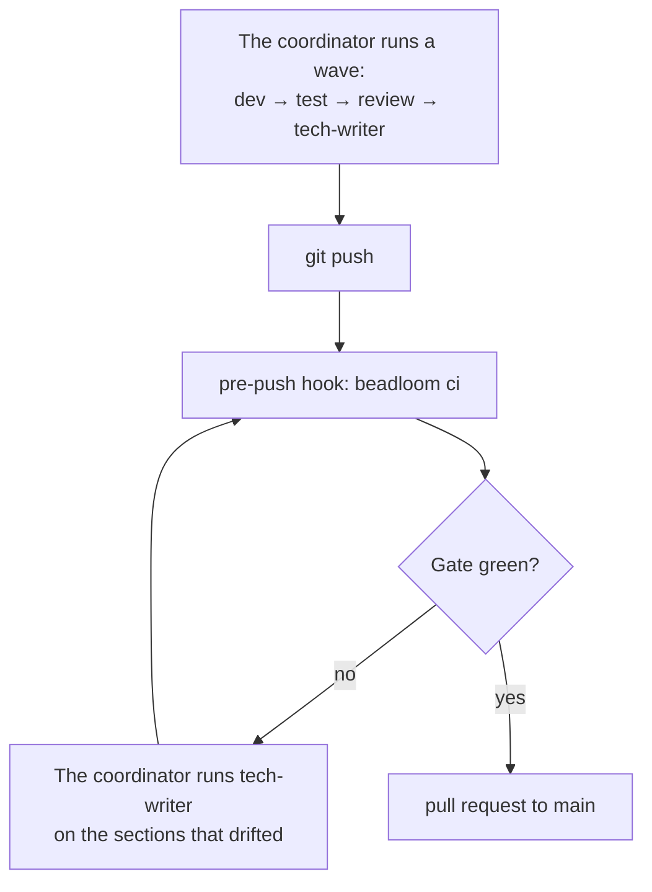
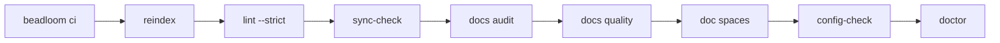
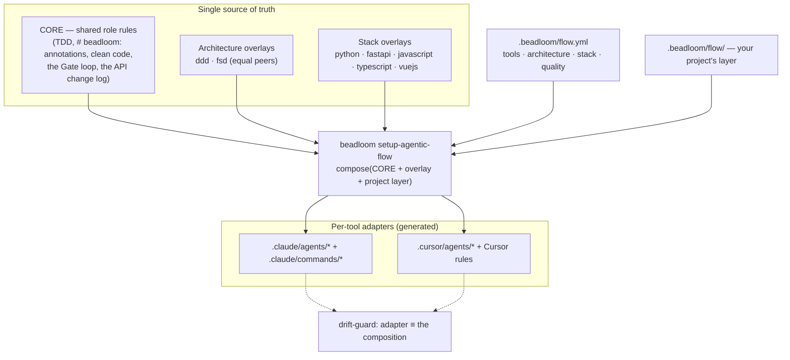
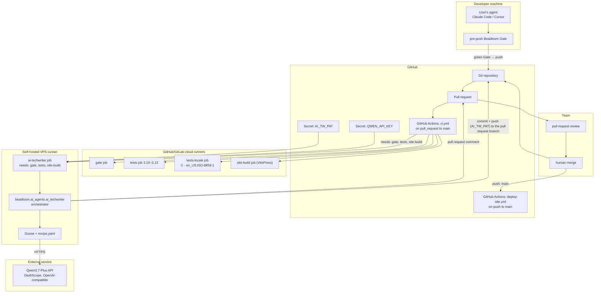
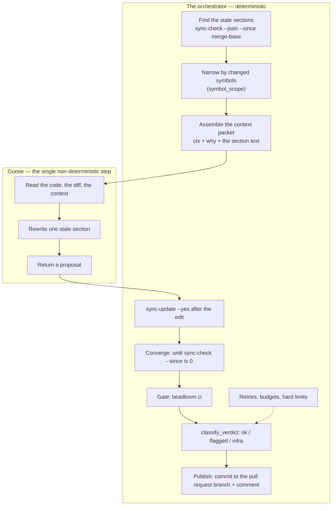
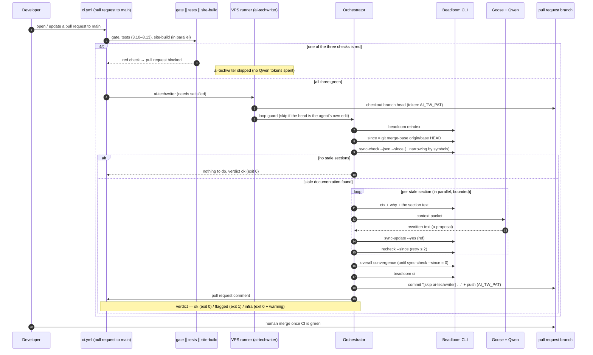

# Agentic development in Beadloom: architecture

> Read this in other languages: [Русский](./multi-agent-development.ru.md)

> This document describes where each part runs, who is responsible for what, and how the parts are connected. Everything stated here applies to the current, released state.

---

## The gap this workflow closes

Beadloom keeps a project's architecture and its documentation in one graph and watches that the two do not drift apart. When the code changes, `sync-check` says it plainly: this section of the documentation no longer describes the code it is bound to. For a long time the tool stopped right there. Someone still had to sit down and rewrite the section, and that step gets postponed.

The workflow described below makes updating the documentation part of ordinary work on a task. There is one rule: **no code reaches `main` without current documentation.** Behind the rule stands a command with an exit code rather than discipline. It is called the Beadloom Gate and it sits in two places, before push and in CI. Forgetting about the documentation is possible. Pushing it past the Gate is not.

---

## The main path: documentation is written next to the code

The documentation is written by the same agent the developer already uses: Claude Code, Cursor or another one. Beadloom's packaged workflow runs inside it: `/task-init`, then `/coordinator`, then the dev, test, review and tech-writer roles, then push. The tech-writer role edits the documents in the same branch that holds the code. No second language model needs to be stood up on the developer's machine.

Before every push a git hook installed by `beadloom install-hooks` fires and runs `beadloom ci` in full.


```mermaid
flowchart TB
  WORK["The coordinator runs a wave:<br/>dev → test → review → tech-writer"]
  PUSH["git push"]
  GATE["pre-push hook: beadloom ci"]
  RED{"Gate green?"}
  FIX["The coordinator runs tech-writer<br/>on the sections that drifted"]
  PR["pull request to main"]

  WORK --> PUSH --> GATE --> RED
  RED -->|no| FIX --> GATE
  RED -->|yes| PR
```

A red Gate stops the push. The coordinator then runs the tech-writer role on the sections that drifted, runs the Gate again, and opens a pull request only once it has gone green. The number of retries is capped, otherwise the loop would spin forever. This loop is written into `/coordinator` as an explicit sequence of steps, so the agent does not have to remember it.

`pre-commit` stays a light check: linting and a fast `sync-check`. The blocking barrier is `pre-push`. The emergency exit is named honestly: `git push --no-verify` bypasses the hook, and the bypass is visible in the commit history. In a repository without Beadloom the hook does nothing and blocks nothing.

One sentence worth keeping in mind: **the whole cycle is deterministic except for one step, the writing of the text itself. And even that step is bounded by the Gate and by human review of the pull request.**

---

## The Gate: eight steps and what each one did not look at

`beadloom ci` runs eight steps in sequence. `federate` becomes the ninth when the project declares satellite repositories.


```mermaid
flowchart LR
  CI["beadloom ci"] --> R["reindex"]
  R --> L["lint --strict"]
  L --> S["sync-check"]
  S --> DA["docs audit"]
  DA --> DQ["docs quality"]
  DQ --> DS["doc spaces"]
  DS --> C["config-check"]
  C --> D["doctor"]
```

The same set sits in the pre-push hook and as the separate `gate` job in CI. Three of the eight steps look at documents.

| Step | What it asserts |
|---|---|
| `reindex` | the index is built from the graph, the documentation and the code |
| `lint --strict` | architecture boundaries hold and there is no untracked code |
| `sync-check` | every documentation section references symbols the code has now |
| `docs audit` | the numbers and versions stated in prose match the ones the project computes |
| `docs quality` | planning documents meet the writing standard |
| `doc spaces` | finished work has a document describing what was built |
| `config-check` | the composed role adapters have not drifted from the graph and the configuration |
| `doctor` | the graph is internally consistent |

`sync-check = 0` proves freshness: a section references the symbols the code has today. That zero proves nothing about the quality of the wording, which is what a human on review is for.

### Every step also names what it did not check

This is the Gate's main property, and the whole design exists to serve it. A green step that checked nothing must not read like a green step that checked everything.

| Step | What it names besides its findings |
|---|---|
| `lint` | how many of the rules it ran were unable to check anything |
| `docs audit` | three answers per declared fact instead of one — see below |
| `docs quality` | the document kinds that no check reads |
| `doc spaces` | epics that declare no node, and epics the tracker does not know |
| `sync-check` | the pairs there is nothing to compare against, counted separately and never as fresh |

The answers `docs audit` gives are worth unpacking, because the number of statements it compared means nothing on its own.

| Answer | What it means |
|---|---|
| verified | a document stated a number and the run compared it against what the project computes |
| not verified | there was nothing to compare: either no document states the fact, or its value is such that no statement of it could ever be read |
| not applicable | the project declined to compute this fact, and the reason for the decline is printed alongside |

That way a fact leaving the count is named. On this repository the line reads `5 of 9 declared fact(s) verified` and names the other four.

### The strictness of reporting inaction is deliberately asymmetric

A rule where **part** has stopped working reports a warning, whatever severity it was declared at. A dead path pattern. An exemption that suppresses nothing. A node selection that selected none, while the rule's other checks still fire. All of that is a configuration defect rather than a boundary breach. It must not redden a pipeline on an upgrade that changed no line of code.

A rule that could check **nothing** of what it was meant to is a different fact. Then "no violations found" and "the rule never ran" produce the same output, and an escalation that evaporates at exactly that moment is an escalation that does not exist. So `doc-area-coherence` and `graph-summary-facts` report a total stand-down at the severity the project declared. Their cost differs. The first ships at `warn` and changes nobody's run. The second ships at `error`, so a project that enables it on a graph stating no number anywhere now goes red. One key undoes that, `severity: warn` in the same rule entry. [The architecture model](./architecture-model.md) covers both rules and names the third one that does not yet behave this way.

---

## What the workflow is composed from

The workflow is tied to no programming language and to no single tool. Roles are composed from parts according to configuration, and the configuration is one file.

```yaml
# .beadloom/flow.yml
tools:        [claude, cursor]   # adapters for one or both
architecture: [ddd]              # ddd | fsd (exactly one)
stack:        [python]           # python, fastapi, javascript, typescript, vuejs
quality:      [clean-code, tdd]
language:     en                 # the language of the process documents
```


```mermaid
flowchart TB
  subgraph CANON["Single source of truth"]
    CORE["CORE — shared role rules<br/>(TDD, # beadloom: annotations, clean code,<br/>the Gate loop, the API change log)"]
    ARCH["Architecture overlays<br/>ddd · fsd (equal peers)"]
    STACK["Stack overlays<br/>python · fastapi · javascript · typescript · vuejs"]
  end

  FLOW[".beadloom/flow.yml<br/>tools · architecture · stack · quality"]
  PROJ[".beadloom/flow/ — your project's layer"]
  COMPOSE["beadloom setup-agentic-flow<br/>compose(CORE + overlay + project layer)"]

  subgraph ADAPTERS["Per-tool adapters (generated)"]
    CLAUDE[".claude/agents/* + .claude/commands/*"]
    CURSOR[".cursor/agents/* + Cursor rules"]
  end

  GUARD["drift-guard: adapter ≡ the composition"]

  CORE --> COMPOSE
  ARCH --> COMPOSE
  STACK --> COMPOSE
  FLOW --> COMPOSE
  PROJ --> COMPOSE
  COMPOSE --> CLAUDE
  COMPOSE --> CURSOR
  CLAUDE -.-> GUARD
  CURSOR -.-> GUARD
```

There are four layers.

- **CORE** — the universal core of the roles: test-driven development, clean-code principles, the Gate loop, the public API change log for the review and tech-writer roles. Annotation discipline belongs here too: the dev role places the `# beadloom:domain=…`, `feature=…` and `component=…` markers in the code itself, so the graph stays honest.
- **The architecture overlay** — **ddd** (Domain-Driven Design, usually backend) and **fsd** (Feature-Sliced Design, usually frontend) as equal peers. Each adds its own layer and boundary rules to a role, and its own annotation vocabulary.
- **The stack overlay** — the specifics of a language and framework. Each brings its own code examples and its own linting, typing and test commands.
- **Your project's layer** in `.beadloom/flow/` composes last and survives an upgrade, because an upgrade changes the core underneath it. A core rule can only be stood down by a declaration carrying a reason and an expiry, and once the expiry passes `config-check` reports it. Details are in the [project overlays guide](./project-overlays.md).

`beadloom setup-agentic-flow` composes the four role protocols, the slash commands and `CLAUDE.md` out of these layers. A separate drift-guard test watches that the generated adapters match the composition. From this follows a practical rule: roles are not edited by hand, because the next composition overwrites a manual edit.

Beadloom's own configuration is modest — `tools: [claude]`, `architecture: [ddd]`, `stack: [python]`. A team writing a Vue frontend in TypeScript with Feature-Sliced Design in Cursor gets the same core and the overlays it needs. Turning that on is one line in `flow.yml`.

Cursor's agent capabilities today are comparable with Claude Code's: its own subagents, orchestration with result handoff, background tasks, worktrees. So the full workflow, the coordinator together with the roles, runs the same way on both tools. For a tool without subagents there is a fallback mode: the same workflow runs sequentially, from the description in `AGENTS.md`. Correctness does not suffer for it, the Gate is responsible for that. Only parallelism is lost.

---

## What the workflow checks besides documentation freshness

Five mechanisms have been added to the cycle of "write code, write documentation, pass the Gate". Each has its own guide, and what is said here is only why the mechanism exists and where it stands.

### Guards: a process rule stops being prose

A guard answers one process question about one situation. Is this edit covered by a claimed task? Is the work happening outside a protected branch? The condition is declared in the `guards:` block of `.beadloom/flow.yml`, Beadloom computes it, and the tool adapter carries no logic of its own.

`beadloom guard <name>` returns `0` on a skip or a pass, `1` on a warning and `2` on a block. One code differs between the shell and the tool's hook, and the difference is deliberate. A defect in the declared configuration, or a command line that could not be used, exits `3` in the shell and `2` under `--hook`, because `3` does not stop a tool call, and a guard that could not answer must never read as one that passed.

`beadloom guard --liveness` reports which guards have fired and which protect nothing. In this repository `bead-claimed` and `working-branch` are live, both at the shipped `warn` level.

### `beadloom waves`: the shape of a wave is derived from the graph

The tracker knows which task blocks which. Only the architecture graph knows what code those tasks occupy. `beadloom waves BEAD [BEAD ...]` decides which of the named tasks may run at the same time, from the code-level independence of the nodes they occupy. Every pair it separates into different waves carries one reason from a closed list: `blocked_by_bead`, `unresolved_scope`, `shared_node`, `shared_file`, `dependency_edge`, `override_serial`.

Whatever shape a wave takes, its agents share four things in every case: the working tree, the pre-commit hook, the documentation freshness baseline and the tracker's identifier space. Each of the four gets a verdict at planning time, and it may come back as `failed`. The one nobody measured comes back as `unmeasured`, and that is a finding with exit code `1` rather than a silent pass. Exit `0` means clean, `1` means there are findings, `2` means it cannot be decided.

What is checked here is a precondition, measured before the wave starts. Nothing watches the wave's behaviour once it is running. See the [parallel waves guide](./parallel-waves.md).

### Three document spaces

Every document lives in one of three spaces.

| Space | Document kinds | What the Gate does with it |
|---|---|---|
| TO-BE | `PRD`, `RFC`, `BRIEF`, `CONTEXT`, `PLAN` | reads it against the writing standard, holds it against an AS-IS document |
| AS-IS | `SPEC`, `DOC`, `README` | binds it to code through `sync-check` |
| WORKING | `ACTIVE` | exempts it from the freshness check by declaration |

The names are deliberately not TODO and DONE, because nothing here changes status. A PRD does not become done. When the work finishes, a different artifact is written, an AS-IS document.

The reason is that a flag has nothing to be checked against. `status: done` is true because someone typed it, and no further change to the code will make it false. A relation has both ends on disk: this epic recorded an intent, its tasks are closed, and the node it named still has no document describing what was built. That is what `beadloom docs spaces` checks, one of the `beadloom ci` steps. See the [document kinds guide](./document-kinds.md).

### `beadloom review-brief`: the reviewer gets the change and the specification

The command assembles the assignment, the declared scope, the graph's specification documents, the linked `@bead:` scenarios and every changed file. The task's own comments it holds back, and it reports how many it held. The author's report is not lost: `--release` prints it as soon as a verdict comment has been recorded.

The point is the order. An agent that has read the author's conclusion first tends to check that conclusion instead of the change.

### The graph's own metadata is checked against the project

Until recently every rule read only the graph's relations: which module reaches which node, which layer may import which. The fields the graph holds about itself were read by nobody, and two of them were wrong here across three major releases without ever going red.

`graph-summary-facts` extracts numeric and version claims from each node's `summary` and compares each one against the same fact the project computes about itself. The cost of an error in a `summary` is high: that sentence is quoted by `ctx`, `prime`, the generated site and every agent adapter.

`doc-area-coherence` asks whether a node documents itself where this graph's own convention says it should. It derives that convention from the graph being checked rather than from a layout written down anywhere else. So the rule works on a feature-sliced project as well as on the "one package per domain" layout used here.

Both rules are ordinary entries in `.beadloom/_graph/rules.yml`. Both print `unverifiable` as a separate answer: a graph whose summaries state no number, or whose documents settle on no convention, is told that it was skipped rather than that it was checked and found clean. See [the architecture model](./architecture-model.md).

### Alongside: federation across repositories

`beadloom export` and `beadloom federate` extend the same "intent against reality" question across several repositories. Each service publishes a deterministic artifact bound to a commit, and a hub aggregates two or more such artifacts into a federated graph with verdicts on links and on contracts. None of this applies to the single-repository cycle above, and `beadloom ci` runs `federate` only when the project declares satellites.

---

## Beadloom applies all of this to itself

Everything described above Beadloom applies to its own code. It shows up in four things.

- There is a node kind **component**, an internal building block alongside a feature. There is a **module-coverage** check at error severity: every module under `src/` is either a graph node or an explicitly listed exception. A new untracked module fails `beadloom ci`.
- The server-side AI tech-writer became the `ai_agents` domain inside the package, with its own import boundaries.
- A node is held to documenting itself where this graph documents the nodes from its source area, and to carrying no number in its `summary` that the project contradicts.
- A node that genuinely should have no document records that decision together with its reason in the graph itself, and `doctor` prints the reason. An absence somebody decided on stops reading like an absence nobody examined.

This is why Beadloom is the first and strictest consumer of its own workflow. The rule "no code without documentation" applies to its own code too.

---

## Trunk-based development and branch protection

`main` is the integration point and a protected branch. Direct push is forbidden and everything travels through a pull request. Each task is a short-lived `features/<KEY>` branch, one pull request from it into `main`, and a merge once the checks are green.

Protection is configured by `onboarding/branch_protection.py`. By default the command applies `DEFAULT_STATUS_CHECK_CONTEXTS`, the set of nine checks from the consolidated `ci.yml` that any project deployed from this template gets:

```
gate · tests (3.10) · tests (3.11) · tests (3.12) · tests (3.13) ·
tests-locale (C) · tests-locale (en_US.ISO-8859-1) ·
site-build · ai-techwriter
```

In this repository the live protection requires seven of them. The two `tests-locale` contexts are not in it, verified by `gh api repos/:owner/:repo/branches/main/protection`. Both locale checks were red by construction until the text input and output they exposed was fixed. They are green now. The point of those two checks is that they run the same full test suite in a different environment, and what is valuable is the difference between the environments rather than the colour of either one.

A red required check under `strict: true` would make a merge into `main` impossible. So `beadloom setup-branch-protection` is idempotent, but re-running it here is only worth doing after comparing the declared contexts against what actually goes green on an open pull request. The other way is to pass `--check` with the set the pipeline can really produce.

The number of declared contexts has moved in both directions, and that is what is worth remembering. `tests-windows` was added as the tenth, varying the platform the way `tests-locale` varies the environment. Then the owner withdrew it. The reason was measured: 16–28 runner-minutes per pull request, and unlike the locale checks this one becomes the pipeline's critical path and roughly triples the time from pull request to merge. The platform is not among the project's targets. Nothing here has ever run on Windows and, by that decision, will not. It is written down that way in `docs/domains/application/features/flow-guards/SPEC.md`, under *Windows: unverified by decision*, rather than letting a green pipeline imply support.

The `enforce_admins: true` flag means that even the owner integrates through a pull request. Zero required reviews leaves a solo maintainer able to merge their own work, but they still cannot bypass `main`.

One more detail of GitHub's behaviour. It treats a skipped required check as neutral, that is, as passing. So when `gate`, `tests` or `site-build` is red, the `ai-techwriter` job ends up skipped, and what blocks the pull request is the red checks above it. When those three are green, `ai-techwriter` really runs and its verdict becomes the barrier.

---

## Where each piece physically runs

A frequent question: is this in the GitHub/GitLab cloud or on our own server?


```mermaid
flowchart TB
  subgraph LOCAL["Developer machine"]
    AGENT["User's agent<br/>Claude Code / Cursor"]
    PREPUSH["pre-push Beadloom Gate"]
  end

  subgraph GITHUB["GitHub"]
    GH_REPO["Git repository"]
    GH_SECRET["Secret: QWEN_API_KEY"]
    GH_PAT["Secret: AI_TW_PAT"]
    GH_CI["GitHub Actions: ci.yml<br/>on pull_request to main"]
    GH_DEPLOY["GitHub Actions: deploy-site.yml<br/>on push to main"]
    GH_PR["Pull request"]
  end

  subgraph CLOUD_RUN["GitHub/GitLab cloud runners"]
    JOB_GATE["gate job"]
    JOB_TESTS["tests job 3.10–3.13"]
    JOB_LOCALE["tests-locale job<br/>C · en_US.ISO-8859-1"]
    JOB_SITE["site-build job (VitePress)"]
  end

  subgraph VPS["Self-hosted VPS runner"]
    AITW["ai-techwriter job<br/>needs: gate, tests, site-build"]
    ORCH["beadloom.ai_agents.ai_techwriter<br/>orchestrator"]
    GOOSE_RT["Goose + recipe.yaml"]
  end

  subgraph EXTERNAL["External service"]
    QWEN["Qwen3.7-Plus API<br/>DashScope, OpenAI-compatible"]
  end

  subgraph DEV["Team"]
    REVIEW["pull request review"]
    MERGE["human merge"]
  end

  AGENT --> PREPUSH
  PREPUSH -->|"green Gate → push"| GH_REPO
  GH_REPO --> GH_PR --> GH_CI
  GH_CI --> JOB_GATE
  GH_CI --> JOB_TESTS
  GH_CI --> JOB_LOCALE
  GH_CI --> JOB_SITE
  GH_CI -->|"needs: gate, tests, site-build"| AITW
  GH_SECRET --> AITW
  GH_PAT --> AITW
  AITW --> ORCH --> GOOSE_RT
  GOOSE_RT -->|HTTPS| QWEN
  ORCH -->|"commit + push (AI_TW_PAT) to the pull request branch"| GH_REPO
  ORCH -->|"pull request comment"| GH_PR
  GH_PR --> REVIEW --> MERGE --> GH_REPO
  MERGE -->|"push: main"| GH_DEPLOY
```

**Locally** lives the main layer: the developer's agent and the pre-push Gate. What arrives in the cloud is an already consistent pair, the code and the documentation together.

**In the GitHub/GitLab cloud** live the code, the `docs/**` tree, the `.beadloom/` tree, the pipeline description and the open pull requests. A single `ci.yml` runs on every pull request into `main`. The `gate`, `tests` (the Python 3.10–3.13 matrix), `tests-locale` (the same full suite under `C` and under `en_US.ISO-8859-1`) and `site-build` jobs run in parallel on cloud runners.

The `ai-techwriter` job is declared through `needs: [gate, tests, site-build]` and starts only when those three are green, so a broken pull request spends no Qwen tokens. `tests-locale` is deliberately kept out of that `needs:` set. It measures the environment the tests run in and places no requirement on the agent's work. It stops a merge through branch protection instead. A separate `deploy-site.yml` is the only thing that runs on `push: main`, and it publishes the site to GitHub Pages. Under strict trunk-based development `main` is green by construction.

**The self-hosted VPS runner** is the only place where Goose, the orchestrator and access to the model key live at the same time. The versions of `uv`, Python, the Beadloom CLI and Goose on it are pinned, and every run starts from a clean checkout.

**Qwen3.7-Plus** is a cloud API. There is no local model on the server.

**The Beadloom CLI** is installed on the runner, but its sources live in `src/beadloom/` alongside the rest of the repository. It is part of the product, and the pipeline does not produce it.

---

## The fallback path: the server-side AI tech-writer

While the local Gate works, this path sits idle. It runs when a pull request did arrive without current documentation: from an outside contributor, or from someone who went around the workflow. The scenario is the same for GitHub Actions and GitLab CI and differs only in the trigger, the secret names and the way the edit is published.

There are three participants, and their roles are deliberately different.

| Participant | Where it lives | What it does |
|---|---|---|
| **The orchestrator** | `src/beadloom/ai_agents/ai_techwriter/` | The deterministic loop: find the stale sections, repair, converge to zero, Gate, verdict, publish |
| **Goose** | the self-hosted runner, its recipe (`recipe.yaml`) ships inside the `beadloom` package | Reads the context and rewrites one documentation section at a time |
| **Qwen3.7-Plus** | an external API (DashScope, OpenAI-compatible) | The `qwen3.7-plus` model. The key is held only in a CI secret |

Beadloom supplies the commands. The orchestrator assembles a loop out of them. Goose writes text, and only within the bounds the orchestrator set for it.

The orchestrator is an ordinary component of the package: it has a graph node, symbols, a `sync-check` pair and architectural boundaries. It is invoked as `python -m beadloom.ai_agents.ai_techwriter`. Nothing needs to be copied into someone else's repository, it arrives with the package.

An important principle: the "repair → converge → verdict → publish" loop does not enter Beadloom's core. Only individual commands live in `src/beadloom/`: `sync-check --since`, the non-interactive `sync-update --yes`, `ci`, `ctx` and `why`, branch protection, the `setup-*` family and the role composer. The same orchestrator code is invoked from GitHub Actions and from GitLab CI, and only the trigger, the secret names and the `--platform` flag differ.

### What the orchestrator does and what is left to Goose

Everything mechanical is done by the orchestrator. The agent gets one step, the one that needs judgement.


```mermaid
flowchart TB
  subgraph DETERMINISTIC["The orchestrator — deterministic"]
    D1["Find the stale sections<br/>sync-check --json --since merge-base"]
    D1b["Narrow by changed symbols<br/>(symbol_scope)"]
    D2["Assemble the context packet<br/>ctx + why + the section text"]
    D3["sync-update --yes after the edit"]
    D4["Converge: until sync-check --since is 0"]
    D5["Gate: beadloom ci"]
    D6["classify_verdict: ok / flagged / infra"]
    D7["Publish: commit to the pull request branch + comment"]
    D8["Retries, budgets, hard limits"]
  end

  subgraph NONDET["Goose — the single non-deterministic step"]
    N1["Read the code, the diff, the context"]
    N2["Rewrite one stale section"]
    N3["Return a proposal"]
  end

  D1 --> D1b --> D2 --> N1
  N1 --> N2 --> N3
  N3 --> D3 --> D4 --> D5 --> D6 --> D7
  D8 -.-> D6
```

Goose's tool set is restricted, and that is part of the security story. Even when the agent is wrong, the blast radius is small.

| Allowed | Forbidden |
|---|---|
| reading the filesystem: code, diffs | writing to `src/` |
| reading through Beadloom: `ctx`, `why`, `search`, `sync-check` | arbitrary shell commands |
| reading through git: `diff`, `log`, `show` | arbitrary network access |
| writing to `docs/**` only | `sync-update` and merging |
| network to the model endpoint only | choosing what to repair |

That keeps the loop reproducible, and Goose can be swapped for another agent tool without touching Beadloom's core.

### The run, step by step


```mermaid
sequenceDiagram
  autonumber
  participant Dev as Developer
  participant CI as ci.yml (pull request to main)
  participant V as gate ∥ tests ∥ site-build
  participant R as VPS runner (ai-techwriter)
  participant O as Orchestrator
  participant BL as Beadloom CLI
  participant G as Goose + Qwen
  participant Repo as pull request branch

  Dev->>CI: open / update a pull request to main
  CI->>V: gate, tests (3.10–3.13), site-build (in parallel)

  alt one of the three checks is red
    V-->>CI: red check → pull request blocked
    Note over R: ai-techwriter skipped (no Qwen tokens spent)
  else all three green
    CI->>R: ai-techwriter (needs satisfied)
    R->>Repo: checkout branch head (token: AI_TW_PAT)
    R->>O: loop guard (skip if the head is the agent's own edit)
    O->>BL: beadloom reindex
    O->>BL: since = git merge-base origin/base HEAD
    O->>BL: sync-check --json --since (+ narrowing by symbols)

    alt no stale sections
      O-->>CI: nothing to do, verdict ok (exit 0)
    else stale documentation found
      loop per stale section (in parallel, bounded)
        O->>BL: ctx + why + the section text
        O->>G: context packet
        G-->>O: rewritten text (a proposal)
        O->>BL: sync-update --yes (ref)
        O->>BL: recheck --since (retry ≤ 2)
      end
      O->>BL: overall convergence (until sync-check --since = 0)
      O->>BL: beadloom ci
      O->>Repo: commit "[skip ai-techwriter] …" + push (AI_TW_PAT)
      O->>CI: pull request comment
      Note over O,CI: verdict — ok (exit 0) / flagged (exit 1) / infra (exit 0 + warning)
    end
  end

  Dev->>Repo: human merge once CI is green
```

The first thing the job does is the **loop guard**. If the branch head is a commit by the agent itself (author `beadloom-ai-techwriter`, or a message containing `[skip ai-techwriter]`), the job is skipped so the agent's push does not trigger a second run. Otherwise it runs `reindex`, computes the base point `since = git merge-base origin/<base> HEAD`, and runs `sync-check --json --since`.

**Narrowing by symbols.** A change to one fat file used to mark every section bound to it as stale, and editing one line in `cli.py` dragged in a dozen and a half sections. The orchestrator now looks at which symbols actually changed in the file and compares them against the ones a documentation section references. A section that depends on none of the changed symbols is dropped from the work and quietly marked fresh, so that `sync-check` converges to zero without a rewrite. The rule is cautious: on any ambiguity the section stays in the work. Rewriting something unnecessary is better than skipping something needed. A deleted or renamed name also keeps a section in the work.

**When there is drift.** The orchestrator walks the stale sections through a bounded pool of parallel sessions (three by default). On 429 and 5xx responses an exponential backoff kicks in, so the plan's rate limits are not hit. For each section a context packet is assembled, Goose rewrites the text, the orchestrator calls `sync-update --yes` and rechecks against `--since`.

After all the sections comes the **overall convergence**: `sync-check --since` and the freshness marking repeat for newly drifted pairs until a stable zero settles. Editing one domain section can touch neighbouring pairs, and that has been known since the orchestrator's very first version. At the end come `beadloom ci`, a commit of the edit straight into the pull request branch, and a pull request comment. The commit carries the message `[skip ai-techwriter] …` and the author `beadloom-ai-techwriter`, and the push goes through `AI_TW_PAT` so that the commit triggers the `gate` check.

### The verdict: `ok`, `flagged`, `infra`

`ai-techwriter` is a required check that goes red only on a real unresolved documentation problem. An infrastructure failure does not redden it. The run is classified by `runner.py::classify_verdict`, and `cli.py` turns the verdict into an exit code. Telling a documentation problem from an infrastructure failure is simple: look at whether the model produced any output at all (`input_tokens + output_tokens > 0`).

| Verdict | When | Exit code | Effect |
|---------|------|-----------|--------|
| **ok** | there were no stale sections, or the edit went through cleanly | `0` | the check is green |
| **flagged** | the model worked (`tokens > 0`), but the documentation still disagrees with the code: `beadloom ci` is red after the edit, convergence was not reached, or a budget was exceeded | `1` | the check is red, the pull request is blocked, a human is needed |
| **infra** | the model produced no tokens at all (`tokens == 0`): a dead self-hosted runner, a 5xx or a provider timeout, an exhausted quota | `0` | the check is green, plus an explicit `::warning::` and, where possible, a pull request comment |

The conclusion is simple. A dead VPS or an exhausted plan quota does not freeze merges. A real unresolved disagreement between the documentation and the code does. The classification is deliberately cautious, and zero tokens is always read as `infra`. Even a mistaken `infra` is not lost: a CI warning highlights it so a human reruns the job.

---

## The tracker and the ACTIVE.md file

The same trouble the code and the documentation had, now for the state of the work. The workflow keeps that state in two places: in the `bd` tracker and in the status table inside `ACTIVE.md`. Both used to be maintained by hand and drifted from reality over time.

`beadloom active-sync` takes `bd` as the source of truth. The command re-reads the task identifiers straight from the table in `ACTIVE.md`, asks `bd` for their real status and rewrites the status cell only. Headings, prose and the progress log it leaves alone. A maintainer's meaningful note it preserves. It also exports the tracker state into the tracked `.beads/issues.jsonl` file so that task closures survive a branch merge.

All of this is wired into the pre-commit hook as an auto-fix, so a stale status table simply cannot be committed. In a repository with no tracker or no `ACTIVE.md` files the command does nothing.

---

## Limits

- **Orchestration stays inside the developer's tool.** The MCP server offers 18 tools, four of which drive the workflow: `task_init`, `bead_context`, `complete_bead`, `checkpoint`. Orchestration is not among them, because MCP cannot spawn subagents or run the main loop. The coordinator and the waves of subagents stay inside the user's agent. The composer only assembles the roles for them, and the MCP tools are deterministic steps the workflow calls as it goes.
- **`complete_bead` is a strong recommendation.** The model decides to call it. It is stricter than a text instruction and really does refuse to close a task while the Gate is red, but the source of truth remains CI.
- **Only the Gate truly enforces, and it stands in two places.** Locally that is the pre-push hook, on the server the required `ci.yml` checks. Both run the same `beadloom ci`. The only way past them is a deliberate `--no-verify`, which is visible in the history.
- **The move to `ty` is deferred.** Astral's fast type checker `ty` is still in beta and less precise than `mypy`. The project stays on `mypy --strict` and will revisit the question when `ty` has a stable release.

---

## Security

The model key `QWEN_API_KEY` and the push token `AI_TW_PAT` live in CI secrets (GitHub Secrets or GitLab CI/CD variables) and are available only to the job on the self-hosted runner. They are not in the logs and not in the repository. The runner itself is scoped to the project, and every run gets its own temporary workspace.

There is no automatic merge. `sync-check = 0` proves freshness but not the quality of the text, so a human merges the pull request.

`sync-update` outside the loop is worth remembering separately. It is the same operation as the interactive `sync-update`, and it can accidentally turn a bad section green. That is why pull request review and a justification in its description are a required part of the workflow.

---

## One-page cheat sheet

| Question | Answer |
|--------|-------|
| Who writes the documentation in the normal case? | The developer's agent (Claude Code, Cursor), locally, next to the code |
| What stops code without documentation? | The Beadloom Gate: the pre-push hook locally plus a required check in CI |
| What is the Gate made of? | `reindex`, `lint --strict`, `sync-check`, `docs audit`, `docs quality`, `doc spaces`, `config-check`, `doctor`. `federate` is ninth when satellites are declared |
| Then why the server-side ai-techwriter? | Insurance: it engages when a pull request arrives without current documentation |
| Where do gate / tests / site-build run? | GitHub/GitLab cloud runners |
| Where does ai-techwriter run? | A self-hosted VPS runner (Goose plus the model key) |
| Where does the orchestrator live? | `src/beadloom/ai_agents/ai_techwriter/`, a domain of the package |
| How is it invoked? | `python -m beadloom.ai_agents.ai_techwriter` |
| What configures the workflow? | `.beadloom/flow.yml`: tools (claude/cursor) · architecture (ddd/fsd) · stack · quality · guards |
| CI trigger | `on: pull_request → main`, a single `ci.yml`. Only `deploy-site.yml` runs on `push: main` |
| Job order | `gate ∥ tests ∥ tests-locale ∥ site-build` → `ai-techwriter` (`needs: [gate, tests, site-build]`) |
| What drift is measured from | `git merge-base origin/<base> HEAD` (`--since`), narrowed by changed symbols |
| Where the edit lands | a commit in the same pull request's branch, pushed via `AI_TW_PAT` |
| Verdict | `ok` and `infra` exit 0, `flagged` exits 1 |
| Required checks | nine by default; seven are live in this repository, without the two `tests-locale` contexts |
| Branch protection | `enforce_admins: true`, zero required reviews |
| How it reaches main | a pull request plus a human merge, there is no automatic merge |
| What the server-side agent writes | `docs/**` only |

---

## Related documents

| Document | About |
|---|---|
| [`agentic-flow.md`](./agentic-flow.md) | the packaged workflow and the role composer |
| [`ai-techwriter.md`](./ai-techwriter.md) | the operator's guide to the server-side AI tech-writer |
| [`parallel-waves.md`](./parallel-waves.md) | what a wave of parallel agents guarantees and how the reviewer is isolated |
| [`document-kinds.md`](./document-kinds.md) | the three document spaces and the writing standard |
| [`project-overlays.md`](./project-overlays.md) | the four composition layers and the project layer that survives an upgrade |
| [`architecture-model.md`](./architecture-model.md) | domain, feature and component, the untracked-code check, the two rules about graph metadata |

The history of the decisions is held by the RFCs under `.claude/development/docs/features/`: BDL-047 (the orchestrator's first architecture), BDL-049 (the move to trunk-based development), BDL-050 (CI consolidation and the verdict system), BDL-051 ("Beadloom governs itself"), BDL-052 (the configurable workflow and the pre-push Gate), BDL-053 (tracker and `ACTIVE.md` coherence), BDL-061 (guards, the project layer, the three document spaces, waves and `review-brief`), BDL-062 (graph metadata as a checked surface).
