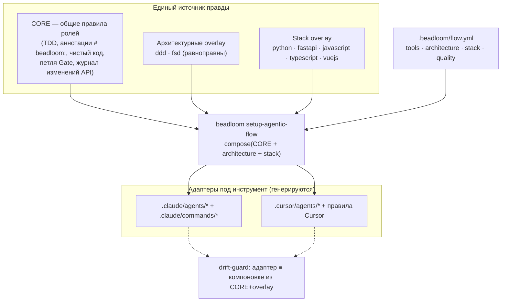
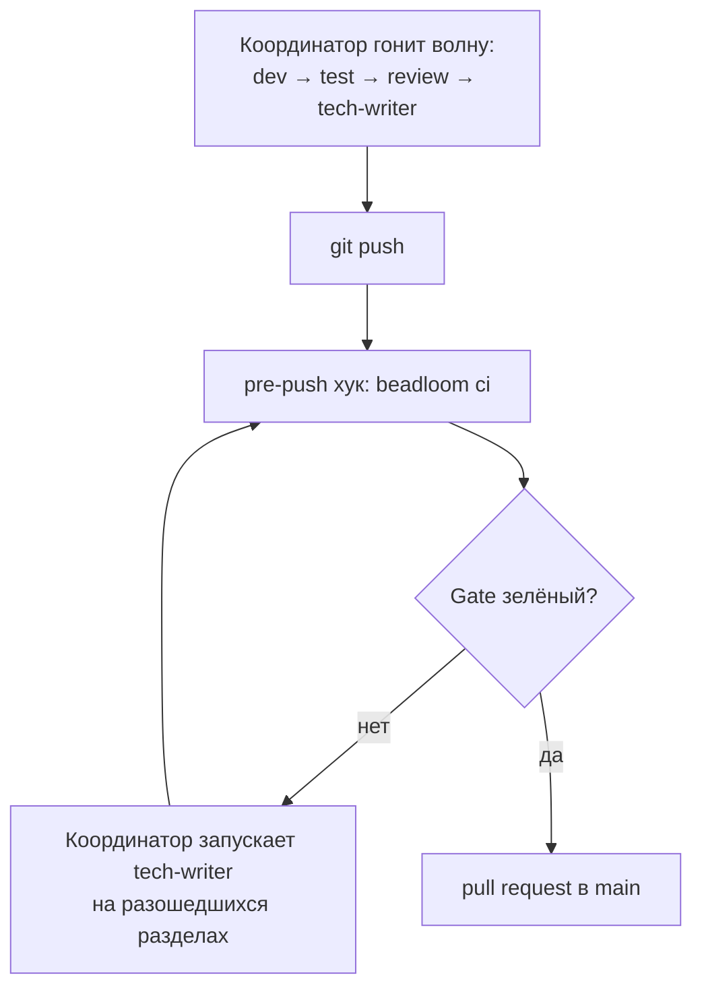
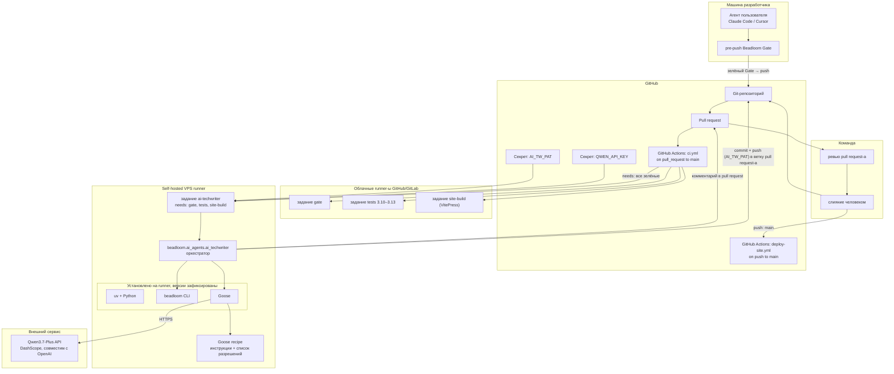
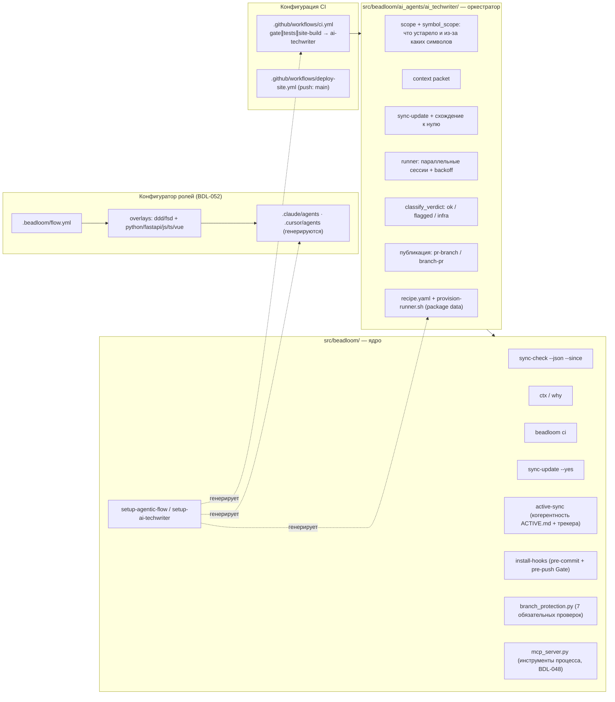
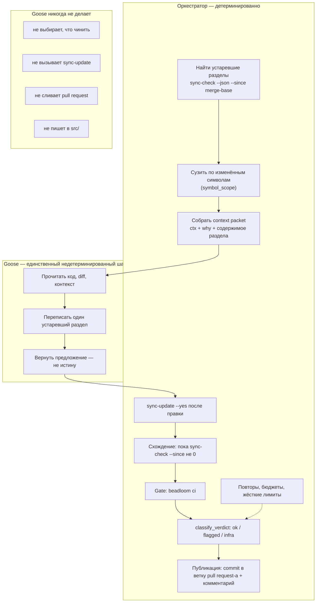
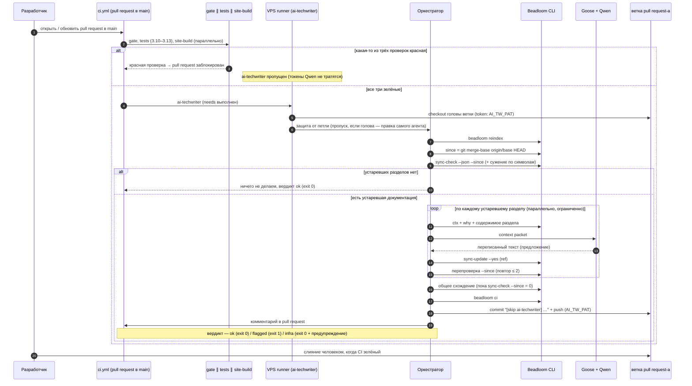
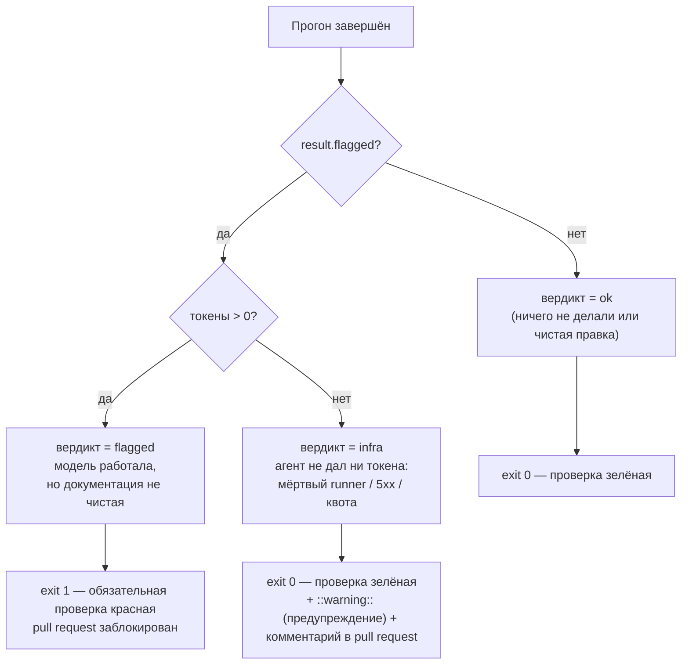
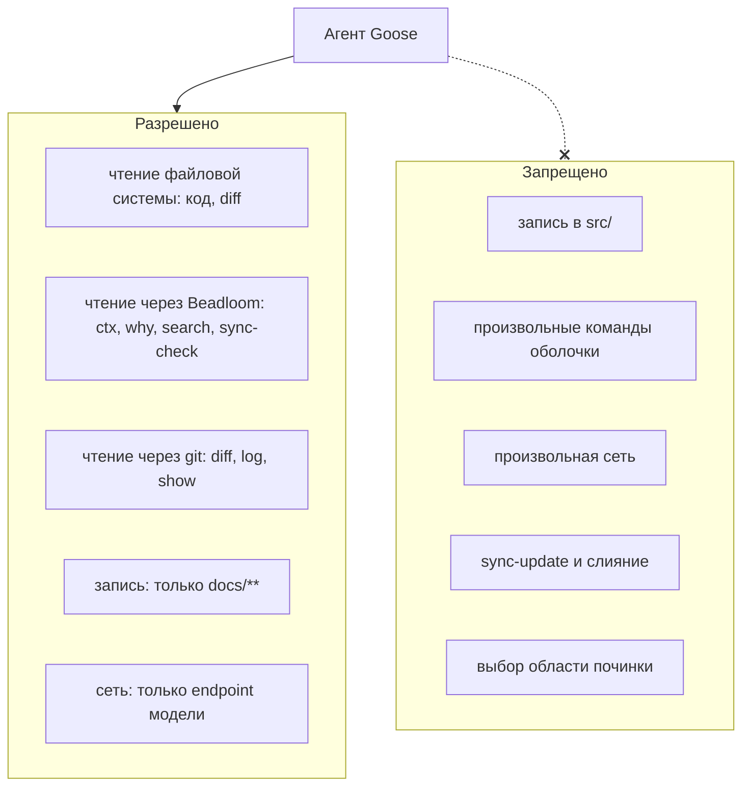
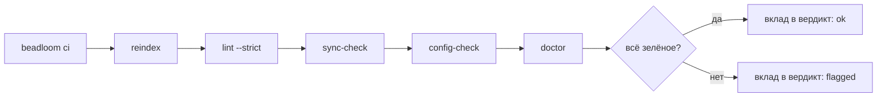
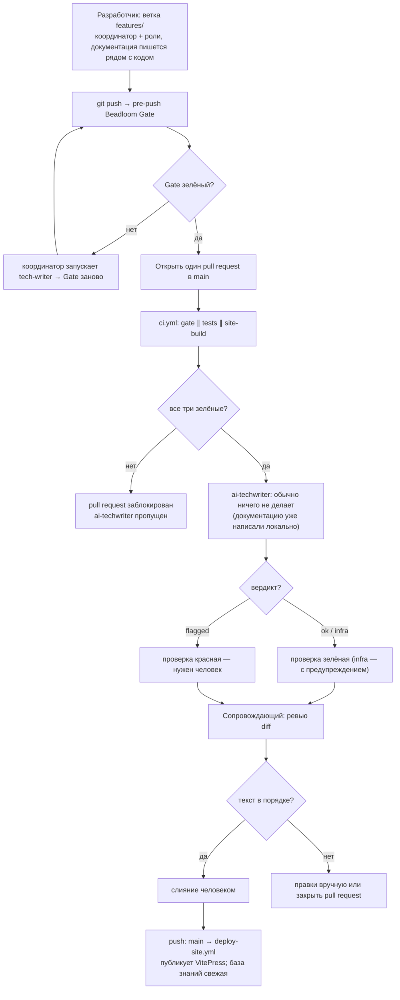

# Агентная разработка в Beadloom 2.0.0: архитектура

> Read this in other languages: [English](./multi-agent-development.md)

> Документ описывает, **где что разворачивается**, **кто за что отвечает** и **как части системы взаимодействуют между собой** — в текущем, выпущенном состоянии (версия 2.0.0).
>
> Хронология изменений: BDL-047 (первый AI tech-writer в CI) → BDL-048 (упаковка многоагентного процесса и инструменты для MCP) → BDL-049 (переход на trunk-based и запуск по pull request) → BDL-050 (сведение CI в единый `ci.yml` и система вердиктов) → BDL-051 («Beadloom управляет сам собой») → BDL-053 (когерентность трекера и файла `ACTIVE.md`) → BDL-052 (настраиваемый, не привязанный к инструменту агентный процесс и pre-push Gate).

---

## Зачем это всё нужно

Beadloom держит в одном графе и архитектуру проекта, и его документацию, и следит за тем, чтобы они не расходились. Когда код меняется, команда `sync-check` честно говорит: «вот этот раздел документации больше не соответствует коду». Но дальше кто-то должен сесть и переписать раздел — а это ровно тот шаг, который в реальной жизни откладывают, и документация сильно устаревает.

Beadloom 2.0.0 закрывает этот разрыв: обновление документации становится частью обычного процесса разработки.

Главный принцип:
**В `main` не попадает код без актуальной документации.** Это не вопрос дисциплины — за этим следят инструменты: детерминированный Beadloom Gate перед push и на стороне CI. Забыть обновить документацию нельзя — Gate просто не пропустит изменение дальше.

---

## Главный принцип 2.0.0: два слоя, один инвариант

Документация пишется в двух местах, но проверяется одним и тем же детерминированным барьером.

**Слой первый, основной — локально, на агенте самого разработчика.** Упакованный агентный процесс Beadloom (`/task-init` → `/coordinator` → роли dev / test / review / tech-writer → push → Beadloom Gate) исполняется тем инструментом, который у разработчика уже открыт: Claude Code, Cursor и так далее. Роль tech-writer пишет документацию прямо здесь, рядом с кодом. Никакой второй языковой модели локально поднимать не нужно — связка Goose + Qwen остаётся исключительно серверной.

**Барьер — pre-push Beadloom Gate.** Перед каждым push команда `beadloom ci` (полный набор детерминированных проверок) запускается как блокирующий git-хук. Если Gate красный — например, документация разошлась с кодом — push останавливается. Тогда координатор запускает роль tech-writer, прогоняет Gate заново и пропускает изменение к pull request только после того, как тот стал зелёным.

**Слой второй, резервный — на стороне CI.** Серверный AI tech-writer на связке Goose + Qwen (наследие BDL-049/050) никуда не делся, но теперь он включается редко — только когда pull request всё-таки пришёл без свежей документации, не пройдя локальный Gate (например, от внешнего участника или от того, кто обошёл процесс). Тогда он обязан привести документацию в порядок. А поскольку локальный Gate делает такие случаи редкими, его пятнадцатиминутный прогон больше не задерживает каждое слияние.

Одна фраза, которую стоит держать в голове:

**Всё в этом цикле детерминировано, кроме одного шага — написания самого текста документации. И даже этот шаг ограничен Beadloom Gate и человеческим ревью pull request-а.**

---

## Участники: кто есть кто

Система намеренно разделена на части: Beadloom остаётся ядром — поставщиком инструментов и данных — и не привязан к конкретному агентному инструменту.

| Участник | Где живёт в репозитории | Что делает |
|------|-------------------------|------------|
| **Beadloom** | `src/beadloom/` | Граф архитектуры, `sync-check`, `ctx` / `why`, `beadloom ci`, конфигуратор ролей. Про Goose ничего не знает. |
| **Локальный агент** | инструмент разработчика (Claude Code, Cursor) | Исполняет упакованный процесс: координатор и роли dev / test / review / tech-writer. Пишет документацию рядом с кодом. |
| **Оркестратор (harness)** | `src/beadloom/ai_agents/ai_techwriter/` | Детерминированный цикл серверного AI tech-writer: поиск устаревших разделов → починка → схождение к нулю → Gate → вердикт → публикация. |
| **Goose** | на self-hosted runner; recipe (`recipe.yaml`) поставляется в составе пакета `beadloom` | Серверный агент: читает контекст, переписывает по одному разделу документации за раз. |
| **Qwen3.7-Plus** | внешний API (DashScope, совместимый с OpenAI) | Модель (`model = qwen3.7-plus`). Ключ хранится только в секрете CI. |

Beadloom **поставляет примитивы**. Оркестратор **собирает из них цикл**. Goose **занимается только написанием документации** — и только в тех границах, которые ему задал оркестратор.

Важное изменение в версии 2.0.0: оркестратор серверного AI tech-writer переехал из служебного каталога `tools/` прямо в пакет — в домен `ai_agents`. Теперь это полноценный, отслеживаемый графом компонент Beadloom (со своим узлом, символами, проверкой `sync-check` и архитектурными границами), а не внешняя пристройка. Вызывается он как `python -m beadloom.ai_agents.ai_techwriter` и поставляется в составе устанавливаемого пакета — никакого копирования исходников в чужой репозиторий больше не происходит.

**Инструменты процесса для MCP (BDL-048).** Отдельно от AI tech-writer Beadloom отдаёт детерминированные шаги процесса как инструменты MCP (`services/mcp_server.py`): `task_init`, `bead_context`, `complete_bead`, `checkpoint`. Это **не оркестрация** — подробнее в разделе [«Ограничения»](#ограничения).

---

## Настраиваемый агентный процесс: конфигуратор ролей (BDL-052)

Главное новшество версии 2.0.0 для команд — упакованный процесс перестал быть привязан и к одному языку программирования, и к одному инструменту. Теперь роли собираются из частей по конфигурации.



Устроено так:

- **CORE** — универсальное ядро ролей, не зависящее ни от языка, ни от инструмента: разработка через тесты, дисциплина аннотаций (роль dev сама проставляет в коде пометки `# beadloom:domain=…` / `feature=…` / `component=…`, чтобы граф оставался честным), принципы чистого кода, петля Beadloom Gate, журнал изменений публичного API для ролей review и tech-writer.
- **Архитектурные overlay** — **ddd** (Domain-Driven Design для бэкенда) и **fsd** (Feature-Sliced Design для фронтенда) на равных правах: каждый добавляет к роли свои правила слоёв и границ и свой словарь аннотаций.
- **Stack overlay** — конкретика языка и фреймворка: `python`, `fastapi`, `javascript`, `typescript`, `vuejs` (каждый приносит свои образцы кода и команды линтинга, типизации и тестов).
- **Конфигурация** `.beadloom/flow.yml` описывает, что собрать: какие инструменты (Claude Code, Cursor), какая архитектура (ddd или fsd), какой стек. Команда `beadloom setup-agentic-flow --tool/--stack/--architecture` компонует CORE с выбранными overlay и пишет адаптеры под каждый инструмент. **Drift-guard** (отдельный тест) следит, чтобы сгенерированные адаптеры всегда соответствовали компоновке. Это значит, что роли не правят вручную: их всегда пересобирает компоновщик, и ручная правка адаптера будет затёрта при следующей сборке.

У самого Beadloom конфигурация скромная — `tools: [claude]`, `architecture: [ddd]`, `stack: [python]`. Команде, которая работает, скажем, над фронтендом на Vue с TypeScript по Feature-Sliced Design в Cursor, достаётся тот же качественный CORE и нужные ей overlay — всё это включается одной строкой в `flow.yml`.

Возможности Cursor по части агентов (собственные субагенты, оркестрация с передачей результата, фоновые задачи, worktree) на сегодня сопоставимы с Claude Code, поэтому полный процесс — координатор плюс роли — идёт на обоих инструментах одинаково. Для инструмента, у которого субагентов нет, предусмотрен запасной режим: тот же процесс выполняется последовательно, по описанию из `AGENTS.md`. Корректность при этом не страдает — за неё отвечает Gate, — теряется только параллельность.

---

## Pre-push Beadloom Gate и петля координатора (BDL-052)

Локальный барьер — это обычный git-хук, который ставится командой `beadloom install-hooks`.



Сам цикл описан в `/coordinator` как явная последовательность шагов, а не как пожелание, которое агент должен «не забыть»: запустить `beadloom ci`, посмотреть код возврата, и если он красный — запустить роль tech-writer на разошедшихся разделах и прогнать Gate заново (с ограничением на число повторов, чтобы не зациклиться). Только зелёный Gate открывает дорогу к pull request.

`pre-commit` остаётся лёгкой проверкой (линтинг и быстрый `sync-check`), а **`pre-push` — это и есть авторитетный блокирующий Gate**. Аварийный выход описан честно: `git push --no-verify` хук обойдёт, но это осознанное исключение, а не норма. В репозитории без Beadloom хук просто ничего не делает и ничего не блокирует.

---

## Beadloom управляет сам собой (BDL-051)

Контекст, без которого двухслойная модель не имела бы смысла: в версии 2.0.0 Beadloom применил собственный тезис к самому себе.

- Появился вид узла **component** (внутренний строительный блок рядом с feature) и проверка **module-coverage** в режиме **ошибки**: каждый модуль в `src/` — это либо узел графа (feature или component), либо явно перечисленное исключение. Никакого «теневого» кода, о котором граф не знает: новый неучтённый модуль роняет `beadloom ci`.
- Серверный AI tech-writer стал первоклассным доменом `ai_agents` внутри пакета (а не внешним каталогом), со своими границами импорта.
- Все модули проекта классифицированы и документированы.

Именно поэтому Beadloom — первый и самый строгий потребитель собственного процесса: правило «нет кода без документации» распространяется и на его собственный код.

---

## Где что физически работает

Частый вопрос: «это в облаке GitHub/GitLab или у нас на сервере?»



**Локально** живёт основной слой: агент разработчика и pre-push Gate. В облако приходит уже согласованная пара — код и документация вместе.

**В облаке GitHub/GitLab** лежат код, каталог `docs/**`, каталог `.beadloom/`, описание конвейера CI и открытые pull request-ы. Единый `ci.yml` запускается на каждый pull request в `main`: задания `gate` (вердикт `beadloom ci`), `tests` (матрица версий Python 3.10–3.13) и `site-build` (сборка сайта на VitePress) идут **параллельно** на облачных runner-ах. Задание `ai-techwriter` объявлено через `needs: [gate, tests, site-build]` и стартует **только если все три зелёные** — сломанный pull request не тратит токены Qwen. Отдельный `deploy-site.yml` — **единственное**, что запускается на `push: main` и публикует сайт на GitHub Pages. При строгом trunk-based ветка `main` зелёная по построению.

**Self-hosted VPS runner** — единственное место, где одновременно живут Goose, оркестратор и доступ к ключу модели. Каждый прогон начинается с чистого checkout.

**Qwen3.7-Plus** — облачный API. Локальной модели на сервере нет.

**Beadloom CLI** ставится на runner, но его исходники — часть репозитория в `src/beadloom/`. Это продукт, а не инфраструктура CI.

---

## Trunk-based и защита ветки (BDL-049 / BDL-050)

`main` — точка интеграции и **защищённая ветка**: прямой push запрещён, всё едет через pull request. Каждая задача — короткоживущая ветка `features/<KEY>` → один pull request в `main` → слияние, когда проверки зелёные.

Защиту настраивает `onboarding/branch_protection.py`: набор обязательных проверок консолидированного `ci.yml` —

```
gate · tests (3.10) · tests (3.11) · tests (3.12) · tests (3.13) · site-build · ai-techwriter
```

Флаг `enforce_admins: true` означает, что даже владелец интегрируется через pull request (строгий trunk-based), а 0 обязательных ревью оставляют одиночному сопровождающему возможность самому выполнить слияние — но ветку `main` при этом обойти нельзя. Применяется идемпотентно командой `beadloom setup-branch-protection`.

Тонкость поведения GitHub: пропущенную обязательную проверку он считает нейтральной, то есть проходной. Поэтому при красном `gate`, `tests` или `site-build` задание `ai-techwriter` оказывается пропущенным, и pull request блокируют именно красные верхние проверки, а не пропущенный `ai-techwriter`. Когда верхние три зелёные, `ai-techwriter` запускается по-настоящему, и его вердикт становится барьером.

---

## Что лежит в репозитории



Важный принцип сохранился: **цикл «починка → схождение → вердикт → публикация» не попадает в ядро Beadloom**. В `src/beadloom/` живут только примитивы (`sync-check --since`, неинтерактивный `sync-update --yes`, `ci`, `ctx` / `why`, защита ветки, семейство команд `setup-*`, конфигуратор ролей). Сам оркестратор лежит в домене `ai_agents` и не привязан к платформе: один и тот же код (`python -m beadloom.ai_agents.ai_techwriter`) вызывается и из GitHub Actions, и из GitLab CI — отличаются только триггер, имена секретов и флаг `--platform`.

---

## Границы ответственности: оркестратор и Goose

Goose — агент, но роль у него намеренно узкая. Всё механическое делает оркестратор, агенту достаётся только то, где нужно суждение.



Так цикл остаётся воспроизводимым: Goose можно заменить другим агентным инструментом, не трогая ядро Beadloom.

---

## Полный прогон CI — шаг за шагом

Это резервный путь — он отрабатывает, когда pull request пришёл без свежей документации. Сценарий одинаков для GitHub Actions и GitLab CI и отличается только триггером, секретами и способом публикации правки.



**Начало.** Pull request в `main` запускает `ci.yml`. Сначала параллельно идут `gate`, `tests` и `site-build`. Если что-то красное — `ai-techwriter` не стартует, токены Qwen не тратятся, а pull request блокируют красные проверки.

Когда все три зелёные, на VPS-runner-е стартует `ai-techwriter`. Первым делом — **защита от петли**: если голова ветки — это коммит самого агента (автор `beadloom-ai-techwriter` или сообщение содержит `[skip ai-techwriter]`), задание пропускается, чтобы push агента не запускал второй прогон. Иначе — `reindex`, вычисление базовой точки `since = git merge-base origin/<base> HEAD`, затем `sync-check --json --since` с сужением области по изменённым символам.

**Сужение по символам (BDL-052).** Раньше изменение одного «толстого» файла помечало устаревшими все связанные с ним разделы — правка одной строки в `cli.py` тянула за собой полтора десятка разделов. Теперь оркестратор смотрит, какие именно символы реально изменились в файле, и сверяет их с теми символами, на которые ссылается раздел документации. Если раздел не зависит ни от одного изменившегося символа, его исключают из работы и молча переаттестовывают, чтобы `sync-check` сошёлся к нулю без переписывания. Правило при этом осторожное: при любой неоднозначности раздел остаётся в работе — лучше переписать лишнее, чем пропустить нужное. Учтён и редкий случай удалённого или переименованного символа: раздел, который ссылается на исчезнувшее имя, тоже остаётся в работе.

**Если дрейф есть.** Оркестратор идёт по устаревшим разделам — теперь ограниченным пулом параллельных сессий (по умолчанию три, с экспоненциальной задержкой при ответах 429/5xx, чтобы не упереться в лимиты тарифа). Для каждого раздела собирается context packet, Goose переписывает текст, оркестратор вызывает `sync-update --yes` и перепроверяет против `--since`. После всех разделов — **общее схождение**: повторять `sync-check --since` и переаттестацию для новых разошедшихся пар, пока не установится устойчивый ноль (правка одного доменного раздела может «задеть» соседние пары — известный инвариант ещё с BDL-047). В конце — `beadloom ci`, коммит правки прямо в ветку pull request-а (сообщение `[skip ai-techwriter] …`, автор `beadloom-ai-techwriter`, push через `AI_TW_PAT`, чтобы коммит запускал проверку `gate`) и комментарий в pull request.

---

## Вердикт: `ok` / `flagged` / `infra` (BDL-050)

`ai-techwriter` — обязательная проверка, которая краснеет **только** при реальной нерешённой проблеме с документацией, но не при сбое инфраструктуры. Оркестратор (`runner.py::classify_verdict`) классифицирует прогон, а `cli.py` переводит вердикт в код возврата. Отличить проблему документации от сбоя инфраструктуры просто: достаточно посмотреть, **дала ли модель хоть какой-то вывод** (`input_tokens + output_tokens > 0`).



| Вердикт | Когда | Код возврата | Эффект |
|---------|-------|--------------|--------|
| **ok** | устаревших разделов нет, либо правка прошла чисто | `0` | проверка зелёная |
| **flagged** | модель работала (`tokens > 0`), но документация всё ещё расходится с кодом: после правки `beadloom ci` красный, схождение не достигнуто или превышен бюджет | `1` | **проверка красная → pull request заблокирован** («нужен человек») |
| **infra** | агент не дал ни одного токена (`tokens == 0`): мёртвый self-hosted runner, ответ 5xx или таймаут провайдера, исчерпана квота — он *не смог запуститься* | `0` | проверка зелёная + явный `::warning::` (предупреждение) + по возможности комментарий в pull request («документация НЕ проверена — перезапустите») |

Вывод простой. Мёртвый VPS или исчерпанная квота тарифа **не** замораживают слияния. А вот реальный нерешённый дрейф — замораживает. Классификация намеренно осторожна: ноль токенов всегда трактуется как `infra`. И даже ошибочный `infra` не теряется — его подсвечивает предупреждение в CI, чтобы человек перезапустил прогон, а не молча отгрузил устаревшую документацию.

---

## Когерентность трекера и файла ACTIVE.md (BDL-053)

Эта возможность решает похожую проблему, только уже не для кода и документации, а для состояния задач. Процесс ведёт его в двух местах — в трекере `bd` и в таблице статусов внутри `ACTIVE.md`. Раньше оба поддерживались вручную и постепенно расходились с реальностью. Beadloom 2.0.0 делает их согласованными по построению.

Команда `beadloom active-sync` берёт `bd` за источник истины. Она перечитывает идентификаторы задач прямо из таблицы в `ACTIVE.md`, спрашивает у `bd` их настоящий статус и переписывает только ячейку статуса. Делает это бережно: заголовки, прозу и журнал прогресса не трогает, а осмысленную пометку сопровождающего сохраняет. Заодно она экспортирует состояние трекера в отслеживаемый файл `.beads/issues.jsonl`, чтобы закрытия задач переживали слияние веток. Всё это встроено в pre-commit хук как автоисправление — то есть устаревшую таблицу статусов просто нельзя закоммитить. В репозитории без трекера или без файлов `ACTIVE.md` команда ничего не делает.

---

## Что Goose может, а что нет

Ограничение набора инструментов — часть безопасности. Даже если агент ошибётся, радиус поражения мал.



---

## Gate `beadloom ci` — детерминированная проверка

Перед `classify_verdict` оркестратор прогоняет полный Gate. Тот же набор проверок стоит и в pre-push хуке, и отдельным заданием `gate` в `ci.yml`.



`sync-check = 0` доказывает **свежесть** — раздел документации ссылается на актуальные символы кода. Это не проверка качества текста: за корректность формулировок отвечает человек на ревью pull request-а. А `lint --strict` теперь проверяет не только границы архитектуры, но и отсутствие «теневого» кода (проверка `module-coverage` в режиме ошибки).

---

## Сценарий для разработчика и ревьюера



Типичный сценарий в 2.0.0 выглядит так. На ветке задачи документацию пишут локально, вместе с кодом. Перед push её проверяет Beadloom Gate. Дальше — один pull request в `main`, и CI гоняет `gate`, `tests` и `site-build`. Серверный `ai-techwriter` при этом, как правило, ничего не делает: документация уже свежая, и он завершается мгновенно. По-настоящему он включается лишь тогда, когда обновить документацию локально забыли. Слияние в `main` запускает `deploy-site.yml` — единственное, что работает на `push: main`.

---

## Ограничения

- **Оркестрация остаётся в инструменте разработчика.** Сервер MCP (BDL-048) отдаёт *инструменты* (`task_init`, `bead_context`, `complete_bead`, `checkpoint`), а **не** оркестрацию — он не умеет порождать субагентов и крутить главный цикл. Координатор и волны субагентов остаются нативными для агента пользователя (Claude Code, Cursor). Конфигуратор лишь собирает под них роли. Инструменты процесса для MCP — это детерминированный субстрат, который процесс *вызывает*, а не замена оркестрации.
- **Документация пишется агентом разработчика, а не серверной моделью.** Связка Goose + Qwen работает только на сервере и служит подстраховкой. Она включается редко — лишь когда локальный Gate обошли. На машине разработчика никакой второй модели не поднимают.
- **`complete_bead` — сильная рекомендация, но не источник истины.** Модель сама решает его вызвать. Он строже текстовых инструкций — действительно отказывается закрывать задачу при красном Gate, — но слабее CI.
- **Истинное принуждение — это Gate, и он в двух местах.** Локально — pre-push хук, на сервере — обязательные проверки `ci.yml`. Оба гоняют один и тот же `beadloom ci`. Ничто их не обходит (кроме осознанного `--no-verify`, который виден в истории).
- **Переход на ty отложен.** Быстрый проверщик типов `ty` от Astral пока в стадии беты и по точности уступает `mypy`, поэтому проект сознательно остаётся на `mypy --strict` и вернётся к вопросу, когда у `ty` выйдет стабильный релиз.

---

## Безопасность

**Ключ модели** (`QWEN_API_KEY`) и токен для push (`AI_TW_PAT`) живут в секретах CI (GitHub Secrets, переменные GitLab CI/CD) и доступны только заданию на self-hosted runner. В логах и репозитории их нет.

**Runner** привязан к проекту. На каждый прогон создаётся отдельное временное рабочее пространство.

**Goose** пишет только в `docs/**`. Исходники не трогает.

**Автоматического слияния нет**: `sync-check = 0` доказывает свежесть, но не качество текста. Pull request сливает человек.

**`sync-update` вне цикла** — та же операция, что и интерактивный `sync-update`. Ею можно случайно «озеленить» плохой раздел, поэтому ревью pull request-а и обоснование в его описании — обязательная часть процесса.

---

## Шпаргалка на одну страницу

| Вопрос | Ответ |
|--------|-------|
| Кто пишет документацию в обычном сценарии? | Агент разработчика (Claude Code, Cursor) — локально, рядом с кодом |
| Что не пускает код без документации? | Beadloom Gate: pre-push хук локально + обязательная проверка в CI |
| Зачем тогда серверный ai-techwriter? | Страховка: включается, когда pull request пришёл без свежей документации |
| Где крутится gate / tests / site-build? | Облачные runner-ы GitHub/GitLab |
| Где крутится ai-techwriter? | Self-hosted runner на VPS (Goose + ключ модели) |
| Где живёт оркестратор? | `src/beadloom/ai_agents/ai_techwriter/` (домен пакета, не каталог `tools/`) |
| Как вызывается | `python -m beadloom.ai_agents.ai_techwriter` |
| Чем настраивается процесс? | `.beadloom/flow.yml`: tools (claude/cursor) · architecture (ddd/fsd) · stack |
| Триггер CI | `on: pull_request → main` (единый `ci.yml`); `deploy-site.yml` — единственное на `push: main` |
| Порядок заданий | `gate ∥ tests ∥ site-build` → `ai-techwriter` (`needs:`) |
| Базовая точка дрейфа | `git merge-base origin/<base> HEAD` (`--since`), область сужается по изменённым символам |
| Куда кладётся правка | commit в ветку **того же** pull request-а (push через `AI_TW_PAT`) |
| Вердикт | `ok` / `infra` → exit 0; `flagged` → exit 1 (блокирует только реальный дрейф) |
| Обязательные проверки | 7: `gate`, `tests (3.10..3.13)`, `site-build`, `ai-techwriter` |
| Защита ветки | `enforce_admins: true`, 0 ревью (строгий trunk-based) |
| Как попадает в main | pull request + слияние человеком (автоматического слияния нет) |
| Что пишет серверный агент | только `docs/**` |

---

## Связанные документы

- **RFC BDL-052** — настраиваемый агентный процесс, конфигуратор ролей, pre-push Gate (текущая модель)
- **RFC BDL-053** — когерентность трекера и `ACTIVE.md` (`active-sync`)
- **RFC BDL-051** — «Beadloom управляет сам собой»: вид узла component, проверка без теневого кода, домен `ai_agents`
- **RFC BDL-050** — консолидация CI и система вердиктов
- **RFC BDL-049** — trunk-based и запуск по pull request
- **RFC BDL-047** — первичная архитектура оркестратора
- [`agentic-flow.md`](./agentic-flow.md) — руководство по упакованному процессу и конфигуратору ролей
- [`ai-techwriter.md`](./ai-techwriter.md) — руководство оператора по серверному AI tech-writer
