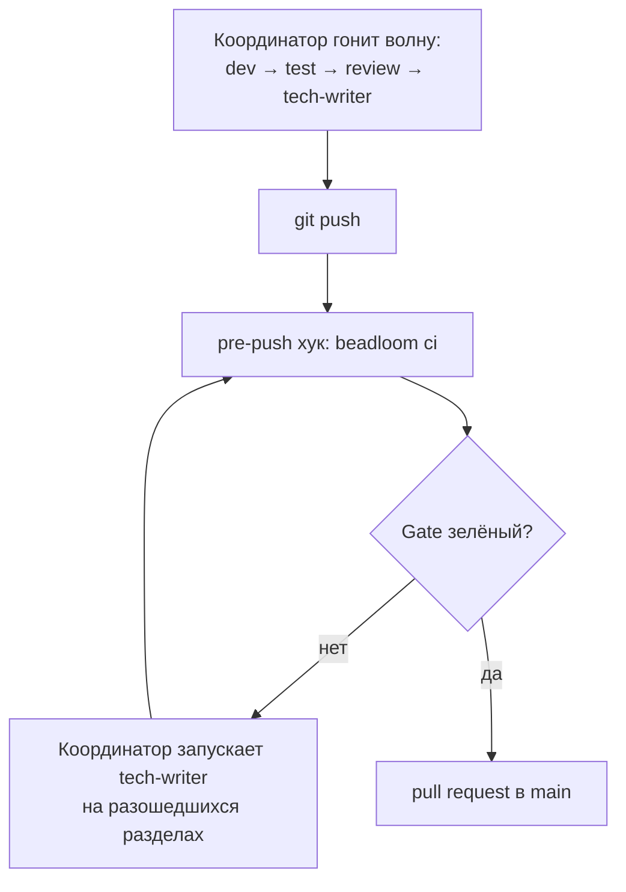
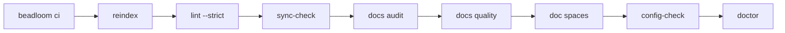
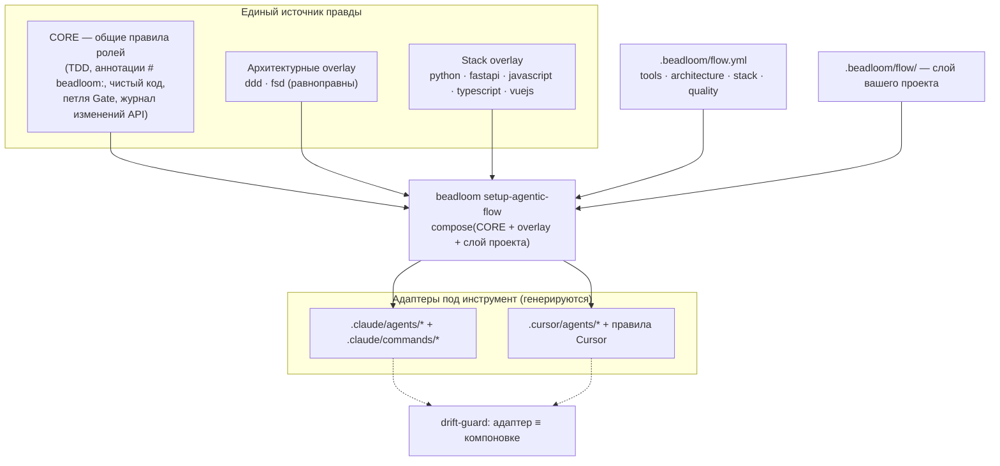
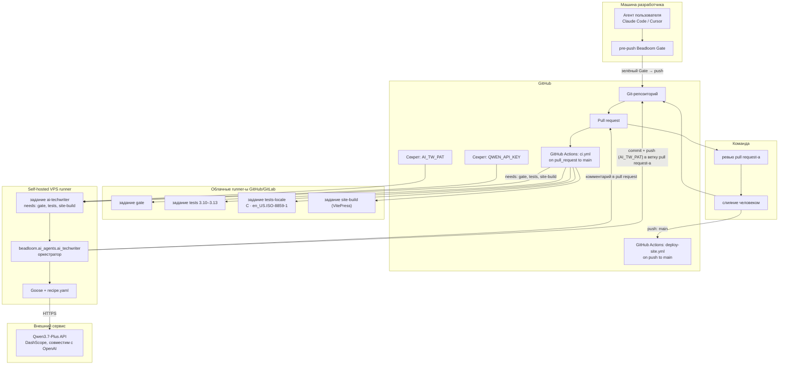
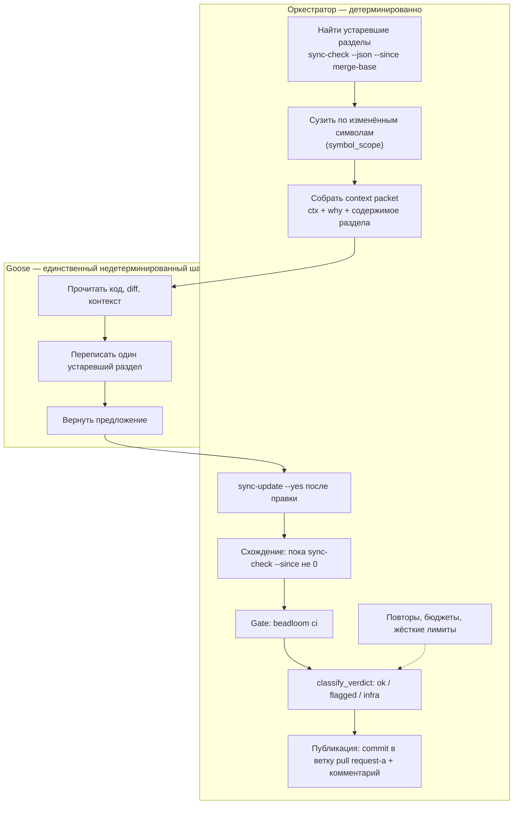
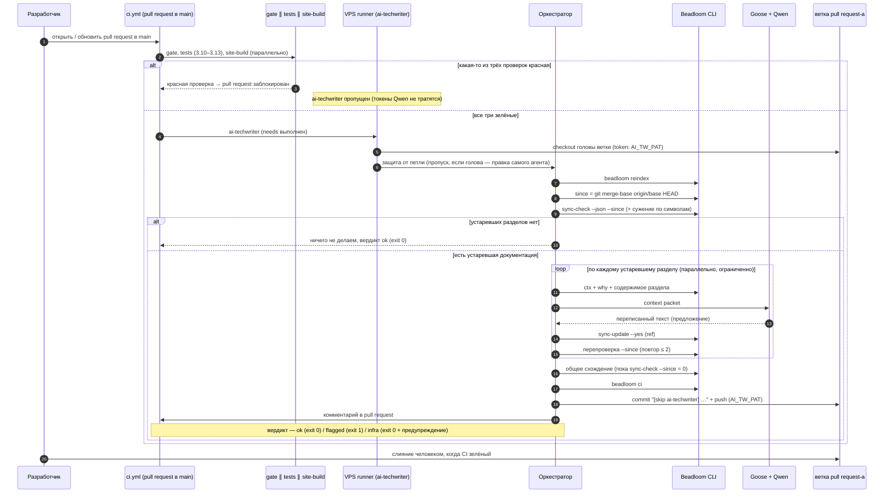

# Агентная разработка в Beadloom: архитектура

> Read this in other languages: [English](./multi-agent-development.md)

> Здесь описано, где что разворачивается, кто за что отвечает и как части системы связаны между собой. Всё сказанное относится к текущему, выпущенному состоянию.

---

## Разрыв, который закрывает этот процесс

Beadloom держит в одном графе архитектуру проекта и его документацию и следит, чтобы они не расходились. Когда код меняется, `sync-check` говорит прямо: этот раздел документации больше не описывает код, к которому привязан. На этом инструмент долго и останавливался. Дальше кто-то должен был сесть и переписать раздел, а такой шаг откладывают.

Процесс, описанный ниже, делает обновление документации частью обычной работы над задачей. Правило одно: **в `main` не попадает код без актуальной документации.** За правилом стоит не дисциплина, а команда с кодом возврата. Она называется Beadloom Gate и стоит в двух местах: перед push и в CI. Забыть про документацию можно. Протолкнуть её мимо Gate нельзя.

---

## Основной путь: документацию пишут рядом с кодом

Документацию пишет тот же агент, которым разработчик уже пользуется: Claude Code, Cursor или другой. Упакованный процесс Beadloom исполняется прямо в нём: `/task-init`, затем `/coordinator`, затем роли dev, test, review, tech-writer, затем push. Роль tech-writer правит документы в той же ветке, где лежит код. Никакой второй языковой модели на машине разработчика поднимать не нужно.

Перед каждым push срабатывает git-хук, который ставит `beadloom install-hooks`, и запускает `beadloom ci` целиком.


```mermaid
flowchart TB
  WORK["Координатор гонит волну:<br/>dev → test → review → tech-writer"]
  PUSH["git push"]
  GATE["pre-push хук: beadloom ci"]
  RED{"Gate зелёный?"}
  FIX["Координатор запускает tech-writer<br/>на разошедшихся разделах"]
  PR["pull request в main"]

  WORK --> PUSH --> GATE --> RED
  RED -->|нет| FIX --> GATE
  RED -->|да| PR
```

Красный Gate останавливает push. Тогда координатор запускает роль tech-writer на разошедшихся разделах, прогоняет Gate заново и открывает pull request только после того, как тот стал зелёным. Число повторов ограничено, иначе цикл крутился бы бесконечно. Эта петля записана в `/coordinator` явной последовательностью шагов, поэтому агенту не нужно о ней помнить.

`pre-commit` остаётся лёгкой проверкой: линтинг и быстрый `sync-check`. Блокирующий барьер — это `pre-push`. Аварийный выход назван честно: `git push --no-verify` хук обойдёт, и обход виден в истории коммитов. В репозитории без Beadloom хук ничего не делает и ничего не блокирует.

Фраза, которую стоит держать в голове: **весь цикл детерминирован, кроме одного шага — написания самого текста. И этот шаг ограничен Gate-ом и человеческим ревью pull request-а.**

---

## Gate: восемь шагов и то, чего каждый не смотрел

`beadloom ci` прогоняет восемь шагов подряд. Девятым становится `federate`, когда проект объявляет репозитории-спутники.


```mermaid
flowchart LR
  CI["beadloom ci"] --> R["reindex"]
  R --> L["lint --strict"]
  L --> S["sync-check"]
  S --> DA["docs audit"]
  DA --> DQ["docs quality"]
  DQ --> DS["doc spaces"]
  DS --> C["config-check"]
  C --> D["doctor"]
```

Тот же набор стоит в pre-push хуке и отдельным заданием `gate` в CI. Три шага из восьми смотрят на документы.

| Шаг | Что он утверждает |
|---|---|
| `reindex` | индекс собран из графа, документации и кода |
| `lint --strict` | границы архитектуры соблюдены, теневых модулей нет |
| `sync-check` | каждый раздел документации ссылается на актуальные символы кода |
| `docs audit` | числа и версии, названные в прозе, совпадают с теми, что вычисляет проект |
| `docs quality` | плановые документы отвечают стандарту письма |
| `doc spaces` | у законченной работы есть документ, описывающий построенное |
| `config-check` | собранные адаптеры ролей не разошлись с графом и конфигурацией |
| `doctor` | граф целостен |

`sync-check = 0` доказывает свежесть: раздел ссылается на те символы, которые в коде есть сейчас. Качество формулировок этот ноль не доказывает, за формулировки отвечает человек на ревью.

### Каждый шаг называет и то, чего он не проверял

Это главное свойство Gate, и ради него он устроен именно так. Зелёный шаг, не проверивший ничего, не должен читаться как зелёный шаг, проверивший всё.

| Шаг | Что он называет вдобавок к находкам |
|---|---|
| `lint` | сколько правил из запущенных не смогли проверить ничего |
| `docs audit` | три ответа про каждый заявленный факт вместо одного — см. ниже |
| `docs quality` | виды документов, которые не читает ни одна проверка |
| `doc spaces` | эпики, не объявившие ни одного узла, и эпики, неизвестные трекеру |
| `sync-check` | связки, которые не с чем сравнить, — они считаются отдельно и в число свежих не попадают |

Ответы `docs audit` стоит развернуть, потому что число сверенных утверждений само по себе ничего не значит.

| Ответ | Что он значит |
|---|---|
| проверено | документ назвал число, и прогон сверил его с тем, что вычисляет проект |
| не проверено | сверять было нечего: либо факт не назван ни в одном документе, либо его значение таково, что никакое утверждение о нём прочитать нельзя |
| неприменимо | проект отказался вычислять этот факт, и причина отказа напечатана рядом |

Так факт, уходящий из счёта, называется по имени. На этом репозитории строка читается как `5 of 9 declared fact(s) verified` и перечисляет остальные четыре поимённо.

### Строгость сообщения о бездействии намеренно несимметрична

Правило, у которого перестала работать **часть**, сообщает предупреждение, каким бы уровнем оно ни было объявлено. Мёртвый шаблон пути. Исключение, которое ничего не подавляет. Отбор узлов, не выбравший ни одного, при живых остальных проверках того же правила. Всё это дефект конфигурации, а не нарушение границы. Красить конвейер на обновлении, не изменившем ни строки кода, он не должен.

Правило, которое не смогло проверить **ничего** из того, что должно было, — это другой факт. Тогда «нарушений не найдено» и «правило не работало» дают один и тот же вывод, а повышение уровня, испаряющееся ровно в этот момент, — это повышение, которого нет. Поэтому `doc-area-coherence` и `graph-summary-facts` сообщают о полном отказе от проверки на том уровне, который объявил проект. Цена у них разная. Первое поставляется на уровне `warn` и ничей прогон не меняет. Второе поставляется на уровне `error`, поэтому проект, включивший его на графе без единого числового утверждения, теперь краснеет. Отменяется это одним ключом `severity: warn` в той же записи правила. [Модель архитектуры](./architecture-model.md) разбирает оба правила и называет третье, которое так пока не поступает.

---

## Из чего собран процесс

Процесс не привязан ни к одному языку программирования, ни к одному инструменту. Роли собираются из частей по конфигурации, а конфигурация — это один файл.

```yaml
# .beadloom/flow.yml
tools:        [claude, cursor]   # адаптеры для одного или обоих
architecture: [ddd]              # ddd | fsd (ровно один)
stack:        [python]           # python, fastapi, javascript, typescript, vuejs
quality:      [clean-code, tdd]
language:     en                 # язык документов процесса
```


```mermaid
flowchart TB
  subgraph CANON["Единый источник правды"]
    CORE["CORE — общие правила ролей<br/>(TDD, аннотации # beadloom:, чистый код,<br/>петля Gate, журнал изменений API)"]
    ARCH["Архитектурные overlay<br/>ddd · fsd (равноправны)"]
    STACK["Stack overlay<br/>python · fastapi · javascript · typescript · vuejs"]
  end

  FLOW[".beadloom/flow.yml<br/>tools · architecture · stack · quality"]
  PROJ[".beadloom/flow/ — слой вашего проекта"]
  COMPOSE["beadloom setup-agentic-flow<br/>compose(CORE + overlay + слой проекта)"]

  subgraph ADAPTERS["Адаптеры под инструмент (генерируются)"]
    CLAUDE[".claude/agents/* + .claude/commands/*"]
    CURSOR[".cursor/agents/* + правила Cursor"]
  end

  GUARD["drift-guard: адаптер ≡ компоновке"]

  CORE --> COMPOSE
  ARCH --> COMPOSE
  STACK --> COMPOSE
  FLOW --> COMPOSE
  PROJ --> COMPOSE
  COMPOSE --> CLAUDE
  COMPOSE --> CURSOR
  CLAUDE -.-> GUARD
  CURSOR -.-> GUARD
```

Слоёв четыре.

- **CORE** — универсальное ядро ролей: разработка через тесты, принципы чистого кода, петля Gate, журнал изменений публичного API для ролей review и tech-writer. Сюда же входит дисциплина аннотаций: роль dev сама проставляет в коде пометки `# beadloom:domain=…`, `feature=…` и `component=…`, чтобы граф оставался честным.
- **Архитектурный overlay** — **ddd** (Domain-Driven Design, обычно бэкенд) и **fsd** (Feature-Sliced Design, обычно фронтенд) на равных правах. Каждый добавляет к роли свои правила слоёв и границ и свой словарь аннотаций.
- **Stack overlay** — конкретика языка и фреймворка. Каждый приносит свои образцы кода и свои команды линтинга, типизации и тестов.
- **Слой вашего проекта** в `.beadloom/flow/` компонуется последним и переживает обновление, потому что обновление меняет ядро под ним. Отменить правило ядра можно только декларацией с причиной и сроком, а по истечении срока о ней сообщит `config-check`. Подробности — в [руководстве по проектным оверлеям](./project-overlays.md).

`beadloom setup-agentic-flow` собирает из этих слоёв протоколы четырёх ролей, slash-команды и `CLAUDE.md`. Отдельный тест drift-guard следит, чтобы сгенерированные адаптеры совпадали с компоновкой. Отсюда следует практическое правило: роли не правят руками, потому что ручную правку затрёт следующая сборка.

У самого Beadloom конфигурация скромная — `tools: [claude]`, `architecture: [ddd]`, `stack: [python]`. Команде, которая пишет фронтенд на Vue с TypeScript по Feature-Sliced Design в Cursor, достаётся то же ядро и нужные ей overlay. Включается это одной строкой в `flow.yml`.

Возможности Cursor по части агентов сегодня сопоставимы с Claude Code: собственные субагенты, оркестрация с передачей результата, фоновые задачи, worktree. Поэтому полный процесс, координатор вместе с ролями, идёт на обоих инструментах одинаково. Для инструмента без субагентов предусмотрен запасной режим: тот же процесс выполняется последовательно, по описанию из `AGENTS.md`. Корректность при этом не страдает, за неё отвечает Gate. Теряется только параллельность.

---

## Что процесс проверяет, кроме свежести документации

К циклу «написал код, написал документацию, прошёл Gate» добавились пять механизмов. У каждого есть своё руководство, здесь сказано только зачем механизм нужен и где он стоит.

### Guard-ы: правило процесса перестаёт быть прозой

Guard отвечает на один процессный вопрос об одной ситуации. Покрыта ли эта правка заявленной задачей? Идёт ли работа вне защищённой ветки? Условие объявлено в блоке `guards:` файла `.beadloom/flow.yml`, вычисляет его Beadloom, а адаптер инструмента своей логики не содержит.

`beadloom guard <имя>` возвращает `0` при пропуске или прохождении, `1` при предупреждении и `2` при блокировке. Один код различается между оболочкой и хуком инструмента, и различается намеренно. Дефект в объявленной конфигурации или командная строка, которой нельзя воспользоваться, дают `3` в оболочке и `2` под `--hook`, потому что `3` не останавливает вызов инструмента, а guard, который не смог ответить, никогда не должен читаться как прошедший.

`beadloom guard --liveness` сообщает, какие guard-ы срабатывали, а какие не защищают ничего. В этом репозитории работают `bead-claimed` и `working-branch`, оба на поставляемом уровне `warn`.

### `beadloom waves`: форму волны выводят из графа

Трекер знает, какая задача блокирует какую. Какой код эти задачи занимают, знает только граф архитектуры. `beadloom waves BEAD [BEAD ...]` решает, какие из названных задач могут идти одновременно, по независимости занятых ими узлов на уровне кода. Каждую пару, которую он развёл по разным волнам, он сопровождает одной причиной из закрытого списка: `blocked_by_bead`, `unresolved_scope`, `shared_node`, `shared_file`, `dependency_edge`, `override_serial`.

Как бы волна ни легла, четыре вещи её агенты делят между собой в любом случае: рабочее дерево, хук pre-commit, базу свежести документации и пространство идентификаторов трекера. По каждой из четырёх на этапе планирования выносится вердикт, и он может вернуться как `failed`. Та, которую никто не измерял, возвращается как `unmeasured`, и это находка с кодом возврата `1`, а не молчаливое прохождение. Код `0` — чисто, `1` — есть находки, `2` — решить нельзя.

Проверяется здесь предусловие, измеренное до запуска волны. За поведением волны после запуска не следит ничто. См. [руководство по параллельным волнам](./parallel-waves.md).

### Три пространства документов

Каждый документ лежит в одном из трёх пространств.

| Пространство | Виды документов | Что с ним делает Gate |
|---|---|---|
| TO-BE | `PRD`, `RFC`, `BRIEF`, `CONTEXT`, `PLAN` | читает по стандарту письма, держит против документа AS-IS |
| AS-IS | `SPEC`, `DOC`, `README` | связывает с кодом через `sync-check` |
| WORKING | `ACTIVE` | освобождает от проверки свежести по объявлению |

Имена намеренно не TODO и DONE, потому что здесь ничто не меняет статус. PRD не становится выполненным. Когда работа заканчивается, пишется другой артефакт — документ AS-IS.

Причина в том, что флаг не с чем сверять. `status: done` истинен потому, что кто-то его напечатал, и никакое дальнейшее изменение кода не сделает его ложным. У отношения оба конца лежат на диске: этот эпик записал намерение, его задачи закрыты, а у названного им узла до сих пор нет документа, описывающего построенное. Это и проверяет `beadloom docs spaces`, один из шагов `beadloom ci`. См. [руководство по видам документов](./document-kinds.md).

### `beadloom review-brief`: ревьюер получает изменение и спецификацию

Команда собирает задание, объявленную область, спецификационные документы графа, связанные сценарии `@bead:` и все изменённые файлы. Комментарии самой задачи она придерживает и сообщает, сколько их придержала. Отчёт автора при этом не пропадает: `--release` печатает его, как только записан комментарий с вердиктом.

Смысл именно в порядке. Агент, который сначала прочёл вывод автора, склонен проверять этот вывод вместо изменения.

### Собственные метаданные графа проверяются против проекта

Ещё недавно все правила читали только связи графа: какой модуль дотягивается до какого узла, какому слою позволено импортировать какой. Поля, которые граф хранит о самом себе, не читал никто, и два из них были здесь неверны на протяжении трёх мажорных выпусков, ни разу не покраснев.

`graph-summary-facts` вычитывает числовые и версионные утверждения из `summary` каждого узла и сверяет каждое с тем же фактом, который проект вычисляет о себе. Цена ошибки в `summary` высока: эту фразу цитируют `ctx`, `prime`, сгенерированный сайт и каждый адаптер агента.

`doc-area-coherence` спрашивает, документирует ли узел сам себя там, где велит собственное соглашение этого графа. Соглашение оно выводит из проверяемого графа, а не из раскладки, записанной где-либо ещё. Поэтому правило работает и на проекте с нарезкой по фичам, и на здешней раскладке «пакет на домен».

Оба правила — обычные записи в `.beadloom/_graph/rules.yml`. Оба печатают `unverifiable` отдельным ответом: графу, в чьих `summary` нет ни одного числа или чьи документы не сходятся ни на одном соглашении, скажут, что его пропустили, а не что его проверили и он чист. См. [модель архитектуры](./architecture-model.md).

### Рядом: федерация между репозиториями

`beadloom export` и `beadloom federate` распространяют тот же вопрос «намерение против реальности» на несколько репозиториев. Каждый сервис публикует детерминированный артефакт с привязкой к коммиту, а хаб собирает два и более таких артефакта в федеративный граф с вердиктами по связям и по контрактам. К однорепозиторному циклу выше это не относится, и `beadloom ci` запускает `federate` только тогда, когда проект объявляет спутники.

---

## Beadloom применяет всё это к себе

Всё описанное выше Beadloom применяет к собственному коду. Выражается это в четырёх вещах.

- Есть вид узла **component** — внутренний строительный блок рядом с feature. Есть проверка **module-coverage** в режиме ошибки: каждый модуль в `src/` — это либо узел графа, либо явно перечисленное исключение. Новый неучтённый модуль роняет `beadloom ci`.
- Серверный AI tech-writer стал доменом `ai_agents` внутри пакета, со своими границами импорта.
- Узел держат за то, что он документирует себя там, где этот граф документирует узлы из его области исходников, и за то, что в его `summary` нет числа, которому проект противоречит.
- Узел, которому документ действительно не положен, записывает это решение вместе с причиной прямо в граф, а `doctor` печатает причину. Отсутствие, о котором кто-то принял решение, перестаёт читаться так же, как отсутствие, которого никто не разбирал.

Поэтому Beadloom — первый и самый строгий потребитель собственного процесса. Правило «нет кода без документации» распространяется и на его собственный код.

---

## Trunk-based и защита ветки

`main` — точка интеграции и защищённая ветка. Прямой push запрещён, всё едет через pull request. Каждая задача — короткоживущая ветка `features/<KEY>`, из неё один pull request в `main`, слияние по зелёным проверкам.

Защиту настраивает `onboarding/branch_protection.py`. По умолчанию команда применяет `DEFAULT_STATUS_CHECK_CONTEXTS` — набор из девяти проверок консолидированного `ci.yml`, который получает любой проект, развёрнутый по этому шаблону:

```
gate · tests (3.10) · tests (3.11) · tests (3.12) · tests (3.13) ·
tests-locale (C) · tests-locale (en_US.ISO-8859-1) ·
site-build · ai-techwriter
```

В этом репозитории живая защита требует семь из них. Двух контекстов `tests-locale` в ней нет, и это проверено запросом `gh api repos/:owner/:repo/branches/main/protection`. Обе проверки локали были заведомо красными, пока не был исправлен вскрытый ими текстовый ввод-вывод. Сейчас они зелёные. Смысл этих двух проверок в том, что они гоняют один и тот же набор тестов в другом окружении, и ценна разница между окружениями, а не цвет каждого из них.

Красная обязательная проверка при `strict: true` сделала бы слияние в `main` невозможным. Поэтому `beadloom setup-branch-protection` идемпотентна, но перезапускать её здесь стоит только после сверки объявленных контекстов с тем, что реально становится зелёным на открытом pull request. Второй способ — передать `--check` с тем набором, который конвейер действительно может выполнить.

Число объявленных контекстов менялось в обе стороны, и запомнить стоит именно это. Десятым добавили `tests-windows`, который варьирует платформу так же, как `tests-locale` варьирует окружение. Затем владелец его снял. Причина измерена: 16–28 минут runner-времени на каждый pull request, и, в отличие от проверок локали, эта проверка становится критическим путём конвейера и увеличивает время от pull request до слияния примерно втрое. Платформа при этом не входит в целевые для проекта. На Windows здесь никогда ничего не выполнялось и, по этому решению, выполняться не будет. Так и записано в `docs/domains/application/features/flow-guards/SPEC.md`, разделом *Windows: unverified by decision*, вместо того чтобы зелёный конвейер намекал на поддержку.

Флаг `enforce_admins: true` означает, что даже владелец интегрируется через pull request. Ноль обязательных ревью оставляет одиночному сопровождающему возможность самому выполнить слияние, но обойти `main` он всё равно не может.

Ещё одна тонкость поведения GitHub. Пропущенную обязательную проверку он считает нейтральной, то есть проходной. Поэтому при красном `gate`, `tests` или `site-build` задание `ai-techwriter` оказывается пропущенным, и pull request блокируют именно красные верхние проверки. Когда верхние три зелёные, `ai-techwriter` запускается по-настоящему, и его вердикт становится барьером.

---

## Где что физически работает

Частый вопрос: это в облаке GitHub/GitLab или у нас на сервере?


```mermaid
flowchart TB
  subgraph LOCAL["Машина разработчика"]
    AGENT["Агент пользователя<br/>Claude Code / Cursor"]
    PREPUSH["pre-push Beadloom Gate"]
  end

  subgraph GITHUB["GitHub"]
    GH_REPO["Git-репозиторий"]
    GH_SECRET["Секрет: QWEN_API_KEY"]
    GH_PAT["Секрет: AI_TW_PAT"]
    GH_CI["GitHub Actions: ci.yml<br/>on pull_request to main"]
    GH_DEPLOY["GitHub Actions: deploy-site.yml<br/>on push to main"]
    GH_PR["Pull request"]
  end

  subgraph CLOUD_RUN["Облачные runner-ы GitHub/GitLab"]
    JOB_GATE["задание gate"]
    JOB_TESTS["задание tests 3.10–3.13"]
    JOB_LOCALE["задание tests-locale<br/>C · en_US.ISO-8859-1"]
    JOB_SITE["задание site-build (VitePress)"]
  end

  subgraph VPS["Self-hosted VPS runner"]
    AITW["задание ai-techwriter<br/>needs: gate, tests, site-build"]
    ORCH["beadloom.ai_agents.ai_techwriter<br/>оркестратор"]
    GOOSE_RT["Goose + recipe.yaml"]
  end

  subgraph EXTERNAL["Внешний сервис"]
    QWEN["Qwen3.7-Plus API<br/>DashScope, совместим с OpenAI"]
  end

  subgraph DEV["Команда"]
    REVIEW["ревью pull request-а"]
    MERGE["слияние человеком"]
  end

  AGENT --> PREPUSH
  PREPUSH -->|"зелёный Gate → push"| GH_REPO
  GH_REPO --> GH_PR --> GH_CI
  GH_CI --> JOB_GATE
  GH_CI --> JOB_TESTS
  GH_CI --> JOB_LOCALE
  GH_CI --> JOB_SITE
  GH_CI -->|"needs: gate, tests, site-build"| AITW
  GH_SECRET --> AITW
  GH_PAT --> AITW
  AITW --> ORCH --> GOOSE_RT
  GOOSE_RT -->|HTTPS| QWEN
  ORCH -->|"commit + push (AI_TW_PAT) в ветку pull request-а"| GH_REPO
  ORCH -->|"комментарий в pull request"| GH_PR
  GH_PR --> REVIEW --> MERGE --> GH_REPO
  MERGE -->|"push: main"| GH_DEPLOY
```

**Локально** живёт основной слой: агент разработчика и pre-push Gate. В облако приходит уже согласованная пара, код и документация вместе.

**В облаке GitHub/GitLab** лежат код, каталог `docs/**`, каталог `.beadloom/`, описание конвейера и открытые pull request-ы. Единый `ci.yml` запускается на каждый pull request в `main`. Задания `gate`, `tests` (матрица Python 3.10–3.13), `tests-locale` (тот же полный набор тестов под `C` и под `en_US.ISO-8859-1`) и `site-build` идут параллельно на облачных runner-ах.

Задание `ai-techwriter` объявлено через `needs: [gate, tests, site-build]` и стартует только по зелёным этим трём, поэтому сломанный pull request не тратит токены Qwen. `tests-locale` в этот набор `needs:` намеренно не входит. Он измеряет среду, в которой идут тесты, и требований к работе агента не накладывает. Слияние он останавливает через защиту ветки. Отдельный `deploy-site.yml` — единственное, что запускается на `push: main`, и он публикует сайт на GitHub Pages. При строгом trunk-based ветка `main` зелёная по построению.

**Self-hosted VPS runner** — единственное место, где одновременно живут Goose, оркестратор и доступ к ключу модели. Версии `uv`, Python, Beadloom CLI и Goose на нём зафиксированы, а каждый прогон начинается с чистого checkout.

**Qwen3.7-Plus** — облачный API. Локальной модели на сервере нет.

**Beadloom CLI** ставится на runner, но его исходники лежат в `src/beadloom/` вместе с остальным репозиторием. Это часть продукта, и конвейер её не порождает.

---

## Резервный путь: серверный AI tech-writer

Пока локальный Gate работает, этот путь простаивает. Он отрабатывает, когда pull request всё-таки пришёл без свежей документации: от внешнего участника или от того, кто обошёл процесс. Сценарий одинаков для GitHub Actions и GitLab CI и отличается только триггером, именами секретов и способом публикации правки.

Участников трое, и роли у них намеренно разные.

| Участник | Где живёт | Что делает |
|---|---|---|
| **Оркестратор** | `src/beadloom/ai_agents/ai_techwriter/` | Детерминированный цикл: поиск устаревших разделов, починка, схождение к нулю, Gate, вердикт, публикация |
| **Goose** | self-hosted runner, recipe (`recipe.yaml`) поставляется в пакете `beadloom` | Читает контекст и переписывает по одному разделу документации за раз |
| **Qwen3.7-Plus** | внешний API (DashScope, совместимый с OpenAI) | Модель `qwen3.7-plus`. Ключ хранится только в секрете CI |

Beadloom поставляет команды. Оркестратор собирает из них цикл. Goose пишет текст, и только в тех границах, которые задал ему оркестратор.

Оркестратор — обычный компонент пакета: у него есть узел графа, символы, проверка `sync-check` и архитектурные границы. Вызывается он как `python -m beadloom.ai_agents.ai_techwriter`. Копировать исходники в чужой репозиторий не нужно, они приезжают вместе с пакетом.

Важный принцип: цикл «починка → схождение → вердикт → публикация» в ядро Beadloom не попадает. В `src/beadloom/` живут только отдельные команды: `sync-check --since`, неинтерактивный `sync-update --yes`, `ci`, `ctx` и `why`, защита ветки, семейство `setup-*` и конфигуратор ролей. Один и тот же код оркестратора вызывается и из GitHub Actions, и из GitLab CI, отличаются только триггер, имена секретов и флаг `--platform`.

### Что делает оркестратор и что достаётся Goose

Всё механическое делает оркестратор. Агенту достаётся один шаг, тот, где нужно суждение.


```mermaid
flowchart TB
  subgraph DETERMINISTIC["Оркестратор — детерминированно"]
    D1["Найти устаревшие разделы<br/>sync-check --json --since merge-base"]
    D1b["Сузить по изменённым символам<br/>(symbol_scope)"]
    D2["Собрать context packet<br/>ctx + why + содержимое раздела"]
    D3["sync-update --yes после правки"]
    D4["Схождение: пока sync-check --since не 0"]
    D5["Gate: beadloom ci"]
    D6["classify_verdict: ok / flagged / infra"]
    D7["Публикация: commit в ветку pull request-а + комментарий"]
    D8["Повторы, бюджеты, жёсткие лимиты"]
  end

  subgraph NONDET["Goose — единственный недетерминированный шаг"]
    N1["Прочитать код, diff, контекст"]
    N2["Переписать один устаревший раздел"]
    N3["Вернуть предложение"]
  end

  D1 --> D1b --> D2 --> N1
  N1 --> N2 --> N3
  N3 --> D3 --> D4 --> D5 --> D6 --> D7
  D8 -.-> D6
```

Набор инструментов Goose ограничен, и это часть безопасности. Даже при ошибке агента радиус поражения мал.

| Разрешено | Запрещено |
|---|---|
| чтение файловой системы: код, diff | запись в `src/` |
| чтение через Beadloom: `ctx`, `why`, `search`, `sync-check` | произвольные команды оболочки |
| чтение через git: `diff`, `log`, `show` | произвольная сеть |
| запись только в `docs/**` | `sync-update` и слияние |
| сеть только до endpoint-а модели | выбор области починки |

Так цикл остаётся воспроизводимым, и Goose можно заменить другим агентным инструментом, не трогая ядро Beadloom.

### Прогон шаг за шагом


```mermaid
sequenceDiagram
  autonumber
  participant Dev as Разработчик
  participant CI as ci.yml (pull request в main)
  participant V as gate ∥ tests ∥ site-build
  participant R as VPS runner (ai-techwriter)
  participant O as Оркестратор
  participant BL as Beadloom CLI
  participant G as Goose + Qwen
  participant Repo as ветка pull request-а

  Dev->>CI: открыть / обновить pull request в main
  CI->>V: gate, tests (3.10–3.13), site-build (параллельно)

  alt какая-то из трёх проверок красная
    V-->>CI: красная проверка → pull request заблокирован
    Note over R: ai-techwriter пропущен (токены Qwen не тратятся)
  else все три зелёные
    CI->>R: ai-techwriter (needs выполнен)
    R->>Repo: checkout головы ветки (token: AI_TW_PAT)
    R->>O: защита от петли (пропуск, если голова — правка самого агента)
    O->>BL: beadloom reindex
    O->>BL: since = git merge-base origin/base HEAD
    O->>BL: sync-check --json --since (+ сужение по символам)

    alt устаревших разделов нет
      O-->>CI: ничего не делаем, вердикт ok (exit 0)
    else есть устаревшая документация
      loop по каждому устаревшему разделу (параллельно, ограниченно)
        O->>BL: ctx + why + содержимое раздела
        O->>G: context packet
        G-->>O: переписанный текст (предложение)
        O->>BL: sync-update --yes (ref)
        O->>BL: перепроверка --since (повтор ≤ 2)
      end
      O->>BL: общее схождение (пока sync-check --since = 0)
      O->>BL: beadloom ci
      O->>Repo: commit "[skip ai-techwriter] …" + push (AI_TW_PAT)
      O->>CI: комментарий в pull request
      Note over O,CI: вердикт — ok (exit 0) / flagged (exit 1) / infra (exit 0 + предупреждение)
    end
  end

  Dev->>Repo: слияние человеком, когда CI зелёный
```

Первое, что делает задание, — **защита от петли**. Если голова ветки это коммит самого агента (автор `beadloom-ai-techwriter` или сообщение содержит `[skip ai-techwriter]`), задание пропускается, чтобы push агента не запускал второй прогон. Иначе идут `reindex`, вычисление базовой точки `since = git merge-base origin/<base> HEAD` и `sync-check --json --since`.

**Сужение по символам.** Раньше изменение одного толстого файла помечало устаревшими все связанные с ним разделы, и правка одной строки в `cli.py` тянула за собой полтора десятка разделов. Теперь оркестратор смотрит, какие символы реально изменились в файле, и сверяет их с теми, на которые ссылается раздел документации. Раздел, не зависящий ни от одного изменившегося символа, из работы исключают и молча помечают свежим, чтобы `sync-check` сошёлся к нулю без переписывания. Правило осторожное: при любой неоднозначности раздел остаётся в работе. Лучше переписать лишнее, чем пропустить нужное. Удалённое или переименованное имя тоже оставляет раздел в работе.

**Если расхождение есть.** Оркестратор идёт по устаревшим разделам ограниченным пулом параллельных сессий (по умолчанию три). При ответах 429 и 5xx включается экспоненциальная задержка, чтобы не упереться в лимиты тарифа. Для каждого раздела собирается context packet, Goose переписывает текст, оркестратор вызывает `sync-update --yes` и перепроверяет против `--since`.

После всех разделов идёт **общее схождение**: `sync-check --since` и пометка свежести повторяются для новых разошедшихся пар, пока не установится устойчивый ноль. Правка одного доменного раздела может задеть соседние пары, и это известно с самой первой версии оркестратора. В конце — `beadloom ci`, коммит правки прямо в ветку pull request-а и комментарий в pull request. У коммита сообщение `[skip ai-techwriter] …` и автор `beadloom-ai-techwriter`, а push идёт через `AI_TW_PAT`, чтобы коммит запускал проверку `gate`.

### Вердикт: `ok`, `flagged`, `infra`

`ai-techwriter` — обязательная проверка, которая краснеет только при реальной нерешённой проблеме с документацией. Сбой инфраструктуры её не красит. Прогон классифицирует `runner.py::classify_verdict`, а `cli.py` переводит вердикт в код возврата. Отличить проблему документации от сбоя инфраструктуры просто: достаточно посмотреть, дала ли модель хоть какой-то вывод (`input_tokens + output_tokens > 0`).

| Вердикт | Когда | Код возврата | Эффект |
|---------|-------|--------------|--------|
| **ok** | устаревших разделов нет, либо правка прошла чисто | `0` | проверка зелёная |
| **flagged** | модель работала (`tokens > 0`), но документация всё ещё расходится с кодом: после правки `beadloom ci` красный, схождение не достигнуто или превышен бюджет | `1` | проверка красная, pull request заблокирован, нужен человек |
| **infra** | модель не дала ни одного токена (`tokens == 0`): мёртвый self-hosted runner, ответ 5xx или таймаут провайдера, исчерпанная квота | `0` | проверка зелёная, плюс явный `::warning::` и по возможности комментарий в pull request |

Вывод простой. Мёртвый VPS или исчерпанная квота тарифа не замораживают слияния. Настоящее нерешённое расхождение документации с кодом — замораживает. Классификация намеренно осторожна, и ноль токенов всегда трактуется как `infra`. Даже ошибочный `infra` не теряется: его подсвечивает предупреждение в CI, чтобы человек перезапустил прогон.

---

## Трекер и файл ACTIVE.md

Та же беда, что была у кода с документацией, только теперь у состояния работ. Процесс ведёт его в двух местах: в трекере `bd` и в таблице статусов внутри `ACTIVE.md`. Раньше оба поддерживались вручную и постепенно расходились с реальностью.

`beadloom active-sync` берёт `bd` за источник истины. Команда перечитывает идентификаторы задач прямо из таблицы в `ACTIVE.md`, спрашивает у `bd` их настоящий статус и переписывает только ячейку статуса. Заголовки, прозу и журнал прогресса она не трогает. Осмысленную пометку сопровождающего сохраняет. Заодно она экспортирует состояние трекера в отслеживаемый файл `.beads/issues.jsonl`, чтобы закрытия задач переживали слияние веток.

Всё это встроено в pre-commit хук как автоисправление, поэтому устаревшую таблицу статусов просто нельзя закоммитить. В репозитории без трекера или без файлов `ACTIVE.md` команда ничего не делает.

---

## Ограничения

- **Оркестрация остаётся в инструменте разработчика.** Сервер MCP отдаёт 18 инструментов, четыре из которых ведут процесс: `task_init`, `bead_context`, `complete_bead`, `checkpoint`. Оркестрации среди них нет, потому что MCP не умеет порождать субагентов и крутить главный цикл. Координатор и волны субагентов остаются внутри агента пользователя. Конфигуратор лишь собирает под них роли, а инструменты MCP — это детерминированные шаги, которые процесс вызывает по ходу дела.
- **`complete_bead` — сильная рекомендация.** Модель сама решает его вызвать. Он строже текстовых инструкций и действительно отказывается закрывать задачу при красном Gate, но источником истины остаётся CI.
- **По-настоящему заставляет только Gate, и он стоит в двух местах.** Локально это pre-push хук, на сервере обязательные проверки `ci.yml`. Оба гоняют один и тот же `beadloom ci`. Обойти их можно только осознанным `--no-verify`, который виден в истории.
- **Переход на `ty` отложен.** Быстрый проверщик типов `ty` от Astral пока в стадии беты и по точности уступает `mypy`. Проект остаётся на `mypy --strict` и вернётся к вопросу, когда у `ty` выйдет стабильный релиз.

---

## Безопасность

Ключ модели `QWEN_API_KEY` и токен для push `AI_TW_PAT` живут в секретах CI (GitHub Secrets или переменные GitLab CI/CD) и доступны только заданию на self-hosted runner. В логах и в репозитории их нет. Сам runner привязан к проекту, и на каждый прогон создаётся отдельное временное рабочее пространство.

Автоматического слияния нет. `sync-check = 0` доказывает свежесть, но не качество текста, поэтому pull request сливает человек.

Отдельно стоит помнить про `sync-update` вне цикла. Это та же операция, что и интерактивный `sync-update`, и ею можно случайно «озеленить» плохой раздел. Поэтому ревью pull request-а и обоснование в его описании — обязательная часть процесса.

---

## Шпаргалка на одну страницу

| Вопрос | Ответ |
|--------|-------|
| Кто пишет документацию в обычном сценарии? | Агент разработчика (Claude Code, Cursor) локально, рядом с кодом |
| Что не пускает код без документации? | Beadloom Gate: pre-push хук локально плюс обязательная проверка в CI |
| Из чего состоит Gate? | `reindex`, `lint --strict`, `sync-check`, `docs audit`, `docs quality`, `doc spaces`, `config-check`, `doctor`. Девятым идёт `federate`, если объявлены спутники |
| Зачем тогда серверный ai-techwriter? | Страховка: включается, когда pull request пришёл без свежей документации |
| Где крутится gate / tests / site-build? | Облачные runner-ы GitHub/GitLab |
| Где крутится ai-techwriter? | Self-hosted runner на VPS (Goose плюс ключ модели) |
| Где живёт оркестратор? | `src/beadloom/ai_agents/ai_techwriter/` — домен пакета |
| Как он вызывается? | `python -m beadloom.ai_agents.ai_techwriter` |
| Чем настраивается процесс? | `.beadloom/flow.yml`: tools (claude/cursor) · architecture (ddd/fsd) · stack · quality · guards |
| Триггер CI | `on: pull_request → main`, единый `ci.yml`. На `push: main` работает только `deploy-site.yml` |
| Порядок заданий | `gate ∥ tests ∥ tests-locale ∥ site-build` → `ai-techwriter` (`needs: [gate, tests, site-build]`) |
| От чего считается расхождение | `git merge-base origin/<base> HEAD` (`--since`), область сужается по изменённым символам |
| Куда кладётся правка | commit в ветку того же pull request-а, push через `AI_TW_PAT` |
| Вердикт | `ok` и `infra` дают exit 0, `flagged` даёт exit 1 |
| Обязательные проверки | по умолчанию девять, в этом репозитории живут семь, без двух контекстов `tests-locale` |
| Защита ветки | `enforce_admins: true`, ноль обязательных ревью |
| Как попадает в main | pull request плюс слияние человеком, автоматического слияния нет |
| Что пишет серверный агент | только `docs/**` |

---

## Связанные документы

| Документ | О чём |
|---|---|
| [`agentic-flow.md`](./agentic-flow.md) | упакованный процесс и конфигуратор ролей |
| [`ai-techwriter.md`](./ai-techwriter.md) | руководство оператора по серверному AI tech-writer |
| [`parallel-waves.md`](./parallel-waves.md) | что гарантирует волна параллельных агентов и как изолирован ревьюер |
| [`document-kinds.md`](./document-kinds.md) | три пространства документов и стандарт письма |
| [`project-overlays.md`](./project-overlays.md) | четыре слоя сборки и слой проекта, переживающий обновление |
| [`architecture-model.md`](./architecture-model.md) | домен, фича и компонент, проверка без теневого кода, два правила о метаданных графа |

Историю решений держат RFC внутри `.claude/development/docs/features/`: BDL-047 (первая архитектура оркестратора), BDL-049 (переход на trunk-based), BDL-050 (консолидация CI и система вердиктов), BDL-051 (Beadloom управляет сам собой), BDL-052 (настраиваемый процесс и pre-push Gate), BDL-053 (когерентность трекера и `ACTIVE.md`), BDL-061 (guard-ы, слой проекта, три пространства документов, волны и `review-brief`), BDL-062 (метаданные графа как проверяемая поверхность).
