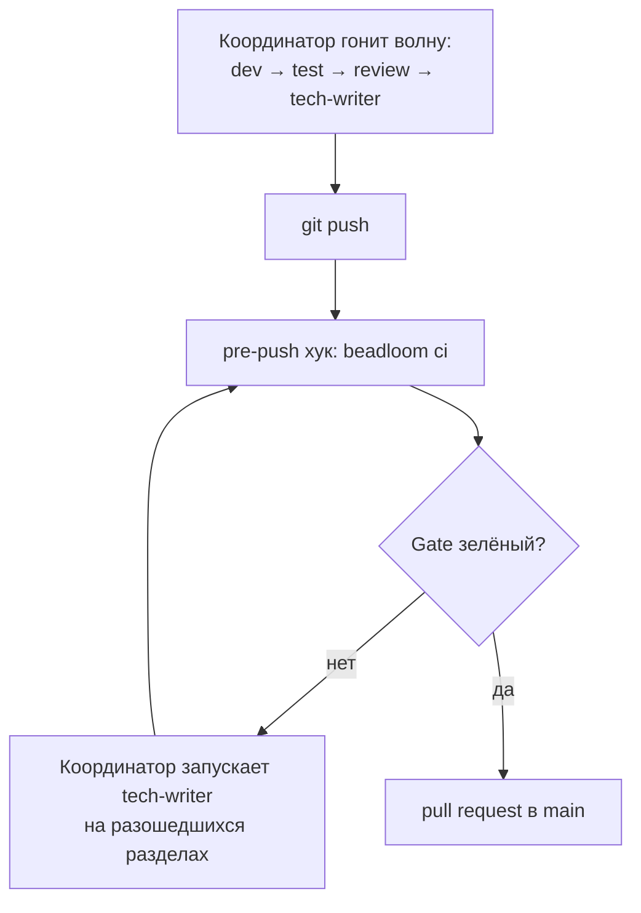
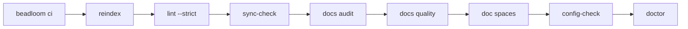
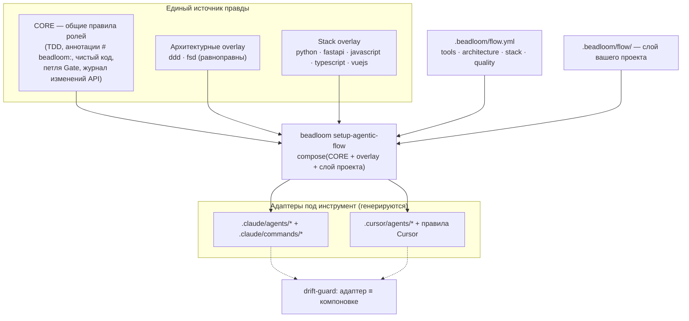
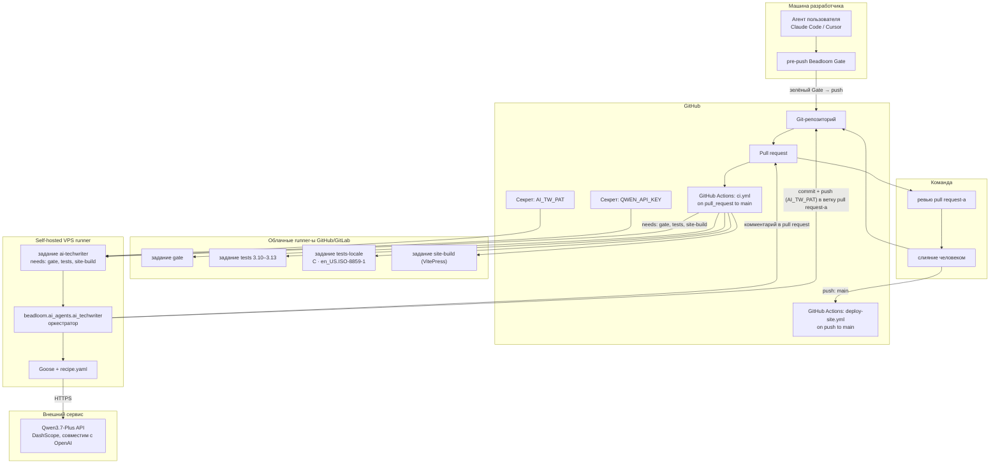
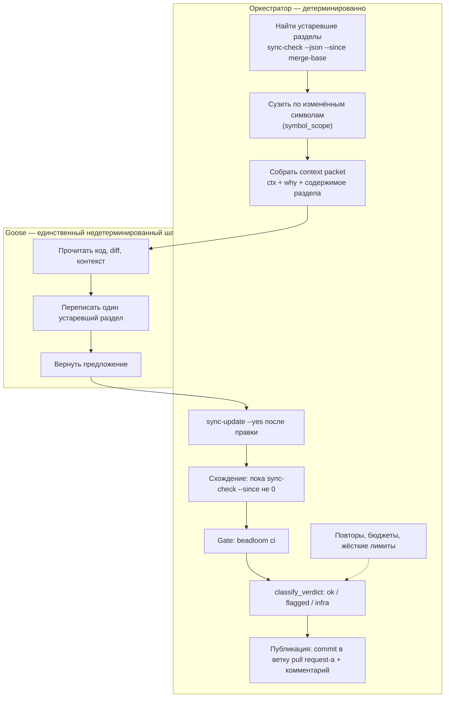
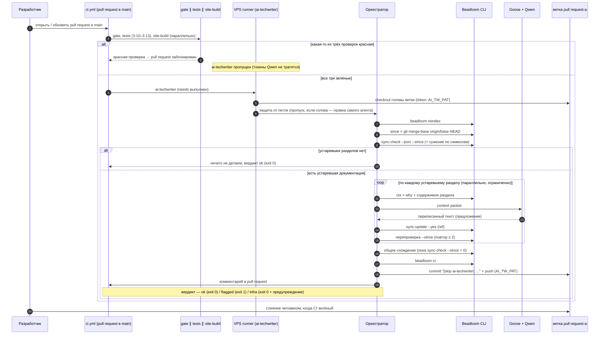

# Агентная разработка в Beadloom: архитектура

> Read this in other languages: [English](./multi-agent-development.md)

> Здесь описано, где что разворачивается, кто за что отвечает и как части системы связаны между собой. Всё сказанное относится к текущему, выпущенному состоянию.

---

## Разрыв, который закрывает этот процесс

Beadloom хранит архитектуру проекта и документацию в едином графе, не позволяя им расходиться. При изменении кода `sync-check` прямо сообщает: этот раздел документации больше не описывает код, к которому привязан. Раньше на этом возможности инструмента и заканчивались: далее требовалось вручную переписывать раздел, а эту задачу постоянно откладывали.

Описанный ниже процесс интегрирует обновление документации в рабочий процесс над задачей. Правило одно: **в `main` не попадает код без актуальной документации.** За соблюдением правила стоит не дисциплина, а команда, возвращающая код ошибки. Этот механизм называется Beadloom Gate и срабатывает в двух местах: перед push и в CI. Документацию можно забыть обновить, но протолкнуть изменения мимо Gate не получится.

---

## Основной путь: документацию пишут рядом с кодом

Документацию генерирует тот же AI-агент, который разработчик использует для кода: Claude Code, Cursor или любой другой. Оркестрируемый процесс Beadloom выполняется прямо внутри него: сначала `/task-init`, затем `/coordinator`, после чего по очереди отрабатывают роли dev, test, review и tech-writer, и в конце происходит push. Роль tech-writer обновляет документацию в той же ветке, где находятся изменения кода. Запускать вторую языковую модель на машине разработчика не требуется.

Перед каждым push срабатывает git-хук, настроенный командой `beadloom install-hooks`, который запускает полный пайплайн `beadloom ci`.


```mermaid
flowchart TB
  WORK["Координатор гонит волну:<br/>dev → test → review → tech-writer"]
  PUSH["git push"]
  GATE["pre-push хук: beadloom ci"]
  RED{"Gate зелёный?"}
  FIX["Координатор запускает tech-writer<br/>на разошедшихся разделах"]
  PR["pull request в main"]

  WORK --> PUSH --> GATE --> RED
  RED -->|нет| FIX --> GATE
  RED -->|да| PR
```

Если Gate загорается красным, push блокируется. В этом случае координатор запускает роль tech-writer для актуализации расходящихся разделов, повторно прогоняет проверку и открывает pull request только после успешного прохождения Gate. Количество попыток строго ограничено, чтобы избежать бесконечного цикла. Вся эта логика зашита в `/coordinator` в виде явной последовательности шагов, поэтому агенту не нужно «держать её в голове».

Хук `pre-commit` выполняет только легковесные проверки: линтинг и быстрый `sync-check`. Основной блокирующий барьер находится на уровне `pre-push`. Предусмотрен и штатный аварийный выход: флаг `git push --no-verify` позволяет обойти хук, причём факт обхода остаётся заметным в истории коммитов. Если в репозитории не установлен Beadloom, хук просто не выполняет никаких действий и ничего не блокирует.

Ключевая мысль, которую стоит держать в уме: **весь цикл детерминирован, кроме одного шага — написания самого текста. И этот шаг ограничен Gate-ом и человеческим ревью pull request.**

---

## Gate: восемь шагов и то, чего каждый не смотрел

`beadloom ci` последовательно выполняет восемь шагов. Девятым шагом добавляется `federate`, если в проекте объявлены репозитории-спутники.


```mermaid
flowchart LR
  CI["beadloom ci"] --> R["reindex"]
  R --> L["lint --strict"]
  L --> S["sync-check"]
  S --> DA["docs audit"]
  DA --> DQ["docs quality"]
  DQ --> DS["doc spaces"]
  DS --> C["config-check"]
  C --> D["doctor"]
```

Этот же набор шагов выполняется в pre-push хуке и в виде отдельного задания `gate` в CI. Три из восьми шагов проверяют документацию.

| Шаг | Что он подтверждает |
|---|---|
| `reindex` | индекс собран на основе графа, документации и кода |
| `lint --strict` | границы архитектуры соблюдены, теневые модули отсутствуют |
| `sync-check` | каждый раздел документации ссылается на актуальные символы кода |
| `docs audit` | числовые значения и версии, указанные в документации, совпадают с вычисляемыми проектом |
| `docs quality` | проектная документация соответствует стандартам написания |
| `doc spaces` | для завершенной работы существует документ, описывающий реализованное решение |
| `config-check` | собранные адаптеры ролей согласованы с графом и конфигурацией |
| `doctor` | граф целостен |

Результат `sync-check = 0` гарантирует актуальность: разделы ссылаются только на те символы, которые действительно присутствуют в коде. Однако это не подтверждает качество формулировок — за смысловую часть отвечает разработчик на ревью.

### Каждый шаг называет и то, чего он не проверял

Это ключевая особенность Gate, ради которой он так спроектирован. Успешно пройденный шаг, который фактически ничего не проверял, не должен восприниматься как шаг, проверивший всё.

| Шаг | Что он дополнительно сообщает помимо найденных проблем |
|---|---|
| `lint` | количество правил из запущенных, которые не смогли выполнить проверку |
| `docs audit` | три варианта ответа для каждого заявленного факта вместо одного (см. ниже) |
| `docs quality` | типы документов, которые не обрабатываются ни одной проверкой |
| `doc spaces` | эпики, не объявившие ни одного узла, и эпики, неизвестные трекеру |
| `sync-check` | связки, которые не с чем сравнивать — они учитываются отдельно и не попадают в список актуальных |

Ответы `docs audit` стоит рассмотреть подробнее, так как просто количество сверенных утверждений само по себе ни о чем не говорит.

| Ответ | Значение |
|---|---|
| проверено | документ содержит число, и проверка сверил его со значением, вычисляемым проектом |
| не проверено | сверять нечего: факт не указан ни в одном документе, либо его значение не позволяет сделать однозначное утверждение |
| неприменимо | проект не вычисляет этот факт, причина отказа выводится рядом |

Таким образом, каждый факт, исключенный из подсчета, явно идентифицируется. В данном репозитории выводится строка вида `5 of 9 declared fact(s) verified`, а остальные четыре факта перечисляются поименно.

### Строгость сообщения о бездействии намеренно несимметрична

Если в правиле перестала работать **часть**, оно выводит предупреждение независимо от заданного уровня. Это может быть нерабочий шаблон пути, исключение, которое ничего не подавляет, или выборка узлов, не нашедшая ни одного элемента при успешной работе остальных проверок этого правила. Всё это классифицируется как дефект конфигурации, а не нарушение границ. Такие ситуации не должны приводить к падению конвейера при обновлениях, не изменяющих ни строки кода.

Если правило не смогло проверить **ничего** из того, что должно было, это совершенно другая ситуация. В таком случае сообщения «нарушений не найдено» и «правило не работало» дают одинаковый результат, а повышение уровня серьезности, которое должно было сработать, фактически игнорируется. Поэтому `doc-area-coherence` и `graph-summary-facts` сообщают о полном пропуске проверки на уровне, заданном для проекта. Последствия при этом различаются. Первое правило работает на уровне `warn` и не влияет на статус прогона. Второе работает на уровне `error`, поэтому проект, включивший его для графа без единого числового утверждения, завершится с ошибкой. Это можно отключить, добавив ключ `severity: warn` в запись того же правила. [Модель архитектуры](./architecture-model.md) разбирает оба правила и упоминает третье, которое пока так не делает.

---

## Из чего собран процесс

Сам процесс не зависит от конкретного языка программирования или инструмента разработки. Конфигурация ролей собирается из модульных компонентов, которые описываются в едином конфигурационном файле.

```yaml
# .beadloom/flow.yml
tools:        [claude, cursor]   # адаптеры для одного или обоих
architecture: [ddd]              # ddd | fsd (ровно один)
stack:        [python]           # python, fastapi, javascript, typescript, vuejs
quality:      [clean-code, tdd]
language:     en                 # язык документов процесса
```


```mermaid
flowchart TB
  subgraph CANON["Единый источник правды"]
    CORE["CORE — общие правила ролей<br/>(TDD, аннотации # beadloom:, чистый код,<br/>петля Gate, журнал изменений API)"]
    ARCH["Архитектурные overlay<br/>ddd · fsd (равноправны)"]
    STACK["Stack overlay<br/>python · fastapi · javascript · typescript · vuejs"]
  end

  FLOW[".beadloom/flow.yml<br/>tools · architecture · stack · quality"]
  PROJ[".beadloom/flow/ — слой вашего проекта"]
  COMPOSE["beadloom setup-agentic-flow<br/>compose(CORE + overlay + слой проекта)"]

  subgraph ADAPTERS["Адаптеры под инструмент (генерируются)"]
    CLAUDE[".claude/agents/* + .claude/commands/*"]
    CURSOR[".cursor/agents/* + правила Cursor"]
  end

  GUARD["drift-guard: адаптер ≡ компоновке"]

  CORE --> COMPOSE
  ARCH --> COMPOSE
  STACK --> COMPOSE
  FLOW --> COMPOSE
  PROJ --> COMPOSE
  COMPOSE --> CLAUDE
  COMPOSE --> CURSOR
  CLAUDE -.-> GUARD
  CURSOR -.-> GUARD
```

Архитектура процесса состоит из четырёх слоёв:

- **CORE** — универсальное ядро для всех ролей. Включает в себя TDD, принципы чистого кода, цикл Gate и журнал изменений публичного API (для ролей review и tech-writer). Также сюда входит дисциплина аннотаций: роль dev самостоятельно добавляет в код пометки `# beadloom:domain=…`, `feature=…` и `component=…`, чтобы граф зависимостей оставался актуальным.
- **Архитектурный overlay** — надстройки для **ddd** (Domain-Driven Design, обычно для бэкенда) и **fsd** (Feature-Sliced Design, обычно для фронтенда). Оба подхода равноправны. Каждый из них добавляет специфичные правила слоёв, границы модулей и собственный словарь аннотаций.
- **Stack overlay** — специфика языка и фреймворка. Определяет примеры кода, а также команды для линтинга, проверки типов и запуска тестов.
- **Слой вашего проекта** — находится в `.beadloom/flow/`, компонуется последним и не перезаписывается при обновлении базового ядра. Переопределить правило ядра можно только через декларацию с указанием причины и срока действия. По истечении этого срока `config-check` выведет предупреждение. Подробнее об этом в [руководстве по проектным оверлеям](./project-overlays.md).

Команда `beadloom setup-agentic-flow` собирает из этих слоёв протоколы для четырёх ролей, slash-команды и файл `CLAUDE.md`. За целостностью следит отдельный тест `drift-guard`, который проверяет, что сгенерированные адаптеры строго соответствуют итоговой компоновке. Из этого вытекает важное правило: конфигурацию ролей нельзя править вручную, так как любые ручные изменения будут перезаписаны при следующей сборке.

Базовая конфигурация самого Beadloom предельно проста: `tools: [claude]`, `architecture: [ddd]`, `stack: [python]`. Если команде нужно писать фронтенд на Vue с TypeScript по Feature-Sliced Design в Cursor, она получит то же самое ядро, но с нужными оверлеями. Всё это включается добавлением всего одной строки в `flow.yml`.

Сегодня возможности Cursor в части работы с агентами сопоставимы с Claude Code: поддерживаются собственные субагенты, оркестрация с передачей контекста, фоновые задачи и работа с worktree. Поэтому полный процесс, включая координатора и все роли, одинаково эффективно работает на обоих инструментах. Для инструментов без поддержки субагентов предусмотрен fallback-режим: тот же самый процесс выполняется последовательно, согласно описанию из `AGENTS.md`. Корректность выполнения при этом не страдает — за неё отвечает Gate. Единственное, чем приходится жертвовать в этом режиме, — это параллельность.

---

## Что процесс проверяет, кроме свежести документации

К базовому циклу «написал код — написал документацию — прошёл Gate» добавились ещё пять механизмов. Для каждого из них существует отдельное руководство. В этом разделе мы лишь кратко описываем их назначение и место в общем процессе.

### Guard-ы: правило процесса становится проверкой

Guard (страж) проверяет одно конкретное условие в рамках процесса. Например: покрыта ли текущая правка заявленной задачей? Не ведётся ли работа в обход защищённой ветки? Условие задаётся в блоке `guards:` файла `.beadloom/flow.yml`. Его вычисляет сам Beadloom, поэтому адаптеру инструмента не нужно содержать собственную логику проверки.

Команда `beadloom guard <имя>` возвращает `0` при успешном прохождении или пропуске, `1` при предупреждении и `2` при блокировке. Коды возврата намеренно различаются при запуске из командной оболочки и из хука инструмента. Если в конфигурации обнаружен дефект или передана некорректная команда, оболочка получит код `3`, а хук (при запуске с флагом `--hook`) — код `2`. Это сделано потому, что код `3` не останавливает выполнение инструмента, а guard, который не смог дать ответ, ни в коем случае не должен считаться пройденным.

Команда `beadloom guard --liveness` показывает, какие guard-ы реально срабатывали, а какие фактически ничего не защищают. В данном репозитории активны `bead-claimed` и `working-branch`, оба работают на стандартном уровне `warn`.

### `beadloom waves`: форму волны выводят из графа

Трекер задач знает о блокировках между задачами, но только граф архитектуры понимает, какой именно код они затрагивают. Команда `beadloom waves BEAD [BEAD ...]` определяет, какие из указанных задач можно выполнять параллельно, оценивая независимость занятых ими узлов на уровне кода. Для каждой пары задач, которые нельзя объединить в одну волну, указывается причина из строго заданного списка: `blocked_by_bead`, `unresolved_scope`, `shared_node`, `shared_file`, `dependency_edge`, `override_serial`.

Независимо от распределения по волнам, агенты всегда делят между собой четыре ресурса: рабочее дерево, хук pre-commit, базу данных свежести документации и пространство идентификаторов трекера. На этапе планирования по каждому из этих ресурсов выносится вердикт, который может быть `failed`. Если ресурс никто не проверял, его статус возвращается как `unmeasured`. Это считается находкой с кодом возврата `1`, а не молчаливым успешным прохождением. Код `0` означает отсутствие проблем, `1` — наличие находок, `2` — невозможность принятия решения.

Здесь проверяется предусловие, которое оценивается до запуска волны. За поведением волны после её запуска ничего не следит. См. [руководство по параллельным волнам](./parallel-waves.md).

### Три пространства документов

Каждый документ относится к одному из трёх пространств.

| Пространство | Виды документов | Действие Gate |
|---|---|---|
| TO-BE | `PRD`, `RFC`, `BRIEF`, `CONTEXT`, `PLAN` | Читает по стандарту оформления, сверяет с документом AS-IS |
| AS-IS | `SPEC`, `DOC`, `README` | Связывает с кодом через `sync-check` |
| WORKING | `ACTIVE` | Освобождает от проверки свежести по явному указанию |

Пространства намеренно названы не TODO и DONE, так как в этой модели ничто автоматически не меняет свой статус. PRD не переходит в состояние «выполнено». По завершении работы создаётся другой артефакт — документ AS-IS.

Дело в том, что статус не с чем автоматически сверять. Флаг `status: done` истинен лишь потому, что кто-то его вручную проставил, и никакие последующие изменения в коде не сделают его ложным. При этом у отношения оба конца лежат на диске: эпик зафиксировал намерение, его задачи закрыты, но для указанного в нём узла до сих пор не создан документ, описывающий реализацию. Именно это и проверяет команда `beadloom docs spaces`, которая является одним из шагов `beadloom ci`. См. [руководство по видам документов](./document-kinds.md).

### `beadloom review-brief`: ревьюер получает изменение и спецификацию

Команда собирает техническое задание, заявленную область изменений, спецификационные документы графа, связанные сценарии `@bead:` и все изменённые файлы. Комментарии из самой задачи она временно удерживает и сообщает, сколько именно комментариев было отложено. При этом отчёт автора не теряется: флаг `--release` выводит его сразу после появления комментария с итоговым вердиктом.

Ключевой смысл здесь именно в порядке действий. Агент, который сначала ознакомится с выводами автора, с большой вероятностью будет проверять сами выводы, а не фактические изменения в коде.

### Собственные метаданные графа проверяются против проекта

Ещё совсем недавно все правила анализировали только связи графа: какой модуль ссылается на какой узел, какому слою разрешено импортировать другой слой. Поля, которые граф хранит о самом себе, не проверялись вообще. В результате два из них оставались некорректными на протяжении трёх мажорных релизов, ни разу не вызвав ошибки.

Правило `graph-summary-facts` извлекает числовые и версионные утверждения из поля `summary` каждого узла и сверяет их с фактическими значениями, которые проект вычисляет самостоятельно. Цена ошибки в `summary` очень высока: эту информацию цитируют `ctx`, `prime`, сгенерированный сайт и адаптеры каждого агента.

Правило `doc-area-coherence` проверяет, документирует ли узел сам себя в том месте, которое предписано внутренним соглашением данного графа. Это соглашение выводится непосредственно из анализируемого графа, а не из какой-либо внешней конфигурации. Благодаря этому правило корректно работает как в проектах с группировкой по фичам, так и в текущей структуре «один пакет на домен».

Оба правила представляют собой стандартные записи в файле `.beadloom/_graph/rules.yml`. Оба возвращают статус `unverifiable` в виде отдельного ответа: если в `summary` графа нет ни одного числа или его документы не соответствуют ни одному соглашению, система сообщит, что проверка была пропущена, а не что граф успешно прошёл проверку. См. [модель архитектуры](./architecture-model.md).

### Рядом: федерация между репозиториями

Команды `beadloom export` и `beadloom federate` расширяют проверку соответствия «намерения и реальности» на несколько репозиториев. Каждый сервис публикует детерминированный артефакт, привязанный к конкретному коммиту. Хаб собирает два или более таких артефакта в федеративный граф, формируя вердикты по связям и контрактам. Это не относится к описанному выше однорепозиторному циклу: `beadloom ci` запускает `federate` только в том случае, если в проекте явно объявлены спутники.

## Beadloom применяет всё это к себе

Beadloom применяет все описанные выше принципы к собственному коду. Это реализуется через четыре механизма:

- Введён тип узла **component** — внутренний строительный блок наравне с feature. Настроена проверка **module-coverage** в режиме ошибки: каждый модуль в `src/` должен быть либо узлом графа, либо явным исключением. Добавление нового неучтённого модуля приводит к падению `beadloom ci`.
- Серверный AI tech-writer выделен в домен `ai_agents` внутри пакета и имеет собственные границы импорта.
- Узел обязан документировать себя, если граф требует документации для узлов из его области исходников. Кроме того, проверяется, что в его `summary` нет чисел, которым противоречит проект.
- Если для узла документация действительно не требуется, это решение вместе с причиной фиксируется прямо в графе, а `doctor` выводит эту причину. Осознанно пропущенная документация перестаёт восприниматься как пробел, в отличие от ситуации, когда отсутствие документации никто не анализировал.

Таким образом, Beadloom является первым и самым строгим потребителем собственного процесса. Правило «нет кода без документации» в полной мере распространяется и на его собственный код.

---

## Trunk-based и защита ветки

Ветка `main` служит точкой интеграции и является защищённой. Прямой push в неё запрещён: все изменения попадают только через pull request. Каждая задача ведётся в короткоживущей ветке `features/<KEY>`, из которой создаётся единственный pull request в `main`. Слияние выполняется только при зелёном статусе всех проверок.

Настройка защиты осуществляется скриптом `onboarding/branch_protection.py`. По умолчанию применяется `DEFAULT_STATUS_CHECK_CONTEXTS` — набор из девяти проверок из консолидированного `ci.yml`. Этот набор автоматически получает любой проект, развёрнутый по данному шаблону:

```
gate · tests (3.10) · tests (3.11) · tests (3.12) · tests (3.13) ·
tests-locale (C) · tests-locale (en_US.ISO-8859-1) ·
site-build · ai-techwriter
```

В текущем репозитории защита ветки требует только семь из них. Два контекста `tests-locale` в неё не включены, что подтверждается запросом `gh api repos/:owner/:repo/branches/main/protection`. Обе проверки локали заведомо завершались ошибкой, пока не была исправлена выявленная ими проблема с текстовым вводом-выводом. Сейчас они зелёные. Смысл этих двух проверок в том, чтобы прогнать один и тот же набор тестов в другом окружении: ценность представляет именно разница между окружениями, а не цвет каждой из них.

Наличие красной обязательной проверки при `strict: true` сделало бы слияние в `main` невозможным. Поэтому команда `beadloom setup-branch-protection` идемпотентна, но перезапускать её здесь стоит только после сверки объявленных контекстов с теми, что реально становятся зелёными в открытом pull request. Другой вариант — передать `--check` с тем набором, который конвейер действительно может выполнить.

Количество объявленных контекстов менялось в обе стороны, и запомнить стоит именно это. Десятым добавили `tests-windows`, который варьирует платформу так же, как `tests-locale` варьирует окружение. Затем владелец его убрал. Причина была измерена: 16–28 минут runner-времени на каждый pull request. В отличие от проверок локали, эта проверка становилась критическим путем конвейера и увеличивала время от pull request до слияния примерно втрое. Платформа при этом не входит в целевые для проекта. Под Windows здесь никогда ничего не выполнялось и, согласно принятому решению, выполняться не будет. Так и записано в `docs/domains/application/features/flow-guards/SPEC.md`, в разделе *Windows: unverified by decision*, вместо того чтобы зелёный конвейер намекал на поддержку этой платформы.

Флаг `enforce_admins: true` означает, что даже владелец интегрирует изменения через pull request. Нулевое требование обязательных ревью оставляет одиночному сопровождающему возможность самостоятельно выполнять слияние, но обойти защиту `main` он всё равно не может.

Ещё одна тонкость поведения GitHub: пропущенную обязательную проверку он считает нейтральной, то есть проходной. Поэтому при красном статусе `gate`, `tests` или `site-build` задание `ai-techwriter` оказывается пропущенным, и pull request блокируют именно красные верхние проверки. Когда верхние три становятся зелёными, `ai-techwriter` запускается по-настоящему, и его вердикт становится барьером.

---

## Где что физически работает

Частый вопрос: где именно выполняются компоненты — в облаке GitHub/GitLab или на нашем сервере?


```mermaid
flowchart TB
  subgraph LOCAL["Машина разработчика"]
    AGENT["Агент пользователя<br/>Claude Code / Cursor"]
    PREPUSH["pre-push Beadloom Gate"]
  end

  subgraph GITHUB["GitHub"]
    GH_REPO["Git-репозиторий"]
    GH_SECRET["Секрет: QWEN_API_KEY"]
    GH_PAT["Секрет: AI_TW_PAT"]
    GH_CI["GitHub Actions: ci.yml<br/>on pull_request to main"]
    GH_DEPLOY["GitHub Actions: deploy-site.yml<br/>on push to main"]
    GH_PR["Pull request"]
  end

  subgraph CLOUD_RUN["Облачные runner-ы GitHub/GitLab"]
    JOB_GATE["задание gate"]
    JOB_TESTS["задание tests 3.10–3.13"]
    JOB_LOCALE["задание tests-locale<br/>C · en_US.ISO-8859-1"]
    JOB_SITE["задание site-build (VitePress)"]
  end

  subgraph VPS["Self-hosted VPS runner"]
    AITW["задание ai-techwriter<br/>needs: gate, tests, site-build"]
    ORCH["beadloom.ai_agents.ai_techwriter<br/>оркестратор"]
    GOOSE_RT["Goose + recipe.yaml"]
  end

  subgraph EXTERNAL["Внешний сервис"]
    QWEN["Qwen3.7-Plus API<br/>DashScope, совместим с OpenAI"]
  end

  subgraph DEV["Команда"]
    REVIEW["ревью pull request-а"]
    MERGE["слияние человеком"]
  end

  AGENT --> PREPUSH
  PREPUSH -->|"зелёный Gate → push"| GH_REPO
  GH_REPO --> GH_PR --> GH_CI
  GH_CI --> JOB_GATE
  GH_CI --> JOB_TESTS
  GH_CI --> JOB_LOCALE
  GH_CI --> JOB_SITE
  GH_CI -->|"needs: gate, tests, site-build"| AITW
  GH_SECRET --> AITW
  GH_PAT --> AITW
  AITW --> ORCH --> GOOSE_RT
  GOOSE_RT -->|HTTPS| QWEN
  ORCH -->|"commit + push (AI_TW_PAT) в ветку pull request-а"| GH_REPO
  ORCH -->|"комментарий в pull request"| GH_PR
  GH_PR --> REVIEW --> MERGE --> GH_REPO
  MERGE -->|"push: main"| GH_DEPLOY
```

**Локально** работает базовый слой: агент разработчика и pre-push Gate. В удалённый репозиторий отправляются уже согласованные артефакты: код и документация в связке.

**В облаке GitHub/GitLab** хранятся исходный код, каталог `docs/**`, каталог `.beadloom/`, конфигурация конвейера и открытые pull request-ы. Единый `ci.yml` срабатывает на каждый pull request в `main`. Задания `gate`, `tests` (матрица Python 3.10–3.13), `tests-locale` (полный прогон тестов для локалей `C` и `en_US.ISO-8859-1`) и `site-build` выполняются параллельно на облачных runner-ах.

Задание `ai-techwriter` настроено с зависимостью `needs: [gate, tests, site-build]` и стартует только после успешного прохождения всех трёх этапов. Это гарантирует, что pull request с падающими проверками не будет расходовать токены Qwen. Задание `tests-locale` намеренно не включено в этот список `needs:`: оно проверяет корректность работы в специфичных локалях и не накладывает ограничений на работу агента, но блокирует слияние через правила защиты ветки. Отдельный файл `deploy-site.yml` — это единственный процесс, запускаемый при `push: main`; он отвечает за публикацию сайта на GitHub Pages. В парадигме строгого trunk-based development ветка `main` всегда остаётся в рабочем состоянии.

**Self-hosted VPS runner** — это единственное окружение, где одновременно работают Goose, оркестратор и предоставляется доступ к API-ключу модели. Версии `uv`, Python, Beadloom CLI и Goose на нём жёстко зафиксированы, а каждый запуск начинается с чистого checkout.

**Qwen3.7-Plus** — облачный API, локальная модель на сервере не развёрнута.

**Beadloom CLI** устанавливается на runner, однако его исходный код находится в `src/beadloom/` в составе основного репозитория. Это неотъемлемая часть продукта, а не артефакт, генерируемый конвейером.

---

## Резервный путь: серверный AI tech-writer

Пока локальный Gate работает, резервный путь простаивает. Он срабатывает, если pull request всё же приходит без актуальной документации: от внешнего участника или от того, кто обошёл основной процесс. Логика одинакова для GitHub Actions и GitLab CI и отличается лишь триггером, именами секретов и способом публикации правок.

В процессе задействованы три участника с намеренно разными ролями.

| Участник | Где находится | Что делает |
|---|---|---|
| **Оркестратор** | `src/beadloom/ai_agents/ai_techwriter/` | Детерминированный цикл: поиск устаревших разделов, исправление, сходимость к нулю, Gate, вердикт, публикация |
| **Goose** | self-hosted runner, recipe (`recipe.yaml`) поставляется в пакете `beadloom` | Читает контекст и переписывает по одному разделу документации за раз |
| **Qwen3.7-Plus** | внешний API (DashScope, совместимый с OpenAI) | Модель `qwen3.7-plus`. Ключ хранится только в секрете CI |

Beadloom предоставляет команды. Оркестратор собирает из них цикл. Goose пишет текст, причём строго в тех границах, которые задал оркестратор.

Оркестратор — стандартный компонент пакета: у него есть узел графа, работа с символами, проверка `sync-check` и архитектурные границы. Он вызывается как `python -m beadloom.ai_agents.ai_techwriter`. Копировать исходники в сторонний репозиторий не нужно, они приходят вместе с пакетом.

Важный принцип: цикл «исправление → сходимость → вердикт → публикация» не попадает в ядро Beadloom. В `src/beadloom/` лежат только отдельные команды: `sync-check --since`, неинтерактивный `sync-update --yes`, `ci`, `ctx`, `why`, защита ветки, семейство `setup-*` и конфигуратор ролей. Один и тот же код оркестратора вызывается как из GitHub Actions, так и из GitLab CI; отличаются только триггер, имена секретов и флаг `--platform`.

### Что делает оркестратор и что достаётся Goose

Всю механическую работу берёт на себя оркестратор. Агенту достаётся единственный шаг, требующий принятия решений.


```mermaid
flowchart TB
  subgraph DETERMINISTIC["Оркестратор — детерминированно"]
    D1["Найти устаревшие разделы<br/>sync-check --json --since merge-base"]
    D1b["Сузить по изменённым символам<br/>(symbol_scope)"]
    D2["Собрать context packet<br/>ctx + why + содержимое раздела"]
    D3["sync-update --yes после правки"]
    D4["Схождение: пока sync-check --since не 0"]
    D5["Gate: beadloom ci"]
    D6["classify_verdict: ok / flagged / infra"]
    D7["Публикация: commit в ветку pull request-а + комментарий"]
    D8["Повторы, бюджеты, жёсткие лимиты"]
  end

  subgraph NONDET["Goose — единственный недетерминированный шаг"]
    N1["Прочитать код, diff, контекст"]
    N2["Переписать один устаревший раздел"]
    N3["Вернуть предложение"]
  end

  D1 --> D1b --> D2 --> N1
  N1 --> N2 --> N3
  N3 --> D3 --> D4 --> D5 --> D6 --> D7
  D8 -.-> D6
```

Набор инструментов Goose строго ограничен, и это элемент безопасности. Даже в случае ошибки агента радиус поражения остаётся минимальным.

| Разрешено | Запрещено |
|---|---|
| чтение файловой системы: код, diff | запись в `src/` |
| чтение через Beadloom: `ctx`, `why`, `search`, `sync-check` | произвольные команды оболочки |
| чтение через git: `diff`, `log`, `show` | произвольная сеть |
| запись только в `docs/**` | `sync-update` и слияние |
| сеть только до endpoint-а модели | выбор области исправления |

Благодаря этому цикл остаётся воспроизводимым, а Goose можно заменить другим агентным инструментом без изменений в ядре Beadloom.

### Прогон шаг за шагом


```mermaid
sequenceDiagram
  autonumber
  participant Dev as Разработчик
  participant CI as ci.yml (pull request в main)
  participant V as gate ∥ tests ∥ site-build
  participant R as VPS runner (ai-techwriter)
  participant O as Оркестратор
  participant BL as Beadloom CLI
  participant G as Goose + Qwen
  participant Repo as ветка pull request-а

  Dev->>CI: открыть / обновить pull request в main
  CI->>V: gate, tests (3.10–3.13), site-build (параллельно)

  alt какая-то из трёх проверок красная
    V-->>CI: красная проверка → pull request заблокирован
    Note over R: ai-techwriter пропущен (токены Qwen не тратятся)
  else все три зелёные
    CI->>R: ai-techwriter (needs выполнен)
    R->>Repo: checkout головы ветки (token: AI_TW_PAT)
    R->>O: защита от петли (пропуск, если голова — правка самого агента)
    O->>BL: beadloom reindex
    O->>BL: since = git merge-base origin/base HEAD
    O->>BL: sync-check --json --since (+ сужение по символам)

    alt устаревших разделов нет
      O-->>CI: ничего не делаем, вердикт ok (exit 0)
    else есть устаревшая документация
      loop по каждому устаревшему разделу (параллельно, ограниченно)
        O->>BL: ctx + why + содержимое раздела
        O->>G: context packet
        G-->>O: переписанный текст (предложение)
        O->>BL: sync-update --yes (ref)
        O->>BL: перепроверка --since (повтор ≤ 2)
      end
      O->>BL: общее схождение (пока sync-check --since = 0)
      O->>BL: beadloom ci
      O->>Repo: commit "[skip ai-techwriter] …" + push (AI_TW_PAT)
      O->>CI: комментарий в pull request
      Note over O,CI: вердикт — ok (exit 0) / flagged (exit 1) / infra (exit 0 + предупреждение)
    end
  end

  Dev->>Repo: слияние человеком, когда CI зелёный
```

Первое, что делает задание, — **защита от зацикливания**. Если голова ветки — это коммит самого агента (автор `beadloom-ai-techwriter` или сообщение содержит `[skip ai-techwriter]`), задание пропускается, чтобы push агента не запускал повторный прогон. Иначе выполняются `reindex`, вычисление базовой точки `since = git merge-base origin/base HEAD` и `sync-check --json --since`.

**Сужение по символам.** Раньше изменение одного объёмного файла помечало устаревшими все связанные с ним разделы, и правка одной строки в `cli.py` тянула за собой полтора десятка разделов. Теперь оркестратор анализирует, какие символы реально изменились в файле, и сверяет их с теми, на которые ссылается раздел документации. Раздел, не зависящий ни от одного изменившегося символа, исключается из работы и молча помечается как актуальный, чтобы `sync-check` сошёлся к нулю без переписывания. Правило осторожное: при любой неоднозначности раздел остаётся в работе. Лучше переписать лишнее, чем пропустить нужное. Удалённое или переименованное имя также оставляет раздел в работе.

**При наличии расхождений.** Оркестратор обходит устаревшие разделы ограниченным пулом параллельных сессий (по умолчанию три). При ответах 429 и 5xx включается экспоненциальная задержка, чтобы не упереться в лимиты тарифа. Для каждого раздела собирается context packet, Goose переписывает текст, после чего оркестратор вызывает `sync-update --yes` и выполняет повторную проверку через `--since`.

После обработки всех разделов выполняется **общая сходимость**: `sync-check --since` и проверка актуальности повторяются для новых разошедшихся пар, пока не установится устойчивый ноль. Правка одного доменного раздела может затронуть соседние пары, и это известно с самой первой версии оркестратора. В конце выполняются `beadloom ci`, коммит правки прямо в ветку pull request-а и комментарий в pull request. У коммита сообщение `[skip ai-techwriter] …` и автор `beadloom-ai-techwriter`, а push выполняется через `AI_TW_PAT`, чтобы коммит запускал проверку `gate`.

### Вердикт: ok, flagged, infra

`ai-techwriter` — обязательная проверка, которая завершается ошибкой только при реальной нерешённой проблеме с документацией. Сбой инфраструктуры не приводит к ошибке. Прогон классифицирует результат через `runner.py::classify_verdict`, а `cli.py` транслирует вердикт в код возврата. Отличить проблему документации от сбоя инфраструктуры просто: достаточно проверить, выдала ли модель хоть какой-то вывод (`input_tokens + output_tokens > 0`).

| Вердикт | Условие | Код возврата | Эффект |
|---------|-------|--------------|--------|
| **ok** | устаревших разделов нет, либо правка прошла успешно | `0` | проверка зелёная |
| **flagged** | модель работала (`tokens > 0`), но документация всё ещё расходится с кодом: после правки `beadloom ci` красный, сходимость не достигнута или превышен бюджет | `1` | проверка красная, pull request заблокирован, требуется вмешательство человека |
| **infra** | модель не выдала ни одного токена (`tokens == 0`): мёртвый self-hosted runner, ответ 5xx или таймаут провайдера, исчерпана квота | `0` | проверка зелёная, выводится явный `::warning::` и, по возможности, добавляется комментарий в pull request |

Вывод прост: мёртвый VPS или исчерпанная квота тарифа не блокируют слияние. Настоящее нерешённое расхождение документации с кодом — блокирует. Классификация намеренно осторожна, и ноль токенов всегда трактуется как `infra`. Даже ошибочный `infra` не теряется: он подсвечивается предупреждением в CI, чтобы человек мог перезапустить прогон.

## Трекер и файл ACTIVE.md

Возникает та же проблема рассинхронизации, что и с кодом и документацией, но теперь для состояния задач. Процесс ведёт их учёт сразу в двух местах: в трекере `bd` и в таблице статусов внутри `ACTIVE.md`. Ранее оба источника обновлялись вручную, из-за чего данные постепенно расходились с реальным положением дел.

Команда `beadloom active-sync` использует `bd` как единый источник истины. Она считывает идентификаторы задач из таблицы в `ACTIVE.md`, запрашивает их актуальный статус в `bd` и обновляет только ячейки со статусами. Заголовки, описания и журнал прогресса остаются без изменений, при этом сохраняются все содержательные комментарии сопровождающего. Дополнительно команда экспортирует состояние трекера в отслеживаемый файл `.beads/issues.jsonl`, чтобы информация о закрытых задачах не терялась при слиянии веток.

Эта логика интегрирована в pre-commit хук в режиме автоисправления, поэтому закоммитить устаревшую таблицу статусов невозможно. Если в репозитории отсутствует трекер или файлы `ACTIVE.md`, команда ничего не делает.

---

## Ограничения

- **Оркестрация остаётся в инструменте разработчика.** Сервер MCP предоставляет 18 инструментов, четыре из которых управляют рабочим процессом: `task_init`, `bead_context`, `complete_bead` и `checkpoint`. Оркестрация не заложена в сами инструменты, поскольку MCP не умеет создавать субагентов и выполнять главный цикл. Координатор и волны субагентов по-прежнему находятся внутри пользовательского агента. Конфигуратор лишь распределяет роли, а инструменты MCP представляют собой детерминированные шаги, которые процесс вызывает по мере выполнения.
- **`complete_bead` — строгая рекомендация.** Модель принимает решение о его вызове самостоятельно. Этот механизм строже текстовых инструкций и действительно блокирует завершение задачи при красном статусе Gate, однако единственным источником истины по-прежнему остаётся CI.
- **Единственный безусловный ограничитель — это Gate, реализованный на двух уровнях.** Локально это pre-push хук, на сервере — обязательные проверки в `ci.yml`. Оба уровня выполняют `beadloom ci`. Обойти эту проверку можно только с помощью явного флага `--no-verify`, который фиксируется в истории коммитов.
- **Переход на `ty` отложен.** Быстрый анализатор типов `ty` от Astral всё ещё находится в стадии беты и уступает `mypy` в точности. Проект продолжает использовать `mypy --strict`, а к вопросу миграции мы вернёмся после выхода стабильного релиза `ty`.

---

## Безопасность

Ключ модели `QWEN_API_KEY` и токен для push `AI_TW_PAT` хранятся в секретах CI (GitHub Secrets или переменных GitLab CI/CD) и доступны только задачам, выполняющимся на self-hosted runner. Эти данные не попадают в логи и не сохраняются в репозитории. Runner привязан к проекту, а для каждого запуска создаётся изолированное временное рабочее пространство.

Автоматическое слияние не предусмотрено. `sync-check = 0` доказывает только актуальность, но не качество текста, поэтому pull request сливается вручную.

Отдельного внимания требует запуск `sync-update` вне основного цикла. Эта операция идентична интерактивному `sync-update` и может привести к случайному «озеленению» некачественного раздела. В связи с этим, обязательными этапами процесса являются ревью pull request-а и обоснование изменений в его описании.

---

## Шпаргалка на одну страницу

| Вопрос | Ответ |
|--------|-------|
| Кто пишет документацию в стандартном сценарии? | Агент разработчика (Claude Code, Cursor) локально, непосредственно рядом с кодом |
| Что блокирует код без документации? | Beadloom Gate: локальный pre-push хук и обязательная проверка в CI |
| Из чего состоит Gate? | `reindex`, `lint --strict`, `sync-check`, `docs audit`, `docs quality`, `doc spaces`, `config-check`, `doctor`. Девятым выполняется `federate`, если объявлены спутники |
| Зачем тогда нужен серверный ai-techwriter? | Это страховка: он включается, если pull request открыт без актуальной документации |
| Где выполняется gate / tests / site-build? | В облачных runner-ах GitHub/GitLab |
| Где выполняется ai-techwriter? | На self-hosted runner-е в VPS (Goose плюс ключ модели) |
| Где расположен оркестратор? | `src/beadloom/ai_agents/ai_techwriter/` — домен пакета |
| Как он вызывается? | `python -m beadloom.ai_agents.ai_techwriter` |
| Чем настраивается процесс? | `.beadloom/flow.yml`: tools (claude/cursor) · architecture (ddd/fsd) · stack · quality · guards |
| Триггер CI | `on: pull_request → main`, единый `ci.yml`. При `push: main` срабатывает только `deploy-site.yml` |
| Порядок задач | `gate ∥ tests ∥ tests-locale ∥ site-build` → `ai-techwriter` (`needs: [gate, tests, site-build]`) |
| От какой точки считается расхождение | `git merge-base origin/<base> HEAD` (`--since`), область сужается по изменённым символам |
| Куда коммитятся правки | В ветку того же pull request, push выполняется через `AI_TW_PAT` |
| Вердикт | `ok` и `infra` возвращают exit 0, `flagged` возвращает exit 1 |
| Обязательные проверки | По умолчанию их девять, в данном репозитории активно семь, за исключением двух контекстов `tests-locale` |
| Защита ветки | `enforce_admins: true`, ноль обязательных ревью |
| Как код попадает в main | Через pull request и ручное слияние, автоматическое слияние отключено |
| Что пишет серверный агент | Только `docs/**` |

---

## Связанные документы

| Документ | Описание |
|---|---|
| [`agentic-flow.md`](./agentic-flow.md) | Упакованный процесс и конфигуратор ролей |
| [`ai-techwriter.md`](./ai-techwriter.md) | Руководство оператора по серверному AI tech-writer |
| [`parallel-waves.md`](./parallel-waves.md) | Гарантии волны параллельных агентов и изоляция ревьюера |
| [`document-kinds.md`](./document-kinds.md) | Три пространства документов и стандарт написания |
| [`project-overlays.md`](./project-overlays.md) | Четыре слоя сборки и сохраняемый при обновлениях слой проекта |
| [`architecture-model.md`](./architecture-model.md) | Домен, фича и компонент; проверка без теневого кода; два правила о метаданных графа |

История решений задокументирована в RFC внутри `.claude/development/docs/features/`: BDL-047 (начальная архитектура оркестратора), BDL-049 (переход на trunk-based), BDL-050 (консолидация CI и система вердиктов), BDL-051 (саморегуляция Beadloom), BDL-052 (настраиваемый процесс и pre-push Gate), BDL-053 (согласованность трекера и `ACTIVE.md`), BDL-061 (guard-ы, слой проекта, три пространства документов, волны и `review-brief`), BDL-062 (метаданные графа как проверяемая поверхность).
